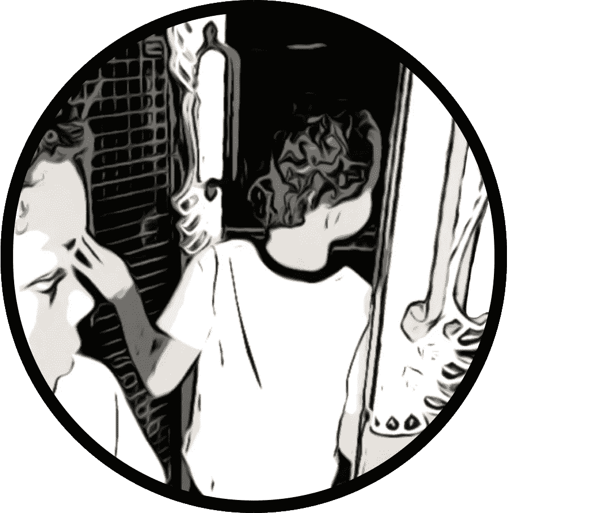
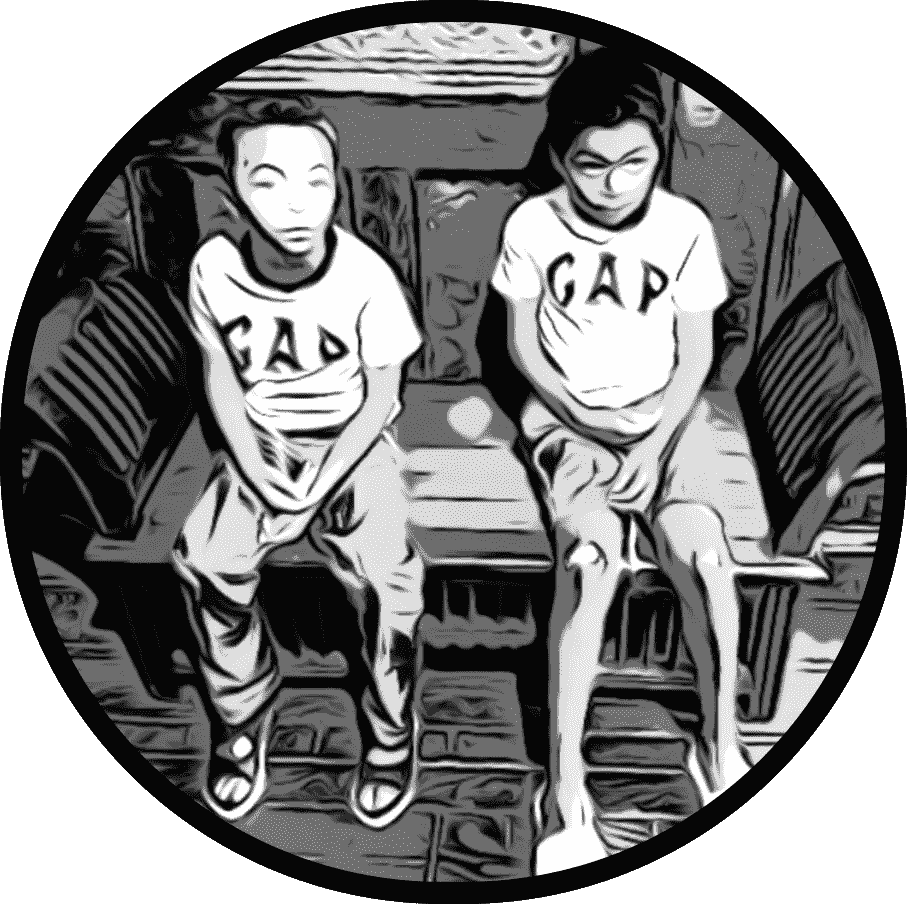
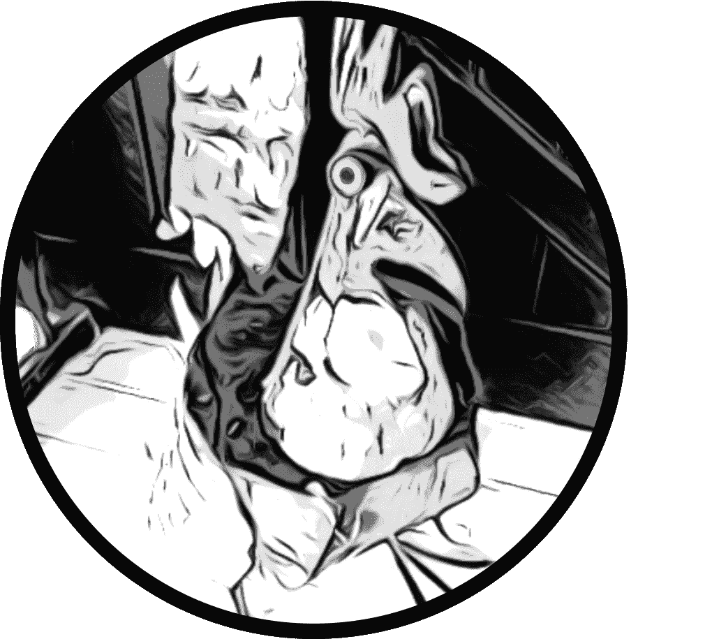

# 我的爪哇咖啡馆第 3 部分

> 原文：<https://medium.com/coinmonks/my-javanese-nftea-house-collection-part-3-a89b372cfd0a?source=collection_archive---------74----------------------->

**作者注:**

成为一个新领域的先锋并不好玩。在我以前作为冰壶教练的生活中，如果我想学习一项新技能，我总是会寻找成功的模式来开始，而不是试图重新发明轮子。

在脸书营销领域，很容易找到一个有效的销售漏斗，然后按照 Russell Brunson 的方式“破解”它。你的主要工作是找到“漏斗的入口”,然后沿着它的逻辑步骤走向第一次销售。

许多作者松散地遵循这种模式，通过免费赠送一个系列的第一本书来让你注册一份时事通讯。这不是一件坏事，尤其是如果时事通讯很酷的话。问题是，一份精心组织的时事通讯可能涉及到和写书一样多的设置和管理。

在图书渠道和课程的世界里，这可能始于提供一份报告之类的免费东西，以换取一封电子邮件或联系信息。这是最初的接触点。

从这一步将是一个免费加航运提供。

输入你的电子邮件，我会免费寄给你一本书——只需支付运费或印刷费。当你等待下载的内容发送到你的邮箱，或者等待纸质书的印刷和发货时，下一页可能是一个低价项目的报价，比如一门出售的课程。

这次销售将清算你的广告费用。在客户端，你现在已经在公司的价值阶梯上迈出了第一步，要么购买并成为付费客户，要么只是一个好奇的旁观者。

这种模式在 NFT 世界行得通吗？

这在脸书和类似的市场上行得通，但这些策略如何应用于 NFT 世界呢？这个世界看起来和行为都完全不同。在已经将加密作为一种不可避免的生活方式的人(在他们的 Metamask 钱包中有加密的人)和在脸书上花时间、从亚马逊买书或在洗碗时通过音频收听的典型读者之间，似乎有很大的差距。

对作者来说，说明问题的另一种方式是，亚马逊市场是为作者兜售他们的商品准备的，旨在促进作者和读者之间的联系，以换取一份馅饼。

我越来越多地看到亚马逊的份额似乎越来越大，同时仍然享受着其他公司没有的规模经济。新作者并不完全处于谈判这种权力差异的平等地位，一些人已经争先恐后地推出自己的平台。

亚马逊的另一个主要缺点是，它不一定会与卖书的作者分享客户信息。

不要误解这一点——我认为该公司为新作者出版创造了奇迹，让他们绕过典型的传统出版社，保护他们的市场份额。

谁相当于 NFT 空间中的亚马逊？

我有限的经验是在 Opensea 和区块链以太坊。乍一看，这种进入壁垒似乎会阻止一般作者去尝试。

我可以听到他们绝望的集体哀号:“在亚马逊上发表一篇手稿已经够难的了，现在你却告诉我必须建立一个什么钱包？我要怎么做才能拿到密码？我的读者要走很多步。jpeg 和 NFT 有什么区别？我并不真正了解区块链——我有一千个问题……”

我能感觉到偏头痛开始了。

我第一次涉足海洋给我带来了我甚至不知道存在的障碍，更不用说对手稿的实际制作做出贡献了。作家们光是坐在座位上写最终稿就已经够头疼的了。

看看像[马克·道森](https://selfpublishingformula.com/)这样的作者，他好心地公布他的数字，并在亚马逊平台上独家出售他的书。这将是保持狭隘的一个例子。Mark 还为作者提供了一系列补充课程，帮助他们为亚马逊和其他营销系统(如时事通讯)正确设置图书。

[约翰娜·佩恩](https://www.thecreativepenn.com/)马克的朋友和同时代人，展示了一个成功的宽模型。她在多个平台上推广她的作品，但我也听到她亲切地谈论加密货币以及这些技术如何影响作者。

关键是要保留对你作品的主权。例如，如果亚马逊决定不再喜欢你，它不能切断你的收入来源。

去中心化为作者和他们的书提供了同样的自主权，就像它为同一位艺术家的财政提供了同样的自主权一样。这可能不符合亚马逊的最佳利益。

我看到了两个世界无缝融合的潜力。

我对 NFT 的兴趣沿着作者如何做出贡献的路线发展。根据我的经验，那些实际上定期出书的作者并不总是对神秘的营销科学感兴趣。

所以第一个问题是要认识到书不一定能卖出去。

更进一步，一个对书籍如何闯入 NFT 空间感到好奇的作者可能会碰壁。寻找那些去过那里并做过罕见的事情的先驱者的模型。

对于一个进入 NFT 空间的作者来说，问题是:你如何以不同于普通书籍的方式阅读 NFT？我所想象的工作方式将只是一系列连续的照片，在一个英雄的旅程中联系在一起。

这个故事将各种原本互不相关的 NFT 作品联系成一个收藏。书籍是文字和图像的集合。

《房间里的大象》似乎是 NFT 推出的没有故事的作品。营销人员试图描述为什么你会想要进入这个新 NFT 的底层(有点像熟悉的无聊猿的远亲)，它并没有真正增加价值——除了当你翻转它时会获得大量的资本收益。

似乎 NFT 的新鲜感还没有消失，在街头，消费者可能不知道日本和牛牛排和蔬菜汉堡之间的区别。

那是令人烦恼的现实。

**第 3 章—** 爪哇公鸡

第二天一早，男孩们和爸爸一起来到了小鸟王国。杰里警告人们不要分心，他不是在开玩笑。这个地方黑暗、阴森，到处都是小饰品和护身符。

兄弟之间的关系有点紧张。亨特一路上开始骚扰索耶，声称他在索耶背后的角落里看到一颗牙齿，这里有，那里有。起初，索耶相信他，看了看，但什么也没看见，很快就生气了，不理他了。

找到茶馆后，亨特被一个从门的阴影中出现的小熊脸吓了一跳。是他的想象力在捉弄他吗？

现在索耶正在执行一项任务。他听从了杰瑞的警告，没有被金像或木乃伊棺材分散注意力。他不知道如何从他爸爸那里得到火球术的魔法硬币，但他感到安慰的是，硬币和他们一起在大楼里。他曾目睹爸爸把钱包放进他的口袋里。

亨特在前门把索耶拉到一边，"索耶，如果我告诉你我刚才看到了一颗真的牙齿会怎么样？"

既然亨特的恶作剧已经到了大楼前，索耶就没有耐心了。他甩开手，躲进了前门。亨特犹豫了，他担心他们会在里面发现什么。

外面有鸟鸣声和人们的谈话声，但里面一片寂静。男孩们找到杰里提到的长凳坐下来，试图舒服一点。索耶转向亨特说:“我们需要从爸爸那里得到那枚硬币。”

亨特忸怩作态，“什么硬币？”

索耶不敢相信他已经忘记了，“火球术的魔法硬币！我们应该把它带到这里。”

亨特自信地笑着说:“别担心，老兄。”

“你这是什么意思？我们要怎么从爸爸的钱包里得到它？”

亨特把手伸进口袋，骄傲地掏出火球术的魔法硬币给索耶看，“我在你睡觉的时候用了‘发现者守护者’。我知道。我很牛逼。”

他等待着掌声，但索耶另有打算。他身体前倾，试图从亨特手中抢走硬币。硬币掉了下来，滚过地板，被一个金属物体反弹，发出清晰的“砰”的一声

男孩们立即跳了起来，为了得到硬币而互相争斗。他们都惊讶于一只生锈的机械公鸡出现在眼前。亨特注意到公鸡背上有一个投币口，指给索耶看。

Sawyer 有他自己的计划:首先他做了一个跑酷俯冲翻滚来接住硬币，然后把它扔进投币口，最后以一个超级英雄着陆来结束，单膝跪地，拳头放在地板上。

亨特先是愣了一下，然后很生气。“哎！那是我的硬币！”

他盯着喘着粗气的索耶。索耶可以看到亨特的眼睛变红了，这总是意味着他真的疯了。他准备为自己辩护。与此同时，硬币继续叮当作响地穿过鸟的内部机制，最后随着“咯咯”一声停止了一道电弧把这只机械公鸡震醒了。索亚指了指，“亨特看！公鸡在动！”

亨特停下来，握着拳头，转过身去看索耶指的是什么。他是对的！公鸡在动！

公鸡转向他们说:“杰里已经告诉了我关于你们两个的一切。他通过心灵感应和我交流过。”

亨特目瞪口呆。“你是什么？”

公鸡转向他，挺起胸膛。“我是爪哇公鸡！”

“不，我是说你是怎么说话的？”

“虽然我很想向你解释以太，但这个问题需要等待。时间在流逝，孩子们。我认为索耶需要问一个问题。”

公鸡喉咙里发出咯咯的声音，听起来很像计时器。他期待地看着索耶，问道:“怎么样？你的问题是什么？”

索耶毫不犹豫地回答:“牙齿是什么？”

“哈！我喜欢你的风格。我也将简明扼要。你们两个都是其中的一部分。亨特，你也需要注意。随着时间的推移，你会失去你的牙齿，所以你在这次旅程中获得的经验会帮助你。兄弟必须站在一起。”

亨特打断了他，但公鸡用喙轻轻啄了啄他。“亨特，没时间打岔了。闭上嘴！你父亲就在附近，他不能偷听我们的谈话。这只是给孩子们听的。”

亨特定了定神，“好吧。”

“你必须找到彩虹蛇。鸟王国出口附近的壁画上有他行踪的线索。接下来会有进一步的指示。”

就在这时，茶馆的门突然打开，爸爸看起来疲惫不堪地冲进来，“你们在这里！我一直在到处找你。你在对那只公鸡做什么？”

他一说“公鸡”，一块金属薄片就掉了下来，露出了它身体里隐藏的隔间。爸爸马上就注意到了。“那是什么？你们也在忙什么？”

亨特脱口而出，“索耶把你的硬币放进公鸡，它就开始说话了！”

“猎人！”索耶对这一指控感到震惊，在他哥哥的背后打了一拳。

爸爸介入了，“你们是不是吵架了？你不是对这个更感兴趣吗？”他把手伸进公鸡体内，取出一个细长的铁盒。男孩们停顿了一下。

他仔细地看着他们，“索耶，你想打开它吗？”

索耶点点头。爸爸把箱子递给他，索耶拉开了盖子。里面是一点棉花和一封折叠整齐的信。索耶打开纸看了看。“爸爸，你能帮我读一下这个吗？”

亨特战略性地介入，从索耶手里抢走了报纸。在阅读之前，他转向爸爸，指着写在顶部的醒目的通知:“仅供儿童耳目使用！”

他认为爸爸有必要知道，“爸爸，你得走了。我们在进行官方的双胞胎交易。你知道吗？”

爸爸笑了，“哈！我以前听说过。别在这里待太久。我们很快就要出发了。”

爸爸离开时，亨特说:“我爱你！”

“我也爱你，亨特，也爱你，索伊尔。你们去解开你们的谜团吧！”说完这些离别的话，他离开了茶馆。

亨特确信他已经走了，然后开始读信，“亲爱的索耶，”

索耶打断了她，“不，等等。它怎么知道我的名字？”

亨特斥责他，“让我说完！上面写着，亲爱的索耶，你可能想知道我是怎么知道你的名字的，但怎么知道并不重要。另外，要花一整本书来解释我是怎么认识你的。重要的是你希望把你的牙齿交给牙齿轴承。是这样吗？”

索亚点点头，亨特继续说，“好。我以为你会同意。杰瑞告诉我你是个好孩子。这让我很高兴，所以我们继续吧。”

亨特想不通这位作家是怎么认识他哥哥的。

他试图想象这位神秘的作者是谁。抛开他的猜测，他继续说道。“走下金属楼梯，穿过毒针，走下雕出山丘的龙楼梯。

当你找到会唱歌的巨石时，一定要知道你已经接近彩虹蛇了。尽量保持安静，集中注意力。

在这条小径上，你会被各种各样的仙女包围，所以请小心行走。至于月亮洞的入口，这可以改变。你必须打开你头脑中被封闭的一部分。你会通过彩虹和喷水口知道彩虹蛇。这并不容易，但你必须听从你的心，你会被相应地指引。

署名，炼金术士。

附注:请记住我的公鸡的线索。还有，把杰瑞放在包着棉花的罐子里，埋在月亮洞里。这是一个危险的地方，所以一定要让你父亲和你一起去。然而，在任何情况下你都不应该让他知道你的真实意图。他可能出于自己的目的试图干涉并逮捕杰里。"

两个男孩都静静地坐着。

公鸡发出一声响亮的鸣声打破了寂静，侧板砰的一声关上了！这个谜越来越深。亨特把纸折起来，小心翼翼地放回罐子里，递给索耶:“这是你的任务，索耶。你知道该怎么做。”

感谢阅读！我希望你喜欢第三章。敬请期待第四章——如果我勇敢的话。与此同时，请访问 [Opensea](https://opensea.io/collection/javanese-tea-house) .io 上的爪哇 NFTea 收藏

— Bouwhui5