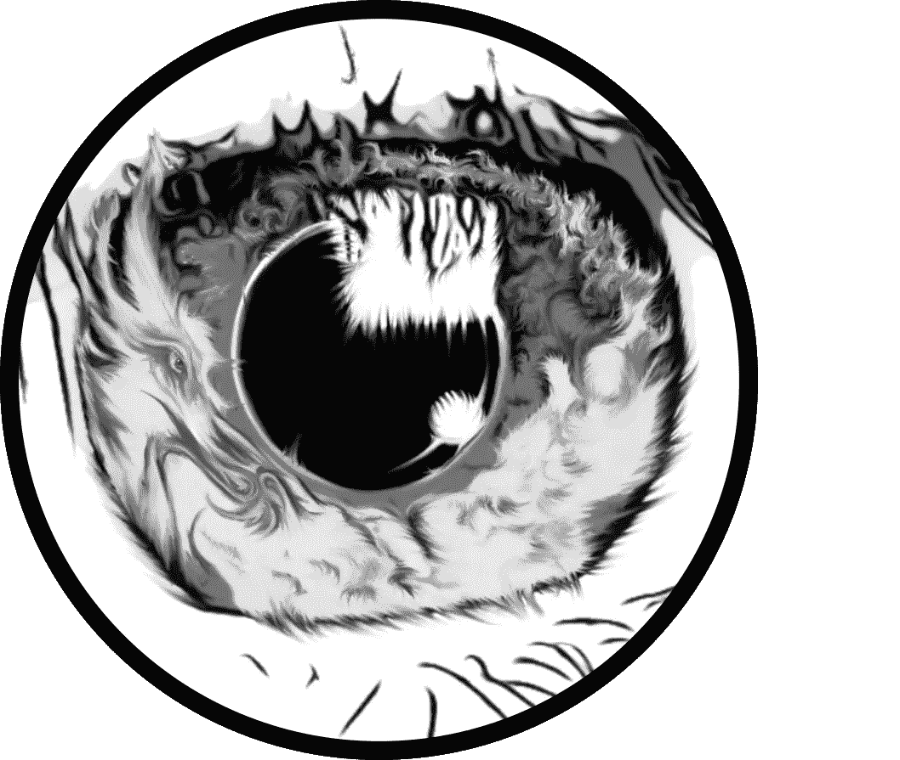
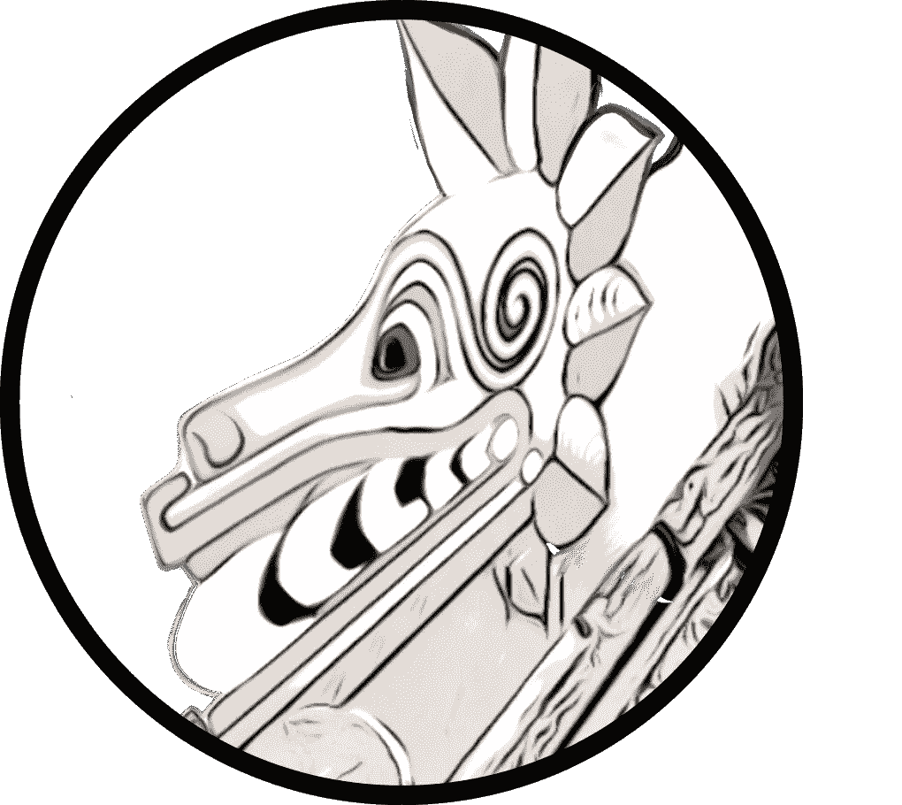
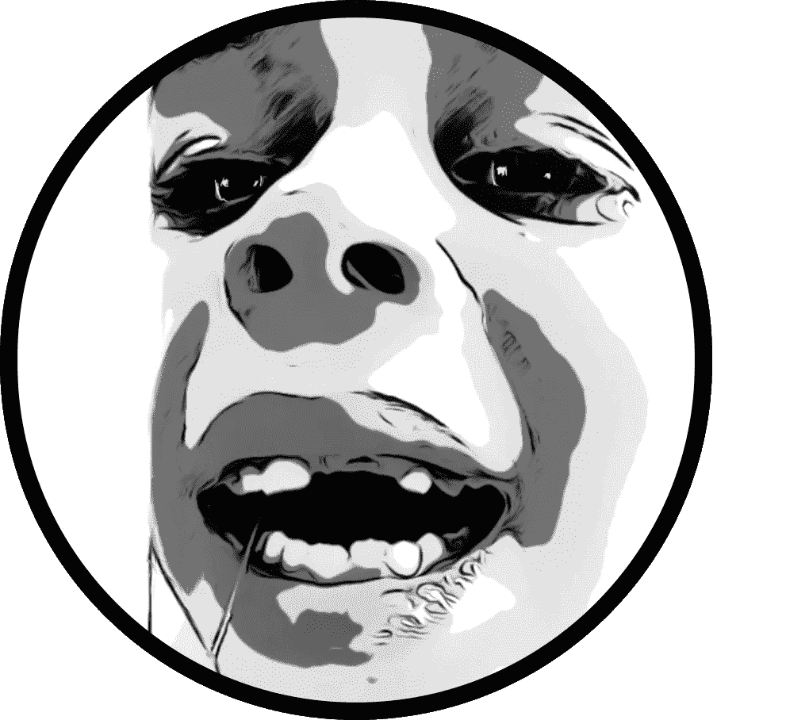
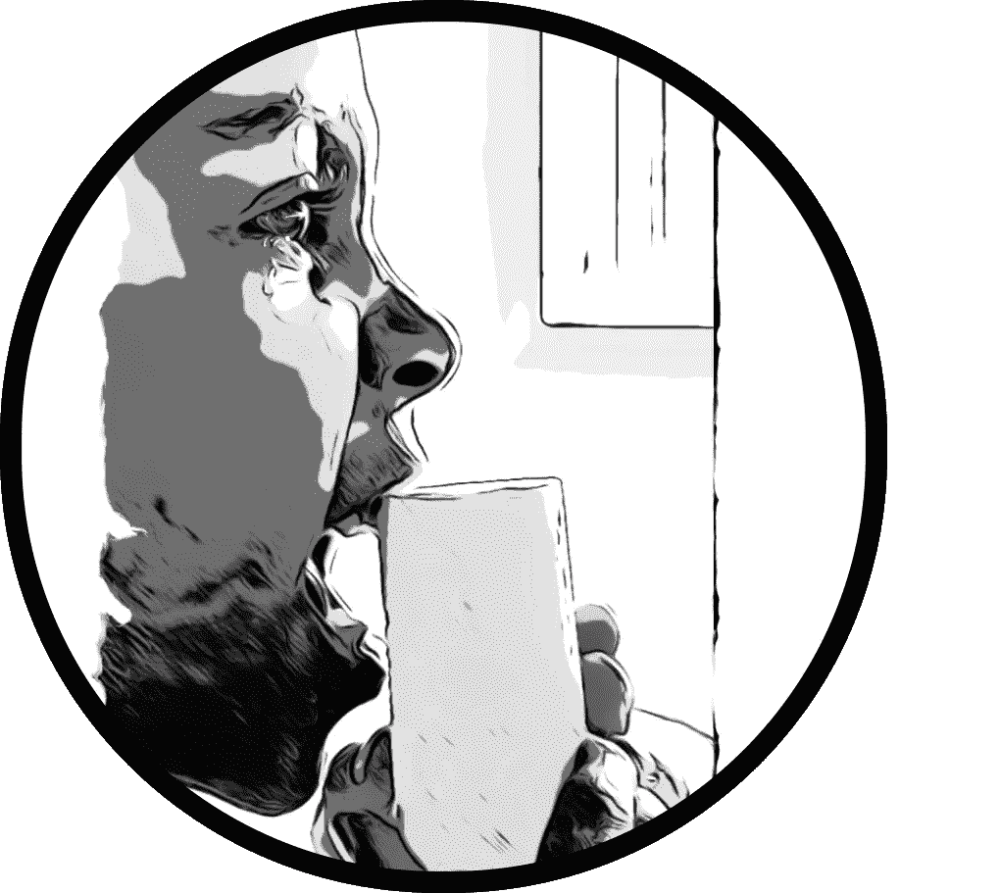

# 我的爪哇咖啡馆第 4 部分

> 原文：<https://medium.com/coinmonks/my-javanese-nftea-house-part-4-6fb5425a1b50?source=collection_archive---------91----------------------->

**作者注:**

我在思考书籍和电影之间的转换。这两种类型的内容之间有一种有趣的关系。书有一种电影没有的品质，反之亦然——我同样爱它们。

也许当书籍进入 NFT 空间时，它们也需要做出改变。仅仅试图改变它们的用途是不够的。他们只需要一个好的电影剧本。

昨晚我看到了一段时间以来最清晰的月亮——它有着梅耶斯柠檬的特征，我相信它是橙子和柠檬的杂交。之前多云的天空看起来很清晰。

清晰是一件健康的事情。

最近日子过得很艰难，我有时能看到我写作中的紧张。似乎有一点愤怒就在皮肤下，然而总是有两件事让我重新振作起来。

我突然想到，我收集这个 NFT 系列的原因是因为我爱我的双胞胎儿子。我知道如果我做过什么让我骄傲的事，那就是成为他们的父亲。

我看到了前进的道路。

**第四章—** 如果我勇敢

在离开鸟王国的路上，他们发现了彩虹蛇的画像。他们盯着看了又看，但看不到爪哇公鸡提到的线索。

亨特想起了爸爸的视频，“索耶我以前见过这个符号。是螺旋！还记得尼亚加拉峡谷的视频吗？这条路上有一大堆螺旋。

这就是线索！

发现墙上的线索后，亨特回去查看了爸爸的“天使在天空中”视频。果然，炼金术士提到的每一个地方，爸爸在徒步旅行时都会经过，然而，很明显，爸爸并不知道该注意些什么。

索耶仔细地看着，仿佛看见爸爸把一个仙女踩在脚下。亨特仔细地绘制了他自己绘制的该地区的初步地图。

“这应该有助于我们导航。爸爸需要补充缺失的细节，因为他已经脚踏实地了。然而，我们需要记住爸爸的什么呢？”

索耶茫然地盯着亨特，“我不知道。”

亨特摇摇头，“老弟！我们不能让爸爸知道牙齿的秘密！”

“但是亨特！会疼的！我不想拉杰瑞出来。”

亨特摇摇头，“记得爸爸说什么吗？”

索耶抬起头来，眼里充满了泪水。“他说什么？”

亨特引用了他经常听爸爸重复的一句话:“索伊尔，你不要害怕。恐惧是思维的杀手。面对你的恐惧，让它穿过你。在另一边，只有你会留下。这就是他们在故事《沙丘》中所做的。”

索耶的脸色缓和下来，但他并不十分信服。亨特阐述道。“好的，索耶，想象你站在滑板公园最高的混凝土坡道上保持平衡。

你在边缘犹豫不决，不敢和你的摩托车一起跳下去。你不会在你的头脑中找到勇气，或者在你的内脏中找到勇气，但是你必须倾听你的内心！"

索耶表示同意，“有道理。”

带着新的决心，他扔掉被子，全速跑向浴室的镜子。他确切地知道必须做什么。他带着新的决心盯着那颗牙齿。

它会前后摆动，但不足以出来。到现在，事情已经岌岌可危了。他感到胃里一阵翻腾。亨特鼓励他。“动手吧老弟！”

随着一阵猛力的挤压，索耶和杰里永远分开了。你说不会疼的！”

亨特扬起眉毛，直视着他。“我说你需要面对你的恐惧，不是说它不会痛。”尽管他很厚颜无耻，但他确实同情他的兄弟。是的，Sawyer 面对了他的恐惧，但直接的回报是痛苦。

在没有通知爸爸这个计划的情况下，他设法在冰箱里找到了一块冷冻海绵来缓解疼痛。他把它递给他的兄弟说:“把海绵放在上面，这样会感觉好些。我为你感到骄傲，索亚，这需要很大的勇气。”

索耶一把海绵放在牙龈上，就感觉好多了，不再哭了。索耶嘴角挂着一点口水，转过身对他哥哥说:“好吧。我准备好远征了！”

亨特对他哥哥从痛苦中恢复得如此之快感到宽慰。这孩子有心脏，这是肯定的，他想。

希望你喜欢最后几章！敬请关注第五章——彩虹蛇。如果你想看到这个 NFTea 集合的实时发展，一定要看看 [Opensea.io](https://opensea.io/account) 。

-Bouwhui5