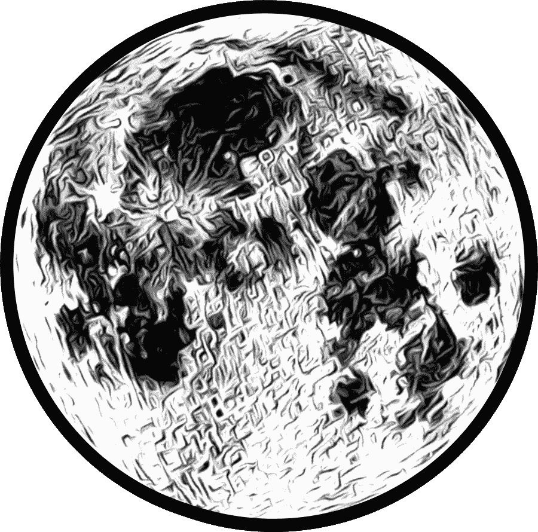
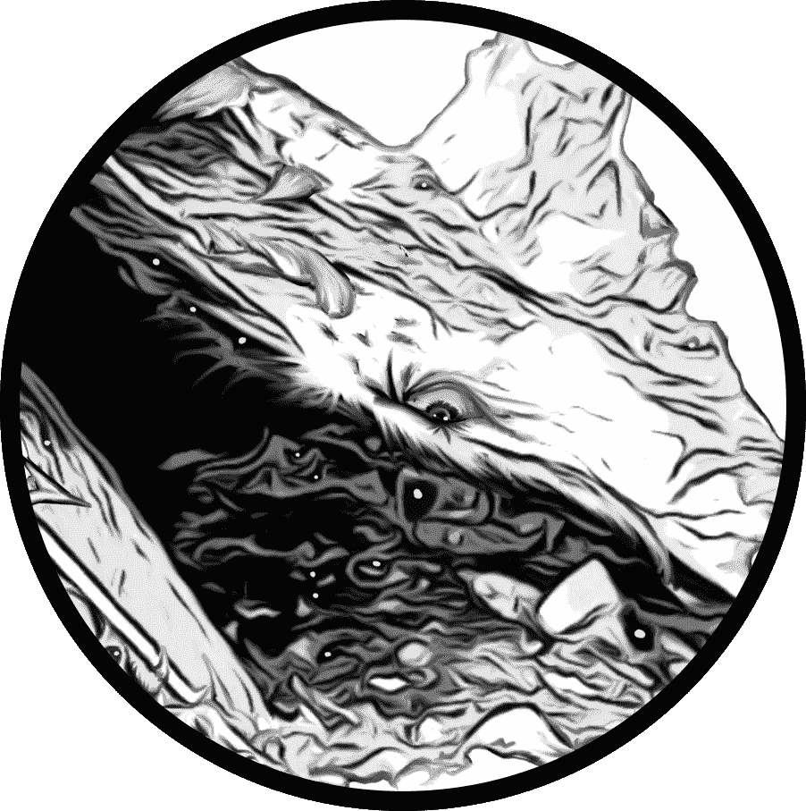
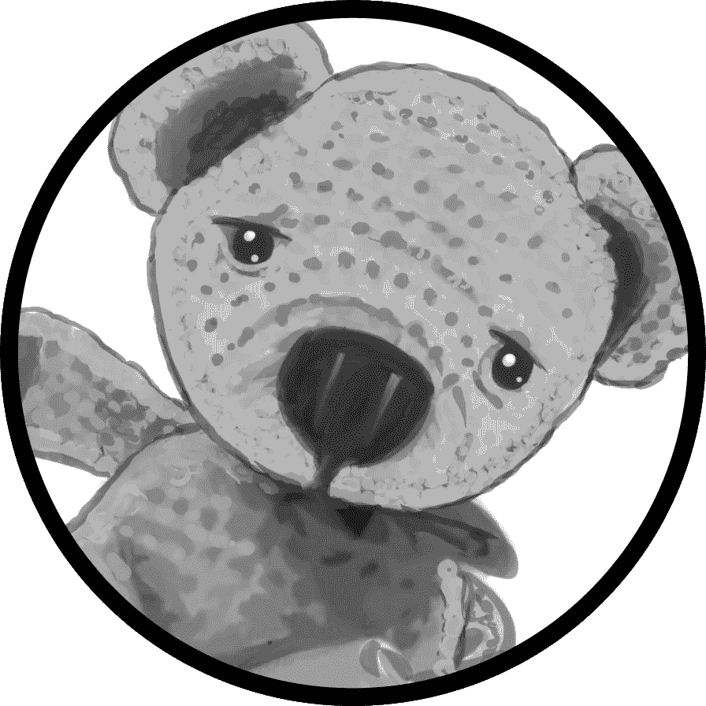

# 我的爪哇咖啡馆第六集

> 原文：<https://medium.com/coinmonks/my-javanese-nftea-house-part-6-807051e6323b?source=collection_archive---------78----------------------->

**作者注:**

我在 NFT 之旅中的一个重大里程碑将是真正卖出一辆 NFT。有很多视频向你展示*如何*在 Opensea 上出售 NFT——这与实际出售并不完全相同。

在这个阶段，我还没有敲开那个核桃。

算出价格并不容易。我确实在这个平台上读过一篇关于交易量和底价的文章，以及它如何影响买方的，但我需要再看几次才能更好地理解。在这一点上，我仍然在纠结到底是什么驱动了价值。

就此而言，价格和价值是一回事吗？

还有一些相关因素，比如感知度，会随着谁代言了一个系列，以及一个艺术家在开始之前是否已经有了追随者而剧烈波动。

我在亚马逊上买书的经验是，它是批量生产的。价格保持在低位是因为书籍已经成为商品——通常新作者必须通过通行权，免费发布他们的书，以吸引新读者帮助提高该书的初始认知度。

在一天结束的时候，许多作者并没有在每本书上赚很多钱，但是如果事情进展顺利，他们会卖出很多书。随着时间的推移，随着作者建立他们的回溯目录，它会变得越来越好。

虽然有些事情是相同的，NFT 空间最初听起来像是为新艺术家提供了更多的机会，然而，在我看来，它仍然不是那么容易，换句话说，如果它起飞了，我会认为这是第一次的运气。

那是一个大驼峰。

想象一下，第一本书要付出多大的努力才能出版，然后你被告知必须以 0 美元的价格出售。一些作者设法避开了这个陷阱，但这并不容易。

我想市场知识是关键。

降低 NFT 的价格似乎会产生一种不良效果，让它看起来一文不值，就像一个恶意的魔术。我本以为它会让一个有兴趣的人趁虚而入，买下所有的东西，然而，事实似乎恰恰相反。

我推测，买家总是想知道他们可能会以更高的价格出售，某种升值会发生。这肯定是，类似于一些书被认为是稀有的，因为它们绝版了，很难找到。

总之，这些只是我的第一本儿童读物《NFT 作品集》最后一章的一些想法。

尽情享受吧！

- **Bouwhui5**

**第六章** —月亮洞

unter 和 Sawyer 浑身湿透地躺在一个光线昏暗的洞穴光滑的沙地上。那个声音又响起来了:“索耶，醒醒！”

索耶醒来，看见亨特躺在他身边，没有知觉，但还在呼吸，像是睡着了。他环顾四周，但不知道它们是如何来到这里的，心想它们一定是被赶出了游泳池。

爬上一个多岩石的斜坡，他可以看到从入口倾泻进来的光线，闪耀着许多彩虹的颜色。这个声音又说话了。“你好，索耶！”

索耶环顾四周。“这是谁说的？”

“这是我，这是你。难道你不应该做点什么吗？”

现在他想起了这颗牙齿，并在口袋里摸了摸。幸运的是，它仍然存在。他试图面对这个声音，但不知道该转向哪里。“我们是在月亮洞吗？我有牙齿。现在怎么办？”

那个声音回答说:“你和亨特是 400 多年来第一个发现这个洞穴的人。它已经被封存太久了！”

现在索耶想起了他该做什么。“如果这真的是月球洞穴，那么我不得不把杰里埋在这里。你是彩虹蛇吗？”

那个声音回答说:“同一个世界里，我们都是亲戚。”

索耶感到一股暖流充满了他的心，他感到信心十足。他取出装着牙齿的锡，把它放在地上。虽然亨特还没有动，但索耶大声说，希望他的弟弟能醒过来，“亨特，你害怕吗？”

亨特保持沉默。

索耶接着说。“当你陷入困境时，我很害怕，但我记得你说过什么是恐惧，然后它离开了我。剩下的只是你离开后我的胸口一阵疼痛。我感到悲伤，所以我跟随你来到这里。我很高兴我们在一起，而且都很好。让我们埋了这件事，这样我们就可以去找爸爸。我希望他没有跳进来救我们！”

那个声音安慰他说:“索耶，你爸爸很安全。他陷入了悲痛之中。”

索耶找了一个合适的地点，挖了一个坑，把锡放进去，并覆盖上所有的仪式，他可以召集。这封信，这种声音，这种指示，这是一个很大的过程。尽管这一切都令人兴奋，但他厌倦了这种游戏，开始想家了。

他一盖上锡，杰里坟墓上方的空气中就出现了几个火花，墙壁上岩石周围的裂缝开始发光。一群耀眼的灯光紧随其后，飞了出去，落在了亨特的身上，他猛地一醒。

他看起来吓坏了。“索耶，我们在哪里？”

每道光都在每个发光光环的中心包含一个微型“熊”。它们看起来就像一串飞来飞去的彩虹。男孩们很快就失去了对他们的任何恐惧，很快整个内部的洞穴被点燃在多方面的颜色。现在索耶可以看出这不是典型的洞穴形成。

他注意到这个洞穴是一个完美的球体。身旁的艺术家惊叹于墙壁上错综复杂的神圣几何雕刻，这些雕刻让他回想起麦田圈。

亨特想起了他在爪哇茶馆见过的那张脸。他转向索耶，“我们找到了牙齿轴承！真不敢相信它们是真的！”

看到这样的景象，索耶大为吃惊，退后一步，看着这只箱子从他埋葬的地方升了起来，而且随着“牙齿轴承”的旋转，箱子也转了个不停。锡罐打开了，掉到了地上。“牙齿杰里”站了起来，被“牙齿轴承”包围着，闪着微弱的蓝光，紧接着是一声“砰！”

牙齿一消失，牙熊就停止盘旋，退回到洞壁内它们来的地方。

索耶弯下腰捡起了罐头。他注意到盖子已经换过了。感觉到它的重量，他摇了摇它，然后听了听里面是否有东西在动。亨特看着他的哥哥。出于好奇，索耶撬开盖子，发现杰里已被一个金手镯取代。

他一拿起它，就意识到它是有磁性的。当他拉开它时，他摸索着它，突然它颠倒了极性，打开了，然后在他的手腕上啪的一声合上了。

“哇！”他欣赏他手腕上的带子。它非常合身，既不太宽松也不太紧。他很喜欢。

亨特问索耶是否见过爸爸。他解释说，除了彩虹蛇跟他说过话之外，他什么也不知道。亨特惊叫道，“什么？你应该告诉我！”

现在亨特感到恐慌，“我们以后再讨论声音吧，我们得去找爸爸！现在！”

他抓住索耶的手，领他走向入口。当他们爬出来时，他们可以看到入口隐藏在一个小瀑布后面。他们在明亮的阳光下眨着眼睛。

在远处，他们可以看到一个孤独的人坐在精灵带他们去的岩石上。他们可以听到轻轻的抽泣声，当他们走近时，他们意识到那是爸爸。他们以前从未见过他们的父亲哭过。他们的脚步声吓了他一跳，他停下来，擦去脸上的泪水，怀疑地盯着他们。亨特认出他时大叫道:“爸爸！”

爸爸看到自己的男孩喜出望外，伸出手紧紧地拥抱他们，“这怎么可能？我看到漩涡把你们俩都卷了进去。”

索耶抗议道:“爸爸，你把我捏得太紧了！”

爸爸道歉说:“对不起，我以为你走了，我无能为力。太可怕了。我不知道我刚才有什么样的幻觉，但我想我需要带你离开这个地方回家。我感到筋疲力尽。”

男孩们没有争吵。他们站起来，掸掉身上的灰尘，沿着回家的路往回走。当他们离开时，索耶目不转睛地看着他的新手镯，举起一只手在阳光下仔细端详。如果他把手臂调整到合适的角度，他可以看到一条完整的双彩虹环绕在他的手腕上。

牙齿熊送的礼物太棒了！他开始感觉到新的可能性，但后来他想也许他今天已经有足够的“可能性”了。

剧终

我希望你喜欢这个儿童故事。如果你想知道 NFT 项目进展如何，可以去 Opensea 看看爪哇 NFTea House 收藏。