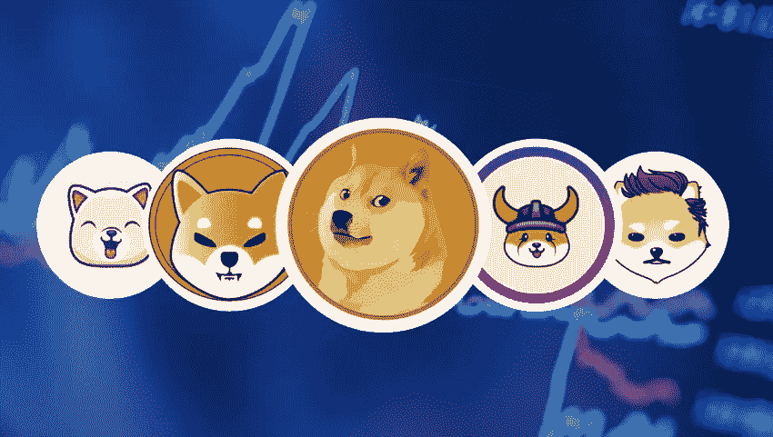
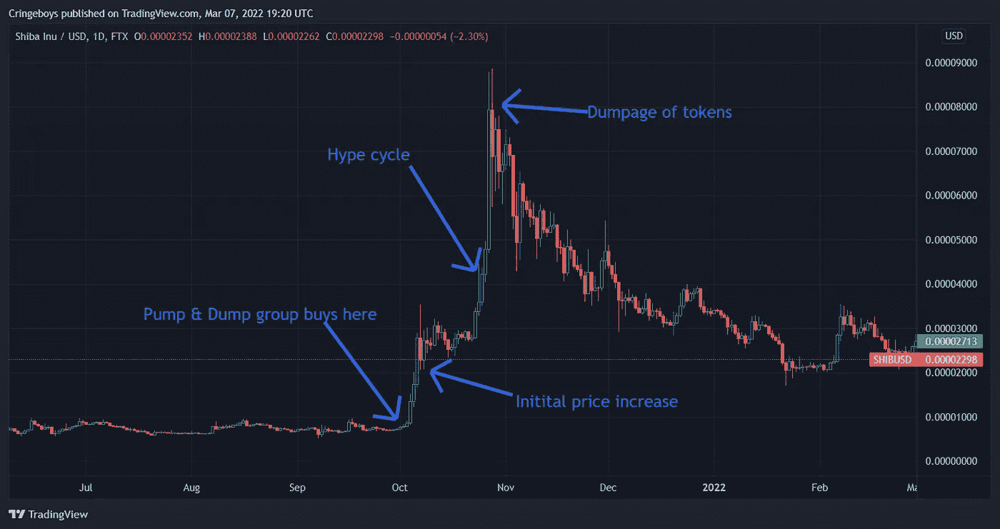

# 我对迷因币的看法

> 原文：<https://medium.com/coinmonks/my-opinion-on-memecoins-225a4ad8297a?source=collection_archive---------43----------------------->

去年，大量的迷因币爆炸，让某些人变得非常富有，只要想想 Dogecoin、Shiba Inu 和无数种类的狗币就知道了。

我个人不投资 Memecoins。我试过一次，看看炒作是什么，但老实说，只是希望一些鲸鱼泵你特定的狗硬币。

持有 memecoins 是可以的，只要它只占你投资组合的一小部分，而且如果你主要是为了好玩。因为老实说，你的 Memecoin 可能不会让你变得富有。那些关于在柴犬投资并把 15 美元变成数百万美元的人的故事是十亿分之一的概率。

# 泵和排放方案

用 Memecoins 赚钱的唯一方法，由于它们的使用量为零，就是希望你的硬币越来越受欢迎，或者一些鲸鱼决定购买特定的代币，使其价格飙升。

不幸的是，这种推动价格上涨的能力也可以用于鲸鱼的利益。这就是像泵和倾卸这样的东西出现的地方。

一个泵和转储由一群人(最好是有高净值的人)组成，他们聚在一起同时购买某个小盘股代币。由于所选代币的市值很小，代币会突然以疯狂的百分比上涨。

这反过来让其他持有人非常高兴，但也吸引了其他投资者的注意，他们看到一个令牌上涨了很多，并决定它一定是下一个热点。随着他们的非理性，将有相当多的人“模仿”硬币，再次推动它进一步上涨。

这个游戏一直持续下去，直到不再有足够多的新投资者来支撑不断上涨的价格，或者直到开始抛售的那群人突然卖掉他们所有的代币，完成了抛售阶段的循环。

我会用去年的柴犬指数走势图来展示给你们看。

由于这个小技巧，那些在底部买入的人，就在加油之前，能够在短短 30 天内获得 12 000%的投资回报。这意味着 100 美元的投资会变成 12 000 美元，仅仅是为了在 1 个月内持有代币。

然而，这是后见之明的偏见，因为不可能知道那将要发生，准确地确定顶部也不是一个容易的成就。

# 结论

购买 memecoins 本质上只是希望下一个抽取和倾倒团体在你的硬币上尝试他们的策略。如果你在它们爆炸前买了很小的代币，并且你足够自律去获利，那么是的，如果你运气好的话，你可能会从中获得一些不错的利润。

然而，不要在股价已经上涨 10 000%的时候买入，然后拿着一文不值的袋子离开。

这些硬币中的许多人只是希望这是一个快速致富的计划，不幸的是，最终变得越来越富有的几乎总是鲸鱼，而普通投资者在一个毫无价值的令牌下跌 80%后离开。

注意安全。