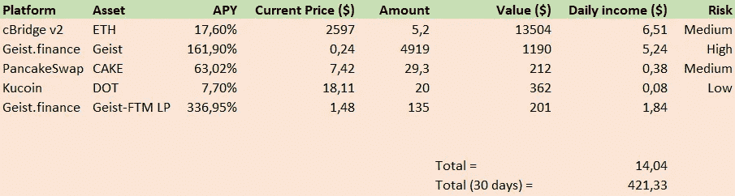

# 每月 400 多美元:我一月的被动加密收入流

> 原文：<https://medium.com/coinmonks/my-passive-crypto-income-stream-of-january-6ff52aad6d30?source=collection_archive---------1----------------------->

# 介绍

(此处阅读跟进[)](/@Igor.MD/500-a-month-my-passive-crypto-income-stream-of-february-fca6185f2149)

**(跳转到结果进行概述)**作为一个 22 岁的人，我被每周工作 40 小时、被锁在办公室里试图偿还学生贷款的繁荣景象吓坏了……在 covid 期间，我体验到了一周大部分时间盯着电脑屏幕、试图通过兼职工作来打发时间的滋味。

这是我的旅程开始的地方！我在 2020 年末开始投资 crypto，虽然我愿意相信是我卓越的眼光让我早早进入，但这可能只是运气。尽管如此，我已经从加密空间获得了一些不错的利润，随着 crypto、Web3 和 DeFi 慢慢获得更多的牵引力，我们可以利用许多机会！

# 被动收入

我第一次接触被动收入是在 ETH 赌注合同推出的时候。它提供了大约 5-10%的可变 APY，我已经把我的 ETH 押上了将近一年。但是，我对更多被动收入的渴望并没有就此停止。在将我的其他替代硬币如 Polkadot、Link、ADA 和 Matic 也投资到他们的赌注合同中后，我很好奇其他地方还有什么机会。

Defi 在 2021 年末蓬勃发展，随着 Phantom、Avalanche 和 Polygon 等许多不同的第 1 层链的兴起，针对不同 DApps 推出了许多激励措施，提供从百分之几到数百%的奖励。我已经开始寻找可靠的项目，以可持续的方式向用户提供赌注回报，试图避免任何传销或潜在的骗局。

# 结果

有几个项目，我押硬币，支付任何地方 10-400%的 APY 押资产。在这里，我将概述我的赌注资产，他们的 APY，我的风险评估和他们在 1 个月内的潜在回报。下个月我会比较这些结果，看看实际的利润！

我们可以看到，每天 6.51 美元的主要收入来自 Cbridge v2 上的以太坊，我在以太坊的跨链桥接上提供流动性。通过在 cBridge 上提供你的 ETH，它会被转移到其他连锁店，你会得到所产生的费用的%,以及获得 CELR 代币来提供流动性。每个连锁店的 APY 不同，但 17.6%是所有连锁店的平均值。

Geist.finance 还为其平台上的赌注者提供非常高的 APY 奖励。这是幻影网上 AAVE 的一个分支，用 geist 代币奖励他们的早期采用者。不要被高额的 APY 欺骗，因为几乎所有的艾斯特用户都获得了这些奖励，这给艾斯特代币价格带来了下行压力。艾斯特-FTM LP 奖励似乎更稳定，奖励和价格也是如此。

**结论**

这些是我第一个月在 DeFi/CeFi 被动收入领域监控现金流的结果。我希望你从这篇概述中学到了一些东西，如果你有任何问题，请随时提问！

我最近还写了一篇关于你需要警惕的骗局和庞氏骗局的文章。如果你曾经研究过被动收入，你肯定也见过这些！这里推荐你看一下[。](/@matthijsdethmers/3-crypto-scams-on-medium-you-need-to-watch-out-for-66fa69256b54)

为了让我的故事免费提供给每个人，请给我买杯咖啡吧！https://ko-fi.com/igormd

> *加入 Coinmonks* [*电报频道*](https://t.me/coincodecap) *和* [*Youtube 频道*](https://www.youtube.com/c/coinmonks/videos) *了解加密交易和投资*

# 另外，阅读

*   [Bookmap 评论](https://coincodecap.com/bookmap-review-2021-best-trading-software) | [美国 5 大最佳加密交易所](https://coincodecap.com/crypto-exchange-usa)
*   最佳加密[硬件钱包](/coinmonks/hardware-wallets-dfa1211730c6) | [Bitbns 评论](/coinmonks/bitbns-review-38256a07e161)
*   [新加坡十大最佳加密交易所](https://coincodecap.com/crypto-exchange-in-singapore) | [购买 AXS](https://coincodecap.com/buy-axs-token)
*   [红狗赌场评论](https://coincodecap.com/red-dog-casino-review) | [Swyftx 评论](https://coincodecap.com/swyftx-review) | [CoinGate 评论](https://coincodecap.com/coingate-review)
*   [投资印度的最佳密码](https://coincodecap.com/best-crypto-to-invest-in-india-in-2021)|[WazirX P2P](https://coincodecap.com/wazirx-p2p)|[Hi Dollar Review](https://coincodecap.com/hi-dollar-review)
*   [加拿大最好的加密交易机器人](https://coincodecap.com/5-best-crypto-trading-bots-in-canada) | [库币评论](https://coincodecap.com/kucoin-review)
*   [用于 Huobi 的加密交易信号](https://coincodecap.com/huobi-crypto-trading-signals) | [HitBTC 审核](/coinmonks/hitbtc-review-c5143c5d53c2)