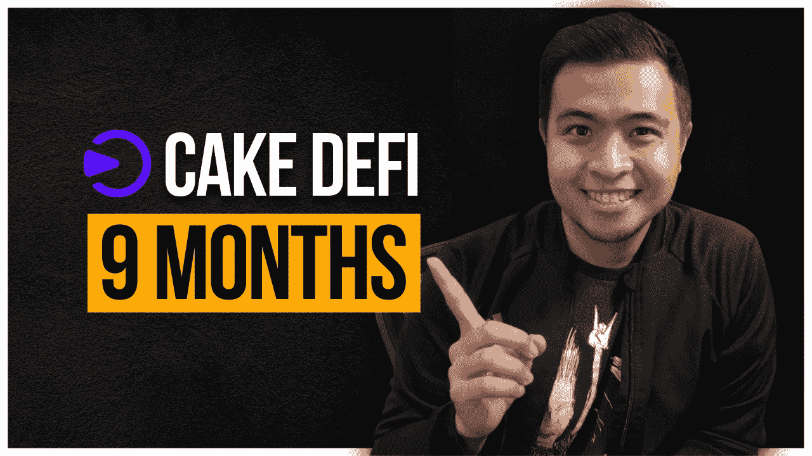
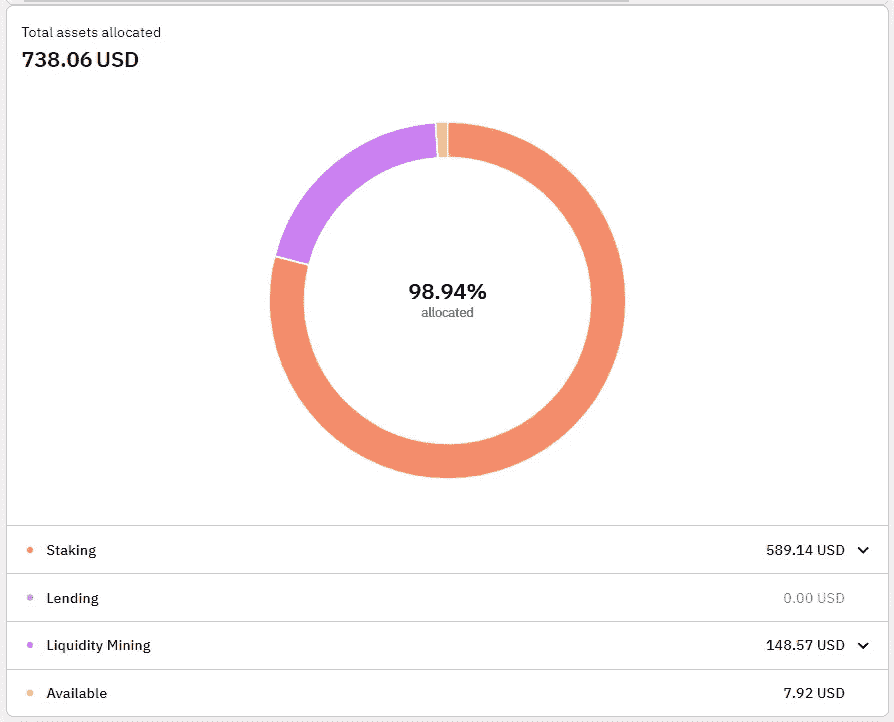
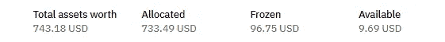

# 我 9 个月的蛋糕被动收入

> 原文：<https://medium.com/coinmonks/my-passive-income-with-cake-defi-for-9-months-cca857f129de?source=collection_archive---------10----------------------->

[Check me out on YouTube too! :)](https://go.thehustlefiles.com/YouTube-sub)

我真的以为今年我会低调处理 crypto，但是这个领域已经向我证明了自己是一个机会的金矿。

在经历了快速的加密冬天和年初的无数恐慌以及最近的崩溃之后，我想简单地把我的投资留在可以给我带来被动收入的平台上，并利用空闲时间了解更多关于这个领域的信息。

然而，我对我使用的平台、别人使用的策略和我错过的东西了解得越多，机会就越多，我赚得也越多。

2021 年 8 月，我在 Cake DeFi 投资了 250 美元，让我的比特币发挥作用，为我创造一些被动收入。3 个月后，我赚了 215 美元——价值增长了 86%。从那以后，我把我的投资留在那里，让它成长。

现在已经 9 个月了。所以让我和你们分享一下我在 Cake DeFi 赚了多少钱，平台有什么新闻和变化，我打算如何处理我的投资。

# 什么是蛋糕 DeFi？

[Get Bonus DFI when you sign up here!](https://go.thehustlefiles.com/CakeDeFi)

Cake DeFi 是一个让你的密码发挥作用并被动产生现金流的平台。它提供最容易使用、最透明的产品和服务，为新手和有经验的投资者提供高回报——这是他们的网站所说的。

他们有 3 种主要产品:

*   **流动性挖掘**—Cake DeFi 最受欢迎的产品，可以为你赚取高达 90%的 APY。
*   **赌注** —我们在加密领域都很熟悉的赌注。这为你赢得了高达 33%的 APY。
*   **冰柜** *(类似于赌注)* —这基本上是一个长期赌注产品，你必须锁定你的赌注代币，以换取赌注奖励之外的额外 APY。
*   **出借** —您可以将 crypto 存入出借批次，并在 4 周内获得保证回报。如果加密价格在一批中上涨，你可以获得额外的回报。然而，这种产品在美国没有销售。

# 蛋糕定义更新

**仪表板升级**

自从我在这个平台开始以来，蛋糕定义有了很多变化。其中之一就是追踪 UI。以前，我很难看到自己的投资有多少是配置在平台里的。他们现在更新了他们的仪表板来反映你的位置。

此外，除了计算 A 点到 b 点，我很难看到我在平台上赚了多少钱。我看不到我一天、一周或一个月赚了多少钱。他们也改变了这一点。Cake DeFi 更新了他们的仪表板，这样用户可以更容易地查看他们每项服务的奖励。

**欧洲加密许可证**

2022 年 1 月 7 日，Cake DeFi 被德国联邦金融监管局(BaFin)发出通知。作为回应，他们从网站上删除了德语。然后，他们在欧盟申请了加密许可证，因为这为 Cake DeFi 在 2024 年转向 MiCA(加密资产市场)许可证铺平了道路。

> *“来自 BaFin 的含糊通知带来了媒体和网民对 Cake DeFi 业务的不准确猜测。从那以后，从我们的网站上移除德语后，我们一直照常运营。我们正在积极申请这一加密许可证，以向我们的德国和欧洲客户作为一个整体提供额外的保证，即 Cake DeFi 是一个可靠、可信和透明的平台。”—*[*Julian Hosp 博士，Cake DeFi*](https://blog.cakedefi.com/cake-defi-applies-for-a-european-crypto-license/) 联合创始人兼首席执行官

**新的风险投资部门**

今年 3 月，Cake DeFi 宣布成立一家 1 亿美元的风险投资公司，名为 Cake DeFi Ventures。它致力于加速科技公司的增长，重点是投资 Web3、游戏和金融科技初创公司。

Cake DeFi Ventures 已经为未来两年的投资预留了 1 亿美元。部署对美国媒体创业公司 The Edge Of Company，Inc .的首笔投资。

# 我 9 个月的成果

8 月份，我从 Cake DeFi 获得了 250 美元。这是截至 2022 年 5 月 5 日的余额。我的数字将基于我开始时，而不是基于自上次更新。

注:这些数字是在最近的事故之前的。

My assets’ value on May 6, 2022.

下注 DFI: $82.64
下注破折号:<$ 0——这么小

DFI 冰柜:1.55 美元

流动性矿业 DFI: $70.73
流动性矿业 BTC:$ 0.41
合计:$71.14

## **下线**

这是我上次更新时没有报告的事情！

我的签约奖金:$50
推荐签约奖金:$72
推荐奖励 DFI: $8.83
推荐奖励 DASH:$ 0.17
推荐总奖金:$81

总奖励:82.64 美元+1.55 美元+71.14 美元+81 美元+50 美元= **$286.33**

价格增值:493.18 美元—286.33 美元=**；206.85 美元**

总收益: **$493.18**

由于我之前没有报告一些数字，在我上次更新时，我的总奖励被少报了，而我的价格升值被多报了。但无论如何，这个总收益接近我的蛋糕 DeFi 投资的 200%的收益。

# 从那以后我做了什么？

由于我没有经常查看我的 Cake DeFi 投资组合，我决定将我的 BTC 和 DFI 奖励再投资于 BTC-DFI 流动性组合。这些代币应该发挥作用，增加我的份额。

由于我现在从我的推荐中获得了 DASH，我也开始下注 DASH。他们只提供 5.7%的 APY，但我不能抱怨这一点，因为这是字面上的免费资金，帮助我增加我的资产。

# 我的前进计划

Photo by [Glenn Carstens-Peters](https://unsplash.com/@glenncarstenspeters?utm_source=medium&utm_medium=referral) on [Unsplash](https://unsplash.com?utm_source=medium&utm_medium=referral)

自从我上一次更新以来，我一直在考虑是否拿出我的投资并用于其他用途，或者只是把它留在平台上，让它增长。但直到最近，我才决定选择后者。

我不会从 Cake DeFi 中拿出我的投资，我会让价值和我的份额增长。此时，我并不真的需要这个平台赚的钱，所以最好让它在这里复利。

我也想投资 USDT-DFI 组合，但 Cake DeFi 的问题是它不是一个交易。所以我不能把我赚到的 DFI 换成其他我能用的东西——在这个例子中是 USDT——来进行流动性挖掘。

我看了一下这个过程的复杂性，确实有点复杂。我将不得不在平台外把我一半的 DFI 代币换成 USDT 代币，这可能会发生在库币。从 DFI 到 USDT 的库币，我会把它转回到蛋糕 DeFi。这样，我将有两个代币的余额。

我还没有这样做，因为我还在想是否有更好更有效的方法来做这件事。通过我提到的方法，我将不得不支付 35 美元来简单地在 Cake DeFi 中打开一个 ETH 地址。在 DeFiChain 网络中，KuCoin 没有 USDT，因此我必须向 Cake 发送一架 ERC-20 USDT，以便开始该过程。

不过，我的另一个选择是投资 DUSD-DFI 组合，因为一切都可以在这个平台内完成。我可以很容易地把我的一些 DFI 换成 DUSD，并准备好两种代币进行流动性挖掘。

这是我目前对 Cake DeFi 的唯一计划，因为我只能在这个平台上做有限的事情。虽然我喜欢 Cake DeFi 作为一种被动收入来源，但我希望他们能够在用户界面和产品易用性方面做出更多改进。

对于新用户来说，这种担心可能并不明显，但随着你越来越多地使用一个平台，你会开始发现它不好用的地方和它真正好的地方。

[**报名蛋糕 DEFI 即可获得 DFI 奖金！**](https://go.thehustlefiles.com/CakeDeFi)

**更多来自我**

 [## 为什么主播的 APY 降到了 18%

### Anchor 著名的 20%收益率最近发生了变化，这让许多用户对该平台的受欢迎程度感到困惑和担忧。这是…

medium.com](/coinmonks/why-anchors-apy-dropped-to-18-3f44d3a4a2fe)  [## 9 个月后我的 BlockFi 利息账户

### 几个月前，我分享了我在 block fi——一个有息加密账户——赚了多少钱，因为我发现…

medium.com](/coinmonks/my-blockfi-interest-account-after-9-months-c8c946ca1cd4) 

> 加入 Coinmonks [电报频道](https://t.me/coincodecap)和 [Youtube 频道](https://www.youtube.com/c/coinmonks/videos)了解密码交易和投资

# 此外，请阅读

*   [排名前 8 的加密会员计划](https://coincodecap.com/crypto-affiliate-programs) | [eToro vs 比特币基地](https://coincodecap.com/etoro-vs-coinbase)
*   [最佳电子钱包](https://coincodecap.com/best-ethereum-wallets) | [电报密码货币机器人](https://coincodecap.com/telegram-crypto-bots)
*   [最佳杠杆代币交易交易所](https://coincodecap.com/leveraged-token-exchanges) | [购买 HTZ 代币](https://coincodecap.com/how-to-buy-htz-token)
*   [5 大最佳社交交易平台](https://coincodecap.com/best-social-trading-platforms) | [瓦齐瑞 NFT 印度](https://coincodecap.com/wazirx-nft-india)
*   [10 款最佳密码书籍](https://coincodecap.com/best-crypto-books) | [5 款英国最佳密码机器人](https://coincodecap.com/uk-trading-bots)