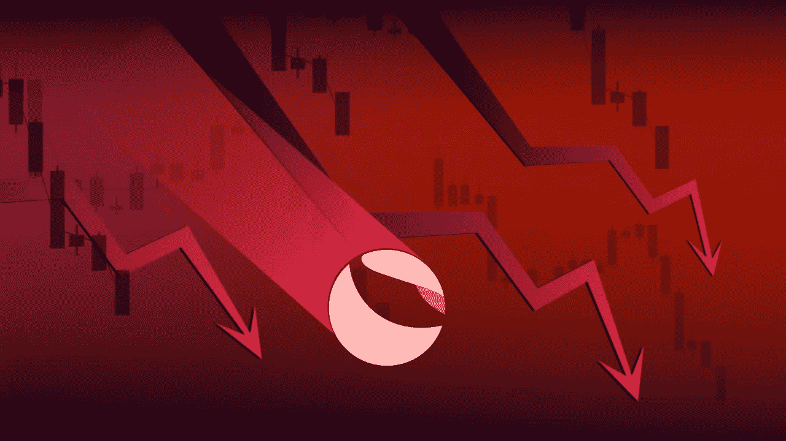
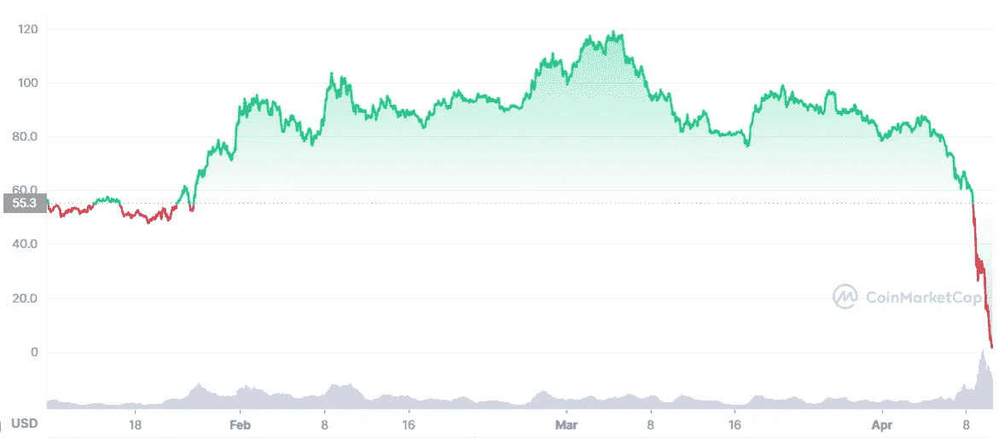
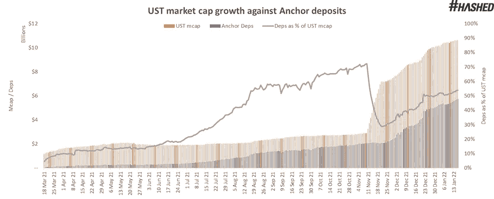
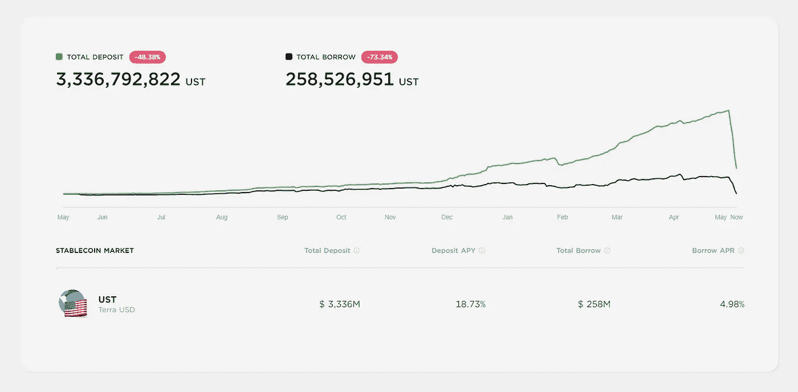
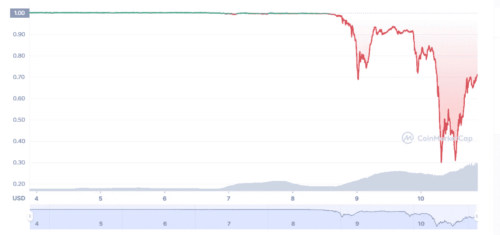
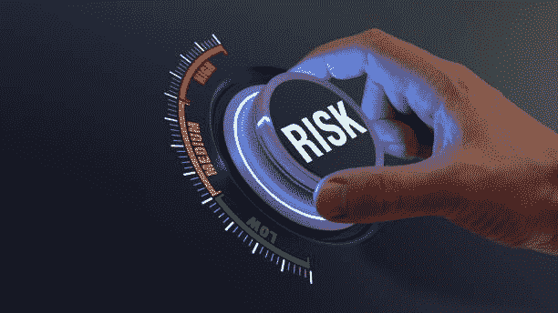

# 我个人经历的卢娜/UST 崩溃

> 原文：<https://medium.com/coinmonks/my-personal-experience-with-the-luna-ust-collapse-3389ddfd3150?source=collection_archive---------6----------------------->

## 加密货币和风险

## 从 Terra 主要货币的历史性崩溃中吸取的教训

这几天我们在卢娜和 UST 身上看到的是前所未有的。不是因为一个硬币一夜之间掉了 95%——这在密码学中已经发生无数次了——而是因为这个项目的规模和相关性。

按市值计算，LUNA 和 UST 都位列加密货币前 10 名，而就在一个月前，LUNA 创下了历史新高。现在，它值 **$1.4** 。

许多人措手不及，包括我自己。以下是我对所发生的事情的体验以及我从中学到的东西。

> 加入 Coinmonks [电报频道](https://t.me/coincodecap)和 [Youtube 频道](https://www.youtube.com/c/coinmonks/videos)了解加密交易和投资

# 我对露娜和 UST 的接触

让我先告诉你我对 Terra 生态系统有多投入。

## 月神

我很幸运，很早就买了露娜。我的参赛价格大约是 34 美元。老实说，这不是一个很大的头寸，但对我来说非常重要——一个阿根廷人投资 crypto 来躲避 5%的月通胀率。

我让这些露娜在 Terra 站押了 8%,委托给猎户座验证器。几个月后，我转向 StaderLabs 液体打桩。

**为什么？因为我对 21 天的取消授权期感到不舒服。StaderLabs 的 LunaX 令牌允许我交换我的 LUNA 而无需等待。回想起来，那是我做过的最好的选择之一。**

## UST

起初，我在 UST 的仓位和我在露娜的仓位差不多。人民币与美元 1:1 的挂钩以及 20%的 APY 锚定汇率，是一项不容忽视的巨大被动收入。

不仅如此，每次我结束交易时，我都在 UST 获利，并把它们存入锚中，以增加我的被动收益。

很快，我在 Anchor 的 UST 头寸增长了 4 倍，成为我投资组合中的第二大持股，仅次于 BTC。

# 我知道什么，不知道什么，以及这有多重要

在进入这个项目之前，我研究了一段时间 LUNA tokenomics。卢娜是如何被用来平衡 UST 和维持联系汇率的，以及随着 UST 的铸造，卢娜是如何被烧伤的。

我还通过在 Twitter 上关注权道和研究主播协议了解到，20%的收益率是有补贴的，在有机上是不可持续的。我还知道，UST 总供应量的 70%左右存放在 Anchor Earn 上，推动了它的大部分采用和铸造。

我不是专家，但请相信我，这不是秘密。

我从这件事中学到了什么结论？

1.  首先，大多数 UST 供应集中在一个协议上，该协议失败将触发灾难性事件。
2.  第二，UST 供应量的增长主要是由人为的 APY 推动的，这种人为的得到了快速消耗的收益率储备的补贴。
3.  最后，LUNA 的看涨反弹是其供应枯竭的结果。因此，卢娜·普莱斯也间接依赖于主播的 APY。

UST supply versus Anchor deposits.

在我的脑海中出现这三个项目，我知道灾难性失败的风险是真实的可能性。

然而，保护联系汇率的许多机制——如 BTC 储备和 Curve 的 4-pool——以及 Do Kwon 对他的项目的信心(几次在 Twitter 上恐吓对 Terra 生态系统表示关切的批评者),使我忽略了它。严重的错误。

然而，我相信，在达到临界点之前，我们还有很长的路要走。我和我的密码爱好者朋友讨论过这个问题。

我们知道灾难会到来——每个研究 UST 的人在某种程度上都知道。我们只是没想到会是现在，而且是这么快。这让我们措手不及。

# 我的反应

> 我去年在 160 美元买了 SOL。我看到它涨到 240 美元，我拒绝卖出，认为它会更高。我仍然持有该溶胶，我已经下跌了 75%。从那天起，我发誓我会一直获利。

我告诉你这些是因为大约一个月前，LUNA 达到了 118 美元的历史新高。吸取了这个教训，了解了我所知道的关于 Terra 生态系统的一切，我获利了。

我不能准确地计算顶部的时间，但我确实在 110 美元卖出了我 60%的 LUNA 头寸。我收回了最初的投资，也获得了可观的利润，仍然保留了 40%的 LUNA。那是我做的第一个正确的选择。然而，我把利润存入锚中。

然后，转储发生了。BTC 从 38K 美元跌到 36K 美元，然后又跌到 33K 美元。正如经常发生的那样，alts 接踵而至，LUNA 是其中最糟糕的一个。它从 85 美元跌到 60 美元，恐惧开始袭来。

当 Anchor 开始看到大规模撤资时，我很平静。联系汇率保持不变，我也习惯了波动。然而，第二天，Terra 的主协议继续运行。

> 记住，锚和它的 APY 是大约 70% UST 铸币的唯一原因。

Anchor TVL chart.

接下来发生的是所有人都知道会发生的事情:对卢娜失去信心，退出锚定，持有 UST 而不是，比如说，USDC 或 USDT 是没有意义的——更具流动性，被广泛采用的稳定资本和无数更多的交易对。

## 离开 UST 和露娜

当 UST 汇率达到 0.98 美元时，尽管大多数人仍然平静地认为它将会复苏，但焦虑开始出现。是的，许多稳定的硬币失去了挂钩，他们中的许多人恢复了。然而，许多其他人没有，考虑到我对 UST 的了解，我不太确定是否能恢复。

我决定承担损失，从锚上撤回我所有的 UST，把它桥到雪崩上。在那里，我在 TraderJoe 上用 0.97 美元的**把我所有的 UST 换成了 USDC。我支付了 77 美元的交易费，你可以想象这对组合的交易量。**

很难解释当 USDC 出现在我的钱包里时，我有多轻松。就像降落一架燃烧的飞机。

正如我之前说过的，我知道如果 UST 崩溃了，露娜也会跟着崩溃。我仍然把我的 LUNA 的 LunaX 放在 StaderLabs，所以我把它换成了 LUNA 并把它送到了 KuCoin，在那里我清算了那个位置的最后残余。我的出场价格是 54 美元。令人惊讶的是，我关闭了利润。

就这样，结束了。我躲过了一劫。

# 经验教训

这听起来可能是陈词滥调和重复的，但是相信我，直到你赔钱了，你才真正学会。

## 自己做研究

我知道我必须退出，因为我花时间阅读了机制和令牌组学，并查看了数据，如安克雷奇的 TVL 与 UST 总供应量的比较。

如果我不明白某件事，我会寻找更聪明、更值得信任的人，在 YouTube 视频或 Twitter 帖子上解释。倾听所有的声音，支持的和反对的。将他们所说的与你所知道的进行比较。学习。做出你的选择。

你从来都不是房间里最聪明的人，这并不可耻。当你了解全局时，做出好的决定就容易多了。

## 如果一个机会好得不像真的，它很可能就是真的

稳定货币的 20%年收益率简直太划算了。正如我提到的，这是通过补贴和收益储备膨胀的，但许多人——包括我自己——忽略了这一点。

重要的是要超越一个项目的门面和品牌。来自 Terra 生态系统的每个人，从首席执行官到不知情的社区成员，都把 UST 和卢娜描绘成牢不可破的，尽管风险是显而易见的。

不仅如此，提出这些顾虑的人还被欺负，被嘲笑，被取笑，很容易随波逐流。

## 风险总是存在的

在加密领域没有无风险的投资，在任何领域也是如此。不管社区如何看待这个项目，这个项目的品牌如何，这个项目的声誉如何，**总有风险**。

我们中的许多人认为我们是安全的，我们的美元价值受到保护，因为我们持有稳定的硬币。现在，我们都痛苦地吸取了教训，即使这些也意味着风险。

# 结束语

有一种说法认为这是来自币安、贝莱德或城堡的协同攻击。我真的不知道这是不是真的，但我知道这无关紧要。现在最好的办法是翻过这一页，继续前进。

如果你陷入这种困境，我希望你做得很好。看到你的钱蒸发并不容易，许多人都过得不好。但是记住:只是钱，生活还要继续。

如果你需要支持、帮助或聊天的人来洗掉你嘴里的酸味，请随时给我发信息或在 Twitter 上联系我。你并不孤单，尽管我们会犯错误，crypto 仍然是最友好和最有同情心的社区之一。希望这张图有帮助。

坚强点，保重。

## 你喜欢这个故事吗？

我很高兴你这么做了！我叫桑蒂。我喜欢并写作视频游戏、加密货币和流行文化。如果你想阅读更多类似这样的内容，可以考虑关注我的****和 [**Twitter**](https://twitter.com/SantiagoSchw_) 。我真的很感激！****

## ****谢谢大家的支持！****

****我是一名独立作家，我的故事没有报酬。如果你想用你想要的任何数量来支持我，我将非常感激！****

*   ****我的多链地址(以太坊，雪崩，多边形，BNB 链):**0x 9 a9 ab 154 aeea 167 AFD F5 AE 1a 88955 ea C9 ADF 5807******
*   ****本人 BTC 地址:**BC 1 q 9h 509 sea 3y 7 zcjp 24 dqjpucfq 44 r 0 ueltz 3 z 3c yh 67 qlhvsflrwqzt 6 pr 0******

******谢谢！******