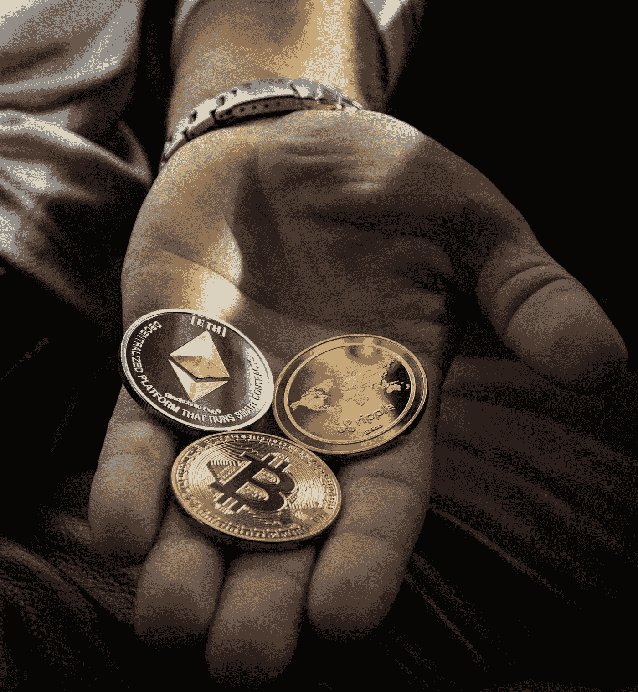

# 我的收入流非常容易复制

> 原文：<https://medium.com/coinmonks/my-revenue-streams-are-extremely-simple-to-replicate-86f666937e6b?source=collection_archive---------34----------------------->

多种收入来源是终极生活帮。

免责声明:*我在 Medium.com 的故事(Joseph A Cottrell)仅用于一般信息和教育目的，不构成法律、税务、会计或投资建议。我不是专业的财务顾问、律师或会计师，也不自称是。*

我不打算粉饰这件事。

这需要一些时间来发展必要的技能，成为一个拥有众多收入来源的坏蛋。然而，为了实现你的目标，你需要一点点的独创性和很大的毅力。

# 最大的博客作者担保的收入来源

因为你已经利用它们来谋生，在这方面你不是唯一的。许多人只把他们的专业知识卖给一个雇主。我意想不到的收入来源是教在线课程。一开始并不总是这样。

前几天在工作中，有人请我谈谈我使用 Java 和 JavaScript 的经历。我做到了。之后他们共同的熟人给我发邮件问“你能教我吗？”

我很害怕，所以我给他报了一个高得离谱的价格。他说当然。一个学习者最终会成为成百上千个学习者中的一员。

天赋可以被任何人传承。使用在线网站如 Skillshare、Teachable 和 Udemy 可以做到这一点。

# 你需要选择一个选项

成千上万的学生负担得起
给极少数个人的高价课程

与普遍看法相反，这两种模式都是有效的。

# 内容版税是一件好事。

为内容付费的平台可能就在那里。你已经知道了。

***Youtube*** 是比较传统的选项。

当你上传视频时，他们会给你一部分广告费。或者，也有其他网站会将你的订阅收入分成一部分。比赛开始变得拥挤了。

在考虑这些服务时，想想 ***Vocal、Substack 和 Quora*** 。

使用这些网站，你不可能在 30 天内买一艘船和一栋价值 1000 万美元的房子。然而，这是一个收入来源，当与其他来源配对时，可能会成倍增加。

# 模板

出售你能想到的每一种模板。使用网站[***gum road***](https://gumroad.com/)。

## 电子书模板

## 记录日志的模板

## 日历模板

## 博客标题模板。

我出售的大部分模板都是通过记录我的网络商务和写作技巧得到的。

在你记录了你的方法之后，你可以通过出售模板来赚钱。作为对电子邮件地址的交换，你可以赠送一个免费的模板。

模板只是快捷方式。人们愿意为方便而付费。

# 成本较高的咨询

企业为建议而非个人付费。

当你给一家公司开账单时，有可能提高你的价格。为什么？

这样他们就可以利用你的付款来减税。他们也没有那么多钱可以花，因为他们的公司会产生收入来支付你的费用，而你教的人更可能用他们的薪水来支付你。

结交新朋友。看看你能否作为顾问帮助他们。

问十次，你只会得到一个顾客。

# Web 3.0 提供了新的赚钱方式

区块链革命是网络 3.0。 [***BitClout***](http://BitClout.com) 是一个允许人们投资我的博客的平台。

想法是你购买我的股票。随着我的作品越来越受欢迎，这个数字也越来越大。加密货币的发明者可以选择将其部分利润或特权返还给拥有者。

此外，我能够从我制作的东西中赚钱。

我所做的就是使用[***OpenSea***](http://OpenSea.com)平台将一篇网络文学作品转换成 NFT，然后发布在区块链上。所有权的证据很清楚。可以证明。

然后你可以通过出售你的作品来赚钱。为了利用 Web3 上不断扩大的金融前景，考虑在你的投资组合中增加一个或多个 Web3 收入流。

不是每个人都是粉丝。那么，这是值得深思的事情。

# 我准备引入新的收入来源

从 ***联盟营销*** 中获得的利润可能是巨大的。让我给你举个例子来说明我所说的。

阅读这篇文章的绝大多数人最好从转售他人的数字产品开始。这样你会对主题有更好的理解。利用别人的名声，以较小的风险销售已建立的项目，也是这种策略的一大优势。

联盟营销业务是最没有吸引力的资金来源。

当你在网上赚到 50 美元的时候，你的心态就完全改变了。联盟营销就是这样做的。这不需要太多的努力，但结果却是深远的。

# 我的结论

学习技能。下一步是将这些能力转化为现金。建立你的技能堆栈，同时增加你的资金来源。祝你好运！

> 加入 Coinmonks [电报频道](https://t.me/coincodecap)和 [Youtube 频道](https://www.youtube.com/c/coinmonks/videos)了解加密交易和投资

# 另外，阅读

*   [Bookmap 点评](https://coincodecap.com/bookmap-review-2021-best-trading-software) | [美国 5 大最佳加密交易所](https://coincodecap.com/crypto-exchange-usa)
*   最佳加密[硬件钱包](/coinmonks/hardware-wallets-dfa1211730c6) | [Bitbns 评论](/coinmonks/bitbns-review-38256a07e161)
*   [新加坡十大最佳加密交易所](https://coincodecap.com/crypto-exchange-in-singapore) | [购买 AXS](https://coincodecap.com/buy-axs-token)
*   [红狗赌场评论](https://coincodecap.com/red-dog-casino-review) | [Swyftx 评论](https://coincodecap.com/swyftx-review) | [CoinGate 评论](https://coincodecap.com/coingate-review)
*   [投资印度的最佳密码](https://coincodecap.com/best-crypto-to-invest-in-india-in-2021)|[WazirX P2P](https://coincodecap.com/wazirx-p2p)|[Hi Dollar Review](https://coincodecap.com/hi-dollar-review)