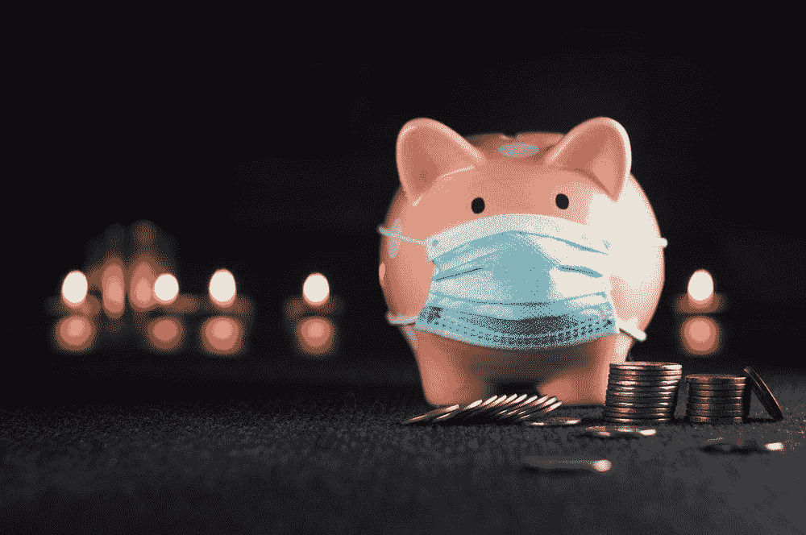

# 银行账户是骗局——我如何从我的钱上赚取 8%的利息:

> 原文：<https://medium.com/coinmonks/my-savings-account-earns-8-interest-a-year-6f656ee65815?source=collection_archive---------0----------------------->

通货膨胀会在 7 年内把你的钱减半——你需要 0.5%以上的利息。

Credit: Konstantin Evdokimov

银行账户是骗局。

在大多数国家，银行不需要保留你的任何现金。

如果你把钱存入储蓄账户，**银行会贷出你所有的钱，并且每年只给你 0.5%的利息。**