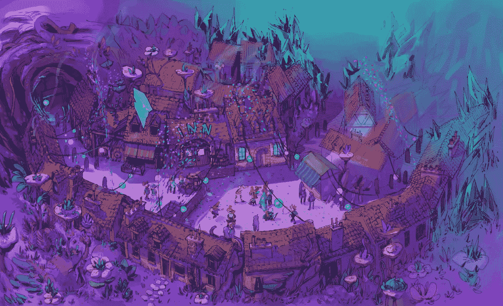

# 我对 GameFi 的看法

> 原文：<https://medium.com/coinmonks/my-take-on-gamefi-f44b3c81c6c0?source=collection_archive---------25----------------------->

Aurory, a GameFi project on Solana

# 介绍

2020 年 3 月，在疫情期间，学校被关闭，我回到中国的家中在线上课。由于社交距离和减少承诺，我用游戏口袋妖怪剑购买了一个开关，我在三天内完成了游戏。后来，我把开关和游戏一起给了我的朋友，以帮助他打发时间，并开始沉浸在一个名为“王者荣耀”的 MOBA 游戏中。每天，我都会定一个时间，和一些朋友在国王峡谷碰面，然后花几个小时为胜利而战。五月份学期结束的时候，我在那款游戏里达到了最高等级，我和我的口袋妖怪游戏的朋友成为了世界前一千的训练师。

除了为我们隐藏的天赋欢呼之外，我们对我们每天花在游戏上的时间感到惊讶，并且知道我们不是唯一一个在那个时候有强烈游戏瘾的人。我们意识到，随着人们有更多的空闲时间和寻求娱乐选择，Covid 已经成为游戏的催化剂。除了我们对游戏投入的时间，我和我的朋友们还购买了许多游戏中的皮肤和物品来展示我们的数字身份。我们开始意识到游戏是最赚钱的行业之一。它每年产生近 2000 亿美元的收入，仅国王的荣誉在 2020 年就产生了 24.5 亿美元的收入。随着时间的推移，游戏可能会成为持续表现良好的行业，因为对游戏的需求不会因为对娱乐的持续需求而减少。

疫情时期还有什么繁荣的？答案是加密。2021 年，人们正在寻求通胀对冲，并目睹了大量资金流入加密市场。要么是受 FOMO(害怕错过)的驱使，要么是相信这个行业，许多人跳上了顺风车，将钱投入加密货币。投资者的范围很广，但大多数都在 40 岁以下，对创新的接受度很高。许多从中学到大学的年轻投资者被$DOGE 或$SHIB 等迷因币带入市场，使加密成为他们的第一笔投资。随着大量用户的流入，许多链上应用开始受到关注，新的想法出现了。围绕 Defi、SocialFi、GameFi 和 NFTs 的概念和应用开始更多地出现在人们的对话中。这些想法似乎比现有的集中式系统更有吸引力，因为它们能够解决数据权利归属、利益分配(没有中间人)、隐私等问题。

GameFi 是最受欢迎的。不仅因为边玩游戏边拿报酬的想法听起来很诱人，而且人们也预见到了这个领域巨大的盈利机会。Axie Infinity 的爆炸式增长说服了零售商和风险投资公司对 GameFi 的需求，并使他们想加入寻找下一个热门产品。大量风投资金涌入该行业。例如，FTX 和光速创投公司的 1 亿美元，币安和 Animoca 的 2 亿美元。2021 年底，脸书宣布更名为 Meta，进军元宇宙。声明发布后，大盘股元宇宙代币和 NFT 也大幅升值。所有这些都让人们相信下一次炒作将会在 GameFi，结合 NFTs 和元宇宙概念的模型上进行。

# GameFi 是什么？

从字面意思来看，GameFi 是游戏和金融的结合。该模型采用互动的博弈方式，为人们提供分散融资的途径。从而达到玩游戏获得奖励的目的，也称为玩赚。换句话说，GameFi 可以被视为添加到 Defi 的一个额外的交互层。用户需要在一段时间内完成某些动作，以从 Defi 获得类似或更多的收入。

# GameFi 的优势

GameFi 的想法似乎对许多人有吸引力，因为游戏为人们提供了使用 Defi 和了解加密世界的友好途径。其他好处包括所有权证明、有效广告、分散运营、透明度等等。

## 1.所有权证明

为了理解所有权的证明，我们需要首先理解 NFT，不可替换的令牌。在区块链上，当用户创建或购买一个 NFT 时，jpeg 或项目会附加到用户的钱包地址上，其交易历史可以在以太坊(Ethereum)等浏览器网站上搜索到。对于创作者来说，NFT 允许他们鉴定自己的作品。对于买家来说，NFT 允许他们有机会直接从某些创作者的作品中获得所有权。这种设计有效地消除了“右击保存者”的顾虑，因为他们可以自由下载或使用图片，但不拥有图片的所有权。所有权赋予 NFT 价值，创造了一种数字稀缺和排他性的感觉。这解释了为什么人们愿意支付数千美元来换取 jpeg。

回顾 Web2 gaming，一个没有所有权的世界，旧的结构可能会蒸发玩家在游戏中的努力，并在游戏过时时变得毫无意义。我是一个流行的手机游戏《部落冲突》的粉丝。我在中学时开始玩这个游戏，当时它在 App Store 上很流行，我周围的人都在谈论它。后来，我的许多朋友逐渐失去了兴趣，但我继续享受它的寒意节奏。年复一年，我花了很多时间购买了很多游戏中的物品。去年终于不玩游戏了，把那句关于我的青春和努力都写在那款游戏里了。

正如许多人可以从我的例子中看到的，在 Web 2 游戏中，你花在游戏上的时间和金钱通常不能被恰当地估价。如果游戏变得过时，你周围没有人玩这个游戏，你也会逐渐停止玩，你之前的所有努力都变得毫无意义。然而，Web 3 用所有权的概念解决了这样一个问题。由于游戏中的所有物品都以 NFT 的形式存在，所以当用户想要退出游戏时，可以交易他们的物品。通过这种方式，游戏玩家为游戏付出的努力可以得到货币价值的回报。此外，在样本量更大的无边界区块链生态系统中，用户可以很容易地找到买家，这些人也像过去一样对游戏充满热情。这样的系统不仅重视玩家的时间，也延长了游戏的生命周期。只要游戏内的 NFT 有需求，有钱可赚，总会有玩家玩这个游戏。

## 2.有效广告

在传统的 Web 2 游戏中，一个新推出的游戏通常需要大量的广告来获得流量。如果游戏来自一个小公司，即使有昂贵的营销，它也更难获得玩家的关注。

Web 3 游戏轻松解决了这些问题。新游戏可以与旧游戏或 NFT 收藏合作，并承诺向这些用户提供早期访问和独家奖励。既然没有人会对免费的钱说不，如果新来者选择在社交媒体上兜售这个机会，这样的 Web 3 游戏可以很容易地获得大量流量，甚至一些免费广告。验证过程很简单。新游戏可以设置一个机器人来检测用户钱包中是否有特定的令牌，如果用户满足标准，他们可以要求特定的角色/奖励。(类似于 Collabland in Discord)

最后但同样重要的是，Web 3 游戏宣传自己的另一种方式是空投/发射 NFT 或代币。从 2021 年 12 月的$SOS 开始，我们看到了空投的媒体效应迅速将人们的注意力带到了 OpenDao。后来，像 Looksrare 和 X2Y2 这样的市场也采用了这种广告方式，并成功地从 OpenSea 的垄断中获得了用户和交易量。毫无疑问，Web 3 游戏也可以空投代币，让人们了解即将到来的游戏，吸引潜在用户。

此外，许多 GameFi 项目选择在游戏发布前发布 NFT 或代币。通过展示他们的创意肌肉，团队可以在游戏发布前吸引一批潜在用户。通过这种方式，一旦游戏推出，人们就会立即要求来玩游戏，因为他们长期以来一直持有 NFT 和期望。

## 3.分散操作

在传统游戏中，游戏开发者和玩家经常站在对立面，因为玩家试图找到作弊代码以在游戏中茁壮成长，而开发者试图限制这些玩家并恢复平衡。开发者将不断改变游戏中的数据和规则，以确保没有人在没有他们监督的情况下获得任何优势。然而，这些开发者并不总是做出正确的决定，许多人最终失望并失去了忠诚的玩家。这是传统游戏行业中仍然普遍存在的一个问题。

幸运的是，围绕去中心化的理念，区块链减少了开发者的主导地位，同时促进了用户和创作者之间的关系。就拿 Gala 的创始人节点来说吧。拥有有效的创始人节点许可证或游戏节点许可证，用户可以运行 Gala 节点软件，并每天获得部分发行奖励。有超过 16，000 个玩家运行的节点，每个节点持有者都可以就春晚游戏路线图的发展发表意见。分布式投票机制将被用于招募节点所有者和玩家，授予他们决定哪个游戏应该被添加到平台上以及如何资助节日游戏的权力。Gala 的模式通过利用玩家的力量强调去中心化，把他们和开发者放在同一个会议室里。

分散的设计也培养了一个健康的社区。当将节点分配给单个节点所有者时，开发团队的利润与社区捆绑在一起。拥有节点和表达意见的权力，代币持有者将获得更多激励来帮助游戏/生态系统变得可持续。开发者也将更乐意向代币持有者寻求支持/建议，而不会被质疑他们的能力。随着时间的推移，这种分散的结构可以形成一个强大的社区，确保项目成为长期可持续的。

## 4.透明度

在传统的游戏公司，没有办法知道公司如何使用他们的资金。然而，区块链上的一切都是可以搜索的。(隐私 dapps 除外，如 Tornado cash。)如果该团队公开发布其社区钱包地址，投资者可以上诸如 etherscan 等扫描仪网站查看该钱包中的货币行为。由区块链科技促成的这种开放性可以在投资者和开发团队之间培养一种强烈的信任感。

更重要的是，在区块链，每一项都以非关税壁垒的形式存在于合同中。大多数时候这些合约都是开源的，玩家可以查看游戏设置。在传统游戏中，如果没有开源合同，游戏公司可以随时降低从神秘箱子中取出稀有物品的可能性。许多公司已经秘密地这样做了，以确保玩家投入更多的钱来获得他们需要的物品。此外，通过不断修改状态，开发者可以使稀有物品变得常见，并创建更稀有的物品来迫使玩家研磨或投资，同时使玩家之前投入的所有金钱和努力变得徒劳。这种不道德的行为将被揭露出来，并被区块链技术阻止，因为开发者在开源合同上无处可藏。因此，当垄断被消除时，玩家现在可以在公平的环境中真正享受游戏。

# GameFi 的问题

尽管 GameFi 有许多创新的好处，许多人也发现 GameFi 的想法是矛盾的和有问题的。一些论点是(GameFi 是)一种费力的 Defi 形式，缺乏有意向的参与者，低效的治理机制，供应过剩，以及承诺过多和兑现不足。

## 1.用一层坚硬的东西来定义

在 Defi 中，用户通常将代币放入流动性池，被动地从平台赚取奖励/交易费。在基于相同机制的情况下赚取类似的金额，GameFi 消除了被动收入的想法，并要求用户与游戏互动来赚取收入。这种设计对许多投资者来说似乎很费力，因为他们看不到 GameFi 的意义，因为他们可以通过 Defi 轻松获得同样多的回报。

## 2.缺乏潜在的玩家

GameFi 最关键的问题之一是“密码第一，游戏第二”，这意味着玩家更关注盈利方面，而不是游戏的可玩性。考虑到目前听说过 GameFi 的潜在受众是 Web 3 领域的加密/ NFT 投资者。他们中的许多人相信他们投资的游戏有一天会成为主流，人们会开始增加效用，并让他们投资的代币或游戏曝光。这似乎是一个可靠的计划。然而，这里的问题是，一旦游戏推出，玩家将是谁？

大多数了解 GameFi 并听说过这个概念的人都是投资者，他们从来不指望自己会一直玩游戏。特别是在 Axie Infinity 疯狂回归的推动下，许多 GameFi 投资者设想有人会来玩他们的游戏，让他们的游戏爆炸。然而，Axie Infinity 爆发了，因为它在 Covid 期间成为许多菲律宾人的主要收入来源。投资者是否应该期待弱势群体的再次出现，并神奇地发现 GameFi？我认为答案是否定的，而且，即使有，这种模式也是不可持续的(早期采用者或鲸鱼通常在操纵游戏内令牌方面有明显的优势，他们可以随时从新来者身上获利)。

同样，对于 GameFi 公司来说，他们在 Web 3 领域的大部分接触都是以利润为导向的投资者，而公司则在寻找主要存在于 Web 2 领域的以盈利为导向的玩家。如果这些公司不走出 Web 3 泡沫，他们将无法接触到合适的受众，也无法让他们的生态系统可持续发展。然而，将游戏玩家从 Web 2 过渡到 Web 3 需要时间和教育。所以 GameFi 达到成功的时间跨度会拉长。

## 3.低效投票机制

大多数 GameFi 项目目前运行的治理机制是某种形式的 DAO，其中每个令牌持有者都有权对团队的路线图进行投票，他们的投票根据他们拥有的令牌数量进行加权。这一机制涉及两个问题，即"道"本身的问题和选民代表性问题。

如今，大多数 DAO 的投票参与率很低，要么是因为大多数持有人从交易所购买代币，要么是因为他们对去中心化治理的想法漠不关心。此外，团队决定在每轮投票中发布什么问题，投票者只有有限的选项，大多是“是”或“否”。尽管用户也可以在论坛中发布他们的提案，但团队会最终决定在投票中提出哪个提案。因此，团队做出了最后的决定。此外，投票根据他们拥有的代币数量进行加权。通过这种方式，鲸鱼比散户投资者拥有更多的投票权，而且往往有能力单独改变任何投票的结果。很多时候，团队持有很大份额的供应，使得分散投票的想法似乎无效。

选民代表性也是 DAO 的一个常见问题。大多数项目指派令牌持有者负责决策。然而，令牌持有者通常并不代表整个项目生态系统的最佳利益。例如，如果团队要求令牌持有者投票决定该项目是否应该减少游戏中的土地数量，令牌持有者可能并不总是知道土地所有者的核心问题。不是每个代币持有者都拥有土地，也不是每个土地所有者都有代币。GameFi 的投票机制应该更加周到，充分体现公平和去中心化的理念。

## 4.供给过多

现在制作 Web 3 游戏的公司太多了，导致整个 GameFi 市场供过于求。许多项目向用户和风险投资提供美化的游戏画面和雄心勃勃的路线图。虽然风险资本有能力识别项目的可行性并降低投资风险，但散户投资者不具备适当的投资知识，经常带着 FOMO 进入市场(害怕错失良机)。

在 Web 3 领域，在实际的产品发布之前，营销是一切的关键。因此，向散户投资者伪造一个令人信服的项目的门槛非常低。我们听过无数这样的例子，一个团队把所有的钱都投入到市场营销中，却没有打算交付一个实际的产品。这种现象在 NFT 空间极为普遍。一个名为 Pixelmon 的 GameFi 项目向玩家展示了奇妙的《我的世界》风格的游戏内镜头，并锁定了他们的不和谐，使其看起来独家，给观众带来了该项目的高端吸引力。该项目使用荷兰拍卖来出售他们的 NFT，并声称这些将是他们未来的游戏宠物。两周后，当 NFTs 被披露时，图像看起来一点也不像承诺的那样，而是一组破碎的乐高碎片笨拙地组合在一起。当买家意识到他们已经被这个项目弄得筋疲力尽的时候，创始人已经在他的口袋里聚集了 1400 万美元。

除了崎岖不平的高风险之外，由于有如此多的项目和行业都将 GameFi 视为下一波浪潮，成功之路是充满竞争的。最终，大多数 GameFi 项目都会失败，只有极少数会脱颖而出。从投资者的角度来看，在实际游戏推出之前，没有办法在前期确定哪一个会占上风。许多风险投资专注于 Beta，并投资于广泛的游戏，减轻风险，并从大趋势中寻求回报。然而，大多数投资者往往不能减轻他们的风险，也没有能力挑选爆炸性的项目。因此，许多人对 GameFi 印象不佳。

## 5.承诺过多，兑现不足

在游戏发布之前，团队将注意力集中在市场营销上并尽可能地为项目吸引更多的注意力是至关重要的。然而，有时发布前的大肆宣传对项目是有害的，可能会扼杀项目。

一旦游戏推出，玩家就没什么可期待的了。如果游戏表现不佳，持有者将会失望并放弃该项目。另一方面，即使游戏达到了标准，如果项目在推出前被过度宣传，持有者往往会期待更多的东西，并在最初推出后的几周内逐渐失去兴趣。那么什么才是正确的方法呢？Doodles 的创始人 Poopie 曾经亲自告诉我，“一个项目要想成功，就需要少承诺多交付。这就是一个项目如何变得长期可持续的原因。”此外，如果团队设法继续大肆宣传，并给持有人另一个提示，以保持他们的期望，项目将继续做得很好。志那都红豆团队已经使用了这种方法。在他们在洛杉矶会面之前，这个项目受到了大肆宣传。在他们会面时宣布了这个特别的声明后，团队向持有者发送了空投物资，并让整个空间猜测这些可能是什么。他们的方法在会面后的 3 天内带来了大约 5 万以太坊交易量。现在，随着炒作的继续，持有者很高兴，NFT 空间的人试图购买这些藏品。

因此，过度宣传项目会让玩家的期望值过高，最终会更快地对项目失去兴趣。借鉴 NFT 的经验，GameFi 营销的正确方法应该包括承诺不足和过度交付，以及交付后继续大肆宣传。

# 潜在的解决方案

GameFi 的概念引发了很多想象和担忧。显然，没有人知道未来，也没有任何游戏能够吸引每个人的注意力或导致大规模采用。虽然还没有完美的解决方案来解决上面提到的问题，但是我确实预见到了一些潜在的解决方案，它们有助于 GameFi 项目的成功。

# 大问题:如何专注于游戏第一，加密第二

如前所述，GameFi 一直面临着缺乏目标受众的问题。假设我发布了一个 10K 供应商的 GameFi NFT 项目。一旦游戏推出，对游戏最感兴趣的人和潜在玩家是这些 10K 持有者，与任何 Web 2 游戏相比，这是一个很小的群体。由于持有人作为项目的早期利益相关者将获得明显的优势，因此非持有人参与奥运会的动机将会降低。尽管该项目可以推出更多价格更低的 PFP 来吸引更多受众，但额外受众的数量仍将严格限制在他们生产的额外 PFP 上，持有者和非持有者之间的差距将永远无法弥合。此外，供应的无止境增加可能最终会稀释原始收集，同时危及整个生态系统。那么，解决方案应该是什么呢？

## 1.Web 2 迁移到 Web 3

如果我们邀请成功的网络游戏公司迁移到 Web 3 会怎么样？成功的 Web 2 游戏通过其出色的可玩性吸引用户。如果游戏迁移到区块链，很大一部分用户会跟随，特别是了解游戏赚钱方面。这样的 Web 2 公司可以选择完全迁移到 Web 3，或者部分保留在 Web 3 上，以获得额外的游戏体验。后一种方法可能会更受欢迎，因为它将减少步入 Web 3 水域的风险，因为他们仍然保持他们传统的一部分运行，并将能够随时退出。这种迁移将为 GameFI 带来直接受众的显著曝光，并赢得 Web 3 领域大玩家的认可和大量投资。

从用户的角度来看，Web 3 应该看起来更有吸引力，因为它最大程度地回报了链上用户。Web 2 和 Web 3 之间最明显的两个特征是关于用户行为的价值获取。在 Web 2 中，一个平台的用户访问有助于公司的估值，因为这些数据可以提高其平台的广告费。这些 Web 2 公司对通过他们的平台产生的用户数据拥有完全的权利，并经常向他们收取很高的价格。另一方面，在 Web 3 平台上，用户拥有他们数据的所有权，并可以根据他们的链上行为获得回报。我们已经看到了很多以$ENS、$SOS 和$LOOKS 开头的空投，根据用户的上链历史来奖励他们。因此，在 Web 3 中，用户可以通过他们的行为受益，而不是继续养活大玩家。

## 2.IP 优先

如果这个团队不是一个已经很成熟的 Web 2 游戏公司呢？他们应该走哪条路线，应该做些什么？依我拙见，我认为团队应该先打造品牌，再打造游戏。目前有如此多的 GameFi 项目承诺令人难以置信的路线图，并实施赌注以及代币奖励等。然而，如果游戏缺乏玩家，并且生态系统没有很好地建立，那么由于缺乏市场需求，游戏很容易随着令牌价格的下降而倒下。因此，建立游戏的市场需求应该被视为当务之急。一旦品牌成功建立，许多有才华的传统游戏公司就会来敲他们的门，表示愿意帮忙。

## 3.承诺不足和兑现过多

与过度承诺的路线图相反，正如我们在上一节中所提到的，一个创始人/团队应该总是对他们的项目承诺不足而交付过多。团队不应该向持有者承诺一个长期的路线图，因为这个领域发展很快，人们的兴趣可能会改变，任何创始人都无法预测下一个热门话题会是什么。因此，为了项目的长久，对创始人来说最好的事情，与直觉相反，不是承诺一个路线图。没有严格的制度，一旦抓住机会，团队就可以不受最初计划的限制，向任何他们想要的方向转移或前进。此外，通过承诺一个长期的路线图，并最终由于市场兴趣的转移而改变方向，创始人将承受巨大的压力，而投资者将感到背叛和失望，最终离开项目。另一方面，非承诺路线图更像思维导图，因为它为项目创造了无限的可能性，并使项目在当前情况下灵活地做出最佳决策。

# 结论

尽管 GameFi 目前面临着许多似乎无法解决的问题，但 GameFi 体现的基本原理为现代人提供了无尽的想象力。随着 crypto 和 NFTs 在未来变得更加主流，GameFi 也将逐渐走进人们的生活。现在的很多 GameFi 项目，在我看来，更像是资本和基金运作的实验，测试公众的接受度。然而，这些当前的样本将提供有价值的结果，并有助于在未来创建一个成功的 GameFi 项目。

信用:

1.  [期待加密游戏](https://mirror.xyz/harvardblockchain.eth/FQa1LIPeWnaQ_mkJbyZJuAyi7fCjoPNBpLWoCP3y4hY)[安迪·曾](https://twitter.com/bobaepicure)和[约书亚·杨](https://twitter.com/joshuaqyang)
2.  [谈论你不了解的区块链游戏](https://mp.weixin.qq.com/s?__biz=MzU1OTQ3MTI3Ng==&mid=2247483784&idx=1&sn=d7e1311d5741aeb4236bb4afd5e345a2&chksm=fc178e4bcb60075dd4b1191b2f7dd524f5f5a6080e36dc91cee63bae00dbacdd71f9f46c5571&scene=21#wechat_redirect)作者 [Vincent Niu](https://twitter.com/VincentNiu222)
3.  [环游街区 ep2——密码游戏](https://www.youtube.com/watch?v=1hzdtcIqHhI&t=263s)特色[艾米吴](https://twitter.com/amytongwu)
4.  [采访涂鸦 NFT 的联合创始人——Poopie](https://www.youtube.com/watch?v=bNUJzMxS4sI&t=114s)

> 加入 Coinmonks [电报频道](https://t.me/coincodecap)和 [Youtube 频道](https://www.youtube.com/c/coinmonks/videos)了解加密交易和投资

# 另外，阅读

*   [OKEx vs KuCoin](https://coincodecap.com/okex-kucoin) | [摄氏替代品](https://coincodecap.com/celsius-alternatives) | [如何购买 VeChain](https://coincodecap.com/buy-vechain)
*   [币安期货交易](https://coincodecap.com/binance-futures-trading)|[3 comas vs Mudrex vs eToro](https://coincodecap.com/mudrex-3commas-etoro)
*   [如何购买 Monero](https://coincodecap.com/buy-monero) | [IDEX 评论](https://coincodecap.com/idex-review) | [BitKan 交易机器人](https://coincodecap.com/bitkan-trading-bot)
*   [CoinDCX 评论](/coinmonks/coindcx-review-8444db3621a2) | [加密保证金交易交易所](https://coincodecap.com/crypto-margin-trading-exchanges)
*   [红狗赌场评论](https://coincodecap.com/red-dog-casino-review) | [Swyftx 评论](https://coincodecap.com/swyftx-review) | [CoinGate 评论](https://coincodecap.com/coingate-review)