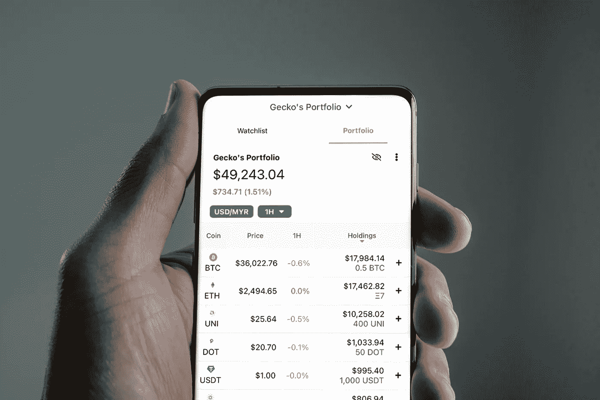

# 我 2022 年的五大加密货币投资

> 原文：<https://medium.com/coinmonks/my-top-5-cryptocurrencies-investments-in-2022-9e1bf79aac51?source=collection_archive---------8----------------------->

Source photo Unsplash.com

# 圆点— 20%

以太坊联合创始人之一加文·伍德(Gavin Wood)是 2016 年由 Web3 基金会成立的 Polkadot 的创始成员。多亏了 Polkadot，所有的区块链协议和基于它们的应用程序现在可以互相通信了。这是一个巨大的工程，但最终将实现数据(和货币)跨多个…