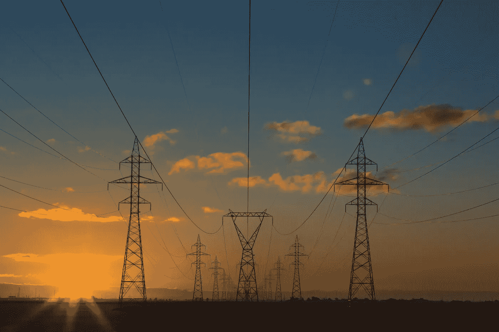

# 我 4 月份最想买的能源股

> 原文：<https://medium.com/coinmonks/my-top-energy-stock-to-buy-in-april-c2ca8e63b16f?source=collection_archive---------42----------------------->

Source photo Unsplash.com

与普遍的看法相反，总统和国会都没有多少权力(如果有的话)来决定你在加油站支付的价格。大多数加油站都是独立拥有和管理的，价格由加油站之间的竞争决定。

当然，影响天然气价格的主要因素是石油价格，石油公司在这方面的权力也有限。这是一个世界性的…