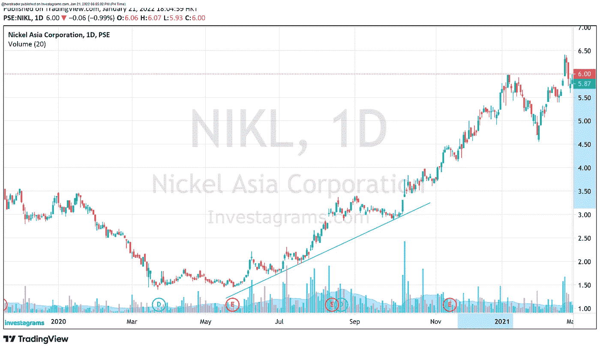
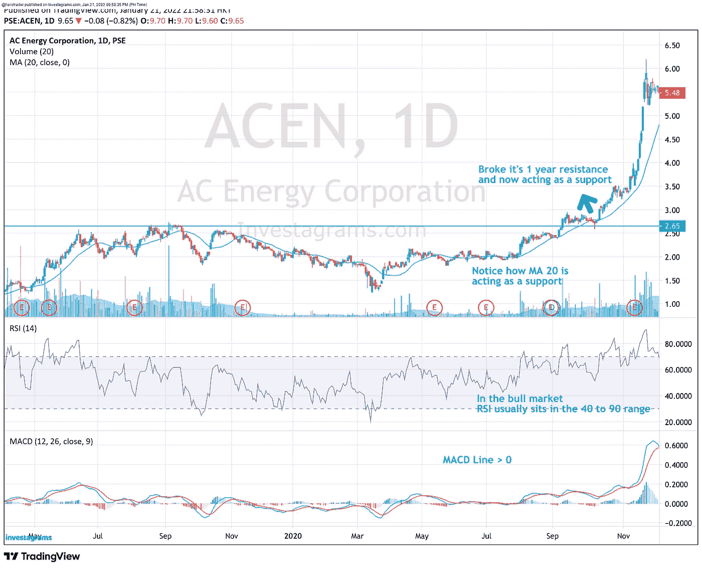

# 我的有利可图的股票交易策略

> 原文：<https://medium.com/coinmonks/my-trading-strategy-for-sustainable-and-profitable-trading-483bf16ece6f?source=collection_archive---------4----------------------->

商业中有一句古老的格言“如果你没有计划，你就计划失败”。这条建议适用于我们生活中的许多选择，包括交易。如果我们不把这个信息放在心上，那么缺乏计划可能会付出高昂的代价。制定一个适合你的交易计划或方法需要很多时间、努力和经验，但这并不能保证成功，拥有一个交易计划对达到更高的高度来说是非常重要的。市场是由人的情绪驱动的，一个坚实的交易策略会帮助你做出合乎逻辑的决定，保护你不受冲动交易的影响。在这个博客中，我将分享我自己简单的交易策略，我将讨论我如何选择和管理我的交易。这不会是非常技术性的，所以如果你是交易新手，这也适合你。顺便说一下，我创建了一个 android 应用程序，你可以在那里学习烛台模式，并参加具有挑战性的测验，查看谷歌 Play 商店股票的烛台模式

# 我的交易计划提出了以下问题

1.  什么值得交易？
2.  什么时候交易？
3.  交易多少？
4.  什么时候退出交易？

# **什么东西值得交易？**

市场朝着 3 个不同的方向移动，上涨，下跌和下跌。在菲律宾证券交易所，我们只做多头市场，这意味着交易者只能在股价上涨时做多头并获利。你可能听说过这样一句话“最好的交易方式是跟随趋势”。这是你可以遵循的建议，只要你知道趋势可以结束，你们将不再是朋友。有不同的方法来确定趋势，最常见的方法是通过绘制趋势线。你可以通过连接一系列向上倾斜的低价点来画一条上升趋势线，然后你就有了上升趋势。上升趋势由更高的高点和更高的低点组成。

在上面的例子中，镍亚洲公司从 2020 年 7 月到 2021 年 3 月。在连接三个连续的趋势线点后，它继续从第三个低点上涨 90%。在像菲律宾证券交易所这样的长期市场中，上升趋势的股票绝对是最值得交易的

# **什么时候交易？**

正如我之前提到的，市场是由人们的情绪驱动的，如果你让情绪引导你，代价可能会很高。有一件事可以帮助你，那就是获得高质量的睡眠，科学证明，当你缺乏睡眠时，你会冒更大的风险。重要的是，你要有清晰的头脑，明白你能承受多少投资组合价值的大幅波动。如果你承担了太多的风险，你可能会在市场顶部买入或者在错误的时间恐慌卖出。最糟糕的情况是，你无法卖出，因为你冒着太大的风险，同时希望收支平衡，直到你再也无法忍受亏损，最终亏损更大。永远记住，市场的起伏是旅程的一部分。深呼吸，遵循你的交易计划。

交易的情感方面讲了这么多，现在是技术方面的时候了。交易中有不同类型的指标。根据一般经验，尽可能保持简单，图表上有多个指标不会提高性能。相反，它会迷惑你，给你错误的信号。我使用了不同的指标组合，但这 3 个是我最喜欢的。

1.  移动平均线——移动平均线就是股票在给定时间内的平均价格。它是技术指标中用途最广、应用最广的指标，并且易于测试。移动平均线也可以作为支撑或阻力，可能不适合小盘股，因为这类股票往往非常不稳定。
2.  MACD——移动平均发散收敛(MACD)是一个滞后指标，它基本上给出了趋势开始的信号。这也有助于交易者了解价格的看涨运动是减弱还是增强
3.  RSI——相对强弱指数是技术交易者用来衡量价格变动的动量指标。RSI 在 0 到 100 的垂直刻度上绘制。高于 70 的运动被认为是超买，而超卖条件将低于 30。RSI 为 70 及以上意味着更多的供应进入市场，价格可能会下跌，而如果 RSI 低于 30，则表明超卖，价格可能会反弹。

事实是，在交易中没有 100%的保证，因此我会尽可能地让事情朝着对我有利的方向发展。如果不是所有这些指标都出现了，我会放弃这笔交易。记住，天涯何处无芳草，永远不要满足于半生不熟的交易。要乐观，要意识到市场上总有机会，等待的人会得到回报。

在上面的例子中，能源公司打破了长达一年的阻力。MACD 高于 MACD 线(显示上升趋势正在加强)，价格高于 20，100 和 200 移动平均线(长期趋势的确认)这是一个突破，我将在以后的博客中讨论。

# **交易多少**

当我们开始交易时，我们倾向于关注图表、技术分析和利润，而这些确实是需要花时间去做的重要事情。这就像打篮球只有进攻，没有防守只有进攻的球队很少赢得比赛，我们忘记了交易最重要的一个方面，风险管理。作为交易者，保护你的资本是你的职责，正确的仓位大小可以让你承受损失，让你的赢家自由驰骋，同时积极寻找市场机会，并有能力抓住它们。

头寸规模因人而异，取决于他们的账户规模和风险承受能力。作为像我这样的动量交易者和趋势跟踪者，我的风险不会超过投资组合的 2%。因此，即使我连续输了 10 次，我也只会损失我总资本的 20%。除非你有一个强大的防御来保护自己免受巨大的损失，否则在交易游戏中是不可能赢的。因此，作为散户交易者，我们应该制定明确的止损规则，将每次交易的风险控制在 5%到 10%。问题是我们什么时候知道自己错了？当我买的股票价格下跌 5 到 10 %时，我知道我错了。市场没有希望的空间。市场走自己的路，不考虑你或你的位置，所以我缩短了我的损失，继续下一次交易。

# **什么时候退出交易？**

当我开始交易时，我把所有的精力放在学习如何以及何时用技术分析买入。我磨练了我的选择标准，直到我有信心拿我辛苦赚来的资本去做交易。下一个挑战是何时出售。出售从来都不容易，我们担心如果卖得太快，我们可能会错过未来的利润，如果卖得太晚，我们可能会后悔把利润退回去。

为了减少交易的情绪，我养成了把握市场时机的习惯，计算风险和回报的比率，确保回报大于风险。对于像我这样的动量交易者，合适的风险回报比是 1:2 或更高。作为交易者，我们的目标是盈利。为了留住他们，我们必须保护自己，锁定利润。关键是知道什么时候这样做。

有不同类型的销售策略，但我坚持最基本的一种，即当股票朝着我的交易方向移动时，在强势时销售，在弱势时销售。这与所有人的做法相反。当一只股票上涨时，我会削减我的头寸，降低我的市场敞口，或者在它接近阻力位时卖掉我所有的头寸。获利是永远不会错的，每一笔交易只是我即将进行的数千笔交易中的一笔。

*感谢您阅读这篇文章！如果你有任何问题，请在下面发表评论，并确保在媒体上关注我:)*【https://medium.com/@algerwrites 