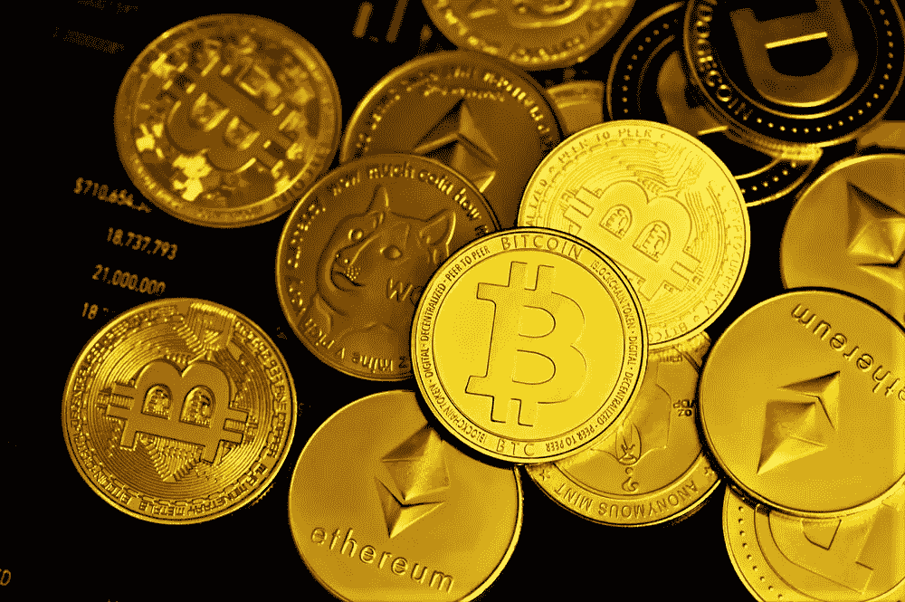
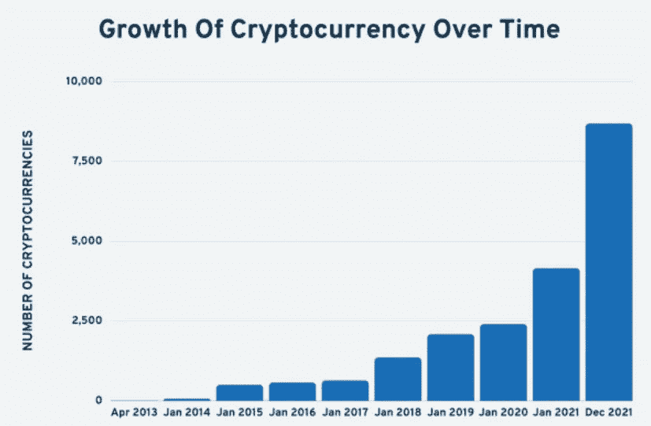
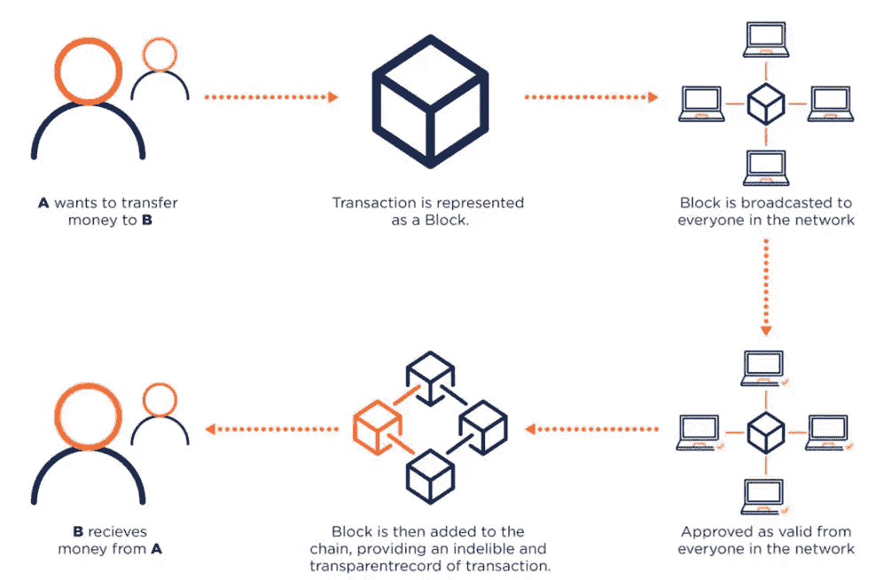
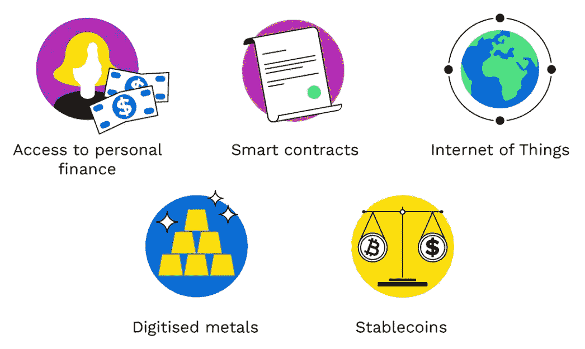
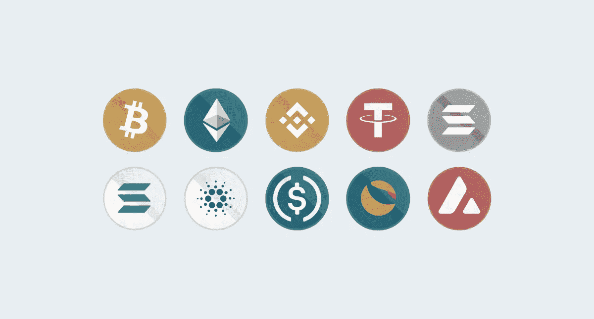

# 我对加密货币的理解

> 原文：<https://medium.com/coinmonks/my-understanding-of-cryptocurrencies-ab67974f5ba7?source=collection_archive---------61----------------------->

## 是的，它们是数字货币，但还有什么呢？

My Precious!

> **“如果你不相信或者不明白，我没有时间去试图说服你，对不起。”—中本聪**
> 
> **“但我会尽力而为:)”——西达尔特·阿加瓦尔**

# 什么是加密货币？

一种加密货币是一种数字形式的货币，起到交换媒介的作用。它可以用来支付任何东西，任何人，任何地方。加密货币在最近十年变得流行起来，比特币成为了追踪最广的数字货币。

***之所以对很多人有吸引力，是因为它的以下能力:***

**1。**它是在没有中央组织的情况下进行管理的，这使得它在设计上是分散的，因此没有像银行这样的中介在人与人之间转移加密货币。取而代之的是，它由用户和计算机算法来操作，就像保持其优点的区块链一样。

**2。**通过加密货币进行的交易记录在公共账本上，通常是区块链，每个过程都受到加密技术的保护，这只是安全通信的实践，使伪造或重复消费成为不可能。

**3。**加密货币是匿名的，不能被发送者或接收者发现。因此，它在那些想隐瞒自己财务活动的人中很普遍。

**4。转账既便宜又快捷。**

**5。**使用加密货币不需要在任何网站上注册，也不需要任何许可。相反，免费软件和应用程序开始使用。

6。这些账户不能被冻结，也能抵御审查，黑客几乎不可能关闭它们。

As of March 2022, there are **18,465** cryptocurrencies in existence. However, not all cryptocurrencies are active or valuable, and removing these cryptos leaves only around **10,363** active cryptocurrencies.

# 加密货币是如何工作的？

加密货币通过[分布式分类账](https://www.investopedia.com/terms/d/distributed-ledgers.asp)如区块链来生产、追踪和管理。在分布式账本中，货币的运动由分散网络中的计算机处理，以确保金融数据的真实性和加密货币的所有权。

这种去中心化的系统是比特币等加密货币吸引力的一部分——它让政府和央行置身于货币系统之外，减少了它们的干预和政治操纵。

***但是加密货币到底是怎么到你这里的呢？***

你可以通过两种方式获得加密货币——通过*挖掘*或者*交换*它。

加密货币矿工是维护区块链并在这个过程中创造新硬币的人。他们使用软件和硬件解决密码难题，验证所有交易，并获得硬币作为奖励。挖掘加密货币需要大量的计算机处理能力和电力，因此挖掘的成本往往超过赚取加密货币的收益。

加密货币交易所是人们可以用他们的加密货币换取传统货币或其他数字货币的地方，这就是各种类型的加密货币的*价值*的定义。交易所充当希望出售和购买加密货币的个人之间的中介，并收取兑换加密货币的费用，或者接受出售和购买价格之间的差价作为交易佣金。您也可以在点对点交易所交易加密货币。

加密货币在*加密货币钱包*之间持有和转移，这些钱包都有一个 [*私钥* y](https://www.gemini.com/cryptopedia/public-private-keys-cryptography) 来“签署”每笔交易，还有一个 [*公钥*](https://www.gemini.com/cryptopedia/public-private-keys-cryptography) 供他人验证交易有效。

交易金额是公开的，因为它们在区块链，并且关于谁发送或接收交易的信息是加密的。这使得加密货币成为伪匿名系统。因为区块链只有每个用户公钥的记录，所以不可能追踪交易的发送者或接收者。如果不知道用户帐户的私钥，就无法识别特定交易的幕后黑手。因此，对许多人来说，加密货币的另一个吸引力在于它在某种程度上是匿名的。

How cryptocurrency transaction works

# 加密货币的用途是什么？

加密货币有许多不同的用途，但这取决于它的创建目的。虽然术语*加密货币*让人联想到支付系统的图像，但更合理的做法是将其视为一种允许你做某些活动的代币，就像视频游戏中的代币一样。你购买一些代币并把它们插入机器，这样你就可以玩游戏了。

例如，比特币的目的是转移资金，使加密像货币一样工作。虽然它可以这样运作，但很少有交易者接受它作为货币，而且与其他支付网络相比，它的速度相对较慢。

类似地，加密货币以太坊允许用户创建“智能合同”,这是一种一旦条款得到履行就会自动执行的合同。加密货币互联网计算机允许用户创建应用程序、网站和其他基于网络的服务。这些数字货币与 Dogecoin 形成了鲜明对比，doge coin 是为了嘲笑比特币的愚蠢而创建的。

无论这些加密货币是否有现实世界的用例，它们最重要的用途之一是作为一种投机手段。投机者来回驱动这些硬币的成本，希望从其他类似的资产交易中获利。

虽然硬币可以使用户执行特定的动作，但许多购买者只对翻转硬币获利感兴趣。对许多人来说，这是加密货币的实际用例。

Use cases of digital money

# 加密货币的类型

比特币是最流行、最有价值的加密货币。一个名叫中本聪的匿名个人/团体发明了它，并在 2008 年通过一份白皮书向世界展示了它。当今市场上有数千种加密货币。

每种加密货币都宣称有独特的功能和规格。例如，以太坊的以太公司将自己推销为底层智能合约平台的天然气。然而，Ripple 的 XRP 被银行用来促进不同地区之间的转账。

2009 年公开的比特币仍然是交易和覆盖范围最广的加密货币。截至 2022 年 3 月，流通中的比特币超过 1900 万个，其中约有 200 万个比特币正在铸造过程中，总市值约为 0.8 万亿美元。

在比特币成功的过程中，许多其他被称为“替代币”的加密货币已经推出。其中一些是比特币的克隆或分裂，而其他则是从零开始的新货币。它们包括索拉纳、莱特币、以太坊、卡尔达诺和 EOS。到 2021 年 3 月，所有有价值的加密货币的总价值已经超过 3 万亿美元。

Different cryptocurrencies

# 最大的加密货币有哪些？

加密货币的大小取决于两个因素:有多少硬币存在以及这些硬币的价值。将这两个值相乘，就可以得到该货币的市值或所有这些硬币的总价。

根据 CoinMarketCap 的数据，截至 2022 年 3 月，主要加密货币及其大致市值如下:

1.  比特币——8790 亿美元
2.  以太坊——4190 亿美元
3.  系绳——820 亿美元
4.  BNB——730 亿美元
5.  美元硬币——510 亿美元
6.  索拉纳——450 亿美元
7.  terra——400 亿美元
8.  XRP——400 亿美元
9.  卡尔达诺——390 亿美元
10.  雪崩——260 亿美元

# 加密货币的优缺点

加密货币的引入彻底改变了金融基础设施。然而，和每一次革命一样，都有权衡取舍。在加密货币发展的现阶段，具有加密货币的分散系统的理论模型与其实际实现之间存在许多差异。

***Some benefits and drawbacks of cryptocurrencies are as follows:***

## 优势

*   加密货币描绘了一种新的、去中心化的货币范式。在这种方法中，银行和货币机构等集中的中间机构对于加强双方之间的信任和监管交易并不重要。因此，加密货币的设计消除了单点故障的可能性，比如一家大型银行，从而在全球引发一连串问题。
*   加密货币承诺让双方之间更容易立即转移资金，而不需要银行或信用卡公司等可信的第三方。使用公钥和私钥以及各种形式的激励系统，如工作证明或股份证明，确保了这种分散式转移。
*   因为没有使用第三方中介，所以交易双方之间的加密货币转账比标准货币转账更快。分散融资中的快速贷款很好地说明了这种分散转移。这些贷款在没有担保品的情况下处理，可以在几秒钟内执行并用于交易。
*   加密货币投资可以产生良好的回报。在过去的十年里，加密货币市场的价值飙升，已经获得了超过 3 万亿美元的收益。截至 2022 年 3 月，比特币在加密市场的价值超过 8790 亿美元。
*   汇款经济正在测试加密货币最突出的用例之一。目前，比特币等加密货币作为中间货币运行，以简化跨境资金转移。因此，法定货币被转换为比特币(或另一种加密货币)，跨境转移，然后转换为目的地法定货币。这一程序简化了汇款过程，使其更便宜。

## 不足之处

*   尽管加密货币声称是一种匿名的交易结构，但它们都是假名。他们会留下数字痕迹，让联邦调查局(FBI)等机构能够破译。这暴露了政府或联邦当局跟踪普通公民的金融交易的可能性。
*   加密货币已经成为犯罪分子进行洗钱和非法购买等邪恶活动的著名工具。加密货币也成为黑客利用它们进行勒索活动的最爱。
*   在假设中，加密货币被表示为去中心化的，它们的财富分布在区块链的许多群体之间。现实中，所有权高度集中。例如，麻省理工学院的一项研究发现，只有 11，000 名投资者拥有比特币飙升价值的大约 45%。
*   加密货币的一个概念是，任何人都可以使用连接互联网的计算机来挖掘它们。然而，挖掘流行的加密货币需要大量的能源，有时需要整个国家消耗的能源。昂贵的能源成本加上采矿的不可预测性使得采矿集中在收入高达数十亿美元的大公司中。
*   尽管加密货币区块链高度安全，但其他加密库，如交易所和钱包，经常被黑客攻击。多年来，许多加密货币交易所和钱包遭到黑客攻击，有时导致价值数百万美元的“硬币”被盗。
*   公开市场上交易的加密货币会遭受价格波动的影响。比特币的价值经历了快速飙升和暴跌，在 2017 年 12 月升至 17，738 美元，随后几个月跌至 7，575 美元。因此，一些经济学家认为加密货币是一种短暂的趋势或投机泡沫。

# 结果

虽然加密货币无疑有一些潜在的好处，但它也有严重的缺点。鉴于加密货币的波动性和各种风险，建议投资者最好谨慎对待加密货币。所以，如果你只是想测试一下，看看到底是怎么回事，保持你的头寸规模较小，不要投入超过你所能承受的损失。

> 加入 Coinmonks [电报频道](https://t.me/coincodecap)和 [Youtube 频道](https://www.youtube.com/c/coinmonks/videos)了解加密交易和投资

# 另外，阅读

*   [如何购买 Monero](https://coincodecap.com/buy-monero) | [IDEX 评论](https://coincodecap.com/idex-review) | [BitKan 交易机器人](https://coincodecap.com/bitkan-trading-bot)
*   [CoinDCX 评论](/coinmonks/coindcx-review-8444db3621a2) | [加密保证金交易交易所](https://coincodecap.com/crypto-margin-trading-exchanges)
*   [红狗赌场评论](https://coincodecap.com/red-dog-casino-review) | [Swyftx 评论](https://coincodecap.com/swyftx-review) | [造币厂评论](https://coincodecap.com/coingate-review)
*   [Bookmap 评论](https://coincodecap.com/bookmap-review-2021-best-trading-software) | [美国 5 大最佳加密交易所](https://coincodecap.com/crypto-exchange-usa)
*   [如何在 FTX 交易所交易期货](https://coincodecap.com/ftx-futures-trading) | [OKEx vs 币安](https://coincodecap.com/okex-vs-binance)