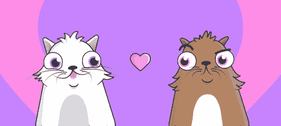

# 我的 Web3 之旅—第 1 章:密码猫

> 原文：<https://medium.com/coinmonks/my-web3-journey-chapter-1-cryptokitties-364be14c9bc3?source=collection_archive---------35----------------------->

# 全世界都在收集数码猫！

那是 2018 年年中。我当时的首席执行官提出了人们收集和饲养数码猫的想法！“好吧，每样东西都有合适的位置”——我想。

起初，它并没有吸引我。为什么我想要或需要一只数码猫？然后回想我只有 8 岁的时候，我喜欢收集外国硬币。
那时我意识到了数码收藏品的吸引力。

这个想法毕竟很有趣，尤其是隐猫是独一无二的，并且具有(数字)生孩子的能力。

## NFTs 和令牌标准

NFTs:这个技术术语最终被揭示出来，我们在公司里能想到的只有“不可替代的令牌”这个概念。我更深入地了解了我们的前进方向。我熟悉了 ERC-20、ERC-721 和 ERC-1155 令牌标准及其差异。

我开始了解区块链、智能合约和铸造过程。

不到 3 个月，我就熟练掌握了这门语言。我来自营销和创意背景，只听说过比特币，在那之前，一切与区块链相关的东西都是个谜。

此后不久，我自己买了我的第一枚(数量不多的)比特币，作为我第一次加密投资的实验。

## 拓展猫咪的经历

我们买了一些小猫做实验，但我们不想就此打住。我们希望这种体验能够影响到更多的观众。如果我有一只独特的小猫，我把它送给朋友，我的收藏中就会少一只喵喵。

那么我们如何将这种体验游戏化呢？
啊哈！我们开始开发自己的 NFT 平台，在那里我们可以进口我们的小猫并批量生产。

这样我就可以想养多少只小猫就养多少只，并和我的朋友们分享。每只猫都有自己的社交活动特征。人们可以喜欢、评论和分享它们。

Tokenizing CryptoKitties - Image source: [CCN.com](https://www.ccn.com/this-third-party-dapp-lets-you-tokenize-your-cryptokitties/)

这开阔了我们的眼界，让我们知道我们还可以用这个平台和 NFTs 做些什么。

是啊！这就像我们向月球发射了第一枚火箭，它着陆了。

未完待续…

> 交易新手？试试[加密交易机器人](/coinmonks/crypto-trading-bot-c2ffce8acb2a)或者[复制交易](/coinmonks/top-10-crypto-copy-trading-platforms-for-beginners-d0c37c7d698c)