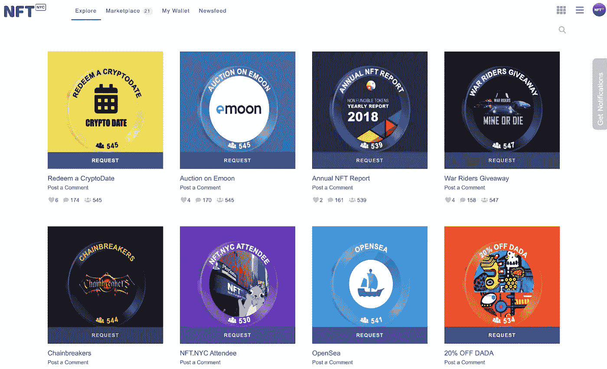
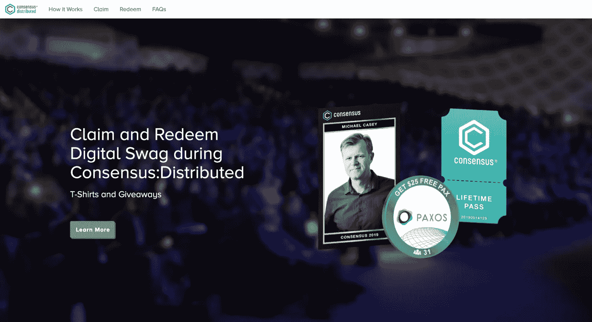

# 我的 Web3 之旅——第 2 章:开发数码礼品袋

> 原文：<https://medium.com/coinmonks/my-web3-journey-chapter-2-developing-a-digital-swag-bag-90297ec5920b?source=collection_archive---------35----------------------->

# 我们如何改变礼品袋体验

对！你可能已经读过我的 [**第一章**](/@fagnerlordello/my-web3-journey-chapter-1-cryptokitties-364be14c9bc3) ，里面讲述了我是如何沉浸在 NFTs 的世界中的。

您了解了我们如何扩展 CryptoKitties 体验，并开始开发白牌 NFT 市场。

**那么，是时候开始直播了！** 我研究和尝试了多个平台。几个月来，我们一直在试验各种功能，但我们需要有一个更清晰的用例来开始探索我们迄今为止已经构建的内容。

我与我们的工程团队密切合作，并在下一步行动之前亲自对每个功能进行质量控制。

与此同时，我们正在组织我们的第一次#NFT 活动。
那是 2019 年 2 月。NFT。纽约即将在纽约时代广场举行。

忘掉那个你可能永远不会用到的装着钢笔和帽子的小塑料袋吧！
我们在 [NFT 首次尝试了数码礼品袋体验。NYC](https://medium.com/u/4ab30e180062?source=post_page-----90297ec5920b--------------------------------) 2019，与 85 家赞助商合作，将他们的代币分发给 500 多名与会者。

大约两个月后，我们向 [@Consensus2022](https://twitter.com/consensus2022) (2019)(由 [CoinDesk](https://medium.com/u/f2fa6f2d51a6?source=post_page-----90297ec5920b--------------------------------) 发起的活动)提议采用 NFT Swag 包。

那是 2019 年 5 月。这个平台已经准备好搭载数千名新手。

我们铸造了大约 200，000 枚代币，在纽约区块链周分发给 5，000 多名参与者。

**经验…**
我们现在明白了非正规金融服务能够带来的价值和机会。回到 3 年前，我们开始塑造你所看到的一切。

通过不可替代的代币提供专属福利的机会吸引了数百名赞助商的目光，他们纷纷加入到数字礼品包中。

每个令牌提供的体验对于每个参与者想要实现的目标都是独一无二的:

1.  **实物赠品**:允许参与者通过他们的数字令牌领取真实世界的资产
2.  数字产品:门票、优惠券、pdf 或电子书等可下载内容
3.  独家通行证:会议、日历预订
4.  **奖品和抽奖活动**:参加者将有机会参加抽奖活动，以获得他们的特别优惠，仅限于少数参与者

谦虚地放在那里:**成功了！🚀**

我们的第二次大礼包分发成功了，让我们得以扩展与我们的活动一同出现的技术。

**说起 NFT。纽约市上周刚刚举行了第四届年度会议。**

加入数字:
-在前两个版本中，我们只有 500 多名参与者
-2021 年，有超过 5500 名
-今年，该活动聚集了来自全球的 16000 人。

下一步是什么？

> 交易新手？尝试[加密交易机器人](/coinmonks/crypto-trading-bot-c2ffce8acb2a)或[复制交易](/coinmonks/top-10-crypto-copy-trading-platforms-for-beginners-d0c37c7d698c)