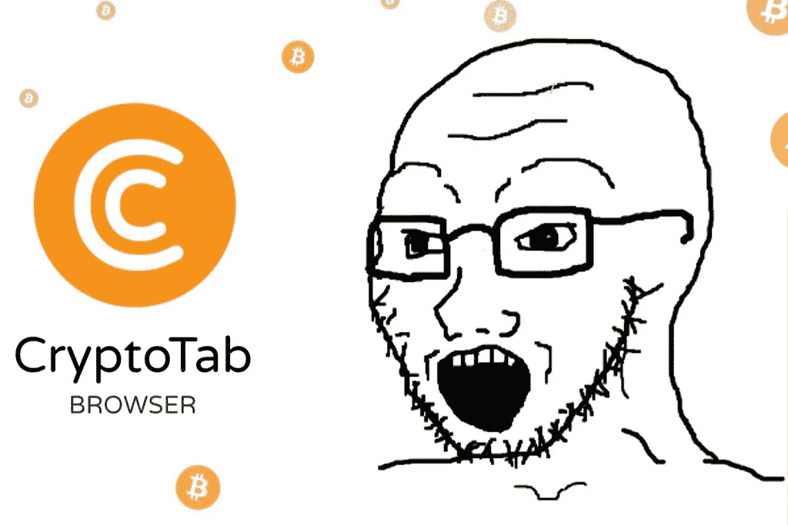
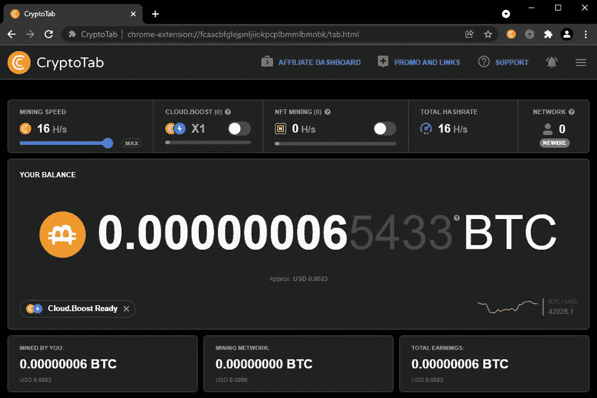
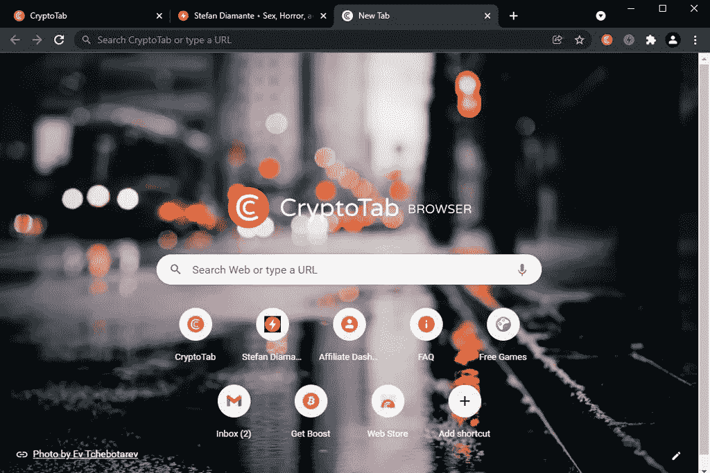

# 我的周末用 CryptoTab 浏览器“挖掘”比特币

> 原文：<https://medium.com/coinmonks/my-weekend-mining-bitcoin-with-cryptotab-browser-19ac81a01980?source=collection_archive---------3----------------------->

CryptoTab Browser is (Wo)jacked

CryptoTab 浏览器是一个…等等…桌面和移动的 web 浏览器，号称“世界上第一个内置挖掘的浏览器。”前提是用户可以在进行正常活动的同时，在消费级设备上挖掘比特币。这个应用程序已经上市几年了，它的广告是加密龙头网站的主要内容。

根据[官方 CryptoTab 浏览器主页](https://cryptotabbrowser.com/):

*“CryptoTab 是世界上所有主流浏览器中最年轻的浏览器，已经有来自 220 多个国家的 2500 多万用户与我们一起赢得 BTC。加入 CryptoTab 社区——世界上第一个也是唯一一个内置挖掘功能的浏览器。不需要投资！立即试用 CryptoTab 浏览器，赢取您的第一个 Btс！”*

让我们先说清楚…这个浏览器的“挖掘”方面完全是胡说八道。对于那些尚未了解的人来说，真正的比特币挖矿是一个使用强大而昂贵的 ASIC 计算机的密集过程，需要了解能源电网，以实现利润最大化。这款浏览器有一个水龙头，类似于 Ember Fund 的水龙头，用户只需简单地跑一跑，就能获得全天的睡眠奖励。它是一个水龙头，在多个网站上有无数关于奖励和浏览器性能的负面评论。

尽管我的期望很低，但需要写一些与比特币相关的东西激起了我的好奇心。我决定看看从周五下午到周日下午的 48 小时内，这个水龙头会在三台设备、两台笔记本电脑和一部手机上产生多少 sat。这个应用程序运行的实际时间在 25 到 30 小时之间。我没有保留具体的记录，但正如你将读到的，这没有什么不同。我探索了浏览器本身的性能。

## **如同水龙头**

I can retire now.

更多来自官方 CryptoTab 网站的废话:

*“我们开发了一种独一无二的挖掘算法，允许您在任何可用的设备上挖掘和赚取 BTC——无论是您的手机还是 PC。听起来很神奇，对吧？照常使用浏览器，无需任何投资即可获得比特币。”*

我遇到的第一个障碍是发现“挖掘”功能在 iOS 版本上不可用。因此，在这次尝试中，我只使用了两台电脑——两台笔记本电脑。一个是 2015 年的戴尔，它是我写作和浏览网页的“日常驱动程序”。另一个是 2010 年的惠普 Mini，几乎不再起作用，主要用作音乐播放器，因为它(令人惊讶地)具有强劲和动态的音频播放质量。我也有一个 10 年历史的 Ideacentre，我严格用于媒体制作，并拒绝包括在这个测试中。是的，我目前将我的计算工作负载分散在三台老旧的电脑上。

(有趣的事实:我这辈子都没买过 PC。所有这些都是以某种方式免费获得的。)

无论如何，这两个水龙头在周末总共下降了 6 个百分点。没错。六个。同样的数量，我可以在的 [FreeBitco .上点击两次，间隔一个小时。而且不用安装该死的浏览器。同样的道理也适用于](https://freebitco.in/?r=48370836)[和](http://www.cointiply.com/r/9dNYV)。这两个水龙头中的任何一个都有可能中大奖。但是 CryptoTab 浏览器上没有头奖。只是一个假的哈希速率监视器和更高的承诺(好像他们可以得到更低的奖励),如果我邀请其他人加入进来。很多人不喜欢我，因为我没有把这些垃圾推给他们。

忘了我余额末尾的 5433 吧。这只不过是一个旨在欺骗用户的伎俩，让他们以为自己收集的 s at 初看起来成千上万。我周末的总分是六个糟糕的 sat。这个数字与我在其他用户的评论中读到的一致，所以我并不感到惊讶。有一个付费版本，据我所知，每天增加大约两个额外的 sat 奖励。该网站吹捧推荐更多具有各种奖金水平等的 sat。但所有这些看起来都像是 MLM 的东西。我对叠加 sat 感兴趣。不是在卖肥皂。最低取款金额为 0.00001 BTC。按照这种“开采”速度，我需要将近一年的时间才能达到这个总数。

## **作为浏览器**

Taking Bitcoin “mining” to the streets.

从技术上讲，它是一个“主要浏览器”,因为它是一个 Chromium 浏览器。事实上，它是 Chrome 的一字不差的翻版。如果你用过 Chrome，那么你用过 CryptoTab。水龙头甚至要求用户用他们的谷歌账户登录。它甚至有相同的美学定制选项，改进了白色默认主题上的橙色 creamsicle，让人想起那些丑陋的旧坦帕湾海盗制服。一些评论声称浏览器会导致设备过热，但我没有在任何一台电脑上遇到过这种情况。即使是又旧又慢的 HP Mini 也不行。

CryptoTab 浏览器的性能太烂了。它可以很好地浏览轻量级的只读页面。但是我看 YouTube 视频的尝试是一场灾难。在以 360p 分辨率播放的 10 分钟的剪辑中，整个过程都结巴，几次停顿。这是在浏览器中没有其他打开的选项卡，也没有应用程序在戴尔上运行的情况下。相比之下，我在 Brave 中流畅地观看了相同的剪辑，同时在两个窗口中打开了大约十几个其他标签，并运行了几个其他应用程序。我还没有研究 CryptoTab 在隐私方面的得分，因为这无关紧要。鉴于市场上卓越的 Chromium 和 Firefox 选项，它甚至不适合作为备份浏览器。

## **结论**

你可以通过安装 [Lolli](https://www.lolli.com/share/wqv4mFwSnX) 扩展来“比特币化”你当前选择的浏览器，并从成千上万的在线零售商那里获得购买的 sats。这个手机应用程序提供了一个每日水龙头，我每天收到的量从 13 到 1157 sats 不等。使用我的推荐链接注册，首次购买可获得 5 美元。前面提到的[安博基金](https://emberfund.onelink.me/ljTI/bce33290/?mining_referrer_id=217215)移动应用也是移动设备的一个高级水龙头。使用我的推荐代码链接，我们将一起赢得更多的 sat。还有用于桌面浏览器的 [Alby](https://getalby.com/) 、 [Tippin](https://tippin.me/) 和 [Zebedee](https://zbd.gg/) lightning 钱包。而[不受影响的浏览器](https://www.impervious.ai/)，一个建立在照明网络上的第三层解决方案，将于 2022 年 4 月作为一个真正的比特币浏览器发布。

CryptoTab Browser 是一个具有讽刺意味的应用程序，试图通过古老的方法从比特币的日益流行中获利。平庸的产品与侮辱性的奖励和不诚实的广告相结合，是比特币旨在取代的丑陋和腐败的股权证明法定货币系统的主要组成部分。就连“CryptoTab”这个名字也表明。这个机构对比特币不够了解或关心，无法区分它和其他加密货币或 2。它正计划加入替代硬币奖励。不管怎样都无所谓。这是一个可怕的产品。这是对不知情的用户的时间和电力的浪费。这是 Wish.com 版的比特币水龙头，说明了很多问题。别为此费心了。

> 加入 Coinmonks [电报频道](https://t.me/coincodecap)和 [Youtube 频道](https://www.youtube.com/c/coinmonks/videos)了解加密交易和投资

## 另外，阅读

*   [印度最佳 P2P 加密交易所](https://coincodecap.com/p2p-crypto-exchanges-in-india) | [柴犬钱包](https://coincodecap.com/baby-shiba-inu-wallets)
*   [八大加密附属计划](https://coincodecap.com/crypto-affiliate-programs) | [eToro vs 比特币基地](https://coincodecap.com/etoro-vs-coinbase)
*   [最佳以太坊钱包](https://coincodecap.com/best-ethereum-wallets) | [电报上的加密货币机器人](https://coincodecap.com/telegram-crypto-bots)
*   [交易杠杆代币的最佳交易所](https://coincodecap.com/leveraged-token-exchanges)
*   [最佳加密分析或链上数据](https://coincodecap.com/blockchain-analytics) | [Bexplus 评论](https://coincodecap.com/bexplus-review)
*   [NFT 十大市场造币集锦](https://coincodecap.com/nft-marketplaces)
*   [AscendEx Staking](https://coincodecap.com/ascendex-staking)|[Bot Ocean Review](https://coincodecap.com/bot-ocean-review)|[最佳比特币钱包](https://coincodecap.com/bitcoin-wallets-india)
*   [霍比评论](https://coincodecap.com/huobi-review) | [OKEx 保证金交易](https://coincodecap.com/okex-margin-trading) | [期货交易](https://coincodecap.com/futures-trading)
*   [麻雀交换评论](https://coincodecap.com/sparrow-exchange-review) | [纳什交换评论](https://coincodecap.com/nash-exchange-review)
*   最好的[加密税务软件](/coinmonks/best-crypto-tax-tool-for-my-money-72d4b430816b) | [硬币追踪评论](/coinmonks/cointracking-review-a-reliable-cryptocurrency-tax-software-5114e3eb5737)
*   [Stackedinvest 评论](https://coincodecap.com/stackedinvest-review) | [北海巨妖评论](/coinmonks/kraken-review-6165fc1056ac) | [bitFlyer 评论](https://coincodecap.com/bitflyer-review)