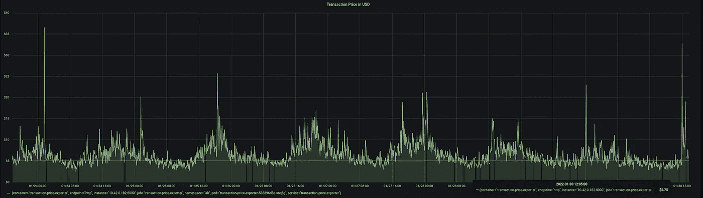

# 神秘营地实验室#1:智能合同部署和造币费

> 原文：<https://medium.com/coinmonks/mystery-camp-lab-1-smart-contract-deployment-mint-fees-526dcc12904?source=collection_archive---------19----------------------->

神秘营地是一个涉及区块链技术的新项目。我们正在发布我们的第一个 NFT 系列，我们计划做得更多，特别是支持动物收容所和分享我们的技术研究。欢迎阅读本系列的第一篇文章！

在设计我们的 dApp 所依赖的智能合同时，节约成本绝对是我们关心的事情。首先，部署是我们希望降低的一项重要成本。与我们合同的交互(尤其是 NFT 薄荷糖)也应该尽可能便宜，这样我们的用户就不会在汽油上花太多钱。

从构思[神秘营地](https://mystery.camp)的第一天起，我们发现分析交易所需的气体并尽可能优化它是绝对重要的。这篇文章是这一分析的顶级亮点。

# 气体优化通常

任何以太坊交易的费用(ETH)都是*气*和*气价格*的乘积。第一个因素是交易发生所需的“气体单位”数量。这是我们可以很容易预测的——在开发期间，我们可以在测试网或本地链上运行我们的事务，以查看我们需要多少个单元来实现特定的功能。

汽油价格是更不可预测的因素。例如，2021 年 8 月 23 日的价格约为 67 千兆瓦，15 天后约为 213 千兆瓦。它也在一天内波动。自 ERC1559 以来， *gasPrice* 由“基本费用”(链条上可用的价值)和“优先费用”(给矿工的小费)组成。

因此，一般来说，为了优化合同部署/交互的成本，我们需要考虑:

*   通过消除昂贵的操作(尤其是写入存储)，降低部署/交互所需的 gas 单元。
*   观察*油价*并在足够低时执行交易。
*   如果你用美元思考——ETH/USD 汇率可能也会让你感兴趣。

当然，这是一个简单的方法。还有许多更复杂的减少气体的技术(例如[这个](/coinmonks/on-efficient-ethereum-storage-c76869591add)真的很有趣)。

# 东帝汶的网络域名代号

让我们定义一个有用的单位，我们称之为 **TP(转移价格)。**且让它只是 21000 单位气体的价格(常规乙醚转移所需)。在 **TP** 中思考极其得心应手。它的美元价值可以在的交易所找到。此外，当写这篇文章时，它在 10 美元以下，这也便于阅读数字。

看看从 2022 年 1 月 30 日左右开始的 7 天内的 TP 美元价格图(21000 **gas price** eth/USD rate ):

Source: lab.mystery.camp

我们已经可以看到一些模式，可以作为进一步分析的良好起点！

# 部署价格

在[以太坊黄皮书](https://ethereum.github.io/yellowpaper/paper.pdf)中描述了每件作品的确切价格(以气体单位计算)。从那里提取每一个细节有点挑战性，这就是为什么我只展示几个实验的结果。

请注意，我所列出的数字只是在测试网上运行事务的结果，它们应该被当作例子。如果您想知道在不同的用例中您的交易将花费多少，请记住仔细测试您的智能合约。这里我将列出几笔交易的气单位、TP 和以美元为单位的价格(在撰写本文时，TP 仅为**【4.17 美元** ) 。

合同部署总是需要至少 53000 单位的气体(在[以太坊黄皮书](https://ethereum.github.io/yellowpaper/paper.pdf)中的*交易费& Ccreate —* 详情)。此外，你为每一个编码数据支付 200 英镑，还有一些很难列出的小费用。

*   空合约(空交易数据)— 53000 **(2.52 TP)，10.50 美元**
*   [最低合约](https://rinkeby.etherscan.io/address/0xCbc7156Cf2b329209C5671e16987393482E5b7FC#code) — 67054 **(3.19 TP)，13.30 美元**
*   [基础模板](https://rinkeby.etherscan.io/address/0x67B229ee6193397A14aa30E931B8CB2ef3ec15C6#code) — 144819 **(6.89 TP)，28.73 美元**
*   [OpenZeppelin 4.3.2 ERC20 模板](https://rinkeby.etherscan.io/address/0xE3d21B6c84A7B8E167991e527493671d862cB48d) —547467 **(26.06TP)，108.71 美元**
*   [OpenZeppelin 4.3.2 ERC721 模板](https://rinkeby.etherscan.io/address/0xc6dc9E625bB114C34983A51Be37DaB19eE6aF02f) —1069805 **(50.94TP)，212.41 美元**
*   [OpenZeppelin 4.3.2 ERC1155 模板](https://rinkeby.etherscan.io/address/0xD513a3e908fB952cD9E69bdBa73aeBbd82F8295E) —1146547 **(54.59TP)，227，67 美元**

# 互动价格

功能价格代表了用户需要花多少钱来和你的 dApp 互动。最基本的例子是:

*   向个人账户发送乙醚— 21000 **(1 TP)**
*   向 ERC1155 合同— 21048 **( > 1 TP)** 发送乙醚

您肯定希望在映射中保存一些东西(例如，资产的所有者或用户权限)。让我们来看看几种情况下[基本模板](https://rinkeby.etherscan.io/address/0x67B229ee6193397A14aa30E931B8CB2ef3ec15C6#code)中`saveToMapping`函数的不同天然气价格:

*   [首次写入映射](https://rinkeby.etherscan.io/tx/0x4c23beedc6321ad2b353f30718d6c0b2cb5458b48d1e34c7c87b3170309bdcbd)—48048**(2.28 TP)，9.54 美元**
*   [密钥的第一次写入](https://rinkeby.etherscan.io/tx/0x0ebe75f6ab83dd35e90fd809e0897217c1ba6883363a186e1843bcb83e3b917d)—65520**(3.12 TP)，13.01 美元**
*   [钥匙的另一次写入](https://rinkeby.etherscan.io/tx/0xb8ac56f037c63a7e28c60aae190a74f6a3cc79a58ca75bd2fdcc4b96081717d7)—38958**(1.85 TP)，7.73 美元**

这些差异来自于存储操作的不同价格——将零值替换为零值，将零值替换为非零值，将非零值替换为非零值(又是黄纸)。许多 dApps 在存储中保存大量数据，这导致交易费用有时甚至在 10TP 左右。这总是关于在存储链和交易费用之间寻找平衡。

“铸造”本身就是保存资产的第一个所有者(初始转移—从 0 到所有者)。这是一个单一的存储操作(增加了资产所有者映射的价值),因此相对便宜。

疯狂奇瓦瓦神秘营地收购只依赖薄荷，使其气体效率。我们计划进一步部署的合同(例如 yield token)将检查初始合同的余额以确认所有权。CCMC 是 ERC1155 兼容的(我们使用 [OpenZeppelin 模板](https://github.com/OpenZeppelin/openzeppelin-contracts/blob/master/contracts/token/ERC1155/ERC1155.sol)，因为它们被广泛使用)，我们使用`_mint()`来创建单个资产，使用`_mint()`循环来创建多个资产。为了气体优化，我们区分这两种情况(跳过循环节省 470 个气体单位)。值得一提的是，ERC1155 比 ERC721 更节能(后者在链中冗余存储了大量自有资产)。

还有一个小的优化，我们最终没有添加。它使用了`_mintBatch()`而不是循环`_mint()`。这两者之间的唯一区别是发出的事件数量。不幸的是，OpenSea 没有那么快解析`TransferBatch`事件，所以我们决定坚持`TransferSingle`为 OpenSea 用户提供最好的用户体验。

疯狂吉娃娃薄荷糖的费用如下:

*   1 CCMC —54637 **(2.60 泰铢/10.86 美元)**
*   2 个 CCMCs—82568**(3.93 TP/$ 16.26)[每项资产 1.97 TP/$ 8.13]**
*   3 CCMCs—110029**(5.24 TP/$ 21.19)【1.75****TP/$ 7.06 每项资产】**
*   4 CCMCs —137491 **(6.55 泰铢/26.12 美元)[每项资产 1.64 泰铢/6.53 美元]**
*   5 CCMCs—164952**(7.85 TP/$ 31.05)[每项资产 1.57 TP/$ 6.21]**

# 下一步是什么？

随着独特的疯狂吉娃娃神秘营地 NFTs 的首次发布，我们推出了[实验室](https://lab.mystery.camp)——目前它只是一个有几个数字和图表的地方，欢迎你来查看！我们想把以太坊发展的知识传播的好很多！

加入我们的社区，让我们知道你对这个问题的看法，我们欢迎所有的建议。CCMC 的主人有优先权！