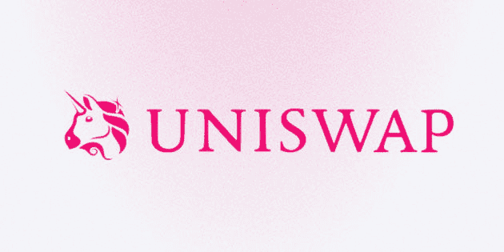
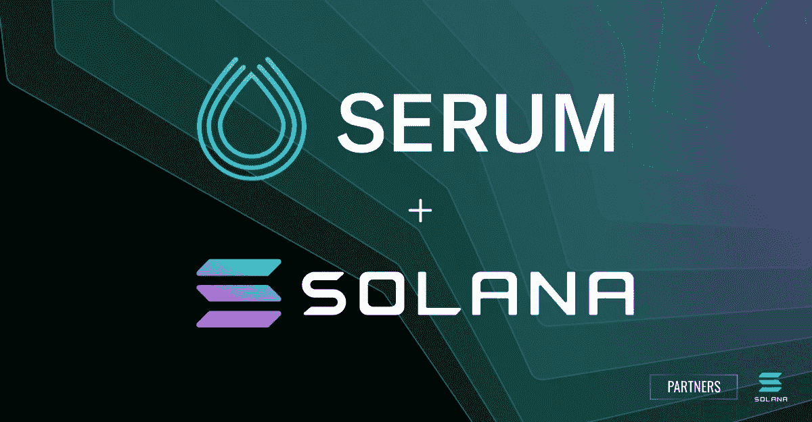
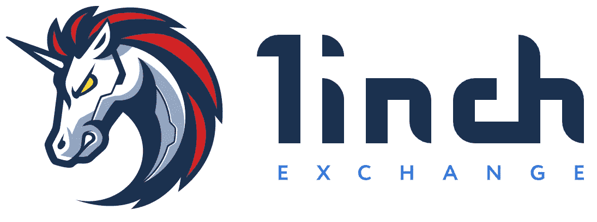
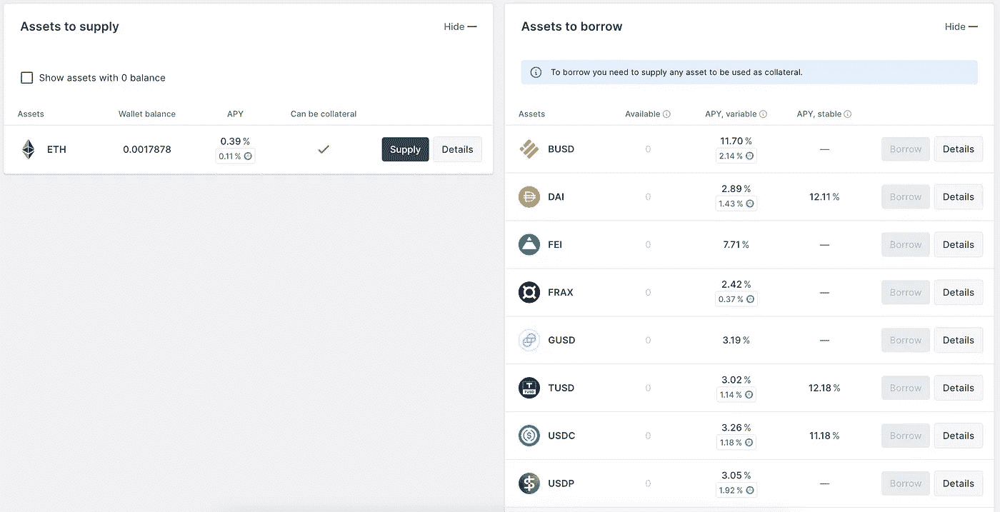
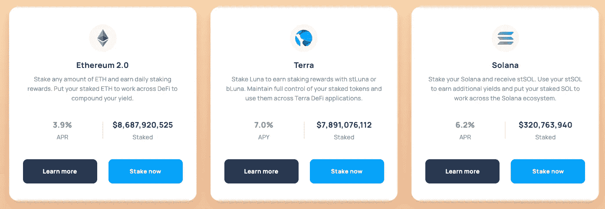

# 纳尼·德菲？

> 原文：<https://medium.com/coinmonks/nani-defi-b79fd294ddc?source=collection_archive---------78----------------------->

欢迎回来，在这篇文章中，我打算讨论加密的去中心化金融(defi ),这是大多数人感兴趣的事情。但是在深入研究这个之前，你需要一个加密钱包来做这件事，请参考我以前的文章，在那里你可以找到不同类型的钱包来满足你的需求。

我想在这篇文章的前面说，我仍然认为自己是一个密码领域的学习者，因为每个月都有许多令人兴奋的产品推出。随着 crypto 的成长，我也越来越了解这个领域，我希望你也能分享这种成长。

回到 defi 上的话题。

**什么是 defi？**

Defi 是一个金融产品和服务的统称，任何可以使用以太坊的人都可以使用，任何有互联网连接的人都可以使用。有了 defi，市场永远是开放的，没有中央政府可以阻止支付或拒绝你获得任何东西。以前缓慢且存在人为错误风险的服务现在变得自动化且更加安全，因为它们由任何人都可以检查和审视的代码来处理。

那里有一个蓬勃发展的秘密经济，你可以借、借、做多/做空、赚取利息等等。精通密码的阿根廷人利用 defi 来逃避严重的通货膨胀。公司已经开始实时传输员工的工资。有些人甚至不需要任何个人身份证明就能获得并还清价值数百万美元的贷款。

defi 的一些例子包括:

1.  分散交换
2.  流动性挖掘
3.  贷款协议
4.  立桩标界
5.  衍生品市场

**分散式交易所(DEX)**

分散式交易所依靠智能合约，允许交易者在没有中介的情况下执行订单。另一方面，集中的交易所是由一个集中的组织管理的，如银行，否则它会参与寻求利润的金融服务。

分散式交易所主要有三种类型:自动做市商、订单簿 DEX 和 DEX 聚合商。所有这些都允许用户通过他们的智能合约直接相互交易。最初的分散交易所使用相同类型的订单簿，类似于集中交易所。

自动做市商(AMM)

这些资产管理工具依赖于总部位于区块链的服务，这些服务提供来自交易所和其他平台的信息，以设定被称为“区块链先知”的交易资产的价格。这些分散交易所的智能合约使用的是被称为流动性池的预融资资产池，而不是匹配买入订单和卖出订单。(稍后将详细介绍这一点。)

资金池由其他用户提供资金，这些用户随后有权获得交易费，交易费是协议对在资金池中执行交易收取的费用。这些流动性提供者需要存入交易对中每项资产的等值金额，以从其持有的加密货币中赚取利息，这一过程被称为流动性挖掘。如果他们试图存放一种资产多于另一种资产，资金池背后的智能合约将使交易无效。

这方面的一个例子是 Uniswap，它是交易量最大的分散式交易所之一，也是 defi 领域的先驱。Uniswap 平台是一个基于以太坊的区块链协议，使用 AMM 和流动性池来促进点对点交易。

订购书籍索引

订单簿汇编所有未结订单的记录，以买卖特定资产对的资产。买单表示交易者愿意以特定价格购买或出价购买某项资产，而卖单表示交易者准备出售或以特定价格购买考虑中的资产。这些价格之间的差价决定了订单的深度和交易所的市场价格。

订单簿索引有两种类型:链上订单簿和链下订单簿。使用订单簿的 dex 通常在链上保存未结订单信息，而用户的资金仍留在他们的钱包中。这些交易所可能允许交易员利用从其平台上的贷方借入的资金来杠杆化他们的头寸。杠杆交易增加了交易的盈利潜力，但也增加了清算的风险，因为它增加了借入资金的头寸规模，即使交易者输掉了赌注，也必须偿还这些资金。(稍后将详细介绍这一点。)

一个例子是 Serum，一个关于 Solana 的链上指数，它有一个中央限价订单簿，为机构和散户用户共享基于流动性和电力市场的功能。Serum 的链上中央限价订单簿和匹配引擎为交易者和组合项目提供流动性和价格-时间-优先级匹配。用户通过选择价格、规模和交易方向的能力，从这种交易模式中受益。

DEX 聚合器

DEX 聚合器使用几种不同的协议和机制来解决与流动性相关的问题。这些平台本质上是从几个指数中聚合流动性，以最大限度地减少大订单的滑点，优化互换费用和代币价格，并在最短的时间内为交易者提供尽可能好的价格。

一个例子是 1inch，它从各种交易所获得流动性，并能够将一笔交易拆分为多个指数，以确保最佳利率。该协议在交换协议和网络上提供聚合信息服务。它提供对各种指数的最大流动性和最佳代币互换利率的访问，具有独特的功能，包括部分填充和跨多个流动性来源寻找最佳互换路径的能力。

**流动性挖掘**

流动性挖掘是一个过程，在这个过程中，加密持有者将资产借给 AMM DEX 以换取回报。这些奖励通常来自交易者交换代币产生的交易费。每笔掉期交易的平均费用为 0.3%，总回报根据一个人在流动性池中的比例份额而有所不同。

无需深究流动性池如何工作，为了向池中提供流动性，您需要提供两个等值的代币。例如，在 AVAX 上的 [TradeJoe](https://traderjoexyz.com/pool) 的情况下，通过分别提供价值 1000 美元的 USDC.e 和 AVAX，我们在 USDC.e-AVAX 池中总共有 2000 美元。同样，提供给 TraderJoe 的流动性将授予从 USDC.e/AVAX(或任何其他)流动性池中交易资产的客户。这些费用随后被收取并分配给流动性提供者(LP)。在这种情况下，你将从你存入资金池的资产中获得大约 17%的年利率。

最终结果是一种共生关系，各方都有所回报。交易所获得流动性、有限合伙人费用，最终用户能够以分散的方式进行交易。

然而，这伴随着非永久性损失(IL)的风险，你可能会以比开始时更少的硬币结束。为了解释，我将联系 [Uniswap 的常数乘积公式](https://docs.uniswap.org/protocol/concepts/V3-overview/glossary#constant-product-formula)以便更容易理解。

x*y=k

其中，x =资产 A 的价值(数量 x 价格)

y =资产 B 的价值(数量 x 价格)

k =一个常数值

以上面的例子为例，我们存入 1，000 美元现汇和 10 个 AVAX @ 1 个 AVAX = 100 美元现汇。过一会儿，1 个 AVAX = 200 美元现汇。TraderJoe 以外的套利者进来，买入你池中的所有 AVAX，直到价格达到 200 美元现汇，与外部交易所相符。

根据 x * y = k 公式，流动性池现在将由 7.071 AVAX 和 1414.21 USDC.e 组成。按照 200 美元的新 AVAX 价格，您在流动性池中持有的总价值将为 1414.21 美元+1414.21 美元= 2828.42 美元。

如果你只是持有最初的 10 个 AVAX 和 1000 个 USDC.e，你在流动性池之外持有的总价值现在将是 2000 美元+1000 美元= 3000 美元。

你的非永久性损失是:3000 美元——2828.43 美元= 171.57 美元。

你可以在这里用 IL 计算器[试验一下，看看价格的变化会如何反映你在流动性池中的 IL。](https://dailydefi.org/tools/impermanent-loss-calculator/)

有不同的策略，人们使用流动性挖掘来帮助他们的投资策略，我不打算在这里涵盖，否则这篇文章会太长，无法阅读。但给个引子，有些人利用流动性池“买入低点”和“卖出高点”。

**借贷协议**

除了纯粹成为一个 LP 来赚取费用，你也可以借出和借入资产链。在传统金融(TradFi)领域，当从银行或金融机构借款时，会对借款人进行背景调查或尽职调查，例如检查他/她的信用评级。然而，链上借贷协议使用智能合同来执行借贷过程。这些协议确保在满足特定条件的情况下，在执行合同的同时，贷款过程完全自动化。

出借人在加密出借过程中扮演着重要的角色。他们以固定或灵活的期限存放他们的加密资产，以从他们的资产中获得被动收入。

借款人必须将其加密资产作为抵押品，并在不出售资产的情况下获得贷款。他们必须保持适当的贷款价值比(LTV ),否则将面临抵押品被清算以偿还贷款的风险(即追加保证金)。此外，借款人还必须支付所借贷款的利息，以收回其抵押品。

加密货币借贷协议充当监管借贷过程的媒介。根据平台的类型，贷款流程的监管方法可能涉及匹配订单、流动性池或代码。清算是协议中的一个关键流程，如果借款人的 LTV 超过安全比率，清算机器人将协助其清算。这是借贷双方都必须考虑的风险

贷款协议的一个流行例子是 [Aave](https://app.aave.com/) 。贷款人可以在 Aave 上存款，赚取贷款利息。存款人分享借款人支付的利息，相当于平均借款利率乘以利用率。准备金利用率越高，储户的收益就越高。当你想在将来借款时，存入的资产可以用作抵押。在 Aave 上，您可以借入的最大金额取决于您的存款价值和可用的流动性。例如，如果没有足够的流动性，或者你的健康状况不允许，你就不能借入资产。您可以在[风险参数](https://docs.aave.com/risk/asset-risk/risk-parameters)部分找到所有可用的担保品及其具体的借款参数。

例如，将 ETH 存入 AAVE，你每年将获得 0.39%的收益。然而，通过将 ETH 存入 AAVE，你将能够以不同的利率借入一系列其他资产。这为你提供了买入低点的机会，借稳定币买入，或者借替代币卖出来做空高点。

**打桩**

大概当你听到这个词的时候，你第一个想到的就是牛排吧！伙计，我现在想吃牛排了！

利害关系证明是一种共识机制，它使用伪随机选举过程来选择一个节点作为下一个块的验证者，该过程基于可能包括利害关系年龄、随机化和节点财富的因素的组合。将令牌锁定在一个节点上，将有助于验证网络。作为锁定代币的回报，您将从该区块的交易中获得一部分交易费。

你可以把赌注想象成把你的钱存入银行账户，并以加密货币的形式获得利息，作为保护网络的回报。比如[丽都金融](https://lido.fi/)上，目前在网上押 ETH 的年利息是 3.9%。

您可以在这里找到这些产品:

**交易所**

币安立桩

按交易量计算，币安是最大的数字货币交易所。因此，许多投资者发现，当他们考虑通过交易平台下注时，这是他们的首要任务。与此相一致，2020 年 12 月，以太坊 2.0 等币安赌注登记服务应运而生。此外，该交易所支持 DeFi staking，其中它容纳了诸如戴，泰瑟()，币安美元()，BTC 和币安硬币()。

想了解更多关于币安赌马的信息，请点击这里阅读更多[。](https://www.binance.com/en/pos)

比特币基地立桩

比特币基地是一家在纳斯达克上市的美国交易所，也是另一家领先的加密货币交易所，你可以在这里押注一系列加密货币。除了 ETH 2.0 赌注，其他硬币容纳在比特币基地赌注包括 ALGO 和 XTZ。

欲了解更多关于比特币基地赌注的信息，请点击阅读更多[。](https://www.coinbase.com/staking)

双子座收入

Gemini Earn 是一个贷款项目，允许用户将他们的加密资产借给机构借款人并赚取利息。利率每天支付，根据借贷市场上每种加密资产的供求情况而变化。

用户可以在 Gemini 平台上轻松查看他们的收入余额和综合交易余额。

摄氏温标

Celsius 是一个点对点贷款平台，允许投资者提供 [Celsius 贷款](https://celsius.network/earn)以换取每周回报。贷款人可以选择以与他们借出的资产相同的货币获得他们的奖励，或者通过选择接收 [CEL](https://coinmarketcap.com/currencies/celsius/) 代币来增加他们的收入。不幸的是，提高的 CEL 奖励只对非美国用户和合格的美国投资者开放，以避免 SEC 的监管审查。

BlockFi

BlockFi 是一个提供加密货币交易、计息账户和加密贷款的平台。一个 [BlockFi 利息账户(BIA)](https://blockfi.com/) 可以让用户每月获得高达 10%的 APY 支付，没有最低余额要求。你所需要做的就是注册一个账户，并存入其支持的任何资产。

**冷钱包还是私人钱包**

莱杰—莱杰是冷钱包的行业领导者。硬件钱包的优势在于，在下注期间，您仍然可以完全控制您的硬币。除了安全性之外，Ledger 还允许用户下注最多 7 枚硬币。它的一些支持赌注的硬币是创(TRX)，原子和 ALGO。

信托钱包——多功能信托钱包[是由币安支持的私人钱包。该钱包允许用户通过押注 XTZ、ATOM、VeChain、TRX、IoTeX、ALGO、TomoChain 和 Callisto 获得被动收入。](https://coinmarketcap.com/currencies/trust-wallet-token/)

tre zor——世界上最古老的硬件钱包也支持通过第三方应用程序(如 [Exodus wallet](https://www.exodus.io/download) )对 Tezos 等一些资产进行下注

**定义定位**

Maker (MKR)-该平台允许用户借用稳定的货币来对抗不稳定的加密货币，如比特币。它的受欢迎程度使其成为以太坊区块链上最著名的分散式金融协议之一(截至 2022 年 3 月，目前在总锁定量(TVL)中排名第[位](https://defipulse.com/))。值得注意的是，戴是该网络的主要稳定核心。因此，农民把贷款借给借款人，同时从贷款利息中得到回报。

Synthetix (SNX)- Synthetix 有一种本国货币叫做 SNX。顾名思义，该平台用于发行合成资产，通常称为 Synths。Synths 是虚拟资产，用于表示物理和真实资产，如股票、密码和菲亚特。

向往金融(YFI)-该协议作为 DeFi 聚合器于 2020 年 2 月问世。因此，它不是促进借贷，而是将沉淀的资金分配到收益率最好、风险较低的平台。例如，每当它发现 Aave 和 Compound 这两种基金能提供最高回报和较低风险的收益时，它就会在这两种基金之间分配资金。

Compound (COMP)- Compound 使用户能够借入或借出少量加密货币，如 ETH、USD Coin (USDC)、Basic Attention Token (BAT)、Ethereum (ETH)和 DAI。该平台使用贷款池，并收取贷款利息。对于抵押品，该协议要求借款人存入一定数量的支持硬币。

我在本文中提出的大多数协议都必须通过加密钱包来访问，无论是热钱包还是冷钱包。因此，明智的做法是选择一个适合自己需求的钱包。进入 defi 是一个兔子洞，人们说一旦你开始，就没有回头路了。在探索这一领域时需要注意的一点是，如果一个协议的 APR(利息)很高，请谨慎使用该协议，并且只放入您准备好要失去的东西。

与此同时，请记得关注我，了解我最近的帖子，并留下评论，以便我知道如何才能更好地向您提供信息！

免责声明:内容仅供参考，您不应将任何此类信息或其他材料理解为法律、税务、投资、财务或其他建议。

> 加入 Coinmonks [电报频道](https://t.me/coincodecap)和 [Youtube 频道](https://www.youtube.com/c/coinmonks/videos)了解加密交易和投资

# 另外，阅读

*   [如何使用 MetaMask Wallet 获取 KCC 地址？](https://coincodecap.com/kcc-address-metamask)
*   [如何获得自己的。XYZ 领域？](https://coincodecap.com/xyz-domain)
*   [最佳加密交换平台](https://coincodecap.com/best-crypto-swap-platforms) | [最佳加密交易所](https://coincodecap.com/crypto-exchange)
*   [购买比特币印度](/coinmonks/buy-bitcoin-in-india-feb50ddfef94) | [Pionex 评论](/coinmonks/pionex-review-exchange-with-crypto-trading-bot-1e459d0191ea) | [加密交易机器人](/coinmonks/crypto-trading-bot-c2ffce8acb2a)
*   [n rave 零点回顾](/coinmonks/ngrave-zero-review-c465cf8307fc) | [Phemex 回顾](/coinmonks/phemex-review-4cfba0b49e28) | [PrimeXBT 回顾](/coinmonks/primexbt-review-88e0815be858)
*   最佳[区块链分析](https://bitquery.io/blog/best-blockchain-analysis-tools-and-software)工具| [赚比特币](/coinmonks/earn-bitcoin-6e8bd3c592d9)