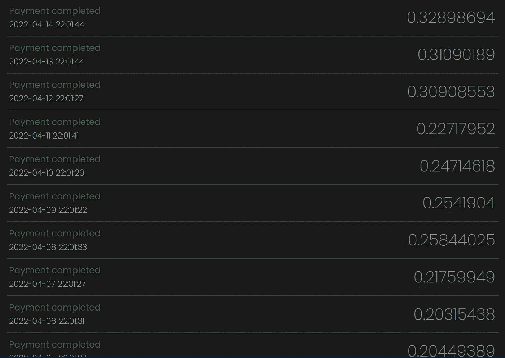

# 纳诺(ӿ):我喜欢挖掘的密码

> 原文：<https://medium.com/coinmonks/nano-%D3%BF-the-crypto-i-like-to-mine-4317f63e5d5?source=collection_archive---------3----------------------->

Photo by [fabio](https://unsplash.com/@fabioha?utm_source=unsplash&utm_medium=referral&utm_content=creditCopyText) on [Unsplash](https://unsplash.com/photos/oyXis2kALVg)

ano 是一种没有汽油的货币，每天都有很多用户进行支付。纳米是一种环保的绿色货币，有即时支付服务。你可以用 Nano 做很多事情，你可以向慈善机构捐款，进行在线支付和交易。玩游戏甚至可以赚到 Nano。

Nano 是在关注比特币的问题后创建的，Nano 是一种没有气体的货币(记录交易不需要挖掘)，我只是在 Nano 中挖掘并获取我的奖励。

比特币最初被采用是因为它在不欢迎信用卡的网站上被接受，它在很多方面是有用的，但在很多方面对政府是一种威胁。比特币的固定数量为 2100 万个硬币。

> 但是当事情有好的一面时，这可能意味着你还没有看到坏的一面。

加密货币开采一直是一些人的问题，他们的观点也是正确的，因为比特币开采消耗的电能相当于一个国家使用的电能([来源](https://digiconomist.net/bitcoin-energy-consumption/))。但是，当秘密战争资金或政治领域的腐败在整个时间线中可见时，有人会认为这是为改善整个世界的金融运动开了绿灯。如果你继续阅读这个故事，我会告诉你加密挖掘的优点，以及为什么我在挖掘了许多其他人之后选择了 nano(ӿ)。

# 简介:

随着时间的推移，我已经浪费了很多天来尝试，只是试图找到一种我可以挖掘的加密货币，并对结果感到满意。我在这一领域并不真正有经验，但我在过去几个月里做了一些采矿工作，我想分享我的成果。例如，当我开采宇宙时，不可开采的支付阈值是 0.2 原子，但我用 1070ti 花了一天半的时间才收集到 0.2 原子。当我在 BTT 采矿时，支付门槛是 40 万 BTT，过去需要大约两天或有时一天半的时间才能收集到 40 万 BTT。

## 现在的**真正麻烦的是**？

真正的麻烦开始时，你选择从一个大目录的硬币，因为 un minable 有一个收集的硬币，它可以提供给你作为付款，如果你使用他们的软件来挖掘，另一方面，你也会发现其他软件是 un minable 的替代品。

从我的经验来说，我尝试过挖掘 VeChain，FunToken，Ethereum，Dogecoin，Solana，BTT，Tron，WINk，Klever，babydogecoin，ADA，现在猜猜我在挖掘什么，Nano。这是一种奇特的纳米技术，如果你读得更多，我会告诉你为什么到目前为止这是我最好的选择。

> 真相:不可挖掘基于 GPU 或 CPU 挖掘的以太坊或 Monero 然后它把你想要的货币换成那个 Eth 或 XMR(这里更好的解释:[链接](https://forum.cardano.org/t/unmineable-is-this-a-scam-i-earned-01-ada-in-one-day-gone/62204/3))。

尽管如此，如果你决定通过不可挖掘来挖掘密码，那么你可以继续这个[链接](https://unmineablesbest.com/)并实时检查费率、[信用](https://www.reddit.com/r/Unmineable/comments/o6ds5u/comment/h6garm2/?utm_source=share&utm_medium=web2x&context=3)。

## 背景:

1.  选择我要的硬币时遇到麻烦
2.  为什么我不建议从笔记本电脑上挖掘(机器故障)？
3.  为什么是 nano(ӿ)？
4.  如何设置矿工？
5.  为什么挖矿加密货币一上台面，人们就觉得可疑？
6.  重要链接

## 为什么我不建议从笔记本电脑上挖掘(机器故障)？

几句话，挖掘笔记本电脑上的密码将减少其寿命。你可能认为你可以从互联网上赚一些钱，但如果你用笔记本电脑来挖掘密码，这是不值得的。

# 中点:

如果你已经涉足采矿，那么你应该知道基于以太坊链的硬币需要你挖掘比普通硬币高得多的数量，这将是你的 PC 或机器在夜间运行的原因，如果你正在挖掘像 FunToken，Fantom，AAVE 或柴犬。虽然 unMineable 不会向你收取交易的天然气费，但它会收取采矿费，采矿费可从 1%降至 0.50%。如果您使用我的推荐代码来使用不可采矿开采加密技术，您的开采费用将减少 0.25%，而我向您介绍不可采矿的奖励将减少 0.25%，因此当您使用推荐代码时，不可采矿的开采费用将为 0.50%。

> 我的纳米矿工推荐代码: ***08lw-xrkt***

## 为什么是 nano(ӿ)？

虽然我承认我已经尝试过挖掘许多其他硬币，但 Nano 独自站在角落里。很奇怪，人们可以等待更长的支付时间，或者允许在交易费用中移除开采的硬币，因此从这一部分你会明白，作为一个矿工，开采纳米在许多不同的方面都是有益的。

**我选择 Nano 的 5 点理由**

1.  **无油费**:每一个 Nano 钱包基本都是一个单独的区块链，发送 Nano 到一个 Nano 钱包地址不需要任何费用。
2.  **低支付门槛**:如果你查看我之前提供的这个[链接](https://unmineablesbest.com/)，你可以注意到 Nano 的支付时间是最低的。因此，如果你想看到钱包数字一点一点上升，那就试试 mining Nano 吧。
3.  **采矿费折扣**:使用转介码可以节省一些纳米。
4.  **不需要让机器运行更长的时间**:因为支付的时间很短，我只需要确保我得到 0.1 纳米的矿，这样当下一次支付交易发生时，我就能得到付款。
5.  **使用 Nano 的方法** : Nano 在很多网上商店都是可以接受的，或者你可以从优惠券提供商那里购买优惠券，你甚至可以通过跑步赚取 Nano。

Referral page

Payment tracking page

在写这篇文章之前，我花了一些时间，我研究了这个记录，然后做了一些调整，同时赚了更多的钱。现在，让我们来看下一点，如何在你的机器上设置矿工。

## 如何设置矿工？

设置矿工是非常简单的，你可以按照下面的简单步骤或者去 YouTube 视频，他们会告诉你怎么做。

**下载此素材** : GPU 挖矿([PhoenixMiner.exe](https://phoenixminer.org/download/))，CPU 挖矿([xmrig.exe](https://xmrig.com/download))，[unminible](https://www.unmineable.com/miner)

**步骤**:

1.  首先，关掉杀毒软件，因为微软机器不会把矿工识别为友好软件。
2.  下载 unMineable 并选择您希望使用 GPU 挖掘还是 CPU 挖掘。
3.  GPU 挖矿解压 PhoenixMiner.exe，CPU 挖矿解压 xmrig.exe，在不可挖矿软件中选择存储目录。
4.  选择您想要挖掘的硬币，填写您的钱包地址、推荐代码，然后单击开始。
5.  你可以在不可挖掘的页面上跟踪这个过程。

如果上面的解释难以理解，你可以查看这个[链接](https://support.unmineable.com/how-to-setup-our-easy-mining-app/)来直接遵循不可完成页面的指示。

# 最终点:

## 为什么挖矿加密货币一上台面，人们就觉得可疑？

比特币挖矿需要大量能源，这个问题正在浮出水面。许多其他硬币和 DeFi 代币已经开始通过引入低汽油费来结束能源消耗。目前，我们不能说 crypto 的未来会怎样，没有什么是固定的，任何事情都可能随时改变。我们所知道的是，这就像 8 英里长跑的前几步。

在一些人看来，开采比特币消耗的能源非常高，令人担忧。根据 digiconomist.net 的说法，一次比特币交易消耗的能量可以供一个家庭使用 70 多天。这就是为什么，当我想到是什么让人们对加密采矿感到焦虑时，我会想到能源消耗。

所以，如果你问我，人类的贪婪和世界政治圈的漏洞是我们经历 2008 年危机，然后聪坐下来创造将改变整个世界的东西的几个原因。

人们可以对采矿说任何他们想说的话，但是我想看看政府把我们的税收花在哪里了。是为了让我们的世界变得更好，还是把钱花在武器、无用的项目或救助破产的对冲基金上，有组织的分类账会显示在什么时间买了什么。

这一次就这样了，谢谢你阅读我的故事，下周或不久我会带着其他话题回来。

## 重要链接

1.  纳米:[网站](https://nano.org/)
2.  纳米:[守宫](https://www.coingecko.com/en/coins/nano)
3.  无法逾越:[纳米页面](https://unmineable.com/coins/NANO)
4.  纳米探索者:[纳米爬虫](https://nanocrawler.cc/)
5.  纳米:[水龙头](https://hub.nano.org/faucets)
6.  找到可以花 Nano 的地方: [TryNano](https://nano.org/try-nano)
7.  纳米商家: [NanoHub](https://hub.nano.org/merchants)
8.  接受 Nano 的慈善机构:[链接](https://hub.nano.org/charities)

> 加入 Coinmonks [电报频道](https://t.me/coincodecap)和 [Youtube 频道](https://www.youtube.com/c/coinmonks/videos)了解加密交易和投资

# 另外，阅读

*   [Bookmap 点评](https://coincodecap.com/bookmap-review-2021-best-trading-software) | [美国 5 大最佳加密交易所](https://coincodecap.com/crypto-exchange-usa)
*   最佳加密[硬件钱包](/coinmonks/hardware-wallets-dfa1211730c6) | [Bitbns 评论](/coinmonks/bitbns-review-38256a07e161)
*   [新加坡十大最佳加密交易所](https://coincodecap.com/crypto-exchange-in-singapore) | [购买 AXS](https://coincodecap.com/buy-axs-token)
*   [红狗赌场评论](https://coincodecap.com/red-dog-casino-review) | [Swyftx 评论](https://coincodecap.com/swyftx-review) | [造币厂评论](https://coincodecap.com/coingate-review)
*   [投资印度的最佳密码](https://coincodecap.com/best-crypto-to-invest-in-india-in-2021)|[WazirX P2P](https://coincodecap.com/wazirx-p2p)|[Hi Dollar Review](https://coincodecap.com/hi-dollar-review)