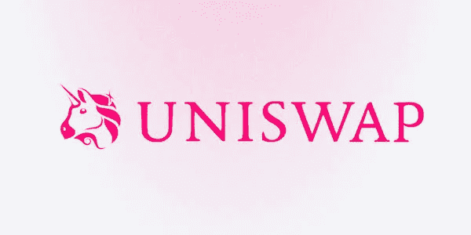
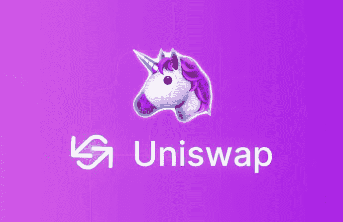
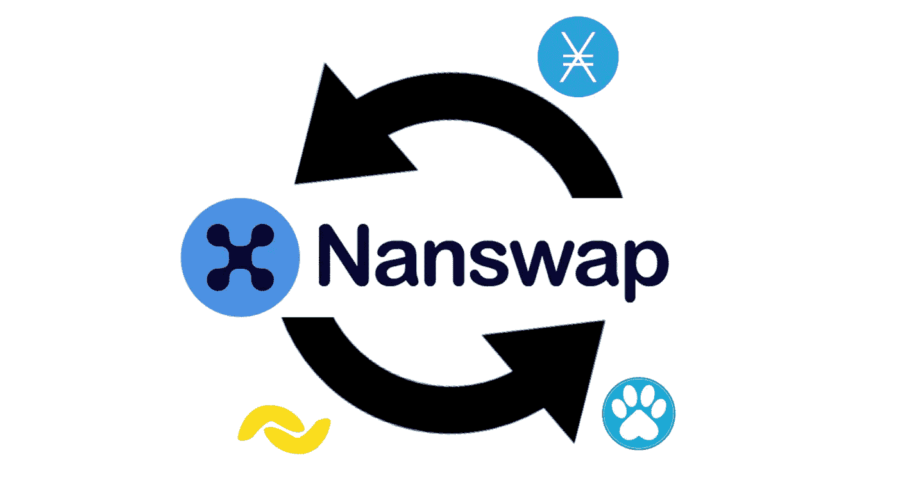
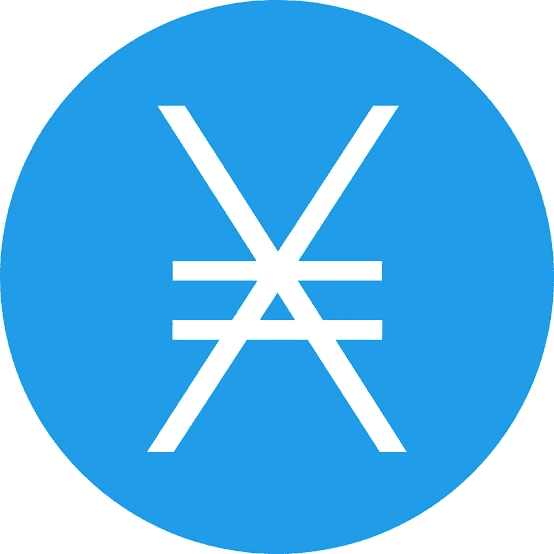

# NANSWAP 还是 UNISWAP？

> 原文：<https://medium.com/coinmonks/nanswap-or-uniswap-a77e3167ec63?source=collection_archive---------33----------------------->

哪个是比较好的交流平台？

> 通过向投资者提供收益农业机会，即帮助促进数字资产分散交换(或交易)的机会，以换取少量费用，分散交易所在金融市场中发挥了巨大作用

对加密感到困惑，并且真的想知道更多？

> [**NewsCrypto**](https://app.newscrypto.io/register/sign-up?referral=f386fdb2) 是一个平台，在这里您可以获得最好的加密教育，从初级到高级水平，新闻和最新的加密更新，了解来自 Defi、Cefi 的一切和关于元宇宙的一切现在在[T5，](https://app.newscrypto.io/register/sign-up?referral=f386fdb2) 点击 [**链接**](https://app.newscrypto.io/register/sign-up?referral=f386fdb2) 现在注册并获得惊人的奖金

# **去中心化交易所？**

不需要客户存款就可以开始交易的交易所，也不为他们保管资金。相反，顾客直接从自己的钱包里进行交易。

多年来，集中交易一直是比特币市场的支柱。它们提供了快速的结算时间、巨大的交易量和持续改善的流动性。然而，以不可信协议的形式，另一个世界正在形成。为了简化交易，分散交易所(DEX)不需要中间人或托管人的服务。

**什么是 uniswap？**

许多开发人员一直在集思广益，用不同的方法来建立一个分散的交易所。Uniswap 是这一领域的先驱之一。Uniswap 的操作可能比更典型的 DEX 更难理解。

由于这项发明，Uniswap 已经成为与*分散融资(DeFi)* 运动相关的最成功的倡议之一。

Uniswap 是基于以太坊的去中心化交易机制。更具体地说，这是一种自动化的流动性机制。没有进行交易所必需的指令簿或集中方。Uniswap 允许用户在不需要中间商的情况下进行交易，导致了高度的去中心化和对审查的抵制。

Uniswap 是一个免费的开源软件，其运行基于流动性供应商创建流动性池的模式。该解决方案提供了一种分散定价机制，可有效平滑订单簿深度，允许用户在不需要订单簿的情况下在 ERC-20 令牌之间进行交换。

**unis WAP 的优势**

Uniswap 是一个开源软件平台，这意味着它可以被其他想要构建 DeFi 应用程序的用户修改。

作为一个分散的交易所，Uniswap 允许用户始终保持对其加密资产的完全所有权。允许消费者保留其私钥的所有权降低了这种资产被泄露的危险。

因为它是一个采用自动做市商机制的指数，用户可以贡献流动性池，并以这种方式获得激励。此外，因为 DEX 是建立在以太坊区块链上的，用户可以简单而便宜地兑换 ERC-20 代币，因为它们没有优点也没有缺点，让我们来看看几个

**缺点**

虽然 Uniswap 收取最低的费用，但交易商还必须支付以太坊的汽油费——实质上是完成交易的费用。由于以太坊平台上的拥堵，汽油可能会很贵，尤其是小额交易。

尽管能够在流动性池中押注代币可能是被动收入的一个来源，但也存在暂时亏损的危险。如果池中代币的价值改变，并且即使保留一定百分比的交易费作为奖励，资产的价值现在也低于如果用户将它放在池外时的价值。

当然，我们并不是要提出一个没有解决方案的问题，我们将引入另一种分散式交换来解决这个问题，那就是

# Nanswap！

Nanswap 是一个简单快捷的 [Nano](http://nano.org) 、 [Paw、](https://paw.digital/)和 [Banano](https://banano.cc/) 交换服务平台，但是你现在可以轻松地将你的 BTC、瑞士联邦理工学院、SHIB、长期债券、KMD 和许多其他货币(包括交易成本/费用)交易成当今最受欢迎的 **DAG** 硬币。

使用 Nano、Paw 和 Banano 的交易是免费的，通常不到一秒钟就能完成。其他加密货币的预计价格中包含交易费(天然气费、网络费、矿工费等)。

该公司可以为你提供最好的价格为纳米，爪，巴纳诺配对，因为它自己的流动性和连接到其他交易所。

**什么是 Dag？**

有向无环图使用顶点和边作为构建块，不像区块链，没有块。相反，事务被存储为堆叠在彼此顶部的顶点。事务由节点贡献给 DAG，很像区块链。要提交事务，节点必须完成工作证明任务

DAG 中的每个新事务都必须引用过去的事务才能被允许进入网络，就像区块链中的块包含对早期块的引用一样。当一个事务引用另一个事务时，它被确认。该事务必须被另一个事务引用才能被验证，依此类推。

Dag 被认为提供了多种益处。事务速度很快，因为处理不受块结构的限制。因为没有矿工，所以没有交易费用——当然，没有采矿也有巨大的环境优势

**现在对比 Uniswap 和 Nanswap**

如前所述，Uniswap 收取 0.3%的加气费，有时可能达到 500 美元，而且它极易受到抢先运行的机器人的攻击。这些领先的机器人启动了一项重大交易，将对市场定价产生影响；他们扫描未决交易，并支付更高的天然气费，以便矿工可以先执行他们的交易。它通过以更高的价格出售资产来获利

另一方面，Nanswap 没有交易费，交换在不到一秒钟内完成，最小值大约为 0.001 美元，前端运行基本上是不可能的，由于 Nano 协议，跨链交换是可行的。

Nanswap 也是集中式的，并且具有单点故障，但是因为最小订单非常少，并且所有订单都是公开可见的，所以很容易检查其偿付能力和诚实性。

Uniswap 在以太坊网络上工作，该网络包括用于每个以太坊交易的 ETH，因此与 nanswap
[Nano](https://medium.com/u/b30e4c109942?source=post_page-----a77e3167ec63--------------------------------) 相比，大大提高了交易成本

在 [Nanswap 上，](https://nanswap.com/?ref=12268ZWPX3ZD)你可以在眨眼之间兑换几种加密货币，Nanswap 也几乎没有感觉

现在尝试您的第一笔 [**Nanswap**](https://nanswap.com/?ref=12268ZWPX3ZD) 交易

准备好您的钱包并
点击 [**此处**](https://nanswap.com/?ref=12268ZWPX3ZD) 获得免费的 XNO、Paw 或 Banano，并尝试 Nanswap 交易无感觉和超快功能

如果你正在寻找在哪里可以得到最好的加密教育与生动的解释所有条款

现在请检查 [**NewsCrypto**](https://app.newscrypto.io/register/sign-up?referral=f386fdb2) ！

> 加入 Coinmonks [电报频道](https://t.me/coincodecap)和 [Youtube 频道](https://www.youtube.com/c/coinmonks/videos)了解加密交易和投资

# 另外，阅读

*   【Capital.com】|[港加密借贷平台](https://coincodecap.com/crypto-lending-hong-kong)
*   [如何在 Uniswap 上交换加密？](https://coincodecap.com/swap-crypto-on-uniswap) | [A-Ads 评论](https://coincodecap.com/a-ads-review)
*   [WazirX vs CoinDCX vs bit bns](/coinmonks/wazirx-vs-coindcx-vs-bitbns-149f4f19a2f1)|[block fi vs coin loan vs Nexo](/coinmonks/blockfi-vs-coinloan-vs-nexo-cb624635230d)
*   [本地比特币审核](/coinmonks/localbitcoins-review-6cc001c6ed56) | [加密货币储蓄账户](https://coincodecap.com/cryptocurrency-savings-accounts)
*   [什么是保证金交易](https://coincodecap.com/margin-trading) | [美元成本平均法](https://coincodecap.com/dca)