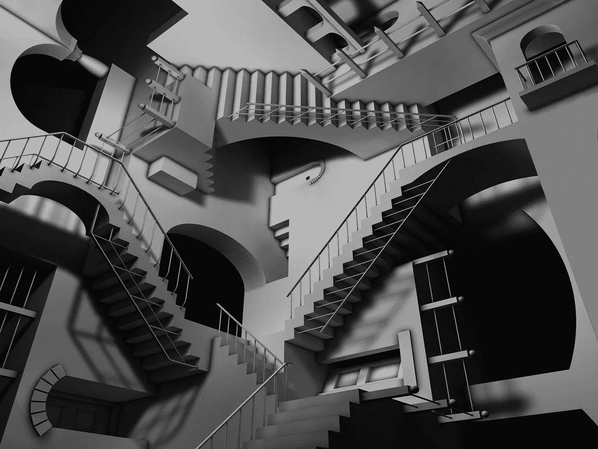
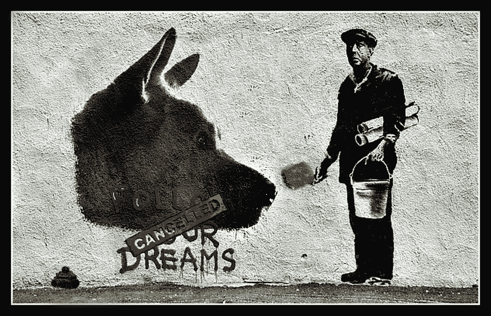

# 纳斯达克文章称监管不会影响加密的核心价值

> 原文：<https://medium.com/coinmonks/nasdaq-article-says-regulation-wont-affect-crypto-s-core-values-11d30754ac2d?source=collection_archive---------17----------------------->

Image Credit: [Victoria White2010](https://www.flickr.com/photos/53355131@N07/5579133724)

## 与此同时，美国证券交易委员会扩大了其加密执法部门

周一，美国证券交易委员会发布了一份[新闻稿](https://www.sec.gov/news/press-release/2022-78)，宣布其网络部门增加了 20 个新职位，该部门已更名为执法加密资产和网络部门。我更喜欢“网络单位”这个名字，特别是从品牌的角度来看，但更重要的是，这条新闻显示了联邦政府在监管和最终集中加密货币市场方面投入资源的具体证据。

新闻稿中引用了 SEC 执法部门主任 Gurbir S. Grewal 的话说，“面对这些严峻的挑战，得到加强的加密资产和网络部门将处于保护投资者和 ***确保公平有序的市场*** 的最前沿。”

出于显而易见的原因，我强调了这些词。在美国证券交易委员会的术语中，“公平有序的市场”暗指受监管的市场。如果你是比特币的投资者，不要害怕，即使加密的集中化是你最大的财务恐惧。一批对加密有影响的人实际上认为你应该接受监管。事实上，在 SEC 发布新闻稿的第二天，一位加密市场参与者撰写并由纳斯达克新闻发布的一篇文章的标题称，[监管对加密的精神气质没有威胁](https://www.nasdaq.com/articles/regulation-is-no-threat-to-the-ethos-of-crypto)。

这是一种大胆的说法，尤其是来自纳斯达克。如果可能的话，这篇文章应该通过一个客观的镜头来阅读，因为它是一个客座撰稿人写的观点，而不是纳斯达克新闻的撰稿人，他是一家为公众区块链提供隐私协议的公司的首席执行官。他还是一家 Web 3.0 信用贷款公司的创始人，该公司的使命是为服务不足的社区提供大众化的可负担得起的信贷，此外，他还是一名屡获殊荣的国际雷鬼和嘻哈艺术家。本质上，他是你的平均加密市场超级明星！

*“虽然有些人可能会将监管视为对 crypto 精神的威胁，但事实并非如此，监管是不可避免的，但隐私的损失却不是。与普遍看法相反，隐私和监管并非不相容。事实上，他们可以一起工作。在经历了多年的合规打击后，加密行业已经适应并创新了新的方法，以满足监管机构和寻求私人交易的加密用户的要求。”*

这个人的积极态度是我相信加密货币的长期可行性并认为自己是其粉丝的原因，尽管它可能看起来不是这样。我喜欢参与分散化空间的制造商的远见和创造力，但也欣赏这样一个事实，即实际的[基础设施](/coinmonks/35k-crypto-atms-the-cryptobowl-nft-vending-machines-fomo-ca8f66affa9a)已经并正在世界各地安装，以帮助这些企业家和那些投资于加密的人实现他们的共同目标，即一个分散化的数字金融世界。所有这些的问题是什么？现实。

纳斯达克文章的作者在他的论点中提出了许多非常好的观点，我想在我的社交媒体渠道上强调和分享，但不幸的是，他的论点有一些致命的缺陷，我认为应该在这里指出。任何作家都很容易歪曲数据和市场情绪，以使观众的观点偏向自己。这是我尽量避免的做法，因为我认为这对读者不公平。Nasdaq 文章的作者使用了这种策略，并发表了以下声明:

*“…加密通常被视为洗钱和其他非法活动的手段。在很大程度上，这种看法可以追溯到丝绸之路，这是一个存在于 2011 年至 2013 年的在线黑市，允许人们通过加密货币匿名从事非法交易。这种与黑市交易的关联使得加密行业面临着相关立法者和监管者越来越多的审查，尤其是在涉及交易隐私时。”*

不幸的是，这与事实相去甚远。也许是作者对真理的感悟，或者是对真理的理想化版本？[残酷的现实](/coinmonks/report-claims-irs-seized-3-5-billion-of-crypto-laundered-cash-in-2020-944567e219ae)是，在有记录的历史上，从来没有比加密更好的洗钱手段。丝绸之路仅仅是问题的一个症状，而不是问题的根源。为了观众的利益，我想展示一下用 crypto 洗钱有多简单，只需四个步骤:

1.  ***用偷来的现金买比特币变成银行本票***

***2。通过搅拌器或不倒翁发送比特币***

***3。兑现新的、不可追踪的比特币，换成法币，甚至更好……***

***4。用比特币购买一些实物财产。然后，在投资到期后，卖掉它获得法定现金(以及可观的利润)***

现在这个星球上[最火的艺术潮流](/@alacergroup/are-nfts-a-money-laundering-gold-mine-ea292a60c0ab) (ehem，洗钱党)是什么？没错，NFT 拍卖会。如果没有加密，NFTs 就不会存在，对吗？话虽如此，也许你需要扔掉一些肮脏的比特币，并优先了解一场安全的(讽刺的是)以热门艺术家为主角的拍卖。谁不会把加密硬币扔向一个有传言承诺的 NFT 呢？如果你拥有大量需要清洗的硬币，你为什么不从像佳士得这样的地方的 NFT 拍卖会上购买像班斯基·NFT 这样的大[呢？](/coinmonks/enviro-stains-investor-anxiety-cancel-the-nft-546ade685c68)

Image Credit: [Patrick Verstappen](https://www.flickr.com/photos/56393389@N05/46463176974)

在佳士得拍卖行这样的历史机构举行的班克斯·NFT 拍卖会，是一场天作之合的洗钱比赛。我是说，从一个骗子的角度来看，没有比这更好的了。如果说加密市场是历史上最大的洗钱推手，那么艺术界紧随其后。正如纳斯达克文章的作者暗示的那样，对加密的监管对罪犯来说比合法的加密投资者来说更是一个问题，除非我认为税收起了作用。

我们可以整天谈论区块链的隐私保护，但加密运动的中心主题和精神集中在自由第一，隐私第二。这意味着免受政府监管者的窥探。正如美国证券交易委员会刚刚通过其新闻稿提醒我们的那样，尽管纳斯达克第二天发表了一篇观点文章，但联邦政府正在投资更多的窥探，特别是针对加密货币市场，而且短期内不会缩减规模。对我来说，这特别像是一个精神杀手。我希望我是错的。

*   结束

> 加入 Coinmonks [电报频道](https://t.me/coincodecap)和 [Youtube 频道](https://www.youtube.com/c/coinmonks/videos)了解加密交易和投资

# 另外，阅读

*   [5 款最佳加密交易终端](https://coincodecap.com/crypto-trading-terminals) | [最佳 DeFi 应用](https://coincodecap.com/best-defi-apps)
*   [比特币基地 vs 瓦济克斯](https://coincodecap.com/coinbase-vs-wazirx) | [比特鲁点评](https://coincodecap.com/bitrue-review) | [波洛涅克斯 vs 比特鲁](https://coincodecap.com/poloniex-vs-bittrex)
*   [德国最佳加密交易所](https://coincodecap.com/crypto-exchanges-in-germany) | [Arbitrum:第二层解决方案](https://coincodecap.com/arbitrum)
*   [币安交易机器人](/coinmonks/binance-trading-bots-d0d57bb62c4c) | [OKEx 评论](/coinmonks/okex-review-6b369304110f) | [阿塔尼评论](https://coincodecap.com/atani-review)
*   [最佳加密交易信号电报](/coinmonks/best-crypto-signals-telegram-5785cdbc4b2b) | [MoonXBT 评论](/coinmonks/moonxbt-review-6e4ab26d037)
*   [如何在 Bitbns 上购买柴犬(SHIB)币？](https://coincodecap.com/buy-shiba-bitbns) | [购买弗洛基](https://coincodecap.com/buy-floki-inu-token)