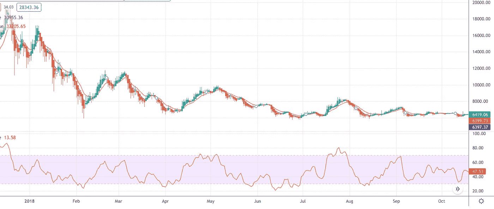
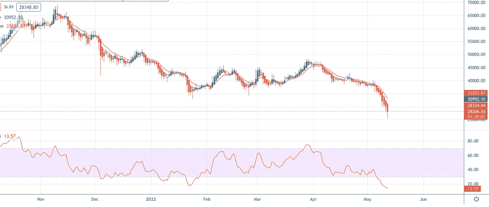

# 导航 2022 年的熊市

> 原文：<https://medium.com/coinmonks/navigating-the-bear-market-of-2022-371c428a48c2?source=collection_archive---------15----------------------->

Photo by Magda Ehlers: [Pexel](https://www.pexels.com/photo/selective-focus-photo-of-polar-bear-451230/)s

面对现实吧！对于密码爱好者来说，2022 年并不顺利。前一年(2021 年)见证了比特币和许多 alt 的历史新高，NFT 繁荣，以及主流加密技术采用的承诺，但在 2022 年几乎中期之后发生了令人作呕的市场崩溃，摧毁了许多人的投资组合！包括我自己。

对于那些跟踪这个领域足够长时间以回忆 2018 年熊市的人来说，2022 年目前的熊市趋势似乎是一种脉动*似曾相识*,如果我们从 2018 年的熊市中吸取了任何教训的话；嗯，这种下降趋势可能会持续一分钟以上。

但是，这种看似可怕的情景非但不会让人沮丧，反而可能是一个分散和增加你的加密组合的独特机会，我在这里提出你可以如何做到这一点。

# 纪念物

在我深入研究我的策略之前，让我们回顾一下 2018 年熊市是如何结束的，我将使用 BTC 的价格行动来说明这一点。

BTC Daily Price Chart in 2018\. Source: TradingView

比特币 2017 年 ATH 的欢欣鼓舞是短暂的，因为新年没多久；市场经历了第一次严重低迷。BTC 在短短几天内损失了近 40%的价值。正如我们从上面的图表中看到的，比特币找到了更低的低点，直到随着时间的推移，它在 5.8k-8.4k 美元范围内盘整。

2022 年的 BTC 价格图看起来也遵循类似的模式。自 11 月下旬 ATH 达到 69k 美元以来，比特币继续突破支撑位，达到目前的 29k 美元。

BTC Daily Price Chart in 2022\. Source: TradingView

如果 BTC 价格遵循与 2018 年类似的模式，我们应该预计随着时间的推移，价格将在更窄的价格区间内进行整合，尽管价格行动从未真正按照计划进行(记住这一点)。然而，如果要在这个时代生存下来，随着即将到来的价格整合而来的市场波动需要密码交易员和投资者改变他们的交易策略；因此，我的建议背后的原因。

# 建议 1:不要害怕改变策略

如果我们都明确同意牛市已经结束，那么在我们过渡到熊市的时候，改变我们的交易/投资方式是合乎逻辑的。

不考虑你的首选策略；美元成本平均法、HODLing、摇摆交易、逢低买入等。，如果你想走在市场曲线的前面，在即将到来的熊市中导航需要在交易方法上有一定的灵活性。

加密市场的特点是动荡；今天有效的不一定明天就有效。你通过调整和再调整你的投资/交易方法在这些恶劣的海浪中冲浪的能力可能是你在这个季节保持漂浮的决定性因素。

# 建议 2:用更少的钱做更多的交易

这个想法并不像看起来那么复杂，只涉及减少你的投资敞口，这样你就可以有足够的储备来利用出现的意外机会。此外，通过探索保证金交易，交易者可以用更少的资金进行更多的交易。

保证金交易，基本上是用借来的资金进行交易，使你能够获得比通常情况下更多的资金来大幅放大你的收益。这种交易方法有内在的风险，我只推荐给更有经验的交易者，他们有很高的情绪和技术智商。

如果努力，保证金交易，尤其是在波动时期，提供了一个独特的机会，在熊市中比传统交易策略更容易获利。

虽然许多交易平台都提供保证金功能，但我会推荐 [KuCoin](https://www.kucoin.com/) ，特别是对新手，因为该平台允许交易者使用高达 10 倍的杠杆，支持多个交易对(160+加密货币)，通过各种交易挑战提供奖金，并且交易费用非常低。

# 建议 3:反思 ICO 投资

硬币产品的概念，今天被称为 IDOs、IGOs 或 launchpads，使加密公司能够为他们的项目筹集资金，以换取令牌，它可能在 2017 年成为主流，失去了一些动力，但仍在 2021 年的牛市中反弹。

当我们进入熊市时，投资者需要谨慎行事。即使在 2017 年和 2021 年繁荣的高峰期，ICO 领域也有一些坏演员设法执行拉地毯或 ***抽水和倾倒*** 计划，损害了不知情的投资者的利益。在 2022 年的熊市中，这一点将变得更加突出。

避免这些 ICO 骗局不需要复杂的变通办法；解决办法很简单。投资者在寻找下一个 crypto gem 项目时，必须进行尽职调查。可以从；

1 .彻底检查网站、社交渠道和白皮书

2.调查团队成员(注意他们在加密领域的历史)、发起人和其他合作者或附属机构

3.监控他们的社区活动

4.在 Github 等在线知识库上寻找开发更新

如果这些活动对你来说似乎太难，太辛苦，考虑投资 KuCoin 的聚光灯项目。除了代表你进行尽职调查，这个平台上的许多项目已经为早期投资者带来了巨大的收益。

通过这个平台的 20 多个项目平均带来了 67.4 倍的收益，其中像 T2 clear Dao T3 这样的项目积累了 299 倍的投资回报(以最高定价计算)。

# 建议 4:探索被动收入模式

如果你长期看好特定的项目，那么你必须考虑投资这些代币(无风险)，而不是仅仅持有。

投资可以以被动收入的形式出现，如:定义桩，产量农业，或流动性开采。

同样， [KuCoin Earn](https://www.kucoin.com/earn) 使投资者能够扩大投资组合，甚至通过各种产品积累额外的代币，如；灵活的储蓄，赌注，燃烧下降，锁定下降，或其他诱人的促销活动。

# 提议 5:项目组合管理

这可能是我的建议中最务实的一个，它可能会让你免受重大损失。投资组合管理背后的基本思想围绕着减少你的风险暴露。

在熊市期间，我们都需要对我们的投资和持有保持战略眼光，因为看到加密资产一夜之间化为乌有并不罕见。(问[$露娜](https://www.kucoin.com/blog/weekly-crypto-analysis-luna-triggers-crypto-s-bloodbath-top-7-things-to-know)霍德勒)。

我不会详细说明我觉得什么是最好的投资组合分配公式(即使我不是 100%确定)。尽管如此，我还是绝对建议你在这个熊市减少 Alt 暴露。

尝试在比特币、Alts 和 Stablecoins/fiat 之间取得现实的平衡。持有更多菲亚特(Stablecoins)股份，以防出现好的投资机会。

# 这都是最基本的

准确预测 2022 年的密码市场即使对于行业领导者来说也是一项艰巨的任务，尤其是在世界面临不确定时期的时候。但如果我们要从 2018 年的熊市事件中寻找相似之处，我对投资者的建议是采取更务实的方法，避免如履薄冰。

牛市不会永远持续，总会结束。因此，在 2022 年的熊市中航行不一定需要对加密市场的技术和基本面有复杂的理解。相反，它需要可操作的基本投资方法的应用，其中一些我已经建议过了。

**免责声明**

这不是财务建议。本文中的信息仅用于教育、信息和娱乐目的。请理解，您需要对使用本文中的任何信息所带来的任何风险承担责任，因此请务必尽职调查。

> 加入 Coinmonks [电报频道](https://t.me/coincodecap)和 [Youtube 频道](https://www.youtube.com/c/coinmonks/videos)了解加密交易和投资

# 另外，阅读

*   [如何在 Uniswap 上交换加密？](https://coincodecap.com/swap-crypto-on-uniswap) | [A-Ads 审核](https://coincodecap.com/a-ads-review)
*   [WazirX vs coin dcx vs bit bns](/coinmonks/wazirx-vs-coindcx-vs-bitbns-149f4f19a2f1)|[block fi vs coin loan vs Nexo](/coinmonks/blockfi-vs-coinloan-vs-nexo-cb624635230d)
*   [本地比特币审核](/coinmonks/localbitcoins-review-6cc001c6ed56) | [加密货币储蓄账户](https://coincodecap.com/cryptocurrency-savings-accounts)
*   [什么是保证金交易](https://coincodecap.com/margin-trading) | [美元成本平均法](https://coincodecap.com/dca)
*   [支持卡审核](https://coincodecap.com/uphold-card-review) | [信任钱包 vs MetaMask](https://coincodecap.com/trust-wallet-vs-metamask)
*   [Exness 回顾](https://coincodecap.com/exness-review)|[moon xbt Vs bit get Vs Bingbon](https://coincodecap.com/bingbon-vs-bitget-vs-moonxbt)