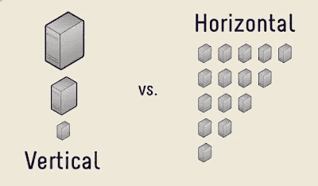
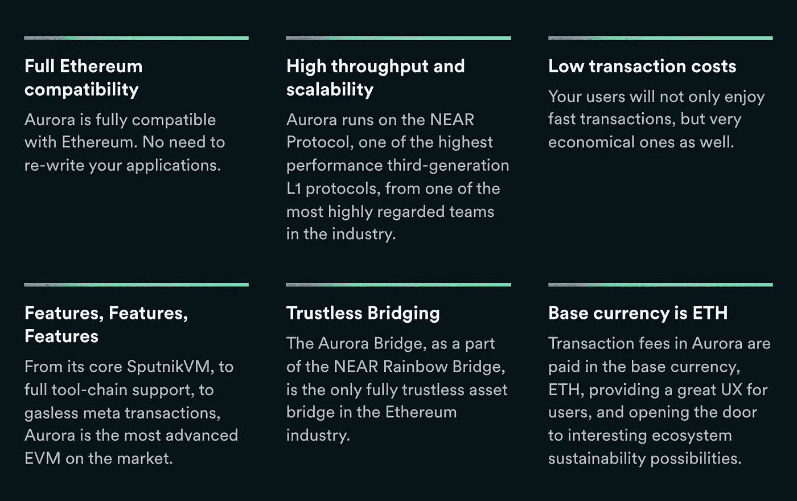

# 近生态系统深潜

> 原文：<https://medium.com/coinmonks/near-ecosystem-deep-dive-dfeb020f0a0e?source=collection_archive---------63----------------------->

## 通过简单、安全和可扩展的技术，NEAR 使数百万人能够发明和探索新的体验。

# 概观

NEAR 是一个 PoS 智能合同区块链，主要关注可用性、可伸缩性、简单性和去中心化。它为部署和运行分散的应用程序提供了一个由社区运营的云基础设施。它结合了分布式数据库和无服务器计算平台的特点。

## 附近 vs ETH

以太坊已经扩展了它的使用案例，并通过 Defi、NFT 和 Gamefi summer 成为了一个独立自主的国家。在目前的状态下，以太坊本身无法处理不断增长的海量交易。它目前依赖第 2 层汇总解决方案来实现可扩展性。易拉宝就像在以太坊顶上加了越来越高的摩天大楼；是缓解拥堵的一个很好的短期解决方案，但不能无限扩大规模。

[水平缩放](http://pudgylogic.blogspot.com/2016/01/horizontal-vs-vertical-scaling.html)将系统划分为多个碎片或子链，将区块链的总工作划分到多个碎片上。每个验证器都需要验证单个碎片上的数据，因此每个验证器需要的计算资源很少。这允许更多的用户参与验证，同时扩展系统的吞吐量，从而使其更加分散。这正是以太坊 2.0 的布局，它将在合并两年后实现(大约 2022 年 7 月)。

> 交易新手？试试[密码交易机器人](/coinmonks/crypto-trading-bot-c2ffce8acb2a)或者[复制交易](/coinmonks/top-10-crypto-copy-trading-platforms-for-beginners-d0c37c7d698c)

NEAR 也在使用水平扩展解决方案，并且已经实现了分片，比我们在 ETH 2.0 上看到它早了几年。NEAR 有一个优秀的执行团队，正在构建一个分散的、兼容的第 1 层，具有无限的可伸缩性，可以桥接回以太坊。

## 技术

NEAR 在其 PoS 机制中支持一种称为 [**末日钉**](https://near.org/blog/doomslug-comparison/) 的新型积木制作技术。它使网络在一轮交流后达到某种实际的终结感。NEAR 支持**动态重新分片**，这是一种扩展和保护分片网络的更具成本效益的方法，因为更多的存储需求可以根据需求进行调整。目前，它有 4 个碎片，支持 **3k TPS** ，预计 **1 年内 100k**无上限。它拥有最快的**终结(2s** )和最低的**tx 费用(< $0.01)** 。

分片或跨链通信中的一个主要问题是确定传入的事务是否有效。NEAR 使用新的**简单** [**茄**](https://near.org/papers/nightshade/) 方法进行分片以达成共识和跨分片事务。

茄影将系统建模为一个**单区块链**。每个块由单个验证器轮流产生。每个块中所有事务的列表被分割成由其他验证器提供的物理块，每个分片一个块。理论上，每个块包含所有碎片的所有事务的细节，但是不通过网络传输。没有参与者下载完整的状态或完整的逻辑块。它们只维护与它们验证事务的碎片相关的状态。到 2022 年第四季度末，他们将推出**动态茄影**，这将引入基于资源利用率的碎片动态拆分和合并

分片区块链的一个主要缺点是整体安全性被分割，因为网络的一部分验证器正在验证分片的事务。NEAR 使用两种方法**“隐藏验证器”**和“**渔夫节点**”，它们无权限地检测、报告不良行为，并启动削减和回滚过程。使用**可验证随机函数(VRF)** NEAR 为每个碎片分配隐藏验证器。任何其他节点操作符都可以通过运行 fisher 节点来提供与隐藏验证器相同的功能。他们可以包括钱包运营商、应用开发商或交易所基础设施，但没有报酬。相反，运行渔夫节点的参与者通常有维护网络安全的外部动机。即使所有隐藏的验证器池都被破坏，fisherman 节点仍然可以检测欺诈活动并启动削减过程，使其防欺诈。

NEAR 使用**渐进斜线**机制进行双重签名，该机制被设置为一个节点所押资产占押资产总额的比例的 3 倍。对于无效的块，全部股份被削减。只有当节点是恶意的时，无效块才是可能的。

近年度**通胀率为 5%** 。他们有他们的 EIP-1559 的实现，燃烧部分交易费。在每个时期收集的费用被烧掉。因此，净通胀率将低于 5%，如果收取的费用超过通胀产生的象征性费用，净通胀率将为通缩。因此，随着更多的采用，它也可以成为通货紧缩。

存储是一种长期稀缺的资产，它是网络节点存储数据的负担。存储成本是通过在账户或合同上维持一个与这种代币占用的存储量成线性比例的近似代币的最小余额来弥补的。验证者通过通货膨胀间接获得报酬，因为这些代币被锁定在帐户中，不可用于下注，使得总赌注更小。NEAR 以分散的方式提供计算和存储云服务。这种结合可以提供新的应用程序和新的业务用例。很多应用程序

## 以开发者为中心的方法

与其他替代层相比，NEAR 目前是可伸缩的，但是可伸缩性不是 NEAR 团队关注的唯一事情。他们通过可用性第一，可扩展性第二的方法，非常注重开发人员的入职。他们试图在 web3 中提供类似 web2 的开发者体验。它允许开发人员只部署应用程序，而无需考虑网络如何运行或扩展，这符合现有的 web2 云应用程序体验，如 AWS、AZURE 等。

NEAR 兼容 EVM (Aurora)、RUST 和 WASM(T1 ),使得从多种编程语言部署应用程序变得容易。Octopus network 是一个多链兼容的 LPoS 网络，在 NEAR 上有一个智能合同，它提供了**副链**来启动与 NEAR、以太坊和任何**支持 IBC 的区块链兼容的各种 web3 应用程序。**它还提供了**强大的工具**，并且具有可预测的价格。NEAR 也有一个内置的**可读地址**以获得更好的可用性

## 开发商激励措施

NEAR 内置了一项费用作为开发者奖励机制。该合同奖励设置为**交易费用**的 30%。开发商还可以通过要求客户将资金附加到呼叫来选择接收等于或高于该金额的任何金额。

这是一个非常独特和开发人员友好的功能，因为这些资金可以分配到一个帐户，并由开发人员、投资者或 DAO 以任何适合项目的方式使用。这为应用程序提供了一个可持续的业务模型，这些应用程序没有有意义的应用程序收费方式，但社区正在调用和使用合同。同样，分叉代码也不会分叉奖励。这是激励开发人员开发应用程序并根据这些合同的使用比例获得报酬的一种强有力的方式。

## 奥罗拉·EVM

Aurora 是 EVM 兼容的智能合约平台，具有来自 NEAR 网络的块时间和共识。它是无信任的和去中心化的，因为需要信任 NEAR 和以太坊共识。开发者可以轻松地将代码转移到 aurora，享受无汽油交易的好处，还可以参与 NEAR foundation 推出的 8 亿美元激励计划。用户可以使用彩虹桥将资金从以太坊转移到极光，反之亦然。许多 Defi、NFT 和 GameFi 应用程序都是基于它开发的。极光达到了近 10 亿美元的 TVL 在其高峰期。

## 不足之处

虽然它提供云服务，但与现有的 AWS 和传统计算机应用程序的 Azure 解决方案相比，它们并不便宜。因此，它应该用于要求高安全性、分散性和不变性的应用程序。理论上存储是无限的，但它取决于新的验证器节点添加到网络的速率和成本。

NEAR 的一个主要缺点是处理事务是并行发生的，不能用于需要同步处理的情况，如金融市场。重新同步会带来实实在在的成本。

## 结论

在目前的状态下，近令牌分发更加集中，并且验证器有限；短期来看，他们正在牺牲权力下放。将会看到这项技术在规模化后的效果。凭借一流的团队、巨大的支持和跨链整合，NEAR 很有可能成为强大的第 1 层区块链。

## 资源:

https://near.org/blog/doomslug-comparison/https://near.org/papers/nightshade/[T4](https://near.org/blog/doomslug-comparison/)

[https://near.org/papers/the-official-near-white-paper/](https://near.org/papers/the-official-near-white-paper/)[http://pudgylogic . blogspot . com/2016/01/horizontal-vs-vertical-scaling . html](http://pudgylogic.blogspot.com/2016/01/horizontal-vs-vertical-scaling.html)