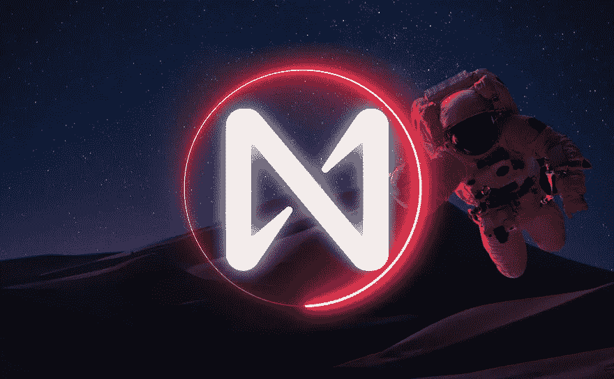

# 近似协议

> 原文：<https://medium.com/coinmonks/near-protocol-f63aaf4b4d76?source=collection_archive---------42----------------------->

***具有沉浸式可扩展性和最低费用的委托股权证明区块链。***

当一名微软软件开发人员和一名谷歌工程师偶然发现区块链技术时会发生什么？你有两个非常聪明的人，他们觉得他们可以构建足够强大的东西来废黜智能合约之王以太坊。以下是您需要了解的关于 NEAR 协议的所有内容。

**NEAR 协议(NEAR)到底是什么？**

Near 协议(NEAR)是第一层区块链，旨在解决缓慢的事务速率、有限的吞吐量和较差的互操作性等问题。它是一个去中心化的应用平台，有可能破坏系统，生成应用程序，并改变人们与互联网的交互方式。NEAR’s Doomslug**consensus**(Doomslug 让我们在仅仅一轮沟通后就觉得自己是某件事情的一部分。与我们在以太坊中等待 35 个区块不同，您只需等待 1 个区块确认)和分片机制，**茄影**有望解决当前区块链网络的局限性。与以太坊的加密钱包地址相反， **NEAR 使用人类可读的账户名**。

# 世卫组织是近距协议的创始人？

正如我们前面提到的，创始人不是别人，正是前微软软件开发人员亚历山大·斯基丹诺夫和前谷歌工程经理伊利亚·波洛舒吉。NEAR Protocol 拥有大量专业开发人员，包括多位金牌获得者和国际大学编程竞赛(ICPC)的获奖者。该公司声称拥有一些专家，他们已经大规模构建了一些唯一的现实世界分片系统，这是该协议正在寻求的一种解决方案，以提高区块链的可扩展性。

# 世卫组织是近前的靠山？

从 2017 年到 2020 年的财政年度**之间，创始人在四个月内通过两笔私人融资交易**Y**Combinator**筹集了 5000 万美元，没有建立任何东西，并通过各种代币销售获得了加密领域一些最大投资集团的资金支持，包括 A16Z、Libertus Capital、Blockchange 和 Animal Ventures，以及其他未披露身份的投资者。

NEAR 的最后一次公开拍卖受到了区块链社区的热烈欢迎，以至于导致 CoinList 网站崩溃，不得不重新安排时间。

截至 2022 年 1 月，NEAR 已经筹集了大约 1.5 亿美元的投资。

# 什么使得 NEAR 协议与众不同？

NEAR 的 **茄属植物** **技术**显著提升了交易吞吐量。茄属植物是一种碎片变体，其中不同的验证器集合通过多个碎片化的链并行处理交易，增加了区块链的整体能力。

与“正常”碎片化相反，茄属植物碎片会产生块中的一小部分，称为“块”。因此，NEAR Protocol 每秒可以处理多达 100，000 个交易，并通过一秒钟的区块节奏实现接近即时的交易终结，同时将交易费用降至最低。

NEAR Protocol 进一步改进了其他区块链公司复杂的入职流程，它使用了人类可读的地址，开发了分散的应用程序，注册流程与用户已经体验过的相当。此外，它还为开发人员提供了模块化组件，使他们能够更快地创建令牌合约或 NFTs 等应用程序。

# NEAR DEVELOPER EXPERIENCE

NEAR Protocol 为开发人员和最终用户开发了一系列工具，其中包括:

**NEAR SDKs:** 针对 Rust 和 Assembly Script 的完整 SDK，提供标准数据结构、示例和测试工具。

**Gitpod 代表 NEAR:** Gitpod 由 NEAR 使用，为开发人员提供零时间入职体验。

**NEAR Wallet:** 一个参考实现，旨在与渐进式安全概念协同工作，允许应用程序开发人员创建更有效的用户体验。

**NEAR Explorer:** 帮助进行合同故障排除并了解网络性能。

**NEAR 命令行工具:**一组简单的命令行工具，允许开发人员从本地环境中简单地设计、测试和部署应用程序。

# NEAR TOKENOMICS

NEAR Protocol 的本地货币是 NEAR(为了将这种货币与网络区分开来，我们将它称为$NEAR)。2020 年 4 月 22 日，Genesis 生成了 10 亿美元的 NEAR 代币，并分发给金融支持者和核心贡献者等各方。

# 比特币有三个目的:

# 1.TRANSACTIONAL POWER

NEAR 的本地货币是$NEAR，它为 NEAR 协议网络上的交易提供支持。ETH 为以太坊网络上的交易提供支持，而 BTC 为比特币网络上的交易提供支持。

# 2.STAKING investment

验证者会得到 NEAR Tokens 作为奖励，后者的固定通胀率约为每年 4.5%。由于成为验证者是一个耗时且成本高昂的过程，因此您可以转而投资验证者投资池，以获得投资奖励。

# 3.管理

$NEAR 币持有者将来还可以建议改进 NEAR 协议的方法并就此进行投票。

$NEAR 于 2022 年 3 月初报 10 美元，于 2022 年 1 月 16 日创下 20.42 美元的历史新高。

# 数据访问对象(Data Access Object)

目前，NEAR 的操作方式类似于 DAO。这是因为 NEAR 雇佣了公会。这些基本上是为 NEAR 执行某些活动的社区团体，类似于公司内的部门。NEAR 的行会专注于从社交媒体到法律问题的任何事情(你可以在这里找到它们。)此外，如前所述，$NEAR 令牌的功能是作为治理令牌，允许持有者以与 DAO 相同的方式对新想法进行提议和投票。

然而，在 NEAR 任务启动后，据信 NEAR 将被改造成一个成熟的 DAO。本质上，它正在打开社区的钥匙，变得完全去中心化。

# 与多个链兼容

正如我们之前讨论的，NEAR 的彩虹桥使 NEAR 协议能够与以太坊互操作。因此，您可以跨 NEAR 和以太坊网络传输 ETH。

近开发商打算允许其他跨链转让与重要的以太坊竞争对手，如币安智能链，幻影，流量，和其他在未来。

# 结论

重要的是要记住，NEAR 协议目前正在开发中，距离广泛采用可能还有很长的路要走。

另一方面，NEAR 似乎符合以太坊杀手清单上的所有标准。

最后，许多早期投资者受到锁定期的限制，这意味着他们只能在特定日期后转让。

# 在附近购买

 [## CoinDCX -加密交易所|购买、出售和交易比特币和顶级替代币

### CoinDCX 是印度最大、最安全的加密货币交易所，在这里你可以买卖比特币和其他…

coindcx.com](https://coindcx.com/) 

# 加入我们吧

# Whatsapp

 [## ⚡BLOCKENTHU⚡

### WhatsApp 群邀请

chat.whatsapp.com](https://chat.whatsapp.com/FTKme4XzkOU73ZDv99Oatj) 

# 电报

 [## ⚡·布洛克登胡·⚡

### 可以马上查看并加入@blockenthu。

t.me](https://t.me/blockenthu) 

# 照片墙

[https://www.instagram.com/blockenthu/](https://www.instagram.com/blockenthu/)

# 商务化人际关系网

 [## Blockenthu | LinkedIn

### blockenthu | LinkedIn 上有 195 名粉丝。“面向大众的 Web 3.0 福利”加密和区块链| BlockEnthu 是社区…

www.linkedin.com](https://www.linkedin.com/company/blockenthu/)