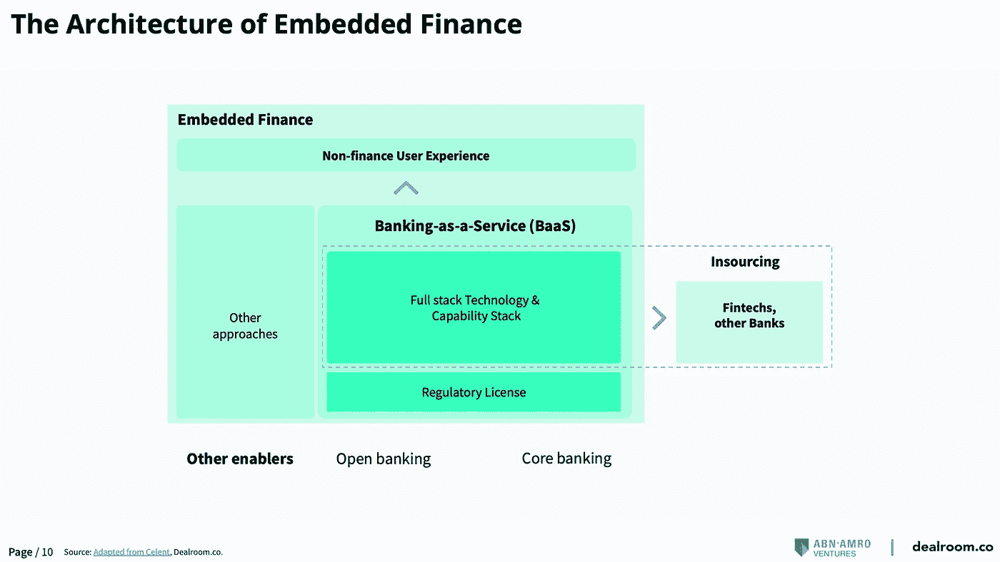
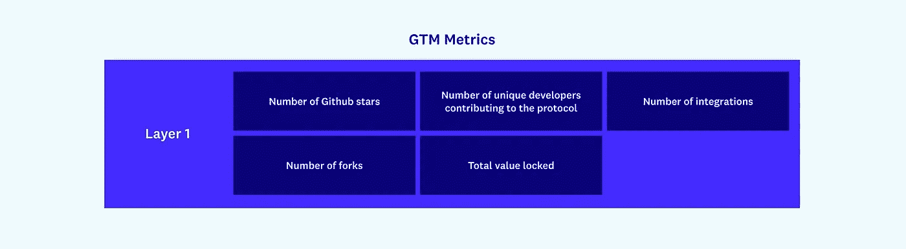
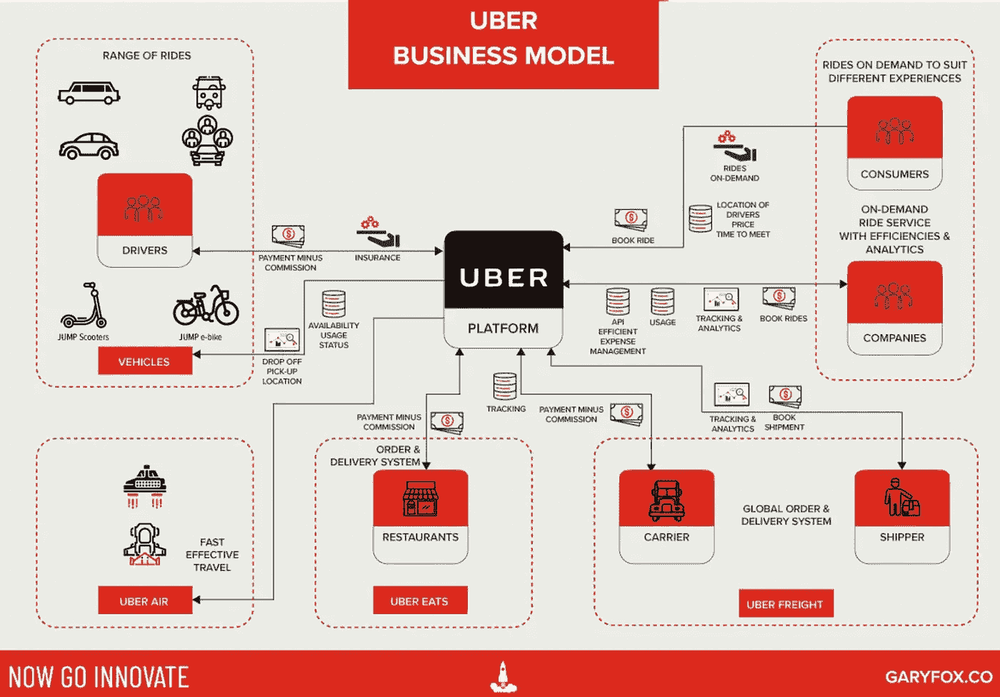
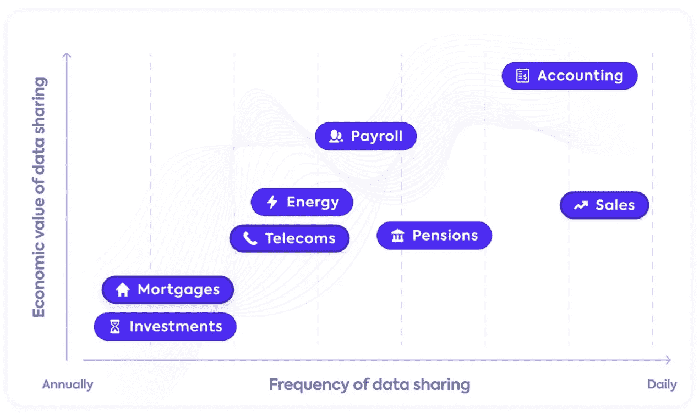

# NEAR Protocol 筹集了 3.5 亿美元的新资金；优步在‘超级 app’推送中给汽车增加了飞机和火车；嵌入式金融和加密；

> 原文：<https://medium.com/coinmonks/near-protocol-raises-350-million-in-new-funding-uber-adds-planes-and-trains-to-cars-in-super-d0e8eb81f80a?source=collection_archive---------43----------------------->

# 在这个版本中:

1.  个人观点:嵌入式金融生态系统内的加密和非金融服务？
2.  NEAR Protocol 筹集了 3.5 亿美元的新资金
3.  超级应用的竞赛:沃尔玛
4.  “用比特币支付”和 Cash 应用程序的其他加密功能
5.  嵌入式金融和加密是相互促进的因素
6.  克里斯·狄克逊:加密网络及其重要性
7.  第 1 层区块链和其他协议的上市动议
8.  优步在“超级应用”中增加了飞机和火车
9.  根据与中小企业的相关性对开放金融数据源进行排名

# 个人观点:嵌入式金融生态系统内的加密和非金融服务？

1.优步正在推进超级应用计划，将旅游服务加入其生态系统。

2.抵押贷款、投资、储蓄、养老金、电信和能源方面还有哪些数据会让消费者受益？

正如我们从本文所附的视频中看到的，嵌入式金融目前主要围绕银行服务构建，但是，金融服务生态系统正在开放。

在此过程中，crypto 等新服务正在兴起，非金融服务提供商正专注于 API，以使金融公司和其他类型的公司能够将非金融服务整合到其价值链中，例如优步通过旅游聚合器提供旅游服务。

让我们假设下一步优步会让它的客户用加密支付，并让司机接受加密支付。或者电子商务网站 start 希望让客户能够以加密方式支付，或者人们希望直接在他们的银行或支付应用程序中管理他们的加密资产。

这些服务在这张图表中处于什么位置？金融科技和非金融机构如何快速实现这些服务？

嵌入式金融 2.0 应该是实现这些功能的技术。

这怎么可能发生？

1.EF 2.0 公司可以通过 BaaS 提供商提供银行服务。

2.投资于 crypto rails，支持简单的服务，如 crypto to fiat exchange，反之亦然。

3.创建 rails，使 fintech 能够将加密钱包添加到他们的应用程序中。

4.使电子商务服务提供商能够接受加密支付，并在需要时使用第二步将其交换给菲亚特。

5.使企业能够将加密交易添加到他们的生态系统中。

6.使企业能够将非金融服务添加到他们的生态系统中，并接受以菲亚特或加密等方式支付。

这些是嵌入式金融 2.0 可以实现的一些服务，但是，还有更多的服务可以添加到列表中。

这些服务将使客户能够全面了解他们的金融和非金融生活方式，而企业则以个性化服务为核心。

# NEAR Protocol 筹集了 3.5 亿美元的新资金

由于它试图与以太坊竞争去中心化应用的区块链，NEAR Protocol 今天宣布，它已经在由老虎全球管理公司牵头的新一轮融资中筹集了 3.5 亿美元。[共和资本](https://www.linkedin.com/company/republic-capital/)、 [FTX](https://www.linkedin.com/company/ftx/) 风投、哈希德、蜻蜓资本、帕拉菲资本、Blockchange 风投、 [MetaWeb.vc](http://metaweb.vc/) 也参与其中。

NEAR 表示，最新一轮融资将加速 NEAR 生态系统的分散化。NEAR 之前的融资包括 2020 年 5 月的 2160 万美元和 2022 年 1 月的 1.5 亿美元。

NEAR Protocol 成立于 2018 年，是一个使用智能合约(smart contracts)构建去中心化应用程序的平台，智能合约是一旦满足特定标准就会执行的自动化程序。

该项目致力于通过提供一系列开发工具来帮助开发人员启动他们的项目。它还旨在成为一个用户友好和可扩展的利害关系证明(PoS)区块链；NEAR 于 2020 年 10 月推出了 mainnet。

根据 CoinMarketCap 的数据，按市值计算，这是第 19 大加密货币，价值 108 亿美元，接近 Protocol 的同名硬币，可用于支付交易费用和网络赌注。

NEAR 表示，自 2021 年底以来，其生态系统的风险资本投资大幅增加。

这包括对 Aurora、基于 NEAR 协议的以太坊虚拟机(EVM)和各种 DeFi 应用程序的投资。今年 2 月，Ref Finance 还宣布，它已经筹集了 480 万美元，用于在 Near Protocol 生态系统中为 DeFi 服务建立一个“一站式商店”。

[来源。](https://decrypt.co/97018/ethereum-rival-near-protocol-raises-350-million-new-funding)

# 超级应用的竞赛:沃尔玛

零售巨头[沃尔玛](https://www.linkedin.com/company/walmart/)通过 2021 年初宣布的一系列举措，表明了其推出金融超级应用的意图。

–今年 1 月，沃尔玛宣布与金融科技投资公司 Ribbit Capital 合作创建一家金融科技初创公司，旨在通过将沃尔玛的零售知识和规模与 Ribbit 的金融科技专业知识相结合，为沃尔玛的客户和员工提供金融服务

–今年 2 月，沃尔玛聘请了两位高盛高管，他们帮助其金融科技部门——高盛的——马库斯发展到超过 970 亿美元的存款:高盛消费者业务前负责人奥马尔·伊斯梅尔和 T4 苹果信用卡前负责人大卫·斯塔克

鉴于沃尔玛产品和服务的多样性，以及其庞大而忠诚的客户群，很明显该公司正在寻求发展成为一个完整的数字生态系统，因为它已经在各种不同的接触点上与消费者互动，这可能使它成为现有客户的焦点

–除了实体零售业务之外，沃尔玛还提供广泛的产品和服务，包括:电子商务、通过 Walmart Connect 的内部广告、通过 Walmart Fulfillment Services 向在线市场卖家提供的供应链和履行功能，以及通过 Walmart Health 提供的便捷医疗服务

–沃尔玛还提供金融服务，如汇票、预付卡、汇款(电汇)、分期付款、支票兑现和账单支付

在成为领先的消费者数字生态系统的竞争中，沃尔玛面临着金融科技公司、科技巨头和金融机构的激烈竞争，但该公司已经明确展示了其打造超级应用的承诺

2022 年 1 月，沃尔玛与 Ribbit Capital 合作的金融科技项目标志着其秘密模式时期的结束，该项目曾被认为是 Hazel 的两项收购

–该公司宣布收购网上银行和透支保护提供商 [Finance One](https://www.linkedin.com/company/financeoneau/) ，并获得工资访问平台 Even Responsible Finance

–合并后，沃尔玛支持的创业公司将使用同一个品牌

沃尔玛的金融科技高管称，新公司 ONE 将成为一系列数字金融服务的中心接入点，这些服务对各个社会经济领域的客户都有吸引力

–它与沃尔玛的合作提供了巨大的客户获取优势，因为这家零售商拥有 160 万名员工和 1 亿名每周购物者

[来源。](https://www.ftpartners.com/fintech-research/race-to-super-app)

# “用比特币支付”和 Cash 应用程序的其他加密功能

[Block](https://www.linkedin.com/company/joinblock/) 通过 Cash App 的直接存款功能收到工资的用户现在可以用比特币收到所有或部分工资。

这家原名为[广场](https://www.linkedin.com/company/joinsquare/)的公司周四在迈阿密举行的比特币 2022 大会上宣布了新的“比特币支付”功能。

“用比特币支付”选项只是 Block 宣布的三项新功能之一，该公司最近在去年加快的一项雄心勃勃的加密议程上加倍努力。

其他新功能之一是为那些使用 Cash App 借记卡的人提供“四舍五入”比特币选项。这意味着，购买 2.80 美元[星巴克](https://www.linkedin.com/company/starbucks/)商品的用户可以选择将额外的 20 美分加入他们的比特币账户。(多年来，综合应用在金融科技领域一直很受欢迎；2017 年， [CoinDesk](https://www.linkedin.com/company/coindesk/) 收购了一款名为 Lawnmower 的比特币围捕应用。)

Block 宣布的最后一个功能与闪电网络(Lightning Network)有关，闪电网络是一条促进快速和低成本比特币支付的铁路。

虽然 Block 在 2 月份集成了闪电到现金应用程序，但用户目前只能通过网络发送比特币，而不能接收比特币——Block 表示，这种情况将在“不久的将来”改变。

布洛克补充说，接受闪电支付将只对美国客户开放，除了那些住在纽约的人——大概是因为该州繁重的加密许可制度。

所有这一切都发生在 Block，这个以支付加密狗和收银机等硬件而闻名的公司，正把自己的未来押在成为一个加密优先的企业上。

据报道，该公司的 Cash 应用程序是 Venmo 和 Zelle 的竞争对手，每月活跃用户约为 3600 万，是向 Block 用户介绍 crypto 的重要手段。

Block 本周的新功能也使其与比特币基地和罗宾汉等服务展开了更直接的竞争，这些服务同样提供传统和加密支付服务。

[来源。](https://decrypt.co/97161/cash-app-now-paid-bitcoin-feature-lightning-receive)

# 嵌入式金融和加密是相互促进的因素

[Strike](https://www.linkedin.com/company/joinstrike/) ，一个建立在比特币闪电网络上的数字支付平台，今天宣布与电子商务公司 [Shopify](https://www.linkedin.com/company/shopify/) 整合。

Strike 首席执行官杰克·马勒斯(Jack Mallers)在迈阿密举行的比特币 2022 大会上宣布，现在符合条件的美国 Shopify 商家将能够以美元形式接收全球客户的比特币支付。

Mallers 还指出，总部位于芝加哥的 Strike 与区块链 50 lister [NCR Corporation](https://www.linkedin.com/company/ncr-corporation/) ，世界上最大的销售点(POS)供应商和支付公司 Blackhawk 合作。

通过利用闪电网络，这种集成为传统的卡网络提供了一种替代方案，如 [Visa](https://www.linkedin.com/company/visa/) 和 [Mastercard](https://www.linkedin.com/company/mastercard/) ，闪电网络是建立在比特币区块链之上的第二层，允许用户通过将交易移出主区块链来快速、廉价地发送或接收加密货币。

Mallers 说，世界上任何拥有 Lightning 网络钱包的消费者都可以使用这项服务，包括超过 7000 万 Cashapp 用户。

该公告强调了闪电网络的日益普及。当天早些时候， [Robinhood](https://www.linkedin.com/company/robinhood/) 公布了将该解决方案集成到其技术堆栈中的计划，加入了加密货币交易所[北海巨妖数字资产交易所](https://www.linkedin.com/company/krakenfx/)、 [Twitter](https://www.linkedin.com/company/twitter/) 和 [Block](https://www.linkedin.com/company/joinblock/) 等公司。

周二，总部位于加州的闪电网络开发商[闪电实验室](https://www.linkedin.com/company/lightning-labs-inc/)推出了一项新协议，该协议希望将闪电网络开放给比特币以外的资产，包括稳定硬币和法定货币。

[来源。](https://bit.ly/3DZzXBQ)

# 克里斯·狄克逊:加密网络及其重要性

Andreessen Horowitz (a16z)普通合伙人 Chris Dixon 讨论了“加密网络及其重要性”，概述了加密空间、其技术的变革意义以及加密网络引领新一轮创新的潜力。

# 第 1 层区块链和其他协议的上市动议

在 web3 中，第 1 层是指底层区块链。Avalanche、Celo、Ethereum 和 Solana 都是第 1 层区块链的例子。这些区块链都是开源的，因此任何人都可以在它们的基础上构建、复制或修改它们，并与它们集成。这些区块链的增长来自于在其基础上构建更多的应用程序。

第 2 层是指在现有第 1 层之上运行的任何技术，用于帮助解决第 1 层网络的可扩展性挑战。第 2 层解决方案的一种类型是汇总。第 2 层汇总就是这样做的——它们在链外“汇总”事务，然后通过网桥将数据发送回第 1 层网络。

第 2 层汇总有两个主要类别。第一个是乐观汇总，“乐观地”假设交易是诚实的，并且通过欺诈证明没有欺诈。第二，zk 汇总，使用“零知识”证明来确定相同。这些第 2 层解决方案中的大多数目前正在为以太坊开发，还没有自己的令牌，但我们将在这里讨论它们，因为它们的上市成功指标与该类别中的其他网络相似。

此外，协议可以建立在其他 L1 或 L2 之上，例如，Uniswap 协议支持以太坊(L1)、乐观(L2)和多边形(L2)。

第 1 层区块链、第 2 层扩展解决方案和这些其他协议的发展可以来自分叉，这是网络被复制然后被改变的时候。比如以太坊，一层区块链，被 [Celo](https://www.linkedin.com/company/celoorg/) 分叉。

乐观，一个第二层的扩展解决方案，被 Nahmii 和 [Metis](https://www.linkedin.com/company/metislab-io/) 分叉。而 [Uniswap](https://www.linkedin.com/company/onebitearn/) 被分叉为创建 SushiSwap。虽然这最初看起来可能是负面的，但一个网络拥有的分叉数量实际上可以成为衡量成功的标准——它表明其他人想要复制它。

这些例子和心态都集中在右上象限，带有令牌的去中心化网络——广义地说，是 web3 当前最先进的例子。然而，根据组织的类型，仍然有相当数量的 web2 GTM 策略和新兴的 web3 模型的混合。构建者在开始制定他们的走向市场策略时，应该了解这些方法的范围，所以现在让我们来看一个混合模型，它融合了 web2 GTM 和 web3 GTM 策略。

[来源。](https://future.a16z.com/go-to-market-in-web3/)

# 优步在“超级应用”中增加了飞机和火车

优步计划今年在其英国应用程序中增加长途旅行预订，包括城际列车、长途汽车和航班。该公司首席执行官达拉·科斯罗萨西(Dara Khosrowshahi)重启了他几年前首次概述的“超级应用程序”战略。

该计划旨在将优步的乘车预订应用程序扩展为一站式旅游商店，最终可能包括酒店。优步英国、北欧和东欧地区总经理杰米·海伍德表示，此举旨在提供“无缝门到门体验”。

英国是优步在北美之外最大的市场之一，在大范围推广之前，它将首先试点这项服务。

该公司希望增加交通方式将推动核心的打车业务，客户可以使用其司机网络在交通枢纽之间移动，并在客户预订火车或公共汽车票价时带来佣金。在冠状病毒袭击之前，大约 15%的优步旅行是在机场进行的，因此该公司希望整合机票预订和票务将推动这些利润更高的旅行。

Khosrowshahi 在 2018 年被任命为首席执行官一年后，开始谈论优步成为更广泛的移动选择的平台——被硅谷的一些人称为超级应用。然而，当疫情停止旅游和运输业时，优步重新专注于扩大其食品配送业务。

优步正计划与现有的旅游预订服务合作，但尚未透露计划与哪些集团合作，这表明它可能会成为 Trainline、Skyscanner 或 Khosrowshahi 的前雇主 Expedia 等聚合商的盟友。“我们不会直接销售门票，当我们上线时，我们将与现有的聚合器或 API 服务充分合作，”优步说。

火车和长途汽车预订服务将于今年夏天在英国上线，航班预订将于今年晚些时候推出。海伍德说，酒店预订明年可能会跟进。

[出处。](https://www.ft.com/content/230b2160-35e1-4acc-9628-6a0dfe19eab1)

# 根据与中小企业的相关性对开放金融数据源进行排名

开放金融是在公认的开放银行业务范围内增加了更多的金融数据来源。围绕开放金融对话的前沿关键数据集是抵押贷款、投资、储蓄、养老金、电信和能源数据。但显而易见的是，对这些数据集的开放访问将惠及消费者，而非中小企业。

抵押

对消费者来说，购房过程是出了名的痛苦，通常是个人一生中最大、最重要的一次购买。

开放抵押贷款数据不会让小企业受益，因为绝大多数小企业只会租用房屋，如果他们有房子的话。

投资

投资的消费者往往倾向于在多个地点投资。为了有效地管理财务，能够获得可用资金的单一视图是很有用的。

小企业很少有投资，他们倾向于将多余的现金重新投资到企业中，或者作为股息从企业中拿出来。

储蓄

从技术上来说，在开放银行而非开放金融的管辖下，消费者对储蓄数据的访问将是资金管理应用的关键组成部分。

企业很少拥有独立的企业账户，它们要么投资回企业，要么作为股息支付。

养老金

对于消费者来说，养老金缴款的可见性和理解以及这如何转化为未来的支出，对于晚年的财务健康至关重要。

对于企业而言，开放养老金数据可能有助于简化员工福利的工作流程，但这只是切实减轻中小企业管理负担所需的一小部分。

能源和电信

在消费者缺乏信用历史的地方，来自能源和电信提供商的数据是良好支付行为的有用证据，以证明信誉。

获取电信和能源数据对企业来说可能没什么用，比如自动对账和支付账单，但这只是整体管理负担的一小部分。

会计和销售

会计和销售数据尚未作为开放金融政策的一部分进行讨论，因为消费者并不使用这些平台。

将会计和销售数据纳入开放金融政策，企业将从中受益匪浅。例如，这将使他们能够实现簿记流程自动化，并获得更好的金融服务。

[来源。](https://www.codat.io/us/report/open-for-business/)

> 加入 Coinmonks [电报频道](https://t.me/coincodecap)和 [Youtube 频道](https://www.youtube.com/c/coinmonks/videos)了解加密交易和投资

# 另外，阅读

*   [XT.COM 评论](https://coincodecap.com/profittradingapp-for-binance) | [币安评论](https://coincodecap.com/xt-com-review)
*   [SmithBot 评论](https://coincodecap.com/smithbot-review) | [4 款最佳免费开源交易机器人](https://coincodecap.com/free-open-source-trading-bots)
*   [比特币基地僵尸程序](/coinmonks/coinbase-bots-ac6359e897f3) | [AscendEX 审查](/coinmonks/ascendex-review-53e829cf75fa) | [OKEx 交易僵尸程序](/coinmonks/okex-trading-bots-234920f61e60)
*   [如何在印度购买比特币？](/coinmonks/buy-bitcoin-in-india-feb50ddfef94) | [WazirX 评论](/coinmonks/wazirx-review-5c811b074f5b)
*   [CryptoHopper 替代品](/coinmonks/cryptohopper-alternatives-d67287b16d27) | [HitBTC 审查](/coinmonks/hitbtc-review-c5143c5d53c2)