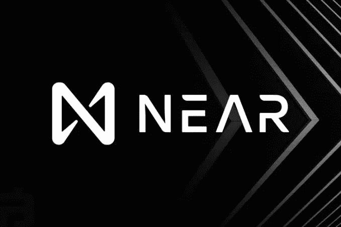
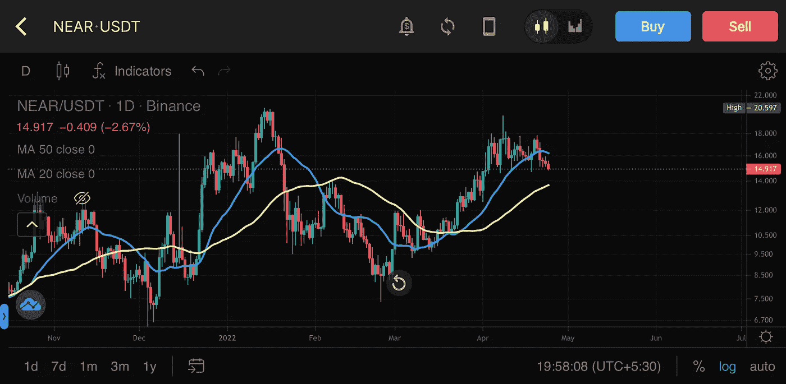
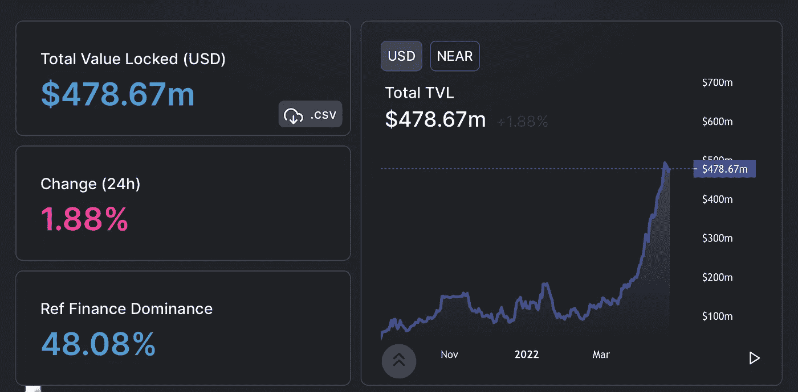
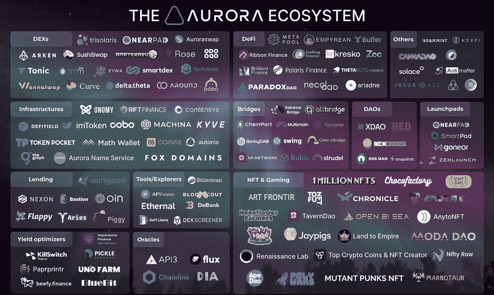

# 近似协议——协议中的网飞

> 原文：<https://medium.com/coinmonks/near-protocol-the-netflix-of-protocols-eebbc4123422?source=collection_archive---------10----------------------->

# CoinDCXpathbreaker

紧随$LUNA 之后，加密空间现在开始注意另一个第 1 层，接近协议。

所以问题来了，Near 能重新定义第一层的工作方式吗？它能成为下一个以太坊吗？还是能胜过 Terra？

让我们深潜…

NEAR/USDT on CoinDCX Pro app

在这篇文章中，我将以最好的方式涵盖以下主题:

*   **附近的 USP**
*   **协议建&住在**附近
*   **好人，坏人&丑人**

## NEAR 协议的独特卖点

另一个第 1 层再次围绕着以太坊的整个传奇，比以太网更便宜、更快、更可扩展和更实惠。这是一个在加密空间中被一次对多次讲述的故事，它正在循环播放…但是请等一下

**可扩展性是 NEAR 的一大优势**

近协议网络的可伸缩性是通过分片实现的，这种方式已经存在很长时间了。以太坊计划在 2023 年 ETH 合并后部署分片技术。

维基百科解释的分片是:*数据库分片，或者简称为分片，是数据库或搜索引擎中数据的水平分区。每个碎片都保存在一个单独的数据库服务器实例上，以分散负载。数据库中的一些数据仍然存在于所有碎片中，但是一些数据只出现在一个碎片中。*

以太坊的目标是通过部署分片来降低其网络的燃气费问题。

这还不是全部，Near 协议部署了一个叫做**动态分片的东西。这里的 Dynamic** 是指，它可以实时调整碎片的大小，从而保持网络的低费用。有了这样的能力，Near protocol 可以轻松处理 Visa 的每秒交易数(Tps)。当我们谈论加密在我们日常生活中的真实用途时，这实际上是巨大的。这是你的答案。

## 金钱万能

Near 协议有一些超级大的资金来源:

*   来自主要风险投资家的 5 . 33 亿美元资金。总共 36 个投资者，其中 6 个是主要投资者。
*   一笔高达 8 亿美元的资金承诺用于他们的生态系统发展

这种资金对任何项目来说都是巨大的，拥有这样的财务实力意味着可以很容易地吸引最好的开发者到他们的生态系统中来。

## 易于使用

在我做研究的时候，我喜欢 Near protocol 的一点是他们对易用性的关注。整个加密空间充满了一些非常有前途的协议和绝对疯狂的回报，但复杂的框架为外行人创造了巨大的进入壁垒。Near 协议试图解决这个问题。

他们有一个用户友好的钱包，可以基于名称，例如，Name . near——非常类似于以太坊名称服务(ENS)

## 生态系统的生态系统

看到如此大规模的发展，似乎没有给 crypto 留下任何空间。

*   **DeFi，GameFI & NFTs**
*   **以太坊虚拟机**
*   **副链展开**
*   **算法支持的稳定硬币$USN(即将推出)**
*   **伙伴关系和资金方面的巨大支持**

这些产品可能看起来像一个全能的项目，但它实际上吸引了大量的观众。任何一个 DeFi 协议的铁杆用户，以及对 Yield farming & flash loans 完全疯狂的用户，可能对 NFTs 不感兴趣……但是我们都知道 NFT 市场有多大，以及它如何继续增长。这种迎合各种用户的做法是一大胜利。协议的网飞。

NEAR 的整个生态系统仍在开发中，由于易于兼容 EVM，大多数 Dapps 都在 Aurora 上。Near 上的一些协议应该在您的观察列表中:

*   参考财务(参考)-2.0312 亿美元，TVL
*   **陋居**-1.5259 亿美元 TVL
*   **元池(Meta)**-1.3277 亿美元 TVL
*   **珍宝交易所(Jumbo)**——322 万美元 TVL
*   **欧因金融(OIN)**-220 万美元 TVL

## 看跌但看涨

目前的加密市场明显充满了悲观情绪，零售似乎已经从舞台上消失了，但接近协议的金融指标显示出看涨的迹象…

Source: DeFi Llama

近东的总 TVL 呈上升趋势，其金融市场的主导地位也在提高。

## 什么是极光网络？

因此，Aurora Networks 就像 Polygon ($Matic)对于以太坊一样。极光是一个以太坊第二层区块链建立在附近。

**极光的独特卖点:**

*   由于 EVM 的简单，ETH 项目可以很容易地转移到 Aurora
*   Aurora 利用 Near 在分片、可伸缩性、速度和低费用方面的优势
*   当前交易成本低于 0.02 美元
*   当前 TVL 11.5 亿美元

Aurora Ecosystem

## 结论

总的来说，我觉得近协议将是密码世界中一股不可忽视的力量。在其生态系统中有如此多的发展，很难忽视它。我对$USN 的推出感到特别兴奋，因为我真切地感觉到，在其生态系统中拥有算法稳定硬币的项目将是下一波加密浪潮的巨大驱动因素。我可能是错的，但这正是我的感受……我会在另一篇文章中阐述我的想法

…

用简单易行的步骤从 [CoinDCX](https://coindcx.com/) 开始您的交易之旅:

*   用您的姓名、电子邮件和手机号码注册
*   接受 CoinDCX 的服务条款
*   完成您的 KYC 验证并添加您的银行帐户详细信息
*   一旦批准，存款菲亚特通过您批准的银行帐户或转移加密从您的其他加密钱包，你就完成了。

# CoinDCXpathbreaker

> 加入 Coinmonks [电报频道](https://t.me/coincodecap)和 [Youtube 频道](https://www.youtube.com/c/coinmonks/videos)了解加密交易和投资

# 另外，阅读

*   [Bookmap 点评](https://coincodecap.com/bookmap-review-2021-best-trading-software) | [美国 5 大最佳加密交易所](https://coincodecap.com/crypto-exchange-usa)
*   最佳加密[硬件钱包](/coinmonks/hardware-wallets-dfa1211730c6) | [Bitbns 评论](/coinmonks/bitbns-review-38256a07e161)
*   [新加坡十大最佳加密交易所](https://coincodecap.com/crypto-exchange-in-singapore) | [购买 AXS](https://coincodecap.com/buy-axs-token)
*   [红狗赌场评论](https://coincodecap.com/red-dog-casino-review) | [Swyftx 评论](https://coincodecap.com/swyftx-review) | [CoinGate 评论](https://coincodecap.com/coingate-review)
*   [投资印度的最佳密码](https://coincodecap.com/best-crypto-to-invest-in-india-in-2021)|[WazirX P2P](https://coincodecap.com/wazirx-p2p)|[Hi Dollar Review](https://coincodecap.com/hi-dollar-review)