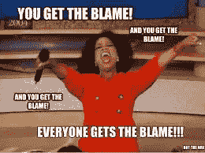

# 近 10 亿美元，7 年后，创始人被自己的创业公司解雇。

> 原文：<https://medium.com/coinmonks/nearly-a-billion-dollars-and-7-years-later-the-founder-was-fired-from-her-own-startup-29bab7365b2?source=collection_archive---------15----------------------->

创始人会被自己的创业公司解雇吗？

我当然知道理论上是可能的。

但是他们应该吗？

史蒂夫·乔布斯——在与首席执行官约翰·斯卡利的长期权力斗争后被苹果解雇。

杰克·多西——2008 年，Twitter 董事会因他有问题的管理风格解雇了他。

特拉维斯·卡兰尼克——在经历了数月的丑闻、性骚扰、性别歧视和管理不善后，2017 年被迫从优步辞职。

Justin Zhu——被 Iterable 解雇，因为他用迷幻药做实验。

但通常他们会“按摩”一下，让首席执行官友好地辞职下台。

这不仅能保护他们的形象，还能显示双方的专业性。

所以被你自己的公司，你从零开始建立的创业公司，相当有力地“解雇”，真的是一记耳光。

某个地方一定发生了不可挽回的错误，唯一的办法就是在毒素扩散或肿瘤进一步转移之前，尽可能快、尽可能突然地切除首席执行官。

安基蒂在兹林戈也是这样吗？

She did an interview shortly after getting fired from Zilingo. [https://youtu.be/bYJNgzq4rBM](https://youtu.be/bYJNgzq4rBM)

他们先是让她停职，然后泄露了这么多争议，现在他们正式解雇了她。

新加坡初创公司 Zilingo 的联合创始人安基蒂·博斯(Ankiti Bose)今天(5 月 20 日)被解雇，不再担任首席执行官一职

失宠？

也许吧，但我只是想知道所有这些是否表明了适当的尽职调查程序是多么重要。

如果我们互相指责，谁会承担大部分责任？

“在此之前，Zilingo 已经被评为新加坡备受瞩目的创业公司之一，2019 年以 9.7 亿美元的估值筹集了 2.26 亿美元。”

新加坡是一个很小的国家，所以每只独角兽都很重要。

尤其是“soonicorns”又名“即将成为独角兽”。

他们通常被媒体密切关注和大肆宣传。

无风不起浪，所以我敢肯定在 Zilingo 的幕后有一些争论、流言和不正当的交易在进行。

但是，对于这样一个受到行业密切关注的炒作的初创公司，你如何从 2019 年开始不提交财务报告？

风投和投资者甚至懒得问吗？

没有人停下来检查一下数学是否有意义吗？

这让我不禁想知道如今尽职调查流程包括哪些内容。

也可能是安基蒂隐藏了信息并暗中操作。

当整个 Fast / Domm Holland 惨败时，我真的想知道到底是谁的错。

Are we ALL at fault?

是投资者不理会并允许 Domm 不受惩罚地运作吗？

还是多姆扭曲的现实感和傲慢？

现在我们在新加坡有了自己的案例。

我们会为损失数百万的投资者感到难过吗？

我们会为安基蒂感到难过吗？她被指控做了她声称没有做的事情。

我们会同情那些全心全意投入公司、相信公司会改变世界的员工和股东吗？

独角兽对于创业界来说是神话般的，但它们就像兴登堡飞艇。

当它们内爆时，它们也会拖垮很大一部分生态系统，因为它们会撞击陆地并摧毁周围的一切。

生态系统中的每一个人都应该学会更加明辨是非。

-

对 Zilingo 来说结束了吗？

-

#初创公司#商业# startupx #成长#成功#社交媒体#文化#创业#战略# ankitibose # zilingo # soonicorn #独角兽#内爆#风险资本#投资者

> 加入 Coinmonks [电报频道](https://t.me/coincodecap)和 [Youtube 频道](https://www.youtube.com/c/coinmonks/videos)了解加密交易和投资

# 另外，阅读

*   [拥护卡审核](https://coincodecap.com/uphold-card-review) | [信任钱包 vs MetaMask](https://coincodecap.com/trust-wallet-vs-metamask)
*   [Exness 评测](https://coincodecap.com/exness-review)|[moon xbt Vs bit get Vs Bingbon](https://coincodecap.com/bingbon-vs-bitget-vs-moonxbt)
*   [如何开始通过加密贷款赚取被动收入](https://coincodecap.com/passive-income-crypto-lending)
*   [BigONE 交易所评论](/coinmonks/bigone-exchange-review-64705d85a1d4) | [电网交易机器人](https://coincodecap.com/grid-trading)
*   [氹欞侊贸易评论](https://coincodecap.com/anny-trade-review) | [CoinSpot 评论](https://coincodecap.com/coinspot-review)