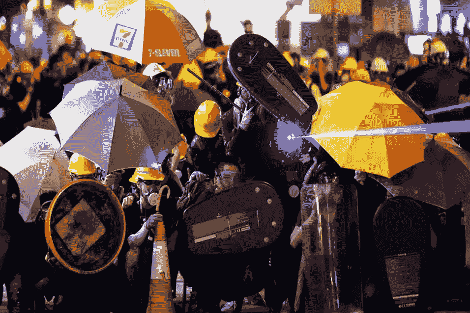

# 人工智能和互联网对民主的负面影响

> 原文：<https://medium.com/coinmonks/negative-effects-of-artificial-intelligence-and-internet-on-democracy-cac4af91f331?source=collection_archive---------15----------------------->

**简介**

自从 18 世纪末蒸汽机被发现以来，我们的生活发生了明显的变化。继蒸汽机、内燃机、电动机之后进入我们生活的互联网和人工智能，在最近一百年里，仿佛带着多米诺骨牌效应，把我们带入了完全不同的生活。今天，技术发生了如此大的变化，以至于我们正在努力保护多年来对我们至关重要的神圣、民主和法律免受我们亲手创造的这个怪物的侵害。在这篇文章中，我将讲述改变了过去半个世纪的互联网和随之而来的人工智能对民主的影响，以及为保护民主免受这些影响所做的研究。

**社交媒体和民主**

在 2016 年美国总统选举和英国退出欧盟进程期间，开展了一场不同寻常的竞选活动。社交媒体平台是我们生活的一部分，在我们不知情和未经允许的情况下，在这些活动中包含了我们在这些平台上的数据。尽管唐纳德·特朗普在调查问卷中落后，但他在选举中当选总统。在特朗普竞选期间，脸书和剑桥分析公司绘制了他的路线图。脸书与剑桥分析公司分享了居住在美国的用户的选举个人数据。剑桥分析公司利用人工智能对这些数据进行了分析和分类。然后，他们使用这种分类为每个州的选民准备了特朗普的竞选活动。过了一段时间，弃权票甚至支持反对候选人的票数都转而支持特朗普。我们可以说，利用个人的数据来准备竞选是今天或未来经历的问题中最无辜的。

pixabay

另一个问题是假新闻。政治舞台上的假新闻自古有之。许多国王失去了他们的王位，许多国王由于假消息而失去了他们的头。然而今天，由于人工智能和互联网，这种情况变得更加危险。多亏了人工智能，这个消息才能传播得更快。由于人工智能管理的机器人账户，它可以很快成为热门，并被带到墙上，以吸引相关投票者的注意。更危险的是利用人工智能制造的深度假货。今天，技术发展如此之快，以至于不属于人们的图像、录音和视频记录可以像是他们的一样被编辑，并在社交媒体上非常迅速地传播。为了影响选民的观点，虚假的色情图像、录音或政治家的照片可以突然与一条假新闻一起在社交媒体上走红，并改变选民的观点。人工智能的力量被用来制造和传播这种假新闻。纵观假新闻，在 2016 年美国总统大选中，数百万内容落在社交媒体上，人们被迅速操纵进入议程。根据 2018 年发表的基于计算机的宣传研究项目报告，截至 2018 年，这种操纵在 48 个国家的选举中进行。在 2016 年的选举中，俄罗斯通过社交媒体操纵了大量针对美国候选人的假新闻。录音或照片可以突然与一条假新闻一起成为社交媒体的议程，并改变选民的看法。人工智能的力量被用来制造和传播这种假新闻。纵观假新闻，在 2016 年美国总统大选中，数百万条内容落在社交媒体上，人们很快被操纵进入秩序。根据 2018 年发表的基于计算机的宣传研究项目报告，截至 2018 年，这种操纵在 48 个国家的选举中进行。在 2016 年的选举中，俄罗斯通过社交媒体操纵了大量针对美国候选人的假新闻。录音或照片可以突然与一条假新闻一起成为社交媒体的议程，并改变选民的看法。人工智能的力量被用来制造和传播这种假新闻。通过假新闻，2016 年美国总统选举的社交媒体上出现了数百万条内容，人们被迅速操纵进入议程。根据 2018 年发表的基于计算机的宣传研究项目报告，截至 2018 年，这种操纵在 48 个国家的选举中进行。在 2016 年的选举中，俄罗斯通过社交媒体操纵了大量针对美国候选人的假新闻。

另一个问题是，据称，由于人工智能的标记和跟踪活动，民主行动将减少，这将损害民主。

在香港的抗议活动中，示威者戴着口罩，使用雨伞和激光，因为这座城市的摄像头系统具有基于人工智能的人脸识别和标记。许多当局，特别是在中国，使用人工智能技术来跟踪、监控和标记他们的公民，这种方式损害了他们的隐私。在香港的抗议活动中，他们在街头用社交媒体和基于人工智能的软件和成像系统做到了这一点，这些带有激光、雨伞和面具的图像出现了。社交媒体是一个伟大的平台，让人们发出自己的声音，并组织起来争取民主和自由。阿拉伯之春是最好的例子，群众首先聚集在社交媒体上争取民主和自由，他们推翻了许多独裁者。

**黑票**

另一个通过技术威胁民主的问题是对电子投票系统或保存选票的数据存储系统的黑客攻击。伴随着“互联网”这个词，“黑客”这个词进入了我们的生活。如果简单定义一下，可以说是数字环境下的盗窃和间谍活动。选举中最大的危险之一是窃取选票。今天，我们可以将这种恐惧转化为黑票。美国在 2016 年举行的选举中经历了这种恐惧。一天晚上，在俄罗斯支持的网络攻击后，窃取选票的威胁出现了。今天，针对选票的网络攻击已经达到了更危险的程度，因为网络攻击现在可以以更危险的方式执行基于人工智能的算法。

pixabay

**针对互联网和人工智能保护民主的方法**

美国和欧洲联盟仍在继续这方面的研究。在欧盟委员会发布的白皮书和柴的《人工智能监管研究》中，为个人的人工智能备案和跟踪活动划了一条红线，并指出应监督当局和开发者，以免开展这些活动。此外，在其他研究中，有人指出，应培训开发人员和用户，并以严格的法规监督开发人员。同样，在其他研究和报告中，也指出应通过建立针对网络攻击的预防单位来防止这些攻击。再次，在美国进行的研究中，对这些社交媒体平台做出规定，通过使用人工智能来控制和阻止这些内容，对抗深度假货和不真实的新闻。此外，脸书、推特和谷歌正在努力通过过滤假新闻和机器人账户来防止这种情况，这要归功于他们的人工智能算法。同样，GDPR(一般数据保护法规)中有保护社交媒体平台上的个人数据的规定，最后，我们正在努力防止这些情况，努力使在我国、欧洲和其他国家发布的社交媒体平台可控。

**结论**

互联网和人工智能是革命性的发现，将开启和关闭这个时代。虽然我们试图通过谈论这些发现的危害来远离这些发现，但最终这些发现会把我们拉进来。在这个过程中，我们不能断绝与他们的联系，设置障碍，但也可以防止他们伤害我们，伤害我们的价值观。如果我们不作为整个世界为此而努力并做出安排，有一天我们将失去创造我们的圣者，我们将被拖入混乱…

[*你可以访问链接阅读土耳其语的文章……*](https://www.ikonionhukukvekariyerdernegi.com/post/yapay-zeka-internet-demokrasi)

**参考文献**

1.  [对人工智能系统的调控，CAHAI 阿夫鲁帕·孔塞伊，2020 年](https://www.coe.int/en/web/human-rights-rule-of-law/-/towards-regulation-of-ai-systems-new-cahai-publication)
2.  [欧洲委员会 2020 年人工智能白皮书](https://ec.europa.eu/info/sites/info/files/commission-white-paper-artificial-intelligence-feb2020_en.pdf)
3.  [Karl Manheim ve Lyric Kaplan，《人工智能:隐私和民主的风险》，耶鲁大学法律和技术期刊，2019 年](https://papers.ssrn.com/sol3/papers.cfm?abstract_id=3273016)
4.  [保罗·涅米茨，《人工智能时代的宪政民主与技术》，英国皇家学会出版网络平台，2018 年](https://royalsocietypublishing.org/doi/full/10.1098/rsta.2018.0089)
5.  [Fabrizio Gilardi，数字民主(数字技术如何改变民主及其研究)，2016 年](https://www.fabriziogilardi.org/resources/papers/Digital-Democracy.pdf)
6.  [Andreas Kaplan，人工智能、社交媒体和假新闻:这是民主的终结吗，媒体和社会的数字化转型(i̇stanbul 大学学报)，2020 年](https://cdn.istanbul.edu.tr/file/JTA6CLJ8T5/DF3BF2DBD76E4F7DB8A7143D0EA6F212)

> *加入 Coinmonks* [*电报频道*](https://t.me/coincodecap) *和* [*Youtube 频道*](https://www.youtube.com/c/coinmonks/videos) *了解加密交易和投资*

# 另外，阅读

*   [在美国如何使用 BitMEX？](https://coincodecap.com/use-bitmex-in-usa) | [BitMEX 评论](https://coincodecap.com/bitmex-review)
*   [最佳期货交易信号](https://coincodecap.com/futures-trading-signals) | [流动性交易所评论](https://coincodecap.com/liquid-exchange-review)
*   [南非的加密交易所](https://coincodecap.com/crypto-exchanges-in-south-africa) | [BitMEX 加密信号](https://coincodecap.com/bitmex-crypto-signals)
*   [MoonXBT 副本交易](https://coincodecap.com/moonxbt-copy-trading) | [阿联酋的加密钱包](https://coincodecap.com/crypto-wallets-in-uae)
*   [雷米塔诺评论](https://coincodecap.com/remitano-review)|[1 inch 协议指南](https://coincodecap.com/1inch) | [购买 Floki](https://coincodecap.com/buy-floki-inu-token)
*   [MoonXBT vs Bybit vs 币安](https://coincodecap.com/bybit-binance-moonxbt) | [Arbitrum:第二层解决方案](https://coincodecap.com/arbitrum)
*   [买 PancakeSwap(蛋糕)](https://coincodecap.com/buy-pancakeswap)|[matrix export Review](https://coincodecap.com/matrixport-review)
*   [最佳免费加密信号](https://coincodecap.com/free-crypto-signals) | [YoBit 评论](/coinmonks/yobit-review-175464162c62) | [Bitbns 评论](/coinmonks/bitbns-review-38256a07e161)
*   [OKEx 评论](/coinmonks/okex-review-6b369304110f) | [Kucoin 交易机器人](/coinmonks/kucoin-trading-bot-automate-your-trades-8cf0ca2138e0) | [期货交易机器人](/coinmonks/futures-trading-bots-5a282ccee3f5)