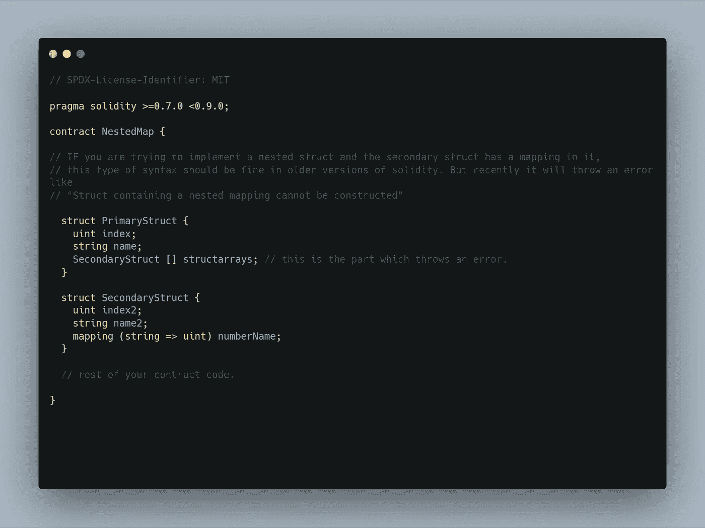

# 实度中的嵌套映射错误

> 原文：<https://medium.com/coinmonks/nested-mapping-error-in-solidity-39edf29eb9af?source=collection_archive---------14----------------------->

我最近一直在学习 Solidity，感觉很棒。有很多东西需要探索，今天我想强调学习者在开发智能合同时面临的一个常见错误。

Solidity

这种错误通常出现在开发人员使用合同中的`struct` (s)和`mapping`时。看看这里嵌入的 Github gist，我在这里展示了我正在谈论的错误。

如果您无法在此处查看嵌入的 gist，请转到此链接->[https://gist . github . com/aditya 172926/EC 8597 cc 4c cfdb 933 b 84 aacf 61217623](https://gist.github.com/aditya172926/ec8597cc4ccfdb933b84aacf61217623)

这是一个在编译你的契约时出现的错误，当你在二级结构中使用一个`mapping`来嵌套`struct`时。这里的错误是`Struct containing a (nested) mapping cannot be constructed`。

**为什么会出现这种情况？🤷‍♂️**

我的意思是嵌套数据结构看起来很直观，对吗？这与我们使用数据时数据将存储在合同中的什么位置有关。您可以使用多种方式在合同上存储数据，如`memory`和`storage`。当您在合同中使用这些关键字和变量时，在保存数据方面有所不同。

什么是`memory`和`storage`？这是另一个博客的内容。😜

但是如果您已经知道它们是什么，那么请知道`mapping`需要`storage`类型来保存数据，即使在契约已经执行之后。而`struct`使用`memory`来完成这项工作。如果我们不小心使用它们，并且不了解它们的范围，我们最终会犯这样的错误。是的，你可以用`memory`声明一个映射，但是每次你启动契约的时候，它都是空的，这不是映射应该做的事情。但是，最终取决于您的使用案例。

所以，我希望你能理解，如果我们试图实现嵌套结构和映射，为什么会出现这样的错误。

感谢您读到这里！🤘

我会在 Solidity、Ethereum 和 web3 开发上发布更多这样的例子，并在我的社交网站上分享。✌