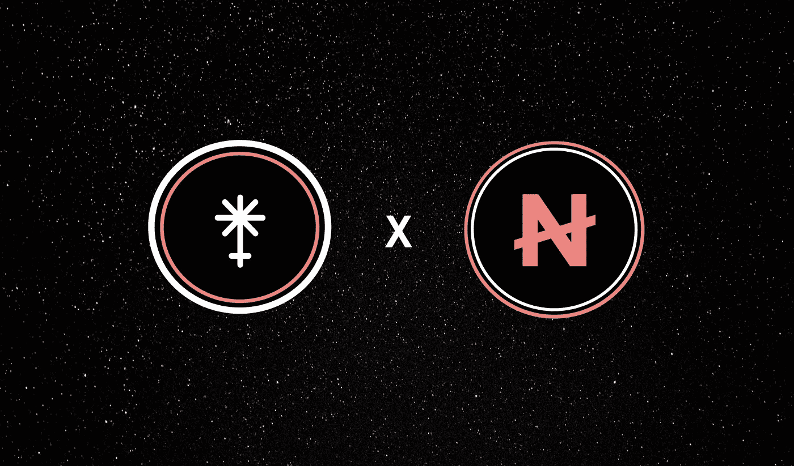
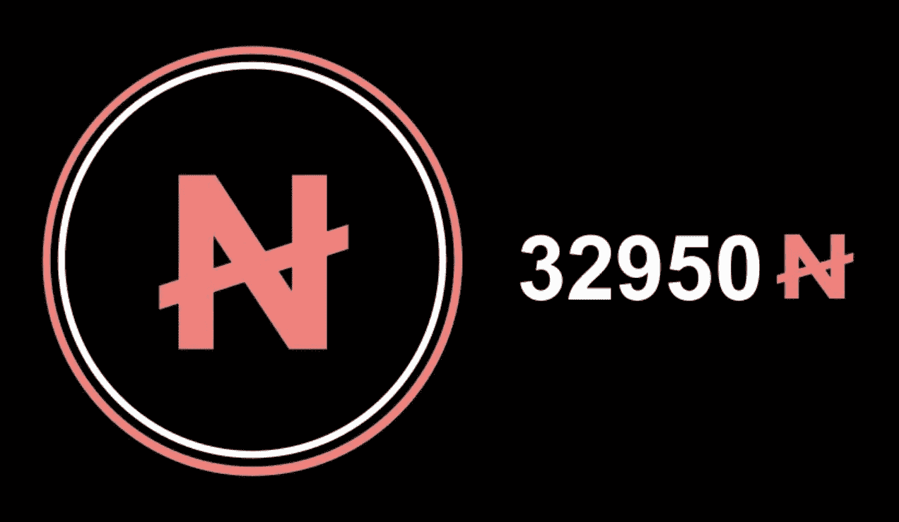
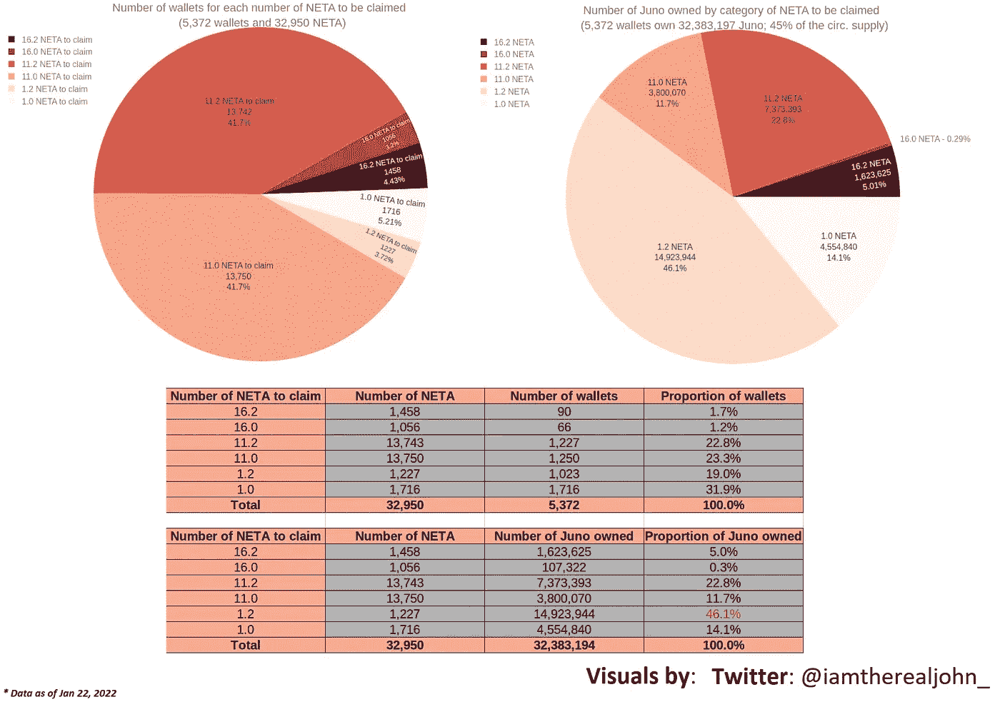
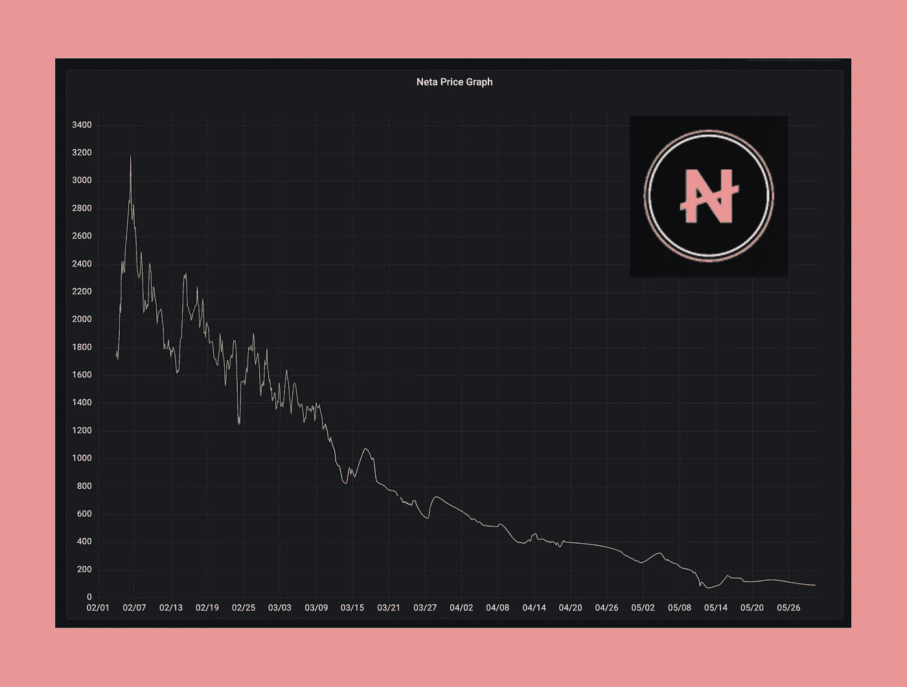
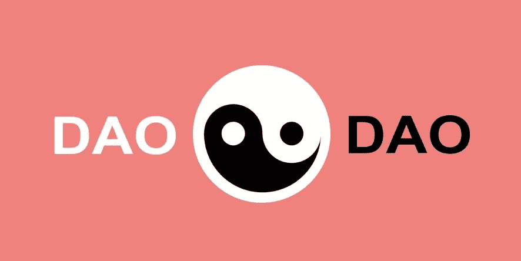
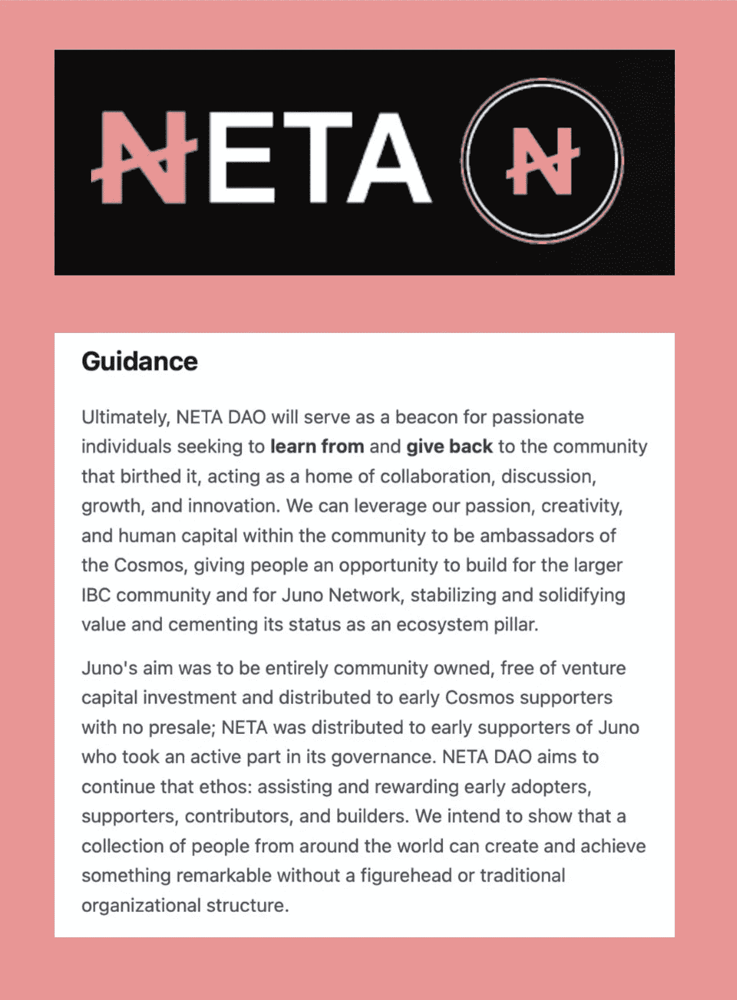
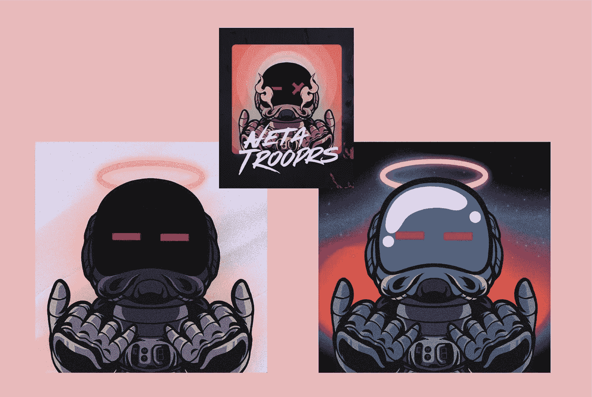
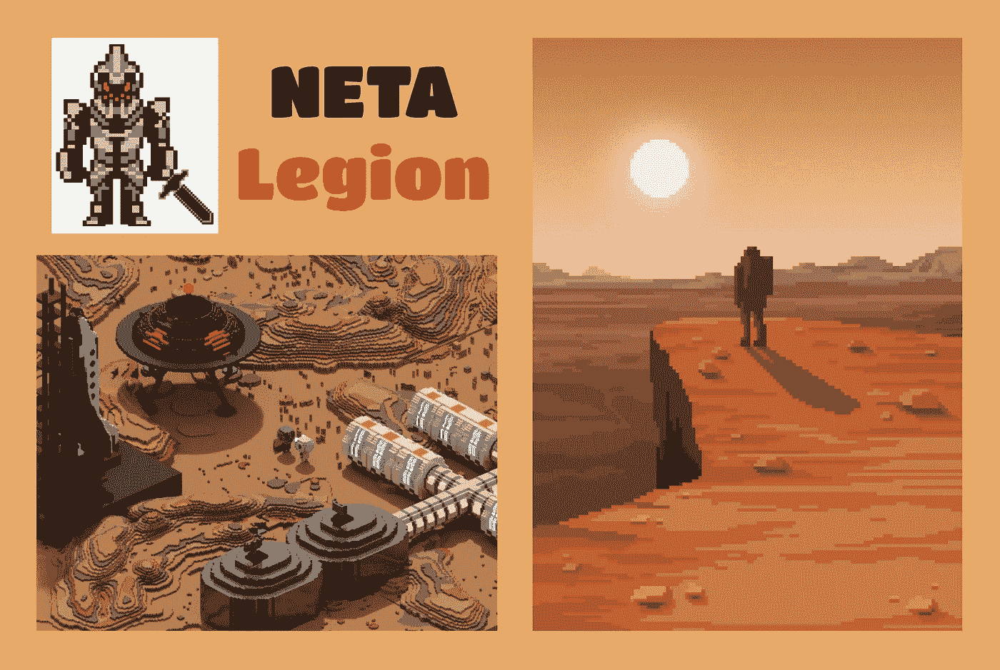
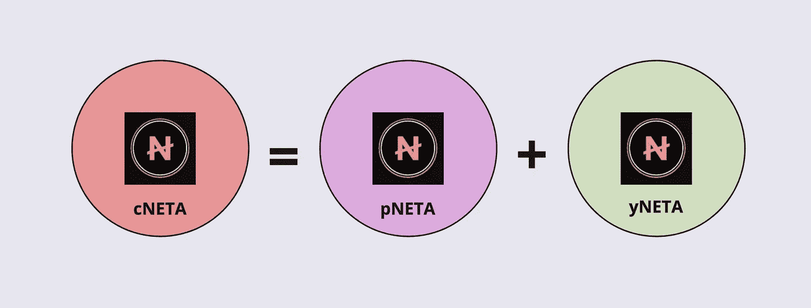
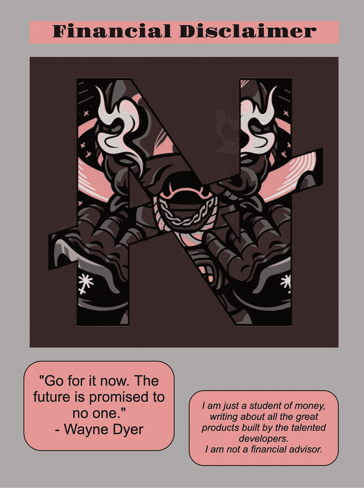

# NETA Money

> 原文：<https://medium.com/coinmonks/neta-money-a682bad2d56d?source=collection_archive---------42----------------------->

# 链间的钱

NETA 被设计为一个金钱商店，并在 2 月份分发给忠实的 Juno Network 贡献者，所有 NETA 都归社区所有。它被分发给 JUNO 利益相关者，参与治理提案投票的利益相关者将获得巨额奖金，JUNO 验证者集前二十名之外的利益相关者将获得小额奖金。

总而言之，只创造了 32950 个 NETA，31886.4 个被认领，1063.6 个无人认领的 NETA 被烧毁。

您可以在 JunoSwap AMM 上将您的 NETA 与 JUNO 配对，并获得原始代币奖励。您也可以将 NETA 与 OSMO 在渗透 AMM 上配对，并获得 OSMO 代币奖励。这两个农场的年百分比(APR)利润丰厚，分别为 75%和 57%。NETA 的赌注还没有开始。

由于两家自动做市商都有活跃的流动性池，如果你现在想拥有一些，你可以换成 NETA。基于早期炒作和兴奋的典型市场力量，随后的动荡起伏，大规模的流动性背离，以及现在整体负面的宏观市场情绪，NETA 跟随这些趋势，其交易价格持续下跌(见下图中的价格图表)。

# 内塔岛

Neta 分散式自治组织已经成立，并且已经进行了多次富有成效的讨论，以制定其章程并为其未来发展出思路。DAO 的前端 dApp 必须完成开发，启动后，机构群体成员可以参与保护 NETA 作为价值储存手段的未来，最初是将 NETA 置于 DAO，随后参与监管提案以塑造 NETA DAO 及其金库的未来。

NETA DAO 的任务包括:

*   促进社区加速器，为成员创造和分配价值
*   促进社区生成者，这是鼓励参与"一体行动"的方式
*   为社区培育者提供便利，为社区创造工具，并为社区培养参与度、参与度和忠诚度
*   保护 Neta 的使用案例作为价值存储。

DAO 已经发布了指导性声明(见下图)。

# 对社区的好处

最初，当 DAO 前端发布时，保护 NETA 的用例作为价值存储预计将从 NETA 的标记开始。根据英联邦社区的对话，NETA 的赌注者似乎会获得奖励。

广泛的讨论最初围绕着一个新的令牌——JUP——展开，它将被用作奖励、花费和公用设施令牌，用于社区在未来开发的各种努力。我已经链接了 NETA DAO 的 Commonwealth 页面，其中包含讨论、提议的项目、用例以及这个新令牌可能的令牌组学。

> 加入 Coinmonks [电报频道](https://t.me/coincodecap)和 [Youtube 频道](https://www.youtube.com/c/coinmonks/videos)了解加密交易和投资

在每周的讨论之后，我不清楚是否会实际采用 JUP 代币。联邦提案包括一个令人印象深刻的令牌组学部分，如果实施，我相信这个令牌可以成为事务处理的一个重要的实用驱动程序，保留 NETA 作为治理令牌和资金存储。它本身还将开辟更多的用例，因为 JUP 可以支持在 NETA DAO 的保护伞下启动的项目的交易支出。

然而，从讨论中可以清楚地看出，NETA DAO 社区对开发 NETA 的价值积累充满热情、积极参与和兴奋。会员的利益可能包括获得 NFT 造币活动的 dApps、空投、NFT 和白名单。让我们来看看什么可能是其中的第一个:NETA 部队。

# 首届 NFT 收藏展

NETA 部队 NFT 收集预计将很快在通道市场推出。与通道团队的沟通表明，在经历了几次不可预见的延迟后，NETA 部队的铸造活动是当务之急。不包括费用，6 ATOM 的铸造价格仍然值得期待。为了在通道市场上打造 NFT，ATOM 代币必须存放在朱诺区块链号上。这就像从 JunoSwap 存放它们一样简单，将它们从 Cosmos Hub 移动到 Juno 网络的所有 IBC 事务都将在后台自动处理。或者，您可以从 JunoSwap 上的另一个令牌切换到 ATOM。铸造交易费用将在朱诺；因此，你的 Keplr 钱包里当然也需要一些 JUNO。

这是 NETA Trooprs 系列的另一个样本(见下图和文章顶部的图片)。

Passage3D 是一家为其技术用户提供身临其境的三维体验的公司。当前的用例包括虚拟世界、视频会议、视频演示、流媒体活动，甚至电子商务。朱诺网络上的通道市场已经进行了第一次活动，铸造了奇怪的氏族 NFT 的集合，目前以 49 原子的底价交易。有关更多信息，请参见下面源代码部分中的链接。

# 工作组和拟议项目

除了推出 NETA DAO 前端，开始 NETA 的赌注，并铸造 NETA 部队 NFT 收集，DAO 有大量的倡议，它正在启动。

机构群体提议分成以下工作组:

*   NFT 和 NFT 的合作——与艺术家合作，将独家 NFT 系列带到 NETA 社区
*   品牌和营销——向世界介绍 NETA 品牌
*   探索和冒险——探索投资机会和参与的真实世界用例
*   DAO 验证器—启动 DAO 的验证器
*   道的章程——制定章程和框架，以实现道的使命陈述。

除了上述项目之外，社区还提出了几个令人兴奋的项目。其中一名成员霍德勒(HODLer)提出了一个 NFT 游戏应用的提案，该应用围绕一个角色扮演游戏世界设计，带有金融元素，为 NETA 增加价值。我在下面的资源部分提供了这个超级有趣和有创意的提议的链接。提案中的细节非常多，提案中的想象力也非常丰富。提案中甚至有一些游戏的艺术效果图(见下图)。

也有人在讨论分红型 ETF，由 NETA 和其他 Cosmos tokens 组成一只具有收益率特征的基金。其他提案包括 DAO 成员提供提案验证和审查服务，以及开发赌场和彩票风格的游戏应用程序。

# 我的两个代币

几个月来，我一直在关注 NETA 的发展，我认为实现社区成员提出的想法的时候到了。关键是吸引所需的资源，将所有这些想法变成现实。不幸的是，所有这些伟大想法的未来发展和随后的实施将取决于 NETA DAO 建立国库基金的能力。看来第一阶段即将开始，我期待着在它的成功中扮演一个小角色。

提议的 NFT 项目显然是社区参与和兴奋的优秀驱动力。然而，我也喜欢社区提出的引入 DeFi 元素的想法。创建一个 ETF，提供 NETA 作为货币市场的抵押品，并能够以它为抵押借款，推出第二个令牌，以及将金融收入来源与游戏捆绑在一起，这些都是很好的想法。使用 JUP 代币作为公用代币来支付奖励、所提供担保品的利息和交易费，可能是保持 NETA 作为价值储存手段的一个重要因素。

我还看到其他项目利用了一些围绕这些 DeFi 领域的创新概念。区块链 Konstellation Network 上的 Nebula 协议(正在开发中)和 VegaX 都提供了基于索引的策略。通过数字资产的集群或篮子，这些投资策略跟踪受欢迎的行业或类别，包括例如蓝筹股、稳定股、DeFi 或以生态系统为中心的股票。Mars Protocol 将重新启动其货币市场，并利用渗透作用实现高产农业战略。Levana 和 Prism 等协议开发的衍生策略充满了希望，但尚未在 Juno 网络上部署。想象一下把 NETA 折射成它的主分量 pNETA，产生轴承分量 yNETA！

# 为了社区，被社区

当然，这些都只是我的想法，站在一个热心参与者的角度。石头已经铺好，地基也差不多完成了；因此，我认为 NETA DAO 完全可以从这里开始构建，并利用这些令人兴奋的技术。更重要的是，一旦前端已经启动，NETA 部队 NFT 的已经铸造，DAO 可以评估与这些其他团队的合作伙伴关系，以向 NETA 社区引入更多的 NFT，游戏和 DeFi 机会。

无论实际方向和后续项目如何，我都期待着未来几个月的发展，以及社区提出的许多想法的有效实施。

Tot ziens — Opa。

# 资料来源、参考文献和进一步阅读

网易财经—[https://neta.money/](https://neta.money/)

网大黑纸—【https://neta.money/NETA_Money.pdf 

Neta Money Twitter — @NetaMoney

Neta DAO Twitter — @NetaDao

英联邦 Neta 岛—【https://commonwealth.im/neta-money/ 

关于 Commonwealth 的社区加速器讨论—[https://Commonwealth . im/neta-money/discussion/4344-neta-Dao-the-community-Accelerator](https://commonwealth.im/neta-money/discussion/4344-neta-dao-the-community-accelerator)

passage 3d—[https://passage3d.com/](https://passage3d.com/)

通道市场—[https://market.passage3d.com/](https://market.passage3d.com/)

怪族—[https://strangeclan.com/](https://strangeclan.com/)

NETA 军团游戏建议书—[https://Commonwealth . im/NETA-money/discussion/4548-NETA-Legion-a-playtoearn-meme fi-NFT-game-in-Juno verse](https://commonwealth.im/neta-money/discussion/4548-neta-legion-a-playtoearn-memefi-nft-game-in-junoverse)

