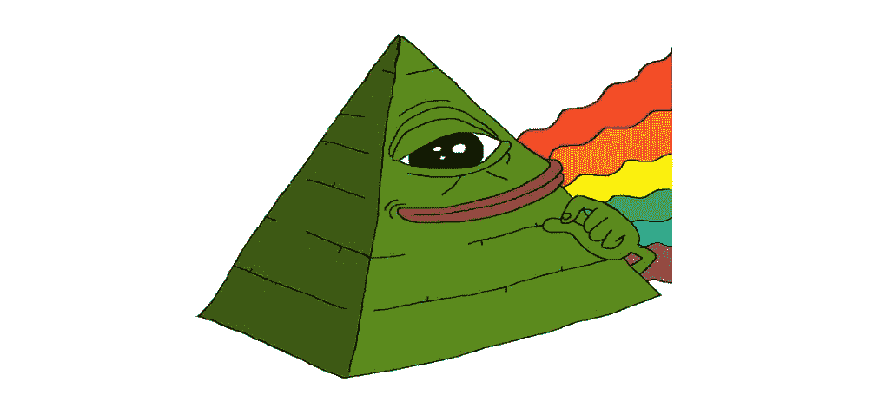

# 下层协议启动

> 原文：<https://medium.com/coinmonks/nether-protocol-initiation-a28d767c4661?source=collection_archive---------42----------------------->

以太坊正在进化，并在一个去中心化的未来成为所有有价值的 dapps 和生态系统的焦点。当 Mainnet 将自己迁移到 PoS consensus 以最小化交易的计算能力时，进化正在发生；另一方面，称为 roll-ups 的第 2 层和第 3 层扩展解决方案正在蓬勃发展，以将以太坊提升到其最终形式，即最终用户对各种服务的全球采用规模。

直到今天，$ETH 还作为燃气费货币用于执行 Mainnet 内部的交易。PoS 迁移完成后，Mainnet 将需要相同的以太网来提供所需的安全性，但这一次，它将在未来的多层中作为安全/数据层发挥更重要的作用。为了去中心化和可扩展的未来，我们需要一种替代货币来帮助实现以太坊的愿景。

以太是其自身生态系统的原生货币，但它不符合其 ERC20 标准，也就是我们所说的整体令牌。这意味着当用户想要交换$ETH 或在其他地方桥接时，token 将被转换为后面的 ERC20 格式，并无缝地执行其功能。从这个意义上说，为了提供更好的可用性和可组合性，新形式的 ether successor 应该是可操作的，并且容易跨层获得。

为了实现这一愿景，Nether 协议提出了以太金库的概念，提供了一种新的以太形式，即 ERC20 形式，并以本地货币及其衍生产品作为令牌的后盾。这意味着这两个协议都开放了自己的平台，接受本地 ETH 和其他代表性的 ERC20 以太网形式，这些以太网形式正被用于 PoS 堆栈，以提高 Mainnet 的安全性，如 stETH 和 rETH。作为回报，用户可以收集他们的共享令牌$CORE，根据他们在总分配中的权重获得奖励。从这个意义上说，虽然用户向国库捐款，但他们的投资将分散在 PoS 赌注平台的令牌上，并分散在他们的收入中，以最大限度地降低风险。

核心令牌是协议的核心。虽然它反映了用户在我们的国库中的份额，但它也将是我们即将到来的项目的锚泊地。Nether Protocol 的目标是不断在其财富基础上构建产品和服务。$CORE token 的持有者将有资格从 PoS 赌注中获得奖励，同时，他们将通过 Nether Protocol 即将推出的产品和服务产生的收入获得奖励。这些分拆的主要目的是加快 L2 和 L3 的采用，简化上线流程，同时寻找更好的解决方案来提高网络安全性，同时考虑分散化并防止池化堆栈服务之间的垄断。

最初的产品将是以太的算法 ERC20 形式，以实现我们的长期愿景和上述资本效率。这种算法令牌的来源将是我们的国库，这意味着为了防止崩溃和维持一个健康的钉住机制，我们通过我们的核心令牌和根据池流量控制的扩展比率来利用真实资产支持，以提供具有巨大流动性和桥接功能的可组合和多层版本的以太网。

未来是 L2s 和 L3s，我们团队的愿景一直延伸到我们部署我们自己的 L3，以欢迎所有寻求利用我们的以太坊金库进行产品开发并有益于以太坊生态系统的 DAP。从这个意义上来说，我们计划建立一个 DAO 模型，投票决定我们将如何管理我们的资金，以及我们将如何为即将在我们的网络上部署的这些项目提供资金。从这个意义上说，我们的$CORE token 持有者将是这些决策的唯一决策者，他们将从这些改进中获得所有额外的好处。

加入未来:

碎碎念:刀

不和:【https://discord.gg/yTWKjG9h】T2