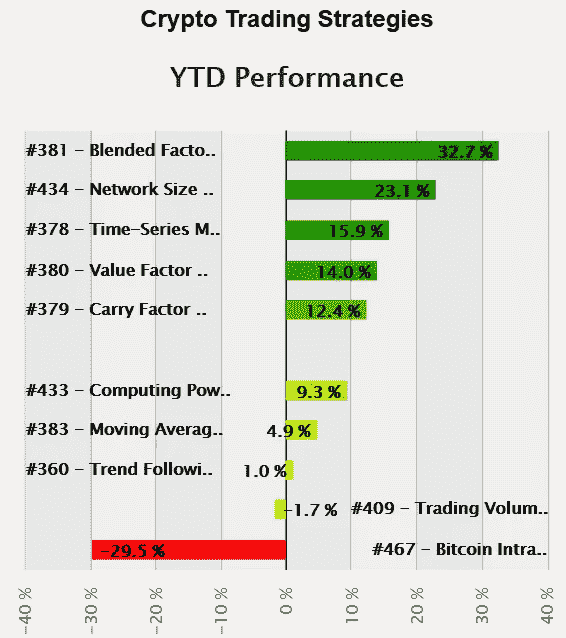
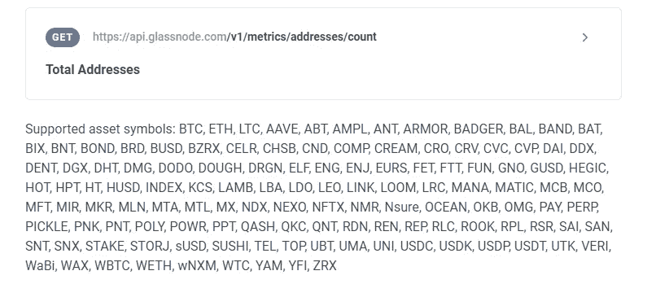
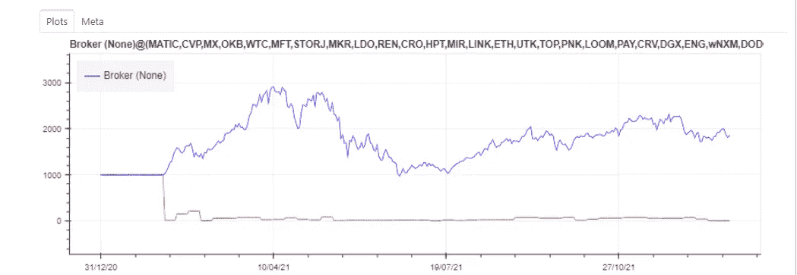
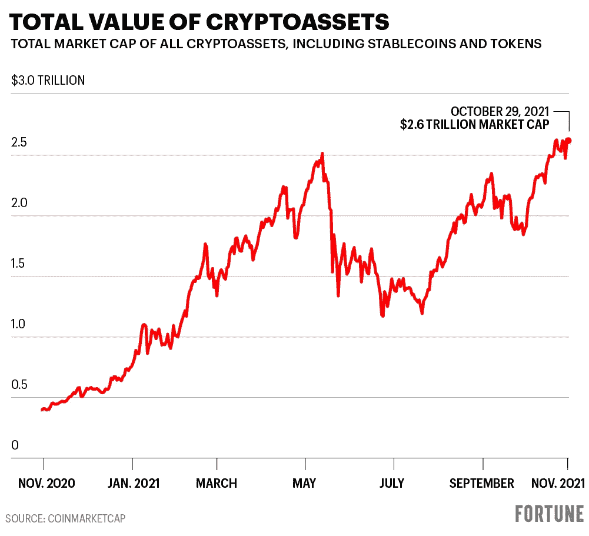
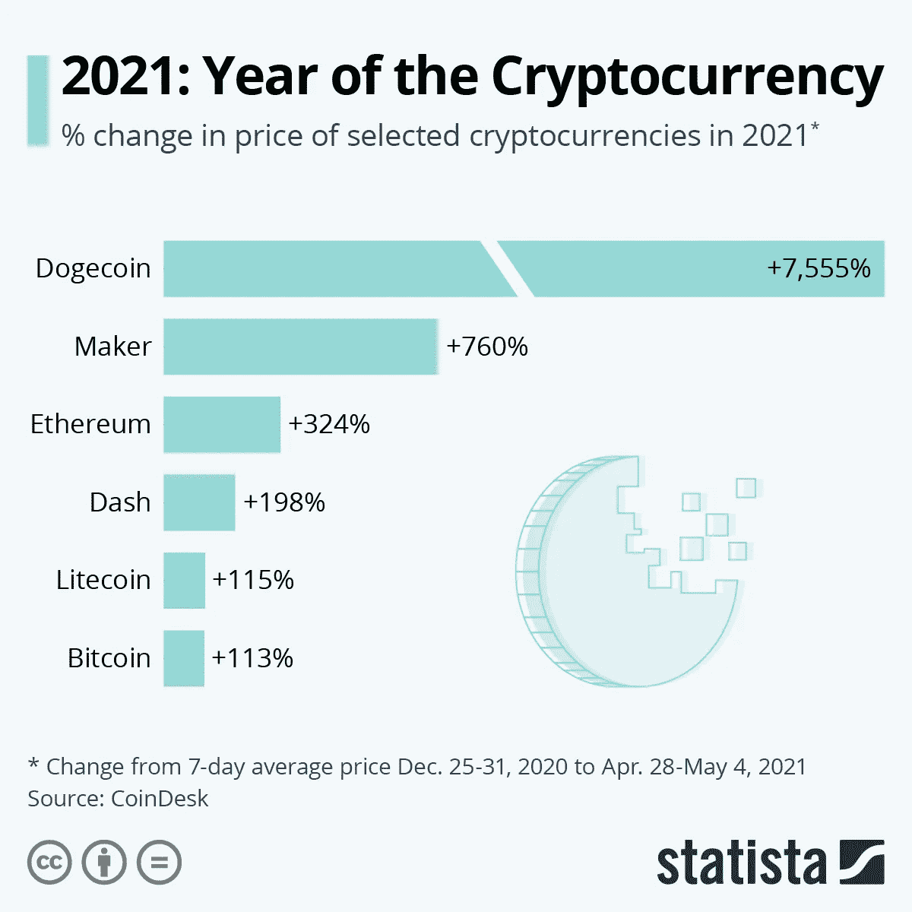
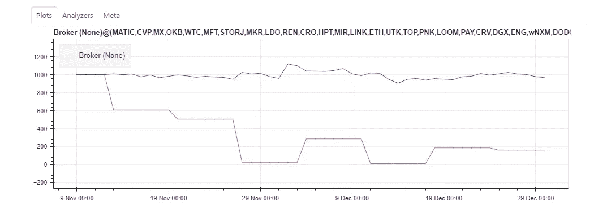

# 基于网络规模的加密投资

> 原文：<https://medium.com/coinmonks/network-size-based-investment-in-crypto-4c6d7536f0a9?source=collection_archive---------5----------------------->

根据 quantpedia.com 的说法，从 2021 年开始探索最好的系统交易策略之一。



Most successful systematic crypto trading strategies, according to [QuantPedia](https://quantpedia.com/analysis-of-systematic-crypto-trading-strategies-in-2021/)

作为一名数据科学家，我通常会尝试做出数据驱动的决策。然而，在不断变化的加密货币交易世界中，如果你不愿意放弃你的金钱和理智，那么拥有一个系统的模型是必要的。

在 QuantPedia.com 的[这篇文章中发现了对现有策略的一个最可靠的比较，所以我决定挖掘一下。虽然实现“混合因子”似乎相当耗时，但我还是专注于第二好的策略——“加密货币中的](https://quantpedia.com/analysis-of-systematic-crypto-trading-strategies-in-2021/)[网络规模因子](https://quantpedia.com/strategies/network-size-factor-in-cryptocurrencies/)”。

**算法是这样的:**

1.  捕获大量可交易加密硬币的网络规模数据。对于这个特殊的实验，我试图观察帐户数量的增长。
2.  通过应用自然对数来调整数值。这样，你就给了像 BTC 这样的老货币和像 SAND 或 GALA 这样的新货币平等的机会。
3.  在周五的周末计算对数值的周平均值。您将收到 2021 年的 53 个值。
4.  通过计算步骤 3 中收到的所有值之间的差异，计算每种加密货币在网络中的增长增量。
5.  通过将步骤 4 中收到的值除以每个加密的网络增长绝对值之和来标准化这些值。
6.  仅使用第 5 步中的正值和硬币作为每周投资组合再平衡过程的分配系数。

如果评论区有足够多的人对代码感兴趣，我会清理它并与公众分享。

如果你对各种加密货币模型有所了解，你可能会意识到这种策略不适用于一定数量的硬币。例如，一些像 Solana 这样的风险证明项目，不可能发现帐户的数量。尽管如此，我发现使用大部分工作证明项目在科学上是足够的。特别是，因为像 BTC 和 ETH 这样的最大的鲸鱼支持这样的链上统计数据，加起来几乎占市场的 2/3。

在这篇文章中，我不会涉及太多关于数据捕获的细节，因为在 GlassNode API 的帮助下，数据捕获非常简单。它提供了大量硬币的网络地址计数，而且免费，几乎没有延迟。



Screenshot from endpoint documentation: [https://docs.glassnode.com/api/addresses](https://docs.glassnode.com/api/addresses)

接下来，我必须下载硬币列表的定价数据。在 python 中，有了 yfinance 包的帮助，这样的事情很容易。与其解释它，我只留下一段代码:

在这一部分之后，我已经明确了投资组合中的潜在项目。我不得不放弃一些硬币，因为它们要么在链上数据或定价数据中没有足够的信息。我也放弃了稳定的股票，因为投资它们没有意义。最终的购物清单是这样的:

```
MATIC, CVP, MX, OKB, WTC, MFT, STORJ, MKR, LDO, REN, CRO, HPT, MIR, LINK, ETH, UTK, TOP, PNK, LOOM, PAY, CRV, DGX, ENG, wNXM, DODO, TEL, CELR, AAVE, EURS, BAT, DMG, GUSD, ABT, DRGN, COMP, BAL, DOUGH, NFTX, ROOK, WETH, RPL, POWR, QNT, ZRX, RLC, SAN, NEXO, MTA, MANA, BAND, HOT, LBA, FET, SNX, GNO, BNT, WBTC, LRC, CREAM, DAI, OMG, DDX, MLN, HUSD, SUSHI, ENJ, REP, CVC, QASH, BOND, PERP, SNT, QKC, STAKE, KCS, MTL, NMR, PPT, UMA, DENT, HEGIC, PNT, POLY, VERI, HT, ANT, BADGER, OCEAN, CHSB, AMPL, NDX, MCB, BZRX, BIX, FTT, LTC, FUN, MCO, PICKLE, CND, ARMOR, Nsure, UNI, RDN, INDEX, LAMB, LEO, RSR, YAM, WaBi, UBT, BTC, BRD, DHT, ELF, YFI
```

有了这么多钱，让我们向交易策略回溯测试的世界迈进一步。

对于评估的这一部分，使用了名为 [BackTrader](https://pypi.org/project/backtrader/) 的流行软件包。它为您提供了一个灵活的工具，用于测试不同资产(如密码、股票、法定货币等)的不同策略。它还集成了 yfinance、pandas 和常规文件输入。在我的实验中，我创建了一个策略类，它实现了根据计算过程中收到的分配购买硬币，如果分配在一周内减少，则出售硬币。

回溯测试的结果——所有人都在等待的结果！单纯从数字上看，这种策略似乎相当有利可图。**最初的预算是 1000 美元，到了年底，它能够交付 1846 美元。**



Account status across the year

但是再看一看，它似乎与下图中的市场趋势相似，所以让我们进一步研究一下。



Cryptomarket value (Original: [https://fortune.com/2021/11/01/its-not-just-bitcoin-and-shiba-inu-cryptos-amazing-run-in-4-charts/](https://fortune.com/2021/11/01/its-not-just-bitcoin-and-shiba-inu-cryptos-amazing-run-in-4-charts/))

在以太坊和比特币方面，它也输给了买入并持有的策略，因为这两种货币分别升值了 324%和 113%。



2021 appreciation of most prominent coins. Original here: [https://www.statista.com/chart/24793/selected-cryptocurrency-price-growth/](https://www.statista.com/chart/24793/selected-cryptocurrency-price-growth/)

这有什么好处吗？嗯，经过一番研究，我发现这个策略比典型的绝望时期的 HODL 策略相对更好。从今年 11 月中旬开始，加密市场处于低迷状态，因此不幸的买家损失了相当多的钱。如果这些买家使用网络规模因素策略，他们的投资组合只会损失 3.3%。在下面的图中，你可以看到，如果你在 11 月 10 日开始应用这个系统，你将会从最初的 **1000 美元中得到 **967 美元**美元。**



Simulation from November 10th till the end of 2021

# 结论

在加密货币交易领域，通常情况下，至少有一些策略总比没有好。通过使用某些指导方针，你总能对未来做出更好的预测，对过去做出更好的反思。尽管如此，正如在股票市场交易中经常发生的那样，HODL 的加密交易比其他任何公开交易策略更有机会带来利润。至少，在史料中是这样的。

这个简短的研究让我确信了在投资另一个加密项目之前进行网络分析的价值。一枚硬币的价格和它所代表的网络吸引新参与者的能力之间似乎有很好的相关性(咄！).

明智地使用这份材料中的数字，因为它不打算作为任何种类的财务咨询。

我希望你喜欢这篇文章，并会回来这里看更多。

[https://medium.com/@destiq](/@destiq)

> 加入 Coinmonks [电报频道](https://t.me/coincodecap)和 [Youtube 频道](https://www.youtube.com/c/coinmonks/videos)了解密码交易和投资

## 也请阅读

[](/coinmonks/leveraged-token-3f5257808b22) [## 杠杆代币[多头代币]终极指南

### 杠杆代币是具有杠杆风险的 ERC20 代币，不考虑保证金、要求、管理……

medium.com](/coinmonks/leveraged-token-3f5257808b22) [](https://blog.coincodecap.com/crypto-exchange) [## 最佳密码交易所| 2021 年十大密码货币交易所

### 编辑描述

blog.coincodecap.com](https://blog.coincodecap.com/crypto-exchange) [](https://blog.coincodecap.com/best-swap-platforms) [## 2021 年最佳加密交换平台| CoinCodeCap

### 如果我们看看今天的情况，许多密码货币交换平台提供了广泛的功能和深度…

blog.coincodecap.com](https://blog.coincodecap.com/best-swap-platforms) [](https://blog.coincodecap.com/best-online-casinos) [## 10 大最佳在线赌场[2021] |赢得并赢得免费 BTC 奖| CoinCodeCap

### 编辑描述

blog.coincodecap.com](https://blog.coincodecap.com/best-online-casinos) [](/coinmonks/top-5-crypto-lending-platforms-in-2020-that-you-need-to-know-a1b675cec3fa) [## 2021 年最佳加密贷款平台| 6 大比特币贷款平台

### 获得比特币和其他密码货币的最佳贷款利率

medium.com](/coinmonks/top-5-crypto-lending-platforms-in-2020-that-you-need-to-know-a1b675cec3fa) [](/coinmonks/the-best-cryptocurrency-hardware-wallets-of-2020-e28b1c124069) [## 6 款 2021 年最佳硬件钱包|顶级加密硬件钱包[更新]

### 最好的密码硬件钱包是绝对必要的。我们将在 NGRAVE、Ledger Nano X 和……

medium.com](/coinmonks/the-best-cryptocurrency-hardware-wallets-of-2020-e28b1c124069) [](/coinmonks/crypto-trading-bot-c2ffce8acb2a) [## 2021 年最佳免费加密交易机器人

### 2021 年，币安、比特币基地、库坎和其他密码交易所的最佳密码交易机器人。四倍，Bitsgap…

medium.com](/coinmonks/crypto-trading-bot-c2ffce8acb2a) [](/coinmonks/best-crypto-signals-telegram-5785cdbc4b2b) [## 最佳 4 种加密交易信号电报频道

### 找到合适的加密交易信号提供商是很乏味的。所以，在本文中，我们将讨论最好的…

medium.com](/coinmonks/best-crypto-signals-telegram-5785cdbc4b2b) [](https://blog.coincodecap.com/bitsgap-review) [## Bitsgap 评论 2021 |获取信号、交易机器人和套利

### 编辑描述

blog.coincodecap.com](https://blog.coincodecap.com/bitsgap-review)