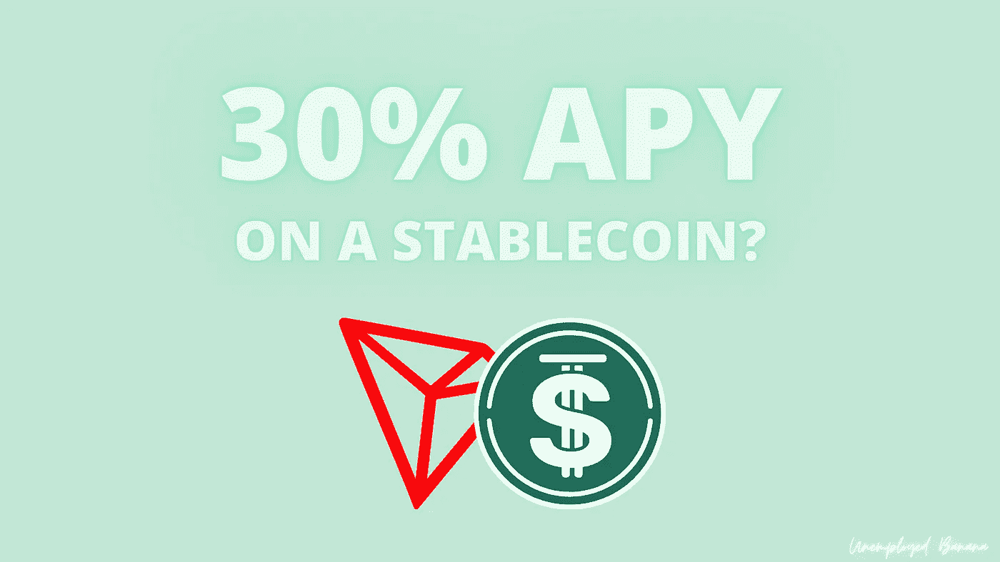
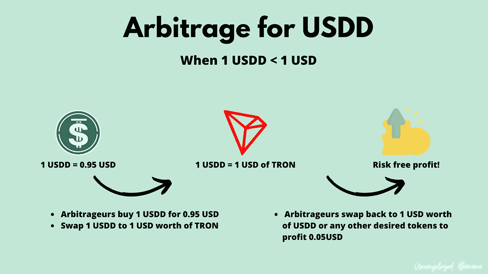
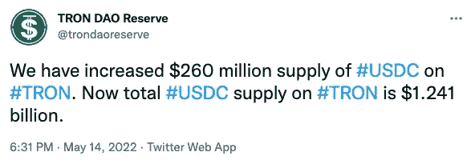
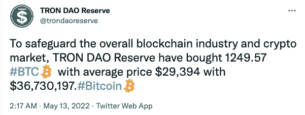
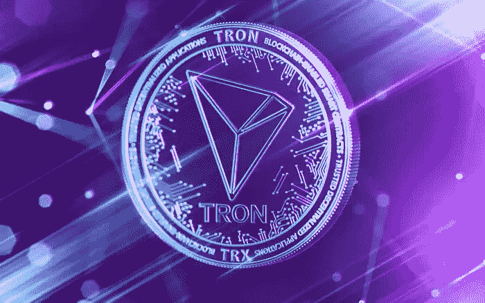

# 新的算法稳定 USDD 承诺 30%的 APY——这是泰拉 UST 的模仿吗？

> 原文：<https://medium.com/coinmonks/new-algorithmic-stablecoin-usdd-promises-30-apy-is-this-a-terra-ust-copycat-2d2787af14b2?source=collection_archive---------4----------------------->

我分析了 9 页 USDD 白皮书和我对 USDD 算法稳定币的想法。

USDD offers 30% APY staking on USDD protocol (USDD.io)

还记得泰若露娜和 UST 吗？USDD 也是一样——一个不依赖任何东西的算法稳定币。它 100%遵循卢纳和 UST 的概念，根据美元挂钩调整 USDD 和创(TRX)的供求。

# USDD 是如何维持其联系汇率的？就像 UST 和露娜一样

## 短期套利系统

与泰拉和 UST 类似，USDD 使用 1 USDD = 1 美元价值的 TRX 的基本算法，将 USDD 的市场价格维持在 1 美元左右，而不管市场状况如何。

Picture illustration of Arbitrage if USDD falls below 1 USD by Unemployed Banana (aka myself!).

*   **如果 USDD 盯住美元的汇率跌破 1 美元**，套利者可以折价购买 1 USDD **。**随后，套利者可以卖出 1 USDD 换取 1 美元的 TRX。最后，套利者可以向他们想要的代币出售价值 1 美元的 TRX，并将折扣作为利润收入囊中。套利的效果如何？一个 USDD 将被烧毁，一个 TRX 将被铸造。**随着 USDD 供应量的减少，USDD 价格将走向 1 美元。**
*   另一方面，**如果 USDD 盯住美元的汇率上升到 1 美元以上，**套利者可以用 1 美元的 TRX 兑换 1 USDD。最终，套利者花费 1 美元兑换超过 1 美元价值的 1 USDD，并将差价收入囊中。**产生的效果与**相似。1 USDD 将被铸造，而价值 1 美元的 TRX 将被烧毁。**随着 USDD 供应量的增加，USDD 价格将回落至 1 美元。**

事后看来，在市场剧烈波动的情况下，这个系统对卢娜和 UST 并不奏效。你可以在这里 **阅读更多关于 Terra 的崩溃** [**。**](/@unemployedbanana/ust-plunged-to-0-25-and-luna-crashed-80-in-12hours-do-kwons-terra-and-ust-recovery-plan-899523db88a1)

## 支持挂钩的 100 亿美元储备体系——仍在进行中

人民币道储备将作为 USDD 的分散储备，旨在稳定 USDD 的联系汇率。

创道储备将从行业参与者那里筹集价值 100 亿美元的高流动性资产。这 100 亿美元将在 2022 年 5 月(USDD 发行月)起的未来 6 至 12 个月内存入创道储备。100 亿美元的储备将用于担保 USDD。还将有一个内在的机制来“自我稳定，抵御任何价格波动”。

TRON 的创始人 Justin Sun 和 TRON DAO Reserve 没有具体披露支持联系汇率制的“高流动性”资产的比例，也没有相关计划。在接受 CoinDesk 的采访时，孙表示，壹基金已经“收购了、、等明星。

截至 2022 年 5 月 14 日，TRON DAO Reserve 披露，他们持有 12.41 亿美元的 USDC 稳定币和 3670 万美元的比特币。

创道储备正在努力做的是迅速建立其储备体系，以实现稳定的抵押货币，从而在市场下跌时保护其联系汇率不受影响。在我看来，这是一个积极的发展，是 LUNA 团队在 UST 成长的早期阶段所缺乏的。100 亿美元的 BTC 储备更多的是权的事后想法，它的出现为时已晚，无法挽救 UST 的联系汇率制度。

# USDD 和创是如何维护其安全的？

通过委托股权证明(dpo)。DPoS 的工作方式类似于利益证明(PoS)。它包括一个投票和共识机制来奖励利益相关者，也称为超级代表(SRs)。赌注者是如何得到回报的？通过在协议内交换费用。

*   传播费——最低 0.5%的费用。根据市场波动自动调整费率。
*   托宾税 TRON 生态系统内不同稳定货币互换的固定费用。目前，托宾税还没有实施，因为 USDD 是 TRON 提供的唯一稳定的货币。

# 为什么 USDD 协议提供 30%的 APY？

USDD 协议基本上采取的是高成本营销策略。30%的“无风险”收益率旨在吸引储户增加协议的流动性。这和 Anchor Protocol 的营销策略类似。

然而，Justin Sun 已经表示收益率不会固定(显然)。这是一个短期的营销策略。未来收益率会低很多，而且是动态的。目前还没有关于该方案将保持其 30%产率多久的计划。

# 我的想法？

我个人认为 USDD 就像是 UST 的翻版。如果历史是未来的一瞥，我对 USDD 的未来相当悲观。

尽管如此,《USDD 议定书》仍有可取之处，可以使其免于灾难。

类似于卢娜基金会警卫(LFG)所做的，TRON DAO Reserve 承诺用 100 亿澳元的高流动性资产支持其 USDD，**，只是他们从一开始就在建设它**。储备系统也意味着去中心化——这在我看来相当混乱，因为如果算法无法保持盯住，储备将需要由 TRON DAO reserve 部署，从而使其集中化。

不管 USDD 是否真的去中心化，100 亿美元的储备将被分散到稳定的货币、比特币和其他资产中，尽管每项资产的实际比重并没有被披露。

USDD 要真正实现长期发展，确实需要一个坚实的计划，如何将 30%的 APY 降低到一个可持续和动态的水平。一个太有吸引力的收益率持续太久将导致 USDD 以惊人的速度增长，这将使创道储备没有足够的时间来建立一个坚实的储备系统。

总而言之，**我认为 USDD 将很难获得投资者的信心。UST 的崩溃意味着算法稳定的银行仍然固有地** [**比像 USDC 和 USDT**](/coinmonks/3-reasons-why-your-money-isnt-really-safe-in-stablecoins-90625f125516) 这样的中央集权银行风险更大。创和 USDD 一起建立的系统还有待验证。只有时间才能证明 USDD 是否是未来分散化的稳定中心。

*感谢阅读我的文章！如果你真的真的喜欢，那就考虑给我买杯咖啡* [***这里***](http://ko-fi.com/unemployedbanana?source=about_page-------------------------------------) *支持我吧！☕❤️*

*如果您想购买 USDD，请考虑使用*[***ku coin***](https://www.kucoin.com/r/rf/rPELADP)**🟢与我的附属链接* ***或*** [***币安***](https://accounts.binance.me/en/register?ref=174617871)**🟡用于任何其他加密货币！✨***

**免责声明:我不是任何形式的财务顾问。永远 DYOR，投资安全。**

**在这里阅读我的其他文章。**

** [## 为什么你的钱在稳定的银行里不安全的 3 个原因

### 你的钱放在马厩里真的安全吗？

medium.com](/coinmonks/3-reasons-why-your-money-isnt-really-safe-in-stablecoins-90625f125516)  [## 2022 年你应该投资 Polygon (MATIC)的 3 个理由。

### 你还在考虑投资$MATIC 吗？现在读读这个。

medium.com](/coinmonks/3-reasons-why-you-should-invest-in-polygon-matic-in-2022-c8b3f5da41aa) 

> 加入 Coinmonks [电报频道](https://t.me/coincodecap)和 [Youtube 频道](https://www.youtube.com/c/coinmonks/videos)了解加密交易和投资

# 另外，阅读

*   [Bookmap 点评](https://coincodecap.com/bookmap-review-2021-best-trading-software) | [美国 5 大最佳加密交易所](https://coincodecap.com/crypto-exchange-usa)
*   最佳加密[硬件钱包](/coinmonks/hardware-wallets-dfa1211730c6) | [Bitbns 评论](/coinmonks/bitbns-review-38256a07e161)
*   [新加坡十大最佳加密交易所](https://coincodecap.com/crypto-exchange-in-singapore) | [购买 AXS](https://coincodecap.com/buy-axs-token)
*   [红狗赌场评论](https://coincodecap.com/red-dog-casino-review) | [Swyftx 评论](https://coincodecap.com/swyftx-review) | [CoinGate 评论](https://coincodecap.com/coingate-review)
*   [投资印度的最佳密码](https://coincodecap.com/best-crypto-to-invest-in-india-in-2021)|[WazirX P2P](https://coincodecap.com/wazirx-p2p)|[Hi Dollar Review](https://coincodecap.com/hi-dollar-review)**