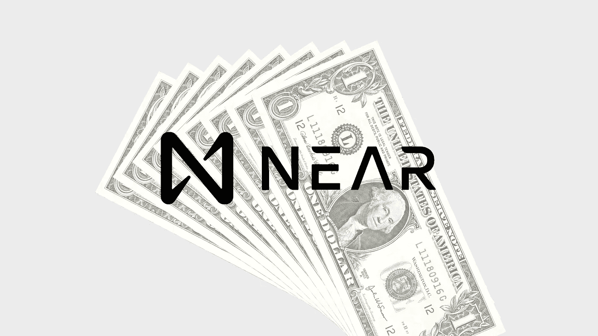
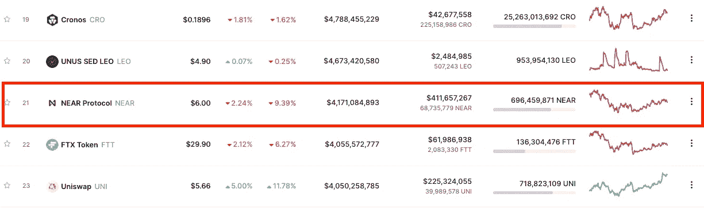
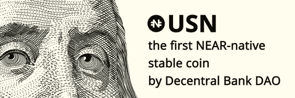
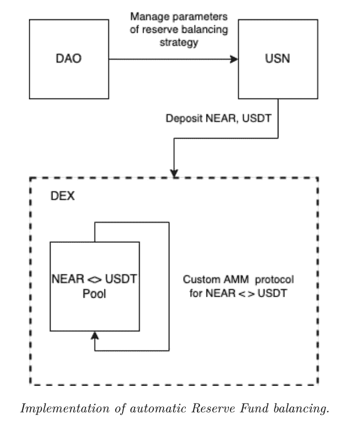

# 提供 10% APY 的新算法 Stablecoin USN 不同的成功秘诀？

> 原文：<https://medium.com/coinmonks/new-algorithmic-stablecoin-usn-offering-10-apy-a-different-recipe-for-success-ced380e3f119?source=collection_archive---------27----------------------->

本质上相似，但技术上不同于 UST 和露娜。

你好！我再次回来向大家展示一个全新的算法 stablecoin，它最近引起了一些关注。它被称为 USN，建立在 NEAR 协议(NEAR)之上。

那么，到底什么是接近协议呢？

这是一个市值约为 40 亿美元的令牌，根据撰写本文时的市值，它位于加密领域的前 30 名令牌之内。

# 这种算法稳定币是如何工作的？

USN 就像 Terra 的 UST 和 Tron Network 的 USDD 一样稳定。它在算法上受到 NEAR 令牌的支持。

一个名为分散银行的分散组织发展并支持 USN stablecoin。分散银行本质上是一个分散的自治组织(DAO ),负责整个项目。

道不持有美元现金储备，这意味着美国政府没有任何硬储备来支持其联系汇率。

为了确保 USN 维持其钉住美元的能力，分散银行 DAO 实施了一些稳定机制。

1.  由 DAO 持有的 USDT 稳定币组成的**储备基金。**
2.  **一个套利系统，确保 1 USN = 1 美元的近币价值。**这类似于 UST 和 USDD 的做法。如果你想了解更多关于套利是如何运作的，我在 [**创网的 USDD 稳定币上做了解释。**](/coinmonks/new-algorithmic-stablecoin-usdd-promises-30-apy-is-this-a-terra-ust-copycat-2d2787af14b2)

 [## 新的算法稳定 USDD 承诺 30%的 APY——这是泰拉 UST 的模仿吗？

### 我分析了 9 页 USDD 白皮书和我对 USDD 算法稳定币的想法。

medium.com](/coinmonks/new-algorithmic-stablecoin-usdd-promises-30-apy-is-this-a-terra-ust-copycat-2d2787af14b2) 

# USN 和 Terra 的 UST 有什么不同？

Image credit: [From Decentral Bank Homepage](https://decentral-bank.finance/)

储备基金自动平衡系统是美国国债和货币发行局制度保持联系汇率的主要特征。

最简单地说，

1.  DAO 通过基于供给和需求的 USN 的燃烧和铸造来管理参数。
2.  USN 将以 1:1 的比例出售给 NEAR 和 USDT。这对代币随后将被存放在分散交易所(DEX)的流动性池中。
3.  流动性池将为 DAO 提供储备，以利用经典的**货币局**模式来支持 USN 汇率的稳定
    。货币局是一种极端的钉住形式，在这种情况下，一种货币的汇率与外国货币挂钩——在这种情况下，它是一篮子稳定的货币，如 USDT 和 USDC。

Image credit: [USN whitepaper v1](https://drive.google.com/file/d/1RbpAYx7K7CsinQKbD9a1I3r9d5zwivm3/view)

# 哪里可以买到 USN，赚 10%收益率？

USN 可以在 [**分散银行**](https://swap.decentral-bank.finance/) **与近令牌**交换，在 [**参考金融**](https://app.ref.finance/stableswap) **与 USDT 交换。** USN 可以以大约 10%的 APY 在分散银行进行投资。

点击此处了解更多关于下注 USN 的信息。

[https://medium . com/near protocol/dec oll-bank-launchs-usn-a-near-native-stable coin-cafe 1 EC 0 C5 af](/nearprotocol/decentral-bank-launches-usn-a-near-native-stablecoin-cafe1ec0c5af)

# 这是成功的秘诀吗？

USN 是一个精心设计和深思熟虑的去中心化和算法稳定的核心。

平心而论，我不会称之为完全的算法稳定币，因为它利用一篮子像 USDT 那样的集中稳定币来维持其盯住汇率。众所周知，USDT 像菲亚特一样被硬储备钉住。

那么 USN 会出什么问题呢？

由于这种算法稳定核心还有待压力测试，USN 是否是分散稳定核心领域的真正竞争对手还有待观察。不过，这个特性集在纸面上给人留下了深刻的印象。

**了解更多关于 USN 和分散银行 DAO 的信息**

[分散银行](https://decentral-bank.finance/) | [Github](https://github.com/DecentralBankDAO)

**加入分散银行 DAO 和 USN 社区**

[不和](https://discord.com/invite/decentralbank) | [推特](https://twitter.com/DcntrlBank)

用你的 USN 换 10%的 APY

分散的银行金融

感谢您阅读我的文章！如果你真的真的喜欢，那就考虑给我买杯咖啡 [*这里*](http://ko-fi.com/unemployedbanana?source=about_page-------------------------------------) *支持我吧！☕❤️*

*考虑使用*[***kucoin***](https://www.kucoin.com/r/rf/rPELADP)**🟢与我的附属链接* ***或*** [***币安***](https://accounts.binance.me/en/register?ref=174617871)**🟡进行加密货币交易。他们提供市场上最低的利率和大量的加密令牌。✨***

**免责声明:我不是任何形式的财务顾问。永远 DYOR，投资安全。**

**你可能会从阅读我的文章中得到乐趣。**

** [## 为什么你的钱在稳定的银行里不安全的 3 个原因

### 你的钱放在马厩里真的安全吗？

medium.com](/coinmonks/3-reasons-why-your-money-isnt-really-safe-in-stablecoins-90625f125516)  [## 2022 年你应该投资 Polygon (MATIC)的 3 个理由。

### 你还在考虑投资$MATIC 吗？现在读读这个。

medium.com](/coinmonks/3-reasons-why-you-should-invest-in-polygon-matic-in-2022-c8b3f5da41aa) 

想了解更多关于加密和区块链？

 [## 通俗地说:区块链和密码中的分叉是什么？

### 分叉是软件工程中使用的一个术语，用于将一个项目分成两个或多个独立的过程。在…

medium.com](/coinmonks/in-laymans-term-what-is-forking-in-blockchain-and-crypto-1c53de221157) 

> 加入 Coinmonks [电报频道](https://t.me/coincodecap)和 [Youtube 频道](https://www.youtube.com/c/coinmonks/videos)了解加密交易和投资

# 另外，阅读

*   [BigONE 交易所评论](/coinmonks/bigone-exchange-review-64705d85a1d4) | [电网交易机器人](https://coincodecap.com/grid-trading)
*   [氹欞侊贸易评论](https://coincodecap.com/anny-trade-review) | [CoinSpot 评论](https://coincodecap.com/coinspot-review)
*   [新加坡十大最佳加密交易所](https://coincodecap.com/crypto-exchange-in-singapore) | [购买 AXS](https://coincodecap.com/buy-axs-token)
*   [投资印度的最佳加密软件](https://coincodecap.com/best-crypto-to-invest-in-india-in-2021) | [WazirX P2P](https://coincodecap.com/wazirx-p2p)
*   [7 个最佳零费用加密交易平台](https://coincodecap.com/zero-fee-crypto-exchanges)
*   [最佳网上赌场](https://coincodecap.com/best-online-casinos) | [期货交易机器人](/coinmonks/futures-trading-bots-5a282ccee3f5)**