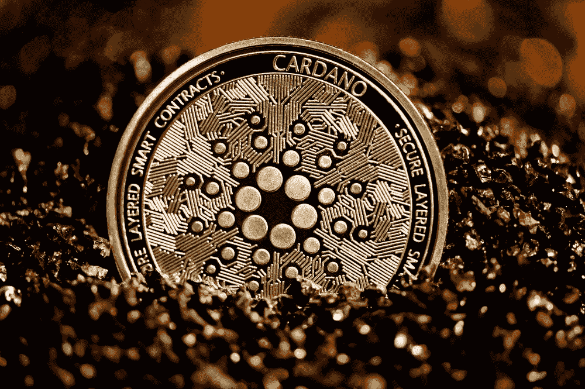

# 2022 年新卡尔达诺 ISPO /国际标准化组织

> 原文：<https://medium.com/coinmonks/new-cardano-ispo-isos-for-2022-a1cbb59e635e?source=collection_archive---------2----------------------->

卡尔达诺的生态系统允许密码持有者帮助保护网络，并每 5 天获得一次卡尔达诺奖励，也称为一个纪元。这整个过程被称为赌注，是加密空间中一个受人喜爱的工具。随着新项目在卡尔达诺空间出现，新的机会出现在项目生态系统中，以赚取新的代币。通过在新项目的池中下注您的卡达诺，您可以免费获得这些项目的新令牌！这被称为“首次股权池发行”(ISPO)或“首次证券发行”(ISO)。

让我们看看 2022 年有哪些新的 ISPO/国际标准化组织！

1.  阿尔达娜·ISPO

[https://ardana.org/](https://ardana.org/)

*   Ardana 是一个分散的稳定硬币项目，将有助于为 Cardano 生态系统带来流动性。
*   ISPO 发射日期:未知。Ardana 将在未来几周到几个月内宣布他们的 ISPO 的启动日期。敬请期待！
*   奖励:阿尔达纳奖励不会影响你的卡达诺奖励，这意味着你仍将继续积累每个时代的卡达诺。
*   )(他)(们)(都)(不)(知)(道)(,)(他)(们)(还)(不)(知)(道)(,)(他)(们)(还)(不)(知)(道)(,)(他)(们)(还)(不)(知)(道)(,)(他)(们)(还)(不)(知)(道)(,)(他)(们)(还)(不)(知)(道)(,)(他)(们)(还)(不)(知)(道)(,)(他)(们)(还)(不)(知)(道)(,)(他)(们)(还)(不)(知)(道)(,)(他)(们)(还)(不)(知)(道)(,)(他)(们)(们)(还)(不)(知)(道)(道)(,)(他)(们)(们)(还)(不)(知)(道)(,)(他)(们)(还)(还)(不)(知)(道)(。 )(她)(们)(都)(不)(知)(道)(,)(她)(们)(还)(不)(知)(道)(,)(她)(们)(还)(不)(知)(道)(,)(她)(们)(还)(不)(知)(道)(,)(她)(们)(还)(不)(知)(道)(,)(她)(们)(还)(不)(知)(道)(,)(她)(们)(还)(不)(知)(道)(,)(她)(们)(们)(还)(不)(知)(道)(,)(她)(们)(们)(还)(不)(知)(道)(,)(她)(们)(们)(还)(不)(知)(道)(道)(,)(她)(们)(们)(还)(不)(知)(道)(道)(,)(她)(们)(们)(们)(还)(不)(知)(道)(,)(她)(们)(们)(们)(们)(还)(有)(
*   * *小心不要进入一个饱和的池，因为你将获得较少的回报。随着用户授权和取消授权，饱和率可能会随时间而变化。定期查看他们的当前状态。
*   更多信息:[https://medium . com/ardana-hub/cardano-start-up-ardana-set-to-launch-high-expected-ispo-9597 CD 4c 8d 42](/ardana-hub/cardano-start-up-ardana-set-to-launch-highly-anticipated-ispo-9597cd4c8d42)

**2。弗里克托·ISPO**

Flickto.io

*   Flickto 是一个媒体社区孵化器，允许用户对他们希望得到资助的媒体项目进行投票。通过投票，用户可以同时获得 FLICK token 和 Cardano。
*   奖励:轻弹奖励不会影响你的卡达诺奖励，这意味着你仍然可以在每个时期继续积累卡达诺。
*   发布日期:2021 年 11 月 1 日—4 月 31 日(纪元 300-332 年)
*   当前 ISPO 池:轻弹
*   更多信息:[https://blog . flickto . io/everything-you-need-know-the-flickto-ispo-1 ab 9 c 7 FB 4554](https://blog.flickto.io/everything-you-need-to-know-about-the-flickto-ispo-1ab9c7fb4554)

**3。拉文德克斯 ISPO**

[https://ispo.ravendex.io/](https://ispo.ravendex.io/)

*   RavenDex 是卡尔达诺的非托管分散式交易所。
*   ISPO 发射日期:纪元 320-352 年(总共 32 个纪元)
*   奖励:有两种类型的池，100%和 50/50 池。50/50 选项允许您赚取 50%的 Cardano 和 50% $RAVE token。在 100%池中，您在每个纪元都不会赢得任何 Cardano，但是在 ISPO 结束时，您将会赢得更多的 RAVE token。
*   当前 ISPO 池:RAVEp
*   更多信息请访问:[https://docs . raven dex . io/ispo/how-to-participate-in-raven dex-ispo](https://docs.ravendex.io/ispo/how-to-participate-in-ravendex-ispo)

**4。天才屈服 ISPO**

[https://news.coincu.com/](https://news.coincu.com/)

*   自动化收益率优化器中的 Genius Yield，这是一种人工智能智能流动性管理协议，可以自动执行交易策略，为消费者带来最大收益。
*   ISPO 发布日期:12 月 15 日—6 月 15 日(纪元 309-344 年)
*   奖励:有两种类型的池，100%和 50/50 池。50/50 选项允许您获得 50%卡达诺和 50% $GENS 令牌。在 100%池中，你不会在每个时期获得任何卡达诺，但是当 ISPO 结束时，你将获得更大数量的 GENS 令牌。
*   当前 ISPO 池:

*   小心不要将任务分派到一个饱和的资金池，因为你将获得更少的回报。随着用户通过各种池进行授权和取消授权，饱和率可能会随时间而变化。定期查看他们的当前状态。
*   更多信息:[https://docs . raven dex . io/ispo/how-to-participation-raven dex-ispo](https://docs.ravendex.io/ispo/how-to-participate-in-ravendex-ispo)

把你的钱投入到工作中，帮助确保卡尔达诺区块链的网络安全，同时在令人兴奋的新项目中获得被动收入。快乐的赌注！

免责声明:本文中的信息不是财务建议。

> 加入 Coinmonks [电报频道](https://t.me/coincodecap)和 [Youtube 频道](https://www.youtube.com/c/coinmonks/videos)了解加密交易和投资

# 另外，阅读

*   [BlockFi vs 摄氏](/coinmonks/blockfi-vs-celsius-vs-hodlnaut-8a1cc8c26630) | [Hodlnaut 点评](/coinmonks/hodlnaut-review-best-way-to-hodl-is-to-earn-interest-on-your-bitcoin-6658a8c19edf) | [KuCoin 点评](https://coincodecap.com/kucoin-review)
*   [Bitsgap 审查](/coinmonks/bitsgap-review-a-crypto-trading-bot-that-makes-easy-money-a5d88a336df2) | [Quadency 审查](/coinmonks/quadency-review-a-crypto-trading-automation-platform-3068eaa374e1) | [Bitbns 审查](/coinmonks/bitbns-review-38256a07e161)
*   [密码本交易平台](/coinmonks/top-10-crypto-copy-trading-platforms-for-beginners-d0c37c7d698c) | [Coinmama 审核](/coinmonks/coinmama-review-ace5641bde6e)
*   [印度的加密交易所](/coinmonks/bitcoin-exchange-in-india-7f1fe79715c9) | [比特币储蓄账户](/coinmonks/bitcoin-savings-account-e65b13f92451)
*   [OKEx vs KuCoin](https://coincodecap.com/okex-kucoin) | [摄氏替代品](https://coincodecap.com/celsius-alternatives) | [如何购买 VeChain](https://coincodecap.com/buy-vechain)