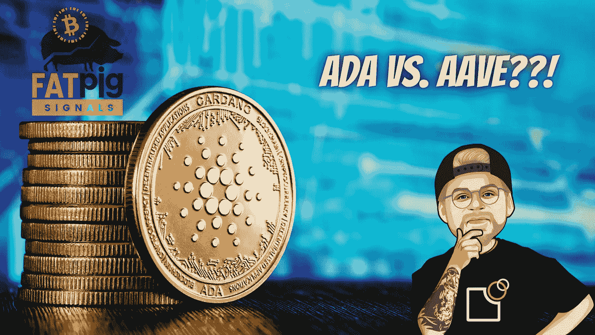

# 卡尔达诺的新 DeFi 项目开始了它的 IDO 阶段！

> 原文：<https://medium.com/coinmonks/new-defi-project-on-cardano-starts-its-ido-phase-19bcb6f2eabf?source=collection_archive---------13----------------------->

卡尔达诺新闻:DeFi 信贷协议 ADALend 接近其 IDO 阶段

ADALend 加入 SundaeSwap，成为卡尔达诺区块链上的另一个旗舰分散式应用程序。至少，这是这个项目的目标。

在最近的采访中，分散化金融协议的首席执行官卡斯帕尔斯·科斯金斯描述了该项目将如何改变银行业…