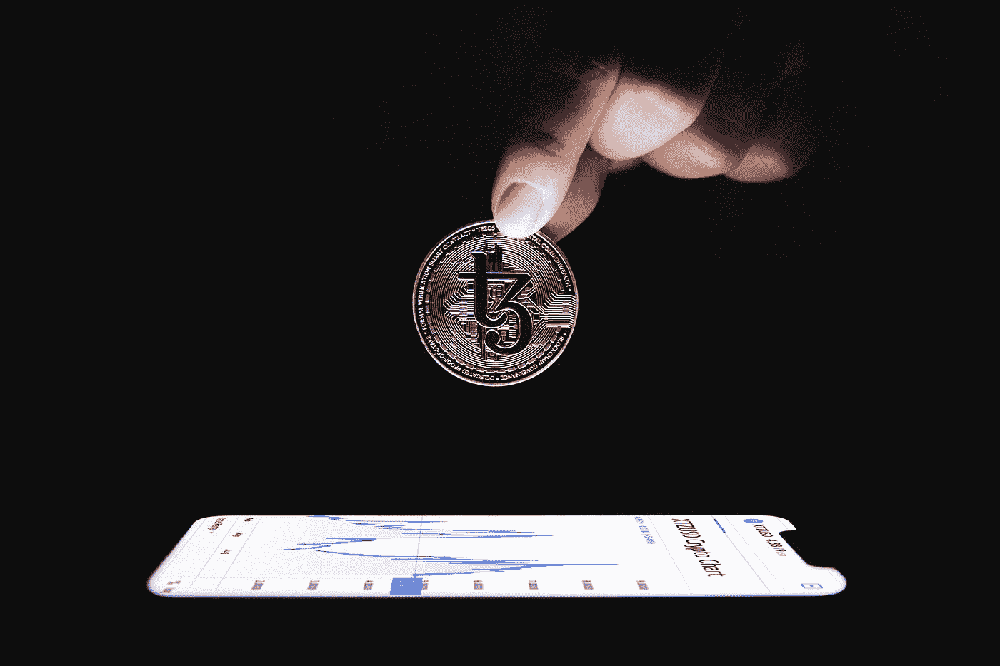

# 密码交易新手？这里有 5 个关于如何开始 2022 年的建议

> 原文：<https://medium.com/coinmonks/new-to-crypto-trading-here-are-5-tips-on-how-to-start-2022-on-the-right-foot-a4292e3af808?source=collection_archive---------2----------------------->

Photo by [Tezos](https://unsplash.com/@tezos?utm_source=medium&utm_medium=referral) on [Unsplash](https://unsplash.com?utm_source=medium&utm_medium=referral)

交易股票和加密货币可能很复杂，但这里有一些关于如何开始的提示。

你在交易方面有多有经验并不重要，因为没有什么可以保护一个人免受加密货币价格波动的影响。目前，比特币(BTC)的波动性(每日波动性的标准衡量指标)为每年 64%。相比之下，标准普尔 500 原油的波动率为 17%，而 WTI 原油的波动率估计为 54%。

然而，遵循以下五个基本原则，可以避免意外的 25%日内价格波动的心理影响。幸运的是，在高波动时期，这些技巧不需要先进的设备或大笔资金。

# 计划在 2 年内不要取钱

假设你有 5000 美元投资，但很有可能在 12 个月内你需要至少 2000 美元用于旅行或汽车维修或任何其他工作。

你能做的最糟糕的事情是分配 100%给加密，因为你可能需要在最糟糕的时候卖掉你的头寸，可能是在周期底部。即使人们计划使用分散融资(DeFi)池中的收益，也总是存在损失或黑客攻击的风险，从而影响资金的获取。

简而言之，任何配置到加密货币的基金都必须有两年的归属期。

# 总是平均美元成本

即使是专业交易者也害怕错过机会(FOMO)，认为尽快建仓很紧迫。但是，如果每个人都持续获得 50%以上的回报，甚至迷因币也能带来丰厚的回报，你怎么能袖手旁观呢？

DCA 策略包括每周或每月买入相同数量的美元，不考虑市场波动；例如，一年内每周一下午买入 200 美元，消除了不断需要决定是否加仓所带来的担忧和压力。

不惜一切代价，避免在不到三四周的时间内买入所有头寸。请记住，加密的采用率仍处于起步阶段。

# 进行分析时，不要使用太多指标

有无数的技术指标，包括移动平均线，斐波纳契回撤水平，布林线，方向运动指数，Ichimoku 云，抛物线 SAR，相对强弱指数，等等。如果你考虑到每个都有多种设置，就有无限的可能性来跟踪这些指标。

最好的交易者经验丰富，知道正确解读市场比选择最好的指标更重要。一些人喜欢跟踪传统市场的相关性，而另一些人则专注于价格图表。这里没有对与错，除了试图同时跟踪五个不同的指标。

市场是动态的，在加密领域，尤其是事物变化如此之快。

# 学会何时靠边站

毕竟，在寻找底部或 altcoin 赛季时，你会误读市场。每个交易者都有犯错的时候，没有必要通过立即增加赌注来弥补损失。这与一个人应该做的事情完全相反。

每当你“休息不好”的时候，休息几天。损失的心理影响是一个沉重的负担，并将对你清晰思考的能力产生负面影响。即使有明显的机会，也要让他溜走。去散散步，或者试着把你的生活从工作中分离出来。

真正成功的交易者不是最有天赋的，而是活得最久的。

# 继续投资赢家

这可能是最难的一课，因为投资者有一种天然的倾向，会从我们的盈利头寸中获利。如前所述，加密市场的波动性非常高，所以 30%的利润目标不足以弥补你过去(或未来)的损失。

交易者不应该卖出赢家，而应该买入更多。当然，人们不应该忽视市场数据或整体情绪，但如果你的预期是看涨的，请考虑加仓，除非整体市场显示某种疲软。

最终，勇敢持有最赚钱的头寸会给你带来 300%或 500%的利润。这些是你在进入这样一个风险市场时预期的回报，所以当它们突然出现时，不要被吓倒。

# 每条规则都注定要被打破

如果加密货币交易成功的路线图存在，许多人会在多年后发现它，回报会很快消失。所以你应该随时准备不时打破自己的规则。

不要盲目听从有影响力的人或有经验的资金管理者的投资建议。每个人都有自己的冒险能力和遭遇意外挫折后加仓的能力。但是，更重要的是，一路上一定要照顾好自己！

# 阅读更多信息:

[投资加密货币前必须知道的事情](https://xbmproject.com/index.php/2021/12/28/what-you-must-know-before-investing-in-cryptocurrency/)

[比特币新入门:9 分钟阅读可能改变你的生活。](https://xbmproject.com/index.php/2021/12/29/a-new-intro-to-bitcoin-the-9-minute-read-that-could-change-your-life/)

*原载于 2022 年 1 月 1 日***。**

> *加入 Coinmonks [电报频道](https://t.me/coincodecap)和 [Youtube 频道](https://www.youtube.com/c/coinmonks/videos)了解加密交易和投资*

# *另外，阅读*

*   *[阿联酋 5 大最佳加密交易所](https://coincodecap.com/best-crypto-exchanges-in-uae) | [SimpleSwap 点评](https://coincodecap.com/simpleswap-review)*
*   *购买 Dogecoin 的 7 种最佳方式*
*   *[最佳期货交易信号](https://coincodecap.com/futures-trading-signals) | [流动性交易所评论](https://coincodecap.com/liquid-exchange-review)*
*   *[火币加密交易信号](https://coincodecap.com/huobi-crypto-trading-signals) | [Swapzone 审查](/coinmonks/swapzone-review-crypto-exchange-data-aggregator-e0ad78e55ed7)*
*   *最佳[密码交易机器人](https://coincodecap.com/best-crypto-trading-bots) | [购买索拉纳](https://coincodecap.com/buy-solana) | [矩阵导出评论](https://coincodecap.com/matrixport-review)*
*   *[Coldcard 评论](https://coincodecap.com/coldcard-review) | [BOXtradEX 评论](https://coincodecap.com/boxtradex-review)|[uni swap 指南](https://coincodecap.com/uniswap)*