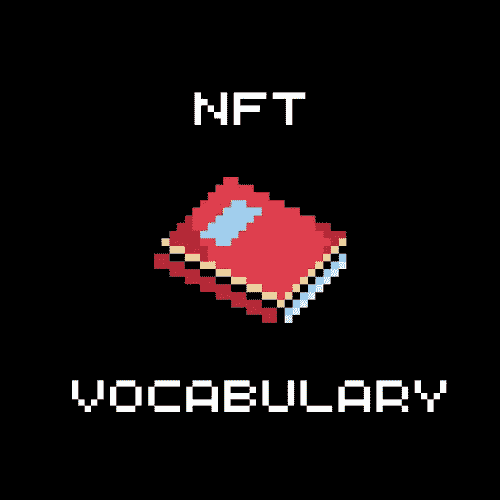

# 不熟悉 NFTs？不明白那些“德根”在说什么？这里是 NFT 词汇，所以你可以稍微多讲一点。

> 原文：<https://medium.com/coinmonks/new-to-nfts-d8ae0fe122a3?source=collection_archive---------64----------------------->

让我们分解一下有助于澄清 NFT 空间的术语。

**发布** —发布一个适用于 mint 的系列。

**Mint**——把 jpeg 变成 nft。有了薄荷糖，nft 就会神奇地出现在你的钱包里。

**预造币**——在其余造币参与者之前铸造 nft 并避免天然气战争的权利。

**WL(白名单)又名造币通行证**——参加造币厂前期的担保人。大多数情况下，这是一个不和谐的角色或一个特殊的 nft，它确认了预薄荷的权利。

**公开销售** —项目启动的一个阶段，每个人都可以获得 mint nft。就在造币前开始。

**Gas** —在以太坊网络中完成交易所需的矿工佣金。

**汽油战** —由于有大量的人想要制造 nft，参与者通过增加每分钟花费的汽油量来增加成功的机会。通过增加天然气，你向矿工支付了更多的佣金，以获得进入该区块并铸造 NFT 的权利。

**二级市场** —在 nft 市场上二手购买 nft。

**市场**—NFT 交易平台(公海、Rarible、FND 等)。)

**上市**——把 NFT 放到市场上出售。

**底价(通常只是底价)**——在二级市场上可以买到 NFT 藏品的最低价格。

**Reveal(Reveal/opening)**—通常在 NFT 上一分钟后，会出现一个带有条件图片的存根，它会显示在集合中的所有 NFT 上。一段时间后，随着元数据的更新，nft 被打开。然后你就能看到什么样的 NFT 被铸造出来了。

**翻牌**——一分钟后立即出售 NFT。短期的。

**纸手**——以小利润，比峰值价格早很多卖出 nft。

**持有**——指储存 NFT，希望在未来获利。长期来看。

**钻石手**——不到最后不出手的自信持有者。

在 Discord 或 Twitter 上发布项目公关，希望找到买家。

**抽奖** —在 discords 中举行的赠品，有机会赢得白名单或 nft 项目。

**骗局** —为了得到你的 NFT 或密码而进行的欺骗。

**Devs (devs 或 developers)** —参与项目的团队。

**不用动脑筋**——当项目好到你甚至不需要分析它会不会加分的时候。

蓝筹股是一个在任何市场条件下都可以安全投资的项目。现在从这样的朋克和 BAYC。

**【FOMO(害怕错过)**——认为如果我买了那辆 NFT，我就能赚很多钱。但是你没买…一开始很疼，后来就不重视了。

**【自己做研究】**——买东西之前，自己分析研究一下项目。

**RIP OF** —是一个受到另一个成功项目“启发”的项目。BAYC 的一个很好的例子是，每第二个系列都试图以猴子为主题，至少分享它们的部分成功。

**AMA(问我任何问题)** —项目创建者(dev)回答来自社区的任何问题的会议。它们存放在 Twitter 的空间或 discords 收藏中。

**WTT(愿意交易)** —准备用这个 NFT 换这个。所以他们在专门的不和谐频道写交易。

**FUD(恐惧、不确定、怀疑)** —一分钟后，有人出于各种原因对结果不满。他们开始给这个项目抹黑，表现得很恶劣。

NGMI(不会成功)——字面意思:你不会成功。NGMI 是作为一个可疑项目的评论或 paperhand nft 的人的评论而留下的。

我们会成功的。

感谢阅读。

**NFT 材料。**

> 加入 Coinmonks [电报频道](https://t.me/coincodecap)和 [Youtube 频道](https://www.youtube.com/c/coinmonks/videos)了解加密交易和投资

# 另外，阅读

*   [最佳免费加密信号](https://coincodecap.com/free-crypto-signals) | [YoBit 评论](/coinmonks/yobit-review-175464162c62) | [Bitbns 评论](/coinmonks/bitbns-review-38256a07e161)
*   [OKEx 评论](/coinmonks/okex-review-6b369304110f) | [Kucoin 交易机器人](/coinmonks/kucoin-trading-bot-automate-your-trades-8cf0ca2138e0) | [期货交易机器人](/coinmonks/futures-trading-bots-5a282ccee3f5)
*   [AscendEx Staking](https://coincodecap.com/ascendex-staking)|[Bot Ocean Review](https://coincodecap.com/bot-ocean-review)|[最佳比特币钱包](https://coincodecap.com/bitcoin-wallets-india)
*   [霍比审核](https://coincodecap.com/huobi-review) | [OKEx 保证金交易](https://coincodecap.com/okex-margin-trading) | [期货交易](https://coincodecap.com/futures-trading)