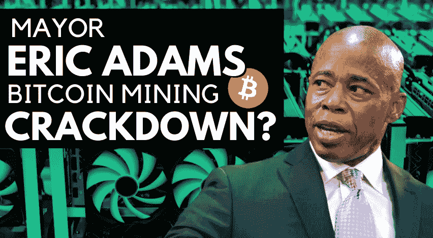
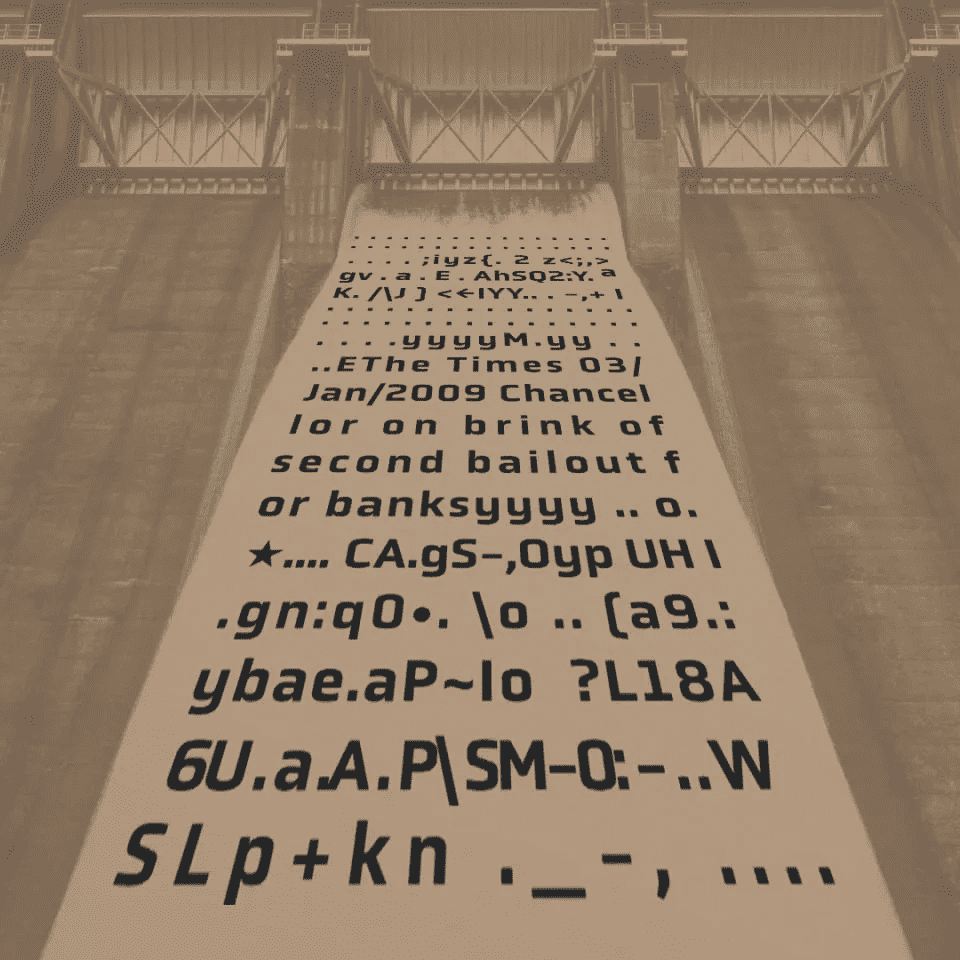

# 纽约市长埃里克·亚当斯称这是肮脏的秘密采矿行为。我们有解决办法。

> 原文：<https://medium.com/coinmonks/new-yorks-mayor-eric-adams-is-calling-out-dirty-crypto-mining-practices-we-have-a-solution-a18ddf8b832e?source=collection_archive---------28----------------------->

我们的 BTC 矿业集团是 100%绿色的，并对我们在生态系统中的角色负责。

*Eric Adams announced this week that he supports ‘cryptocurrencies, but not mining’ (source:* [*NYpost.com*](https://nypost.com/2022/02/09/nyc-mayor-eric-adams-says-hes-against-crypto-mining/)*)*

就在几天前，一些头条新闻报道称，纽约市市长埃里克·亚当斯(Eric Adams)公开表示反对加密采矿，称他总体上支持加密货币，但出于环境原因反对采矿。(如果你错过了媒体对此的狂热——这里有一个[链接。](https://nypost.com/2022/02/09/nyc-mayor-eric-adams-says-hes-against-crypto-mining/))

对于我们这个专注于**绿色比特币采矿**的采矿集体来说，看到围绕采矿实践和不可持续的 BTC 采矿作业的辩论进入主流媒体圈，是一件非常积极的事情。受到埃里克·亚当斯批评的燃气动力采矿公司 Greenidge Generation 实际上继续为自己辩护，声称尽管是燃气动力的，但他们是“碳中性”的。作为 BTC 矿工自己，我们尊重不同意格林里奇一代！我们认为，在从化石资源中获取大量能源的同时，不可能真正对气候有利。

在 Miners DeFi，我们认为负责任地开采比特币的唯一方式是利用水力发电。从环境和财务角度来看，我们对我们的社区有责任让采矿长期盈利。令人震惊的是，我们已经到了 2022 年，在比特币首次发布整整 13 年后，不可持续的采矿做法正在燃烧地球上有限的煤炭、天然气和石油资源。这种情况迟早会停止，尽早采用可持续采矿技术将给我们带来巨大优势，这也将带来更高的回报，反过来，这将有利于矿工 DeFi 集体。

# **以下是 2022 年及以后的加密采矿需求**

1.  采矿只需要使用可持续能源。其他一切都是不可接受的，不负责任的。我们很高兴埃里克·亚当斯提出了这些实践。
2.  只要有可能，就应该使用水电。这是一种比太阳能或风能更稳定、更可靠的发电方式，比其他任何电力来源都更适合 BTC 矿业。
3.  矿业公司需要对其运营和方法完全透明。如果格林里奇一代真的像他们声称的那样是碳中和的，那么证据在哪里呢？
4.  权力下放。不幸的是，在写这篇文章的时候，绝大多数的加密挖掘都是由少数几家公司完成的。这给整个生态系统带来了巨大的风险。从长远来看，确保比特币网络安全的唯一方法是进一步分散比特币。

# **我们在矿工定义中的加密采矿方法**

1.  我们在西伯利亚伊尔库茨克附近的一个工厂只使用 100%的绿色水力发电，你可以在这个视频中看到我们的创始人 Junior 在这个工厂
2.  我们使用自然冷却，并在我们的[网站](https://minersdefi.com/sustainable-mining)上记录了所有证据
3.  我们通过作为分散的集体运行来保持我们的开销非常低(没有中央总部消耗租金)，团队中的每个人都因持有一些矿工代币而受到激励(就像矿工代币持有者社区中的其他人一样)
4.  我们只购买最好的硬件来跟上采矿周期
5.  为了完全透明，我们在我们的仪表板(由我们内部定制开发)上实时显示我们所有的矿业统计数据[，更详细的仪表板 V2 已经在开发中](https://minersdefi.com/dashboard)
6.  我们正在努力为我们的社区创建一个参与式生态系统，其中包括一个应用程序(对关键问题进行投票)、一个“游戏”(也与实际的采矿效用和功能相关联)、关键 NFT 发布会等等。

The Bitcoin Genesis Block turned 13 on Jan 3rd of this year (2022)

读到“泰晤士报 03/01/2009 财政大臣濒临第二次银行救助”这一行时，你还会不寒而栗吗？它确实为我们做到了这一点，我们已经在 crypto 工作了很多年。对于那些不知道的人来说，这是写在比特币创世纪中的一句话，是当时纽约时报头版的一篇文章的标题。它为电视网设定了政治立场的开端。BTC 作为一个全球运动是不可阻挡的。自成立以来，它已经改变了我们所知的世界，并为建立一个更加公平、公正的社会和治理体系创造了机会。然而，我们充分意识到，该系统的很大一部分已经崩溃，需要改变。随着我们迈向 2022 年春天及以后，我们需要适应并迎接我们作为全球社会所面临的挑战。

凭借我们的代币模型，我们可以极其轻松(我敢说毫不费力)地从 BTC 矿业中获利，并以可持续的方式实现盈利。我们设计了一个系统，有两个主要目标:A)尽可能多赚钱，并从比特币中为人们提供永久回报 B)为 100%可持续再生绿色采矿的转变做出巨大贡献。你不需要购买可能很快就会过时的昂贵的硬件，你不需要在自己的家里积累大量的电费。你不需要担心采矿的电力实际上来自哪里，我们会处理好所有的事情。

尽管你总是可以“购买碳补偿”(这可能是埃里克·亚当斯批评的设施可能正在做的)，但至少可以说，这个行业本身也受到了很大的操纵。我们的星球是一个复杂的系统，在我们看来，没有任何补偿可以合理地证明燃烧化石燃料作为能源只是为了创造*金钱*(BTC 就是金钱)。

# **您为什么应该关注我们的可持续采矿方法？**

两个简单的原因。**金钱和地球。**我们的星球最终是我们的责任，因为我们的经营方式是为未来几年和几代人创造持久回报并将其分配给股东的唯一途径。

希望随着人们越来越意识到不负责任的采矿行为所造成的问题，这些行为将被关闭。无论如何，我们在这里，希望市长埃里克·亚当斯和其他著名的公众人物将很快注意到这一点。这是一场重大运动的开始，这场运动的目的是寻求改变，并从各方面保持绿色。

我们的社区和公用令牌$MINERS 是实时的，并不断为持有人产生采矿奖励，但我们还没有做任何重大的营销，我们期待很快就能拿起。我们希望在这场最终关系到我们所有人的对话中加入我们的经验和方法。

如果你是第一次接触矿工 DeFi，我们希望这能激励你看看这个代币，并购买一些$MINERS 来确保长期的加密采矿回报。

[**访问我们的网站**](https://minersdefi.com)

[**在 Pancakeswap 上购买**](https://pancakeswap.finance/swap?outputCurrency=0xeB6B00F8C7E1da78fb919C810C30DdE95475bdDe) **I** [**在 Poocoin 上购买**](https://poocoin.app/tokens/0xeb6b00f8c7e1da78fb919c810c30dde95475bdde) **I** [**在 Bogged 上购买**](https://app.bogged.finance/bsc/swap?tokenIn=BNB&tokenOut=0xeB6B00F8C7E1da78fb919C810C30DdE95475bdDe)

对于加密新手来说，在 BSC 链*上购买我们的令牌并不是一件非常简单的事情(不幸的是，加密中的大多数事情都不是这样..还没有)，所以一定要看看我们的如何购买指南。加入 TG 的社区，并随时向我们提出任何问题。

[**公务电报组**](https://t.me/minersofficial)

[**官方推特页面**](https://twitter.com/MinersDefi)

[**如何购买指南**](https://minersdefi.com/guide)

声明:本文并非财务建议。我们不是财务顾问。所有表达的观点都只是观点。

*   旁注:如果你熟悉 crypto，你可能想知道为什么我们在 BSC 上，而不是 ETH 上。想想“汽油费”到底代表什么，为什么我们可能不同意使用“当前形式”的 ETH 链。

> 加入 Coinmonks [电报频道](https://t.me/coincodecap)和 [Youtube 频道](https://www.youtube.com/c/coinmonks/videos)了解加密交易和投资

# 另外，阅读

*   [投资印度的最佳加密软件](https://coincodecap.com/best-crypto-to-invest-in-india-in-2021) | [WazirX P2P](https://coincodecap.com/wazirx-p2p)
*   [7 个最佳零费用加密交易平台](https://coincodecap.com/zero-fee-crypto-exchanges)
*   [最佳网上赌场](https://coincodecap.com/best-online-casinos) | [期货交易机器人](/coinmonks/futures-trading-bots-5a282ccee3f5)
*   [分散交易所](https://coincodecap.com/what-are-decentralized-exchanges) | [比特 FIP](https://coincodecap.com/bitbns-fip) | [宾邦评论](https://coincodecap.com/bingbon-review)
*   [用信用卡购买密码的 10 个最佳地点](https://coincodecap.com/buy-crypto-with-credit-card)
*   [加拿大最佳加密交易机器人](https://coincodecap.com/5-best-crypto-trading-bots-in-canada) | [Bybit vs 币安](https://coincodecap.com/bybit-binance-moonxbt)
*   [阿联酋 5 大最佳加密交易所](https://coincodecap.com/best-crypto-exchanges-in-uae) | [SimpleSwap 评论](https://coincodecap.com/simpleswap-review)
*   [购买 Dogecoin 的 7 种最佳方式](https://coincodecap.com/ways-to-buy-dogecoin) | [ZebPay 评论](https://coincodecap.com/zebpay-review)
*   [最佳期货交易信号](https://coincodecap.com/futures-trading-signals) | [期交所评论](https://coincodecap.com/liquid-exchange-review)
*   [用于 Huobi 的加密交易信号](https://coincodecap.com/huobi-crypto-trading-signals) | [Swapzone 审查](/coinmonks/swapzone-review-crypto-exchange-data-aggregator-e0ad78e55ed7)