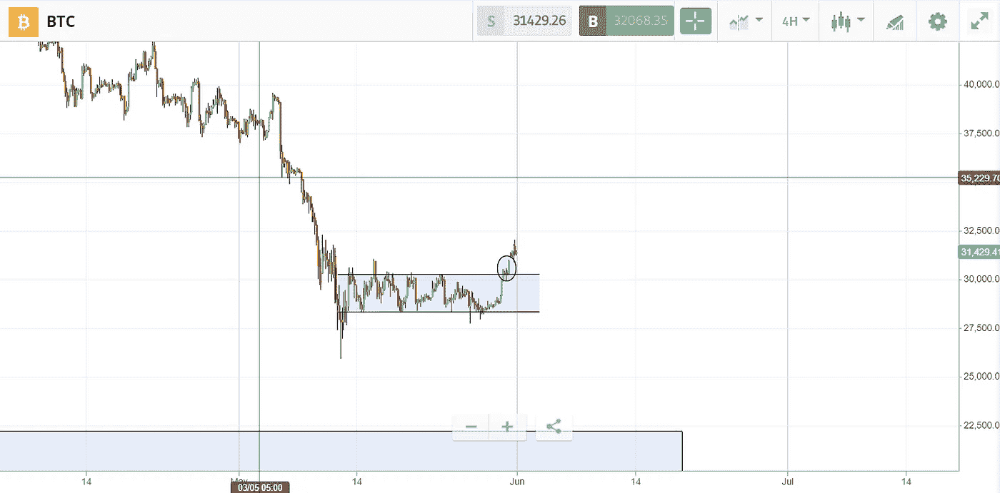

# 加密领域的新闻，以及比特币的持续优势

> 原文：<https://medium.com/coinmonks/news-in-the-crypto-space-and-bitcoins-continuous-dominance-b4359a46ee69?source=collection_archive---------48----------------------->

自从我上一次更新以来，市场并没有发生太大变化，我的比特币优势理论仍然继续显示出力量。在今天的文章中，我将简要介绍上周该领域发生的一些重要新闻，并向您展示比特币作为该领域领导者的表现。

**新闻**

*   地球生态系统复活了。在五月初，卢纳-UST 稳定硬币 depeg，以及随后的崩溃，抹去了[600 亿美元的总市值](https://www.coindesk.com/learn/the-fall-of-terra-a-timeline-of-the-meteoric-rise-and-crash-of-ust-and-luna/)，新的特拉区块链与卢纳 2.0 空投上线。Twitter 上人们的反应要么是令人作呕的，因为价值损失了数十亿美元，要么是 Terra Luna 的创始人 Do Kwon 的态度，即使在崩溃后，他的傲慢仍在继续发光，要么是[疯子](https://dictionary.cambridge.org/dictionary/english/lunatic)。
*   Andreessen Horowitz 筹集了 45 亿美元的加密基金，以利用下跌市场中的便宜货。与合伙人 Arianna Simpson 和 Chris Dixon 一起，该基金旨在投资将塑造我们今天所知的未来技术的加密和区块链公司。尽管市场努力获得动力，并在过去几周内持续面临抛售压力，但该基金相信该空间所提供的长期机会，并将 crypto 比作“下一个主要的计算周期”，并强调了这样一个观点，即通常情况下，最大的机会是在价格行为不太相关的熊市中找到的。
*   [摩根大通:加密超过房地产成为“首选替代资产类别](https://blockworks.co/crypto-leapfrogs-real-estate-jpmorgan-says/)”。根据该银行的数据，比特币的公允价值为 3.8 万美元，尽管交易价格为 3 万美元。考虑到 2017 年他们宣布比特币是一个骗局/欺诈，我对这些说法持保留意见。根据摩根大通的说法，另一个需要关注的快速空间发展的关键指标是风险投资资金，即使在特拉-UST 崩溃后，仍有 40 亿美元进入该空间。

**比特币反弹**

Bitcoin dominance increased to 45.94% in May

比特币在最近一周内增加了 1.65 %的统治地位，显示投资者仍然将比特币视为最安全的数字资产。在 29，000 美元到 30，500 美元的范围内交易了几天后，比特币终于突破了阻力，自 5 月 12 日卢纳-UST 崩溃以来首次重新获得了 31，500 美元的区域。

Bitcoin breaking above $30,500

我将密切关注价格走势如何演变，看看它是一次突破，还是只是一次伪装？

免责声明:我必须警告你，有些观点可能是我个人的偏见，但是我会尽我所能为你提供关于特定主题的客观观点。我不是理财顾问，所有文章只会有严格的教育目的。