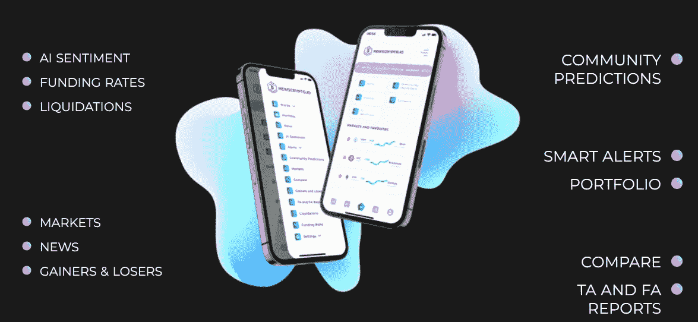
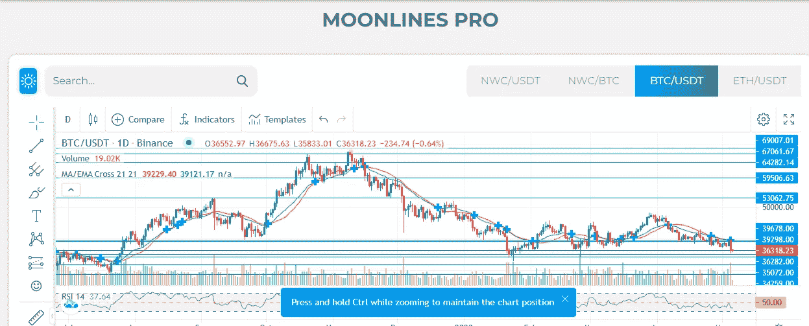
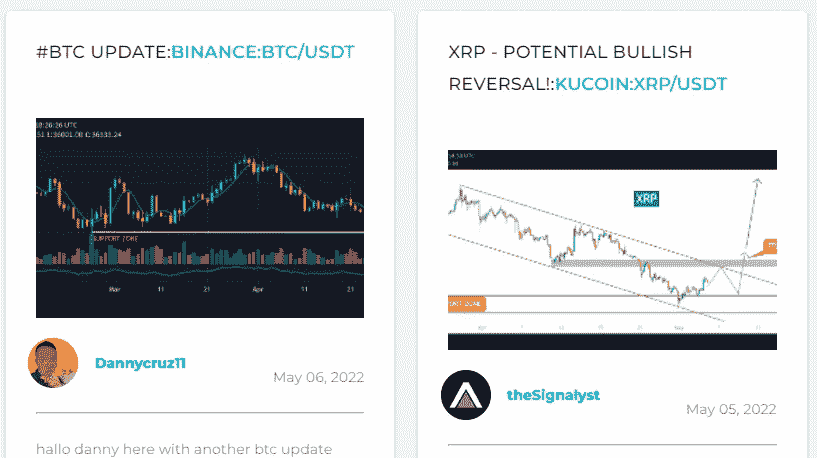
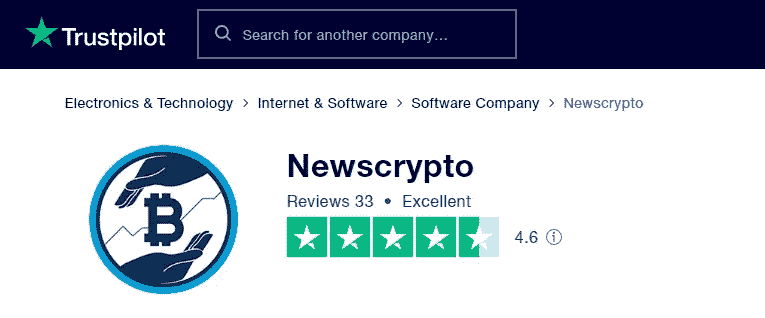

# 新闻加密评论 2022

> 原文：<https://medium.com/coinmonks/newscrypto-review-2022-ec4aae0369a8?source=collection_archive---------62----------------------->

密码行业中做出赚钱决策的最佳场所！

# 什么是新闻加密(NWC)？

[Newscrypto](https://app.newscrypto.io/register/sign-up?referral=aa0ee09d) 平台是世界顶级交易商使用的可靠的一体化加密套件。

它为所有用户提供了一套全面的工具，无论他们当前的知识水平如何。该平台包括从新手的基本技术分析工具到经验丰富的交易者的强大的专有指标。

进入加密货币领域需要大量经验，你不会一下子获得所有这些经验，而是需要通过向经验丰富的交易者逐渐学习的过程。这种交易技术来自于学习和接触经验丰富的交易者，他们可以为你提供一些关于加密货币交易的提示和信息。

[News Crypto](https://app.newscrypto.io/register/sign-up?referral=aa0ee09d) 是一个在线平台，为所有加密货币交易者和爱好者提供学习和分享关于 2017 年推出的加密货币的信息。门户网站“加密新闻”的建立是为了通过提供真正有用的信息来帮助任何新手/初学者学习如何成为专业交易者。

该网站提供交易教育，包括什么是加密货币、如何交易、如何使用价格图表以及如何在执行现货或期货交易前进行技术分析的教学大纲。NXC 是一个很有前途的项目，已经获得了各种媒体的关注。最近，该项目的创始人出现在库币的 AMA 上，他们与数千名库币交易者讨论了该项目的目的和目标，并回答了来自世界各地交易者的问题。他们还讨论了他们正在进行的一些即将到来的项目，这些项目看起来非常令人兴奋，几乎每个交易者都应该知道。

> [新闻加密](https://app.newscrypto.io/register/sign-up?referral=aa0ee09d) NWC:加密数据的圣地。

> 网络上成千上万的用户从中受益匪浅，他们推出了一个平台，让交易者对其他硬币的价格进行预测，如果他们的预测正确，他们就可以获得 NWC 硬币的奖励，这些硬币在库币交易所上市。

# 主要特征

## 交易者需要的一切都在一个地方

从新手到高级交易者，都可以获得免费的世界级指导。

**无限制教育**
在 crypto 最大的社区教育中心，向精英中的精英学习。

**市场指标**

鲸鱼警报、月亮线、流入指标和其他直接的市场洞察都是可用的。

**社区预测**
彼此互动，查看其他秘密交易者的预测。

**cross chain**
[news crypto](https://app.newscrypto.io/register/sign-up?referral=aa0ee09d)允许跨链交换，使 NWC 更容易被更广泛的用户群访问，并促进其在 DeFi 协议和分散式交换中的采用。令牌可以在恒星链、ERC 链和 BSC 链之间以 1:1:1 的比例交换。

[https://www.trustpilot.com/review/newscrypto.io](https://www.trustpilot.com/review/newscrypto.io)

# NWC 令牌:

他们有自己的本地货币 NWC(在 Stellar network 上)，有内部令牌，主要用于付费订阅。令牌 NWC 可以下注，以获得回报。交易信号，套利提示，人工智能情绪，回测机器人，链上分析，等等都包含在专业会员。你可以通过各种奖励获得 NWC。令牌是一个治理令牌，允许您对想法进行投票并提出新的想法。

星链是第一个开放这个平台的。因此，它不是 ERC-20 代币。然而，它目前可以在以太坊和币安区块链买到。因此，无障碍环境正在改善，目前处于较高水平。我认为这是一个显著的优势。

> 该项目符合当前趋势。Stellar-Polygon 桥是一个新的功能，允许你将资源从 Stellar 发送到多边形网络。为了避免错误，成为更好的交易者，NewsCrypto 值得一试(至少在基础阶段)。

# 新闻加密的利弊

## 优点:

1.  提供加密货币指导课程。
2.  它有一个分享加密货币新闻和想法的交易社区。
3.  新交易者可以通过这个网站了解数字市场的一切，让他们像专业人士一样交易。
4.  土著令牌 NWC
5.  手机 app 和手机钱包也可以
6.  赌注可以从两种不同的还款系统中选择一种，3 个月和每年，最低 2000 NWC。

## 缺点:

1.  因为平台这么大，高峰期可能会出现小收缩。

 [## 注册| Newscrypto.io

### 新闻加密是一个全面的教育，社会和信息平台提供初学者和专家交易者…

新闻加密](https://app.newscrypto.io/register/sign-up?referral=aa0ee09d) 

> 加入 Coinmonks [电报频道](https://t.me/coincodecap)和 [Youtube 频道](https://www.youtube.com/c/coinmonks/videos)了解加密交易和投资

# 另外，阅读

*   [CoinDCX 评论](/coinmonks/coindcx-review-8444db3621a2) | [加密保证金交易交易所](https://coincodecap.com/crypto-margin-trading-exchanges)
*   [红狗赌场评论](https://coincodecap.com/red-dog-casino-review) | [Swyftx 评论](https://coincodecap.com/swyftx-review) | [造币厂评论](https://coincodecap.com/coingate-review)
*   [Bookmap 评论](https://coincodecap.com/bookmap-review-2021-best-trading-software) | [美国 5 大最佳加密交易所](https://coincodecap.com/crypto-exchange-usa)
*   [如何在 FTX 交易所交易期货](https://coincodecap.com/ftx-futures-trading) | [OKEx vs 币安](https://coincodecap.com/okex-vs-binance)
*   [CoinLoan 审查](https://coincodecap.com/coinloan-review) | [YouHodler 审查](/coinmonks/youhodler-4-easy-ways-to-make-money-98969b9689f2) | [BlockFi 审查](https://coincodecap.com/blockfi-review)