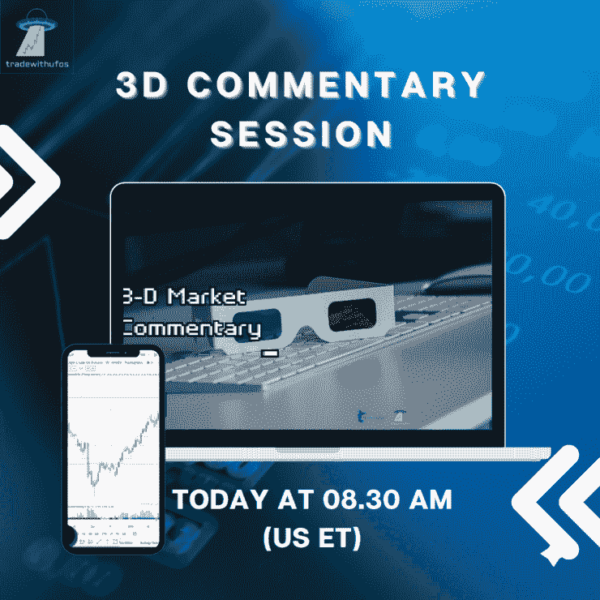

# 新闻快讯 3d 市场评论 2022 年 4 月 20 日

> 原文：<https://medium.com/coinmonks/newsflash-3-d-market-commentary-apr-20-2022-1a97b9fe9990?source=collection_archive---------62----------------------->

# 新闻快讯 3D 评论

五大主要市场:标准普尔 500 |原油|黄金|美元|比特币

决定市场可能发生什么的 3 个关键因素:

-市场环境:未来市场方向(多头/空头)

-买卖不明飞行物:负责即将到来的转折点(进场/出场)的“未成交订单”

-市场波动性:即将到来的价格变化速度(风险/回报)

我们将以下这些统计要素结合起来，以帮助您在交易、投资或对冲时保持客观和现实。

新闻快讯链接> >[https://rb.gy/tzc4ha](https://rb.gy/tzc4ha)

在华尔街开始交易前，观看 3D 直播市场，如下所示:

[**华尔街开始交易前的 3D 市场直播| 2022 年 4 月 20 日**](https://www.youtube.com/watch?feature=youtu.be&utm_campaign=Top%205%20Markets%20Commentary%20And%20Analysis%20Each%20Day&utm_medium=email&utm_source=Revue%20newsletter&v=gmvrkX_bji8)**——**[**www.youtube.com**](https://www.youtube.com/watch?v=gmvrkX_bji8&feature=youtu.be)
不要错过我们的 3D 市场评论广播，我们根据客观统计数据预测和预期市场走势:1 .市场环境:即将到来的市场…

> 加入 Coinmonks [电报频道](https://t.me/coincodecap)和 [Youtube 频道](https://www.youtube.com/c/coinmonks/videos)了解加密交易和投资

# 另外，阅读

*   [美国最佳加密交易机器人](https://coincodecap.com/crypto-trading-bots-in-the-us) | [经常性回顾](https://coincodecap.com/changelly-review)
*   [在印度利用加密套利赚取被动收入](https://coincodecap.com/crypto-arbitrage-in-india)
*   [Godex.io 审核](/coinmonks/godex-io-review-7366086519fb) | [邀请审核](/coinmonks/invity-review-70f3030c0502) | [BitForex 审核](https://coincodecap.com/bitforex-review)
*   [最佳比特币保证金交易](/coinmonks/bitcoin-margin-trading-exchange-bcbfcbf7b8e3) | [萝莉点评](/coinmonks/lolli-review-e6ddc7895ad8) | [比特币保证金交易](https://coincodecap.com/bityard-margin-trading)
*   [创造并出售你的第一个 NFT](https://coincodecap.com/create-nft) | [密码交易机器人](https://coincodecap.com/best-crypto-trading-bots)