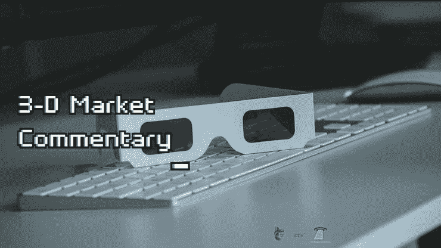

# 新闻快讯 3d 市场评论 2022 年 3 月 21 日

> 原文：<https://medium.com/coinmonks/newsflash-3-d-market-commentary-mar-21-2022-36cffcdd431f?source=collection_archive---------93----------------------->

# 新闻快讯 3D 评论

五大主要市场:标准普尔 500 |原油|黄金|美元|比特币

决定市场可能发生什么的 3 个关键因素:

-市场环境:未来市场方向(多头/空头)

-买卖不明飞行物:负责即将到来的转折点(进场/出场)的“未成交订单”

-市场波动性:即将到来的价格变化速度(风险/回报)

我们将以下这些统计要素结合起来，以帮助您在交易、投资或对冲时保持客观和现实。

新闻快讯链接> >[https://rb.gy/jtvnga](https://rb.gy/jtvnga)

在华尔街开始交易前，观看 3D 直播市场，如下所示:

[**华尔街开始交易前的 3D 市场直播| 2022 年 3 月 21 日**](https://www.youtube.com/watch?feature=youtu.be&utm_campaign=Top%205%20Markets%20Commentary%20And%20Analysis%20Each%20Day&utm_medium=email&utm_source=Revue%20newsletter&v=Xy5OZc21Q9s)**——**[**www.youtube.com**](https://www.youtube.com/watch?v=Xy5OZc21Q9s&feature=youtu.be)
不要错过我们的 3D 市场评论广播，我们根据客观统计数据预测和预期市场走势:1 .市场环境:即将到来的市场…

> 加入 Coinmonks [电报频道](https://t.me/coincodecap)和 [Youtube 频道](https://www.youtube.com/c/coinmonks/videos)了解加密交易和投资

# 另外，阅读

*   [3 商业评论](/coinmonks/3commas-review-an-excellent-crypto-trading-bot-2020-1313a58bec92) | [Pionex 评论](https://coincodecap.com/pionex-review-exchange-with-crypto-trading-bot) | [Coinrule 评论](/coinmonks/coinrule-review-2021-a-beginner-friendly-crypto-trading-bot-daf0504848ba)
*   [莱杰 vs n rave](/coinmonks/ledger-vs-ngrave-zero-7e40f0c1d694)|[莱杰 nano s vs x](/coinmonks/ledger-nano-s-vs-x-battery-hardware-price-storage-59a6663fe3b0) | [币安评论](/coinmonks/binance-review-ee10d3bf3b6e)
*   [Bybit Exchange 审查](/coinmonks/bybit-exchange-review-dbd570019b71) | [Bityard 审查](https://coincodecap.com/bityard-reivew) | [Jet-Bot 审查](https://coincodecap.com/jet-bot-review)
*   [3 commas vs Cryptohopper](/coinmonks/3commas-vs-pionex-vs-cryptohopper-best-crypto-bot-6a98d2baa203)|[赚取加密利息](/coinmonks/earn-crypto-interest-b10b810fdda3)
*   最好的比特币[硬件钱包](/coinmonks/hardware-wallets-dfa1211730c6) | [BitBox02 回顾](/coinmonks/bitbox02-review-your-swiss-bitcoin-hardware-wallet-c36c88fff29)