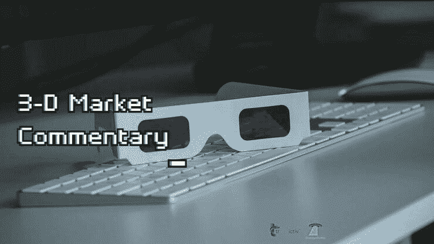

# 新闻快讯 2022 年 5 月 16 日 3d 市场评论

> 原文：<https://medium.com/coinmonks/newsflash-3-d-market-commentary-may-16-2022-a5bc58c723f3?source=collection_archive---------56----------------------->

# 新闻快讯 3D 评论

五大主要市场:标准普尔 500 |原油|黄金|美元|比特币

决定市场可能发生什么的 3 个关键因素:

-市场环境:未来市场方向(多头/空头)

-买卖不明飞行物:负责即将到来的转折点(进场/出场)的“未成交订单”

-市场波动性:即将到来的价格变化速度(风险/回报)

我们将以下这些统计要素结合起来，以帮助您在交易、投资或对冲时保持客观和现实。

新闻快讯链接> >[https://rb.gy/lhdmex](https://rb.gy/lhdmex)

在华尔街开始交易前，观看 3D 直播市场，如下所示:

[**华尔街开始交易前的 3D 市场直播| 2022 年 5 月 16 日**](https://www.youtube.com/watch?feature=youtu.be&utm_campaign=Top%205%20Markets%20Commentary%20And%20Analysis%20Each%20Day&utm_medium=email&utm_source=Revue%20newsletter&v=DwKdQA7dpqE)**——**[**www.youtube.com**](https://www.youtube.com/watch?v=DwKdQA7dpqE&feature=youtu.be)
不要错过我们的 3D 市场评论广播，我们根据客观统计数据预测和预期市场走势:1 .市场环境:即将到来的市场…

> 加入 Coinmonks [电报频道](https://t.me/coincodecap)和 [Youtube 频道](https://www.youtube.com/c/coinmonks/videos)了解加密交易和投资

# 另外，阅读

*   [Bookmap 评论](https://coincodecap.com/bookmap-review-2021-best-trading-software) | [美国 5 大最佳加密交易所](https://coincodecap.com/crypto-exchange-usa)
*   最佳加密[硬件钱包](/coinmonks/hardware-wallets-dfa1211730c6) | [Bitbns 评论](/coinmonks/bitbns-review-38256a07e161)
*   [新加坡十大最佳加密交易所](https://coincodecap.com/crypto-exchange-in-singapore) | [购买 AXS](https://coincodecap.com/buy-axs-token)
*   [红狗赌场评论](https://coincodecap.com/red-dog-casino-review) | [Swyftx 评论](https://coincodecap.com/swyftx-review) | [造币厂评论](https://coincodecap.com/coingate-review)
*   [投资印度的最佳密码](https://coincodecap.com/best-crypto-to-invest-in-india-in-2021)|[WazirX P2P](https://coincodecap.com/wazirx-p2p)|[Hi Dollar Review](https://coincodecap.com/hi-dollar-review)
*   [加拿大最佳加密交易机器人](https://coincodecap.com/5-best-crypto-trading-bots-in-canada) | [库币评论](https://coincodecap.com/kucoin-review)