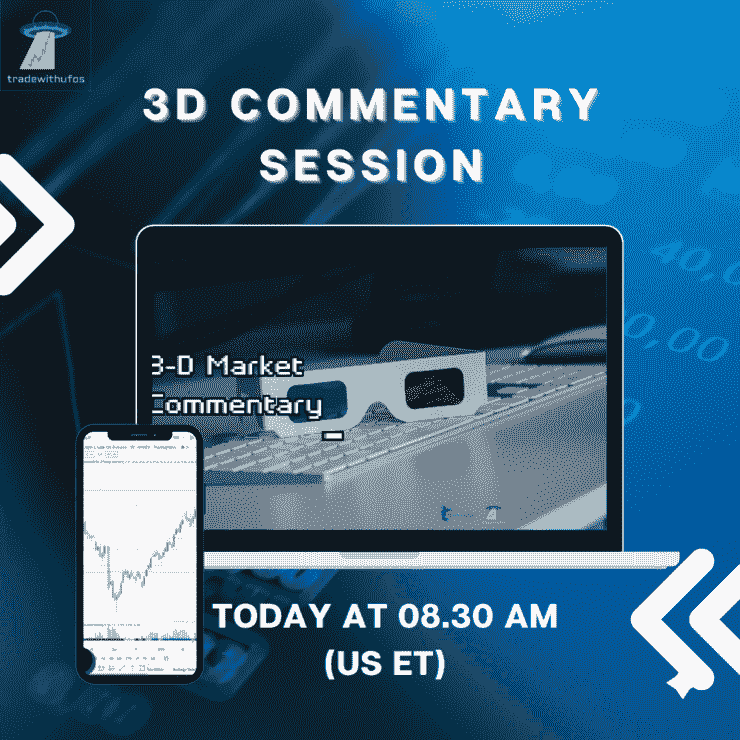

# 2022 年 5 月 31 日 3d 市场评论快讯

> 原文：<https://medium.com/coinmonks/newsflash-3-d-market-commentary-may-31-2022-8b13b1e822a3?source=collection_archive---------70----------------------->

# 新闻快讯 3D 评论

五大主要市场:标准普尔 500 |原油|黄金|美元|比特币

决定市场可能发生什么的 3 个关键因素:

-市场环境:未来市场方向(多头/空头)

-买卖不明飞行物:负责即将到来的转折点(进场/出场)的“未成交订单”

-市场波动性:即将到来的价格变化速度(风险/回报)

我们将以下这些统计要素结合起来，以帮助您在交易、投资或对冲时保持客观和现实。

新闻快讯链接> >[https://rb.gy/yvnqyn](https://rb.gy/yvnqyn)

在华尔街开始交易前，观看 3D 直播市场，如下所示:

[**华尔街开始交易前的 3D 市场直播| 2022 年 5 月 31 日**](https://www.youtube.com/watch?feature=youtu.be&utm_campaign=Top%205%20Markets%20Commentary%20And%20Analysis%20Each%20Day&utm_medium=email&utm_source=Revue%20newsletter&v=AbVwufCHoNY)**——**[**www.youtube.com**](https://www.youtube.com/watch?v=AbVwufCHoNY&feature=youtu.be)
不要错过我们的 3D 市场评论广播，我们根据客观统计数据预测和预期市场走势:1 .市场环境:即将到来的市场…