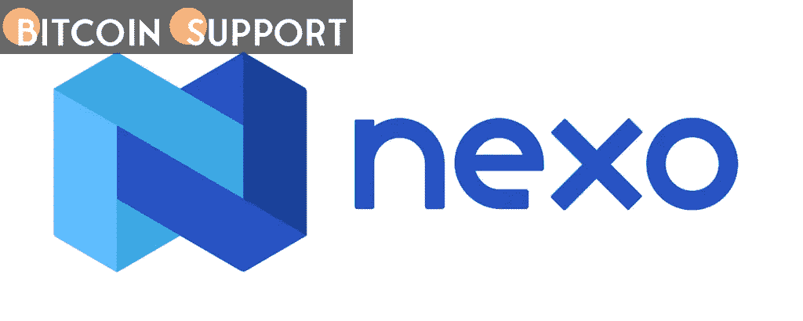

# 加密货币贷款机构 Nexo 已停止向美国客户的新存款支付利息

> 原文：<https://medium.com/coinmonks/nexo-a-cryptocurrency-lender-has-ceased-paying-interest-on-new-deposits-from-us-clients-89a3227a2d9e?source=collection_archive---------50----------------------->

[https://bitcoinsupports.com/](https://bitcoinsupports.com/)

继美国证券交易委员会(SEC)指控 Blockfi 未能注册其零售加密贷款产品并被罚款 1 亿美元后，加密贷款公司 Nexo 宣布，它将不再允许美国消费者获得新储蓄钱包充值的利息。另一方面，在美国的 Nexo 客户将继续从他们在宣布之前的现有储蓄账户余额中赚取利息。

**Nexo 宣布为美国客户节省大量资金**

SEC 上周对加密贷款网站 Blockfi 采取行动，对该公司罚款 1 亿美元。此前，包括新泽西州、肯塔基州、德克萨斯州、阿拉巴马州和佛蒙特州在内的一些州监管机构就 Blockfi 的计息账户向该公司发出了警告。

某些州发布了停止令，要求企业立即停止发行 Blockfi 利息账户(BIAs)。在美国证券监管机构对 Blockfi 实施制裁后，加密贷款公司 Nexo 宣布“为美国客户节省了大量资金”。

根据 Reddit subreddit r/nexo 版主 nexo Josh 的说法，美国的 Nexo 客户可能会注意到 Nexo 计息储蓄计划的某些修改。Nexo Josh 补充说，该公司“自愿改变”其在美国的 earn interest 产品，以便“遵守新宣布的建议”。Nexo 的代表称，非美国客户“不受 SEC 建议的约束，因此会受到影响。”现有美国客户将继续获得余额利息；然而，美国人将不再赚取新增余额的利息。

“从今天起，在赚取利息产品重组之前，您储蓄钱包中的新充值将不会赚取利息，”Nexo Josh 的声明称。此外，该代理强调，“从你的储蓄钱包中取出的任何资产，即使后来归还，也将被归类为新的充值，不会为你赚取利息。”

**加密货币贷款机构 Nexo 正在考虑推出一款赚取利息产品 2.0**

对于美国的新 Nexo 客户，赚取利息产品将不再以当前形式存在。Nexo 打算重新构建该产品，并将其作为 earn interest 产品的 2.0 版本重新推出。“我们的团队和法律顾问正在夜以继日地工作，为我们的美国客户提供解决方案，使 earn interest product 2.0 尽可能广泛地可用，同时保持符合当前的监管现实，”Nexo Josh 总结道。与此同时，Blockfi 并不是美国证券监管机构针对的唯一一家加密货币公司，肯塔基州和阿拉巴马州就计息账户向加密货币贷款公司 Celsius 发出了警告。SEC 目前的立场是，计息加密储蓄产品“不如银行或信用社存款安全。”

**免责声明:以上为作者观点，不应视为投资建议。读者应该自己做研究。**

> 加入 Coinmonks [电报频道](https://t.me/coincodecap)和 [Youtube 频道](https://www.youtube.com/c/coinmonks/videos)了解加密交易和投资

# 另外，阅读

*   [分散交易所](https://coincodecap.com/what-are-decentralized-exchanges) | [比特 FIP](https://coincodecap.com/bitbns-fip) | [Pionex 评论](https://coincodecap.com/pionex-review-exchange-with-crypto-trading-bot)
*   [用信用卡购买密码的 10 个最佳地点](https://coincodecap.com/buy-crypto-with-credit-card)
*   [最佳卡达诺钱包](https://coincodecap.com/best-cardano-wallets) | [Bingbon 副本交易](https://coincodecap.com/bingbon-copy-trading)
*   [印度最佳 P2P 加密交易所](https://coincodecap.com/p2p-crypto-exchanges-in-india) | [柴犬钱包](https://coincodecap.com/baby-shiba-inu-wallets)
*   [八大加密附属计划](https://coincodecap.com/crypto-affiliate-programs) | [eToro vs 比特币基地](https://coincodecap.com/etoro-vs-coinbase)
*   [最佳以太坊钱包](https://coincodecap.com/best-ethereum-wallets) | [电报上的加密货币机器人](https://coincodecap.com/telegram-crypto-bots)
*   [交易杠杆代币的最佳交易所](https://coincodecap.com/leveraged-token-exchanges) | [购买 Floki](https://coincodecap.com/buy-floki-inu-token)
*   [3Commas 对 Pionex 对 Cryptohopper](https://coincodecap.com/3commas-vs-pionex-vs-cryptohopper) | [Bingbon 评论](https://coincodecap.com/bingbon-review)
*   [加密复制交易平台](/coinmonks/top-10-crypto-copy-trading-platforms-for-beginners-d0c37c7d698c) | [如何在 WazirX 上购买比特币](/coinmonks/buy-bitcoin-on-wazirx-2d12b7989af1)