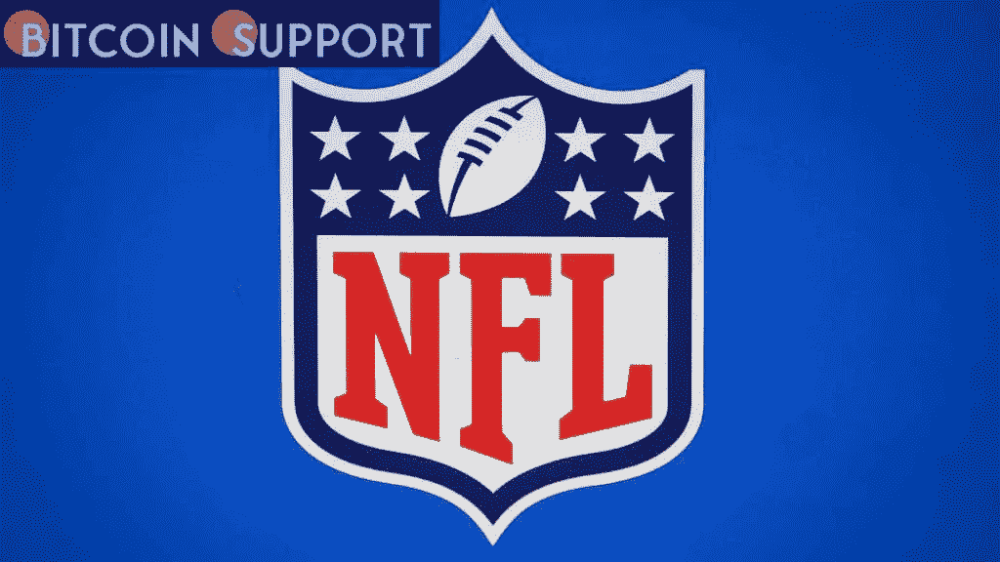

# 随着权利变得可用，NFL 特许权为区块链赞助交易做准备

> 原文：<https://medium.com/coinmonks/nfl-franchises-prepare-for-blockchain-sponsorship-deals-as-rights-become-available-c420e3822993?source=collection_archive---------82----------------------->

**Visit our website:-** [**https://bitcoinsupports.com/**](https://bitcoinsupports.com/)

周一，NFL 发布了几条改变游戏规则的重大新闻。除了宣布底特律为 2024 年选秀的主办城市，NFL 还表示，球队将被允许与比特币基地和 FTX 等公司在区块链合作。

区块链赞助的引入预计将大大增加即将到来的赛季的赞助收入。

**几项重大公告**

继底特律被确认为 2024 年选秀的主办城市后，NFL 在其年会期间继续发布其他重要公告，包括联盟透露球队现在被允许与区块链平台合作。NFT 在 2021 赛季获得了约 20 亿美元的惊人赞助收入，随着区块链的合作伙伴关系摆在桌面上，下一赛季的赞助收入可能会大幅攀升。该联盟上周表示，它将放宽规则，给参赛队更多的回旋余地，让他们与使用区块链技术的公司接洽并获得赞助。

**门是半开的，不是全开的**

虽然允许团队与使用区块链技术的企业合作是一个重大进步，但团队仍然被禁止获得比特币赞助。NFL 首席收入官雷尼·安德森(Rennie Anderson)对这些决定做出了回应，

***“这是我们可以从市场中学到的一点东西，与我们走出去并表现得好像我们什么都知道相比。我们有能力让市场告诉我们他们在这个类别中对自己的看法。”***

**区块链冲击 NFL**

此外，联盟表示希望允许 NFL 俱乐部通过 FTX、比特币基地等平台探索赞助选项，作为联盟推出其最新资产的一部分。安德森认为，这些资产将有助于吸引合作伙伴持有权利，如 NFL 的官方数字钱包和区块链合作伙伴。Anderson 强调，尽管如此，NFL 仍在学习区块链技术及其带来的好处。根据 Anderson 的说法，

***“我认为我们会学到很多关于用例的知识，了解它们如何改变我们的未来。”***

除了加密货币，区块链技术在为不可替代代币(NFT)等收藏品提供真实性和所有权证明方面也有重要意义。

**尚未确信加密货币**

然而，安德森表示，NFL 仍然反对加密货币，并将通过逐步进入该领域来“捍卫业务”。这可能意味着，随着政府当局讨论加密货币和加密行业规则，NFL 正在采取观望态度。这与 NBA 的立场形成鲜明对比，后者在加密货币上孤注一掷。安德森说，“关于 NFL 的态度，

***”安德森说:“我们不必成为第一但是当我们做一件事的时候，我们必须把它做好。***

**访问我们的网站:-**[**【https://bitcoinsupports.com/】**](https://bitcoinsupports.com/)

**免责声明:以上为作者观点，不应视为投资建议。读者应该自己做研究。**

> 加入 Coinmonks [电报频道](https://t.me/coincodecap)和 [Youtube 频道](https://www.youtube.com/c/coinmonks/videos)了解加密交易和投资

# 另外，阅读

*   [Bookmap 评论](https://coincodecap.com/bookmap-review-2021-best-trading-software) | [美国 5 大最佳加密交易所](https://coincodecap.com/crypto-exchange-usa)
*   [如何在 FTX 交易所交易期货](https://coincodecap.com/ftx-futures-trading) | [OKEx vs 币安](https://coincodecap.com/okex-vs-binance)
*   [CoinLoan 审查](https://coincodecap.com/coinloan-review) | [YouHodler 审查](/coinmonks/youhodler-4-easy-ways-to-make-money-98969b9689f2) | [BlockFi 审查](https://coincodecap.com/blockfi-review)
*   《XT.COM 评论》的|
*   [SmithBot 评论](https://coincodecap.com/smithbot-review) | [4 款最佳免费开源交易机器人](https://coincodecap.com/free-open-source-trading-bots)