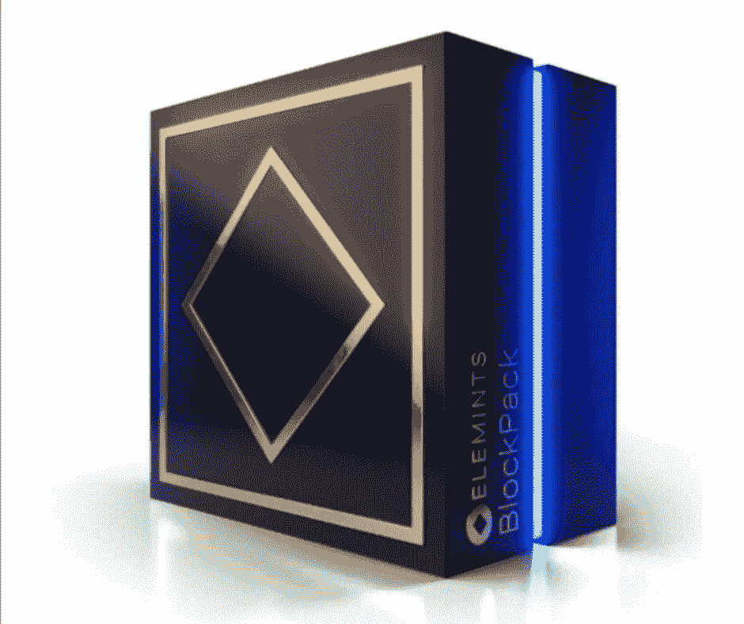
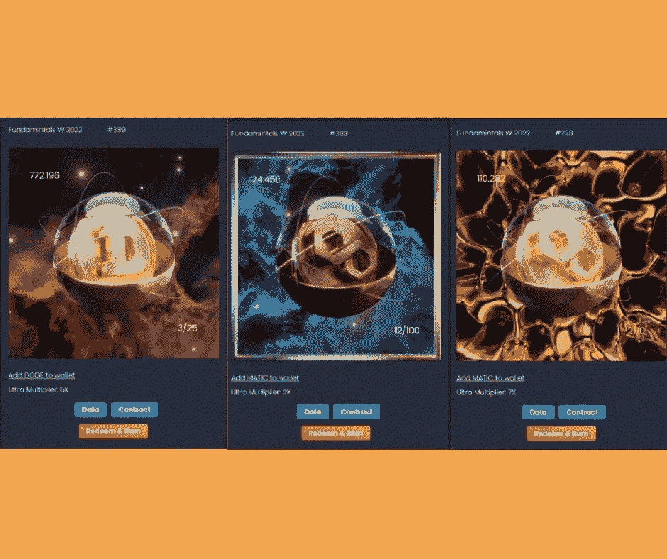

# NFT 101:elements NFT——从 NFT 到 De-Fi 的新手桥梁

> 原文：<https://medium.com/coinmonks/nft-101-elemintsnft-a-bridge-of-newbies-from-nft-to-de-fi-c1dfe8819fa5?source=collection_archive---------73----------------------->

FUNDAMINTALS W 2022 PACKS by [https://app.elemints.io](https://app.elemints.io)

我已经开始的这一系列故事将深入我正在投入的主题。这个 NFT 101 系列源于我在第一篇博客 [*中发布的内容——我在 Crypto、NFT 和元宇宙*](/@bnelsonsep3/my-education-and-connection-journey-on-nft-crypto-and-the-metaverse-349def7419c7) *世界中的教育和联系之旅。-提醒:这不是仅供娱乐的财务建议。*

作为一个 NFT 世界的新手，我一直在寻找不同的方法来了解它。就像其他行业一样，NFT 世界也有自己的术语，当我开始探索它时，我意识到这个空间有多大。我在不同的论坛上阅读文章，提出问题，分享经验，但我觉得还有很多东西我可以学习。

当我第一次了解不可替换令牌时，我就被迷住了。我读了所有我能读到的关于他们的东西。我看了 YouTube 视频，看了白皮书，在网络论坛上提问。我决心继续学习这项令人兴奋的新技术。然后我被介绍给 NFT 电信的一个不和谐服务器

Blockcards with Doge and Matic backed crypto — [https://app.elemints.io](https://app.elemints.io)

# 什么是 Elemints？交易卡？一个密码？NFT 吗？

ElemintsNFT 的创始人 DLaz 有这样一句话来总结它*“Elemints 是一个通过赌注和交易 Elemint 交易卡来产生收入的生态系统。Elemints 交易卡是有史以来第一个由真正的加密资产支持的 NFTs。”*

一旦铸造并打开，BlockPack 就会生成四张 Elemint 卡，或 NFT 交易卡，每张卡都有独特的稀有级别，并以各种著名的加密货币为特色。当你打开 BlockPack 时，一份智能合同会确定该卡的稀有程度以及与之绑定的加密货币总量。

NFT 的持有者可以随时通过选择“赎回并烧毁”来赎回与他们的 elements NFT 相关联的加密货币当选择此选项时，NFT 被刻录，整个加密货币值被发送到用户的钱包。

# 什么是去中心化金融？

分散金融(DeFi)是一个总称，指众多旨在挑战现有银行业的公共区块链应用和计划。DeFi 代表“基于区块链技术的金融应用”，它的灵感来自区块链技术。

有了上面的定义，我相信需要一个单独的关于 De-Fi 的博客来充分讨论它的含义。现在，让我们继续关注 with EleMINTs。*(要了解 De-Fi，请查看我在* [*的博文 https://blog . cryptostars . is/NFT-101-what-is-decentralized-finance-De-Fi-and-how-it-can-disrupt-a 万亿美元-industry-a6df 215760 b 7*](https://blog.cryptostars.is/nft-101-what-is-decentralized-finance-de-fi-and-how-it-can-disrupt-a-trillion-dollar-industry-a6df215760b7)*)*

# elements NFT 如何成为用户或持有者从不可替代令牌(NFT)到分散金融(De-Fi)的桥梁？

以 NFT 为例，持卡人同意允许 Elemints 获取与该卡相关的流动性。作为交换，持有者将获得 100 美元的奖励.

那些喜欢保留 NFT 的人现在可以通过使用 Elemints 分散式应用程序下注 NFT 来获得额外的收入，该应用程序由支持每张卡的硬币支持。(经过短暂的冷却期后，您的非转售/转卖券和抵押品可随时从赌注池中提取。)

## 等等，还有，通过持有$ELMNT，我们还可以获得永久的季度空投分发。

这一投资组合创造的收益将按季度分配给 ELMNT 令牌的持有者。这使得典型的用户或持有人在成为 Elemints 投资团队成员的同时，也能产生被动收入。

# 结论

分散融资是一个新兴领域，将在未来几年产生变革性影响。它将对世界经济和数百万人的生活产生深远的影响。分散融资的潜力才刚刚开始被意识到。现在还处于早期，它的全部潜力还没有发挥出来。

感谢 E [莱明茨·NFT](https://app.elemints.io)介绍了一个伟大的 NFT 项目，帮助初学者理解和热爱即将到来的伟大事物。

关于 Elemints NFT 的更多信息，您可以访问[https://medium . com/@ elemintcollectable/Elemints-not-just-another-NFT-19 a 50152 F6 db](/@elemintcollectable/elemints-not-just-another-nft-19a50152f6db)。

***关于作者***

Brayan Nelson 是一名业余爱好作家，目前是一名大学讲师，同时在 NFT 项目[https://app . elemints . io*实习。*](https://app.elemints.io.) *在 Medium 上，他写了自己在 Crypto、NFT、元宇宙的人脉和教育之旅。订阅他的时事通讯，成为第一个阅读他的博客故事的人。你也可以在 bnelsonsep3@gmail.com 通过电子邮件联系到他*

> 加入 Coinmonks [电报频道](https://t.me/coincodecap)和 [Youtube 频道](https://www.youtube.com/c/coinmonks/videos)了解加密交易和投资

# 另外，阅读

*   [如何在 Uniswap 上交换加密？](https://coincodecap.com/swap-crypto-on-uniswap) | [A-Ads 审查](https://coincodecap.com/a-ads-review)
*   [加密货币储蓄账户](/coinmonks/cryptocurrency-savings-accounts-be3bc0feffbf) | [YoBit 审核](/coinmonks/yobit-review-175464162c62)
*   [Botsfolio vs nap bots vs Mudrex](/coinmonks/botsfolio-vs-napbots-vs-mudrex-c81344970c02)|[gate . io 交流回顾](/coinmonks/gate-io-exchange-review-61bf87b7078f)
*   [CoinFLEX 评论](https://coincodecap.com/coinflex-review) | [AEX 交易所评论](https://coincodecap.com/aex-exchange-review) | [UPbit 评论](https://coincodecap.com/upbit-review)
*   [AscendEx 保证金交易](https://coincodecap.com/ascendex-margin-trading) | [Bitfinex 赌注](https://coincodecap.com/bitfinex-staking) | [bitFlyer 审核](https://coincodecap.com/bitflyer-review)
*   [Bitget 评论](https://coincodecap.com/bitget-review)|[Gemini vs block fi](https://coincodecap.com/gemini-vs-blockfi)cmd |[OKEx 期货交易](https://coincodecap.com/okex-futures-trading)
*   [AscendEx Staking](https://coincodecap.com/ascendex-staking)|[Bot Ocean Review](https://coincodecap.com/bot-ocean-review)|[最佳比特币钱包](https://coincodecap.com/bitcoin-wallets-india)