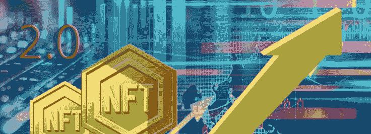

# NFT 2.0——为密码世界的新时代铺平了道路

> 原文：<https://medium.com/coinmonks/nft-2-0-paving-way-for-a-new-era-in-crypto-universe-8cb48641e0c0?source=collection_archive---------22----------------------->

技术是断断续续发展的。它在表面下掠过一段时间，然后似乎每个人都在谈论它。NFTs 也是一样的情况。它在主流媒体中默默无闻了好几年。然后从 2021 年开始，NFTs 开始得到我们现在熟悉的关注。区块链和加密货币对大众来说感觉很复杂。但是，当谈到非功能性测试时，有一种与生俱来的熟悉感。

我们现在即将迎来 NFT 2.0。如果你错过了 NFT 1.0，你不必担心。让我们先了解一下 NFT 1.0 对我们来说意味着什么。

# NFT 1.0 的属性

NFT 1.0 是关于测试市场对数字资产**所有权概念的反应。一些著名的项目包括 [**隐朋克**](https://www.nftically.com/blog/the-evolution-of-cryptopunks/) 和无聊猿游艇俱乐部。这些 NFT 项目专注于创造存储在区块链上的独特的数字字符。基于拥有数字资产的新奇感，这些 NFT 的购买者乐于花钱。它们可以是图像、视频或文本。NFT 1.0 向我们介绍了以下属性。**

*   ****不变性**:NFT 一旦生成就不能改变自己。所有的 NFT 交易都像一个连续的历史记录一样相互联系。任何人都可以找到谁拥有多少数字资产。**
*   ****真实所有权**:区块链可以验证任何数字资产的所有权状态。不像在真实的物理世界中，没有任何争论或伪造的余地。**
*   ****条件性**:智能合约可以保证基于一定条件的自动支付。例如，NFT 艺术家能够从未来的销售中获得一定比例的收益。**
*   **真正的创造者经济:NFT 致力于分散的技术。这意味着创作者可以独立做出自己的创意或财务决策。他们不需要依赖一个集中的平台。**

# **什么是 NFT 2.0？**

**NFT 2.0 是 NFT 技术的下一次发展。**

**任何超越 NFT 1.0 的 NFT 都被称为 NFT 2.0。NFT 1.0 的唯一目的就是坐在区块链上欣赏收藏家。这足以引发 NFT 收养风波。但这仅仅是开始。NFT 的能力远不止停留在链条上。让我们来看看 NFT 2.0 的属性，看看有多少。**

****可扩展性—**NFT 必须是可扩展的，才能被视为 2.0 版本，这意味着它必须能够以有意义/有帮助的方式连接到其他 NFT 或项目。因此，**

*   **一个 NFT 可以链接到另一个 NFT，反之亦然。**
*   **NFT 可以“持有”可替换代币。**
*   **NFT 可以连接到任何其他数据集。**

**所有权的层数是无限的，这意味着创建者可以创建任意多的嵌套层。**

****可升级性** —这一特性确保了 NFT 在将来可以被修改。艺术作品、元数据和额外资源(在能力部分有意义)都是变化的例子。**

****动力**——它赋予 NFT 比他们现在能做的更多的能力。根据创造者或所有者的喜好，他们可以发送命令，装备其他 NFT，修改它们的外观，等等。**

**当你把这三个特征结合起来，你就创造出了远远超出你以前所见过的任何东西的 NFT。让我们看看世界上最先进的 NFT 2.0 技术的实现，以帮助您更好地理解它。**

## **NFT 2.0 开发的独特功能**

****1。嵌套 NFT****

**由于它们的嵌套能力，NFT 可以拥有其他 NFT，也可以被其他 NFT 拥有。虽然这个概念表面上看起来很容易，但它为设计师提供的新选择会让你(在艺术和技术方面)大吃一惊。随着 RMRK 的嵌套，所有权链可以无限延续下去，因此 NFT 可以拥有其他的 NFT，拥有其他的 NFT，拥有其他的 NFT，以此类推，直到无限。游戏、艺术、元宇宙、展览等等都可能从中受益。**

****2。具有多个资源的 NFTs】****

**NFT 的余生不一定要注定单一的命运。NFTs 现在可以在各种资源之间转换。构成 NFT 的图像、视频或其他媒体是一种资源。因此，一个 NFT 可以有两张图片，而不是一张，持有者可以选择显示哪一张。不过，这并不是该特性的唯一用途。一本 NFT 图书可以有三种不同类型的资源:pdf、有声读物和 jpeg 封面。**

**这些资源可以配置为仅在用户与相关平台上的 NFT 交互时加载。如果你用的是图书阅读器，你会看到 pdf 如果你用的是音频播放器，你会听到的。**

****3。反应式或响应式非功能性测试****

**条件渲染使反应式非功能性纹理贴图变得可行。这意味着 NFT 根据特定标准的实现来调整其资源分配。例如，一天中的时间和景观的 NFT 在两种资源(夜间和白天变化)之间切换。当它是夜晚时，NFT 显示夜间形式，当它是白天时，它显示白天变体。要做到这一点，NFT 需要两种资源(在本例中是照片)和一个优先于另一个的标准。**

****4。基于 NFT 2.0 的 DAOs****

**使用这种能力可以将一把 NFT 分割成一把刀。因为一些 NFT 对于单个收藏家来说过于昂贵，DAO 功能允许多个收藏家汇集他们的资金来购买 NFT。一旦完成，NFT 可以连接代币，代币将根据收藏家的投资规模分配给他们。到了选择的时候，收藏者可以用他们的代币投票决定如何处理 NFT。再一次，这是一个应用远远超过其基本解释的概念。**

## **让我们在这里探索几个鼓励 NFT 2.0 开发的气动用例:**

****1。强大的 NFT 存储****

**通过使用多资源功能，可以使 NFT 的存储更加强健。大多数非文件系统现在保存在 IPFS(星际文件系统)上。这意味着 NFT 可以连接到 IPFS 托管的资源。但是 IPFS 的问题是，你必须付费才能将你的资料固定到节点上，除非它不断地被交互(换句话说，你鼓励存储提供商将你的文件托管 x 段时间)。**

****2。通过 NFT 2.0 与多个所有者进行慈善:****

**有了 NFT 2.0，就有可能让多个所有者为一项崇高的事业而来，为一项活动进行慈善捐赠。想象一下，多个慷慨的捐助者来到一个平台上，共同拥有一个 NFT，为一组孤儿院共同捐款。这可能是公共资金的一个突破，投资者可以得到一个慷慨的象征。**

## **结论:**

**并且已经深入用户的心灵。NFT 2.0 开发的出现打开了一个新世界的大门，表明新的可能性和未探索的用例正在路上。**

> **加入 Coinmonks [电报频道](https://t.me/coincodecap)和 [Youtube 频道](https://www.youtube.com/c/coinmonks/videos)了解加密交易和投资**

# **另外，阅读**

*   **[比特币基地赌注](https://coincodecap.com/coinbase-staking) | [热点评论](/coinmonks/hotbit-review-cd5bec41dafb) | [库币评论](https://coincodecap.com/kucoin-review)**
*   **购买 Dogecoin 的 7 种最佳方式**
*   **[iTop VPN 审查](https://coincodecap.com/itop-vpn-review) | [曼陀罗交易所审查](https://coincodecap.com/mandala-exchange-review)**
*   **[比特币基地 vs 瓦济克斯](https://coincodecap.com/coinbase-vs-wazirx) | [比特鲁点评](https://coincodecap.com/bitrue-review) | [波洛涅克斯 vs 比特克斯](https://coincodecap.com/poloniex-vs-bittrex)**
*   **[美国最佳加密交易机器人](https://coincodecap.com/crypto-trading-bots-in-the-us) | [经常性回顾](https://coincodecap.com/changelly-review)**
*   **[A-Ads 审查](https://coincodecap.com/a-ads-review) | [Bingbon 审查](https://coincodecap.com/bingbon-review) | [Mudrex 投资](https://coincodecap.com/mudrex-invest-review-the-best-way-to-invest-in-crypto)**